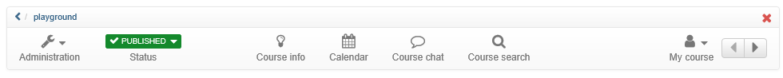
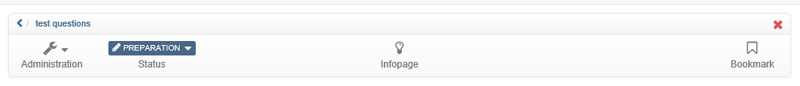
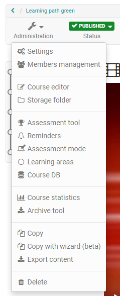
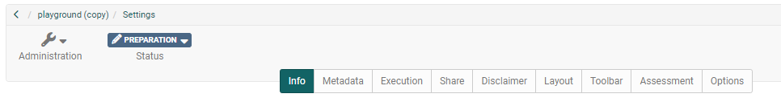

#  Detailed View of Learning Resources

## Toolbar

Each learning resource has a toolbar that provides access to various tools and
settings. Which of the following actions is possible depends on your access
authorization and on the learning resource type. You can access the toolbar
from both the learning resource and the information page.

Examples of a course and a test toolbar:

The "Administration" drop-down menu provides all the tools for configuring and
setting up a learning resource and is quite extensive. The exact possibilities vary depending on the learning resource.

Under "Settings", many options are bundled.
Here you can set up the info page, organize the release of the
learning resource, set the licence of the learning resource and much more.
  

Further information can be found in the corresponding chapters and under
[Course settings](../learningresources/Course_Settings.md).

  

