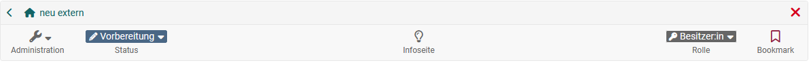
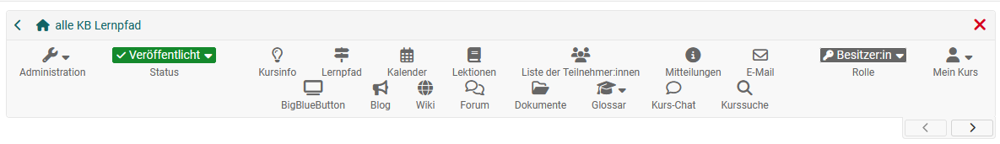
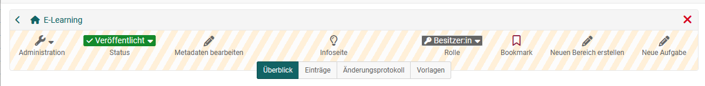

# Detailed View of Learning Resources {: #detailed_view}

A learning resource consists of different areas. Even if the learning resources differ in terms of structure, they all have a toolbar.

## Toolbar of learning resources

The toolbar provides access to the "Info page" of the learning resource (for courses "Course info"). Owners of the learning resource see their role (e.g. owner) and can access the administration menus of the learning resource via the toolbar. The status of the learning resource (e.g. "Published") is also displayed in the toolbar and can be changed here by owners. A bookmark can also be set on the learning resource.

Depending on the learning resource, there may also be other elements in the toolbar. What exactly is in the toolbar and visible depends on:

- the type of learning resource
- the role in which you are viewing the learning resource
- whether you are in edit or view mode
- the particular configuration (see Settings)

Here are a few **toolbar examples:**

Example of a typical toolbar that applies to most learning resources such as blog, podcast, form, glossary, resource folder, video or wiki:

{ class="shadow lightbox" }

The toolbar of a course, on the other hand, can contain further elements and tools:

{ class="shadow lightbox" }

The toolbar of the Portfolio 2.0 template is more for configuration purposes:

{ class="shadow lightbox" }

## Administration of learning resources

In the "Administration" menu of a learning resource, further submenus for configuration can be called up.

All learning resources have the menus:

* Settings
* Members management
* Copy
* Export content
* Delete

Depending on the learning resource, further menus are added.

In the **Settings**, general information about the learning resource is stored, metadata is configured, sharing is set up, a catalog entry is defined and further learning resource-specific settings are made. Further information on the individual settings with regard to courses can be found under [Course Settings](../learningresources/Course_Settings.md).

In the **Members management**, additional owners of the learning resource can be added. For learning resources with the usage "Standalone", coaches and participants can be added as well, see [Function concept courses and learning resources](General_Functions_Concept.md) [:octicons-tag-16:{ title="from Release 18.2 (OO-7277)" }](https://track.frentix.com/issue/OO-7277){:target="_blank"}.

**Copy** creates a copy of the learning resource. The new learning resource created in this way then also appears in the authoring area.

**Export content** allows you to download the learning resource, e.g. as a backup file (ZIP file). This file can later be imported into OpenOlat again. In this way, learning resources can also be transferred to other OpenOlat instances.

**Delete** marks the learning resource as "deleted". It then appears in the authoring area in the tab "Deleted" (trash function). As long as the learning resource is still in the trash, it can be restored or permanently deleted.

## Further information {: #further_information}

[Course Settings >](../learningresources/Course_Settings.md) 
[Function concept courses and learning resources >](General_Functions_Concept.md)

[To the top of the page ^](#detailed_view)
