# Termine und Absenzen {: #course_admin_events_and_absences}

Das Absenzenmanagement ermöglicht es, Anwesenheitslisten online zu führen und Fehlzeiten zu dokumentieren. Die Anwesenheitskontrolle wird jeweils kursbezogen durchgeführt.

Dazu können im Kurs **Termine** angelegt werden, die sich in mehrere **Einheiten** unterteilen lassen. So kann beispielsweise ein Vormittag (Termin) in mehrere Zeitblöcke (Einheiten) gegliedert werden. Dadurch ist es möglich, dass Teilnehmende nur für einzelne Einheiten eines Termins als abwesend markiert werden, ohne den gesamten Termin zu verlieren.

Termine und Einheiten werden entweder von den Kursbesitzer:innen selbst erstellt oder über ein externes Verwaltungssystem mit OpenOlat synchronisiert. Alle Termine erscheinen auch im Kurskalender, sofern der Kurs einen Kalender beinhaltet.

Bevor das Absenzenmanagement genutzt werden kann, muss es von den Kursbesitzer:innen aktiviert werden. Dies geschieht unter `Kurs > Administration > Einstellungen > Tab Durchführung`. Nach der Aktivierung können weitere Einstellungen vorgenommen werden, und in der Toolbar erscheint zusätzlich die Option "Termine".

## "Termine" in der Toolbar {: #toolbar_events}

**Kursbesitzer:innen** können hier Termine hinzufügen und Absenzen organisieren. Zusätzlich erscheint für Kursbesitzer:innen in der Kursadministration das Menü "Termine und Absenzen". Die Möglichkeiten sind dabei überwiegend identisch. 

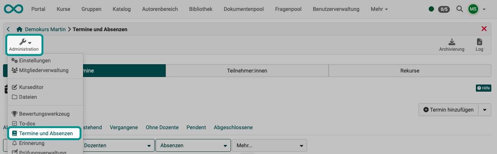{ class="shadow lightbox" }

**Kursbetreuer:innen** sehen das Menü "Termine" nur in der Toolbar, nicht aber in der Kursadministration. Auch können sie *keine* neuen Termine anlegen, nur die vorhandenen einsehen und, sofern aktiviert, Absenzen erfassen. Es kann auch nach Terminen gefiltert werden, für die man als Betreuer:in eingetragen ist.

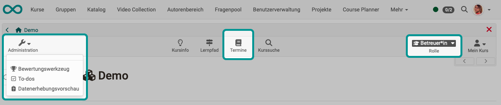{ class="shadow lightbox" }

**Teilnehmende** sehen das Menü "Termine" in der Toolbar und können so rasch synchrone Präsenz- oder Online-Termine erkennen, z.B. im Rahmen von Blended-Learning. 

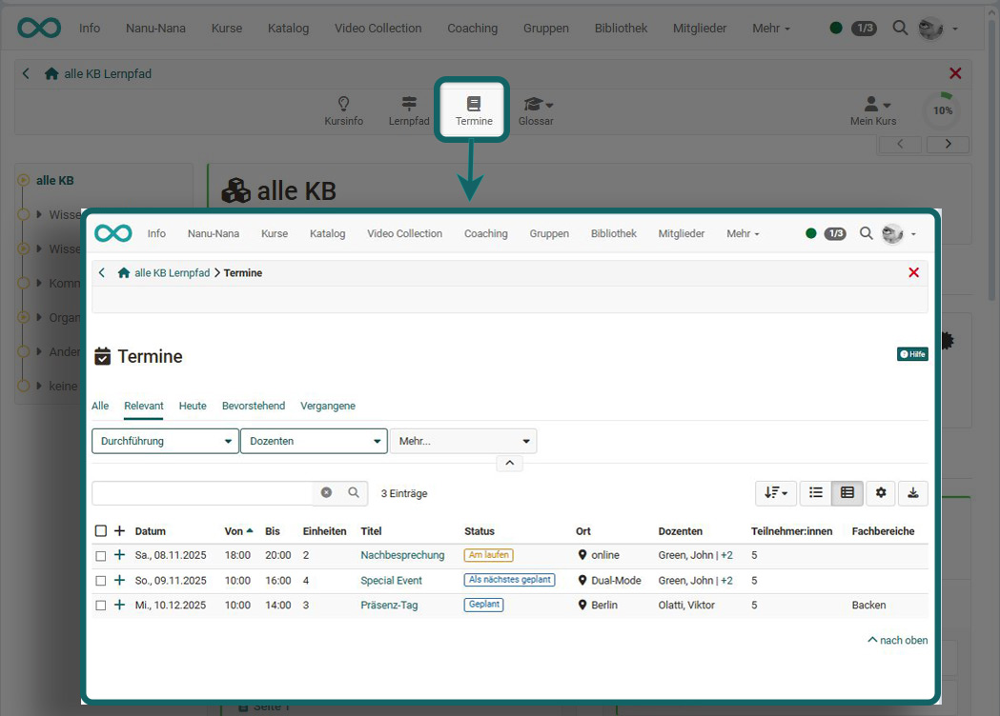{ class="shadow lightbox" }

Persönliche Fehlzeiten finden Teilnehmende dann bei den "Persönlichen Werkzeugen" im [Menü "Absenzen"](../personal_menu/Absences.de.md).

[Zum Seitenanfang ^](#course_admin_events_and_absences)

---

Im Folgenden wird die Ansicht der Termine und Absenzen für **Kursbesitzer:innen** näher beschrieben. 

## Tab Termine {: #tab_events}

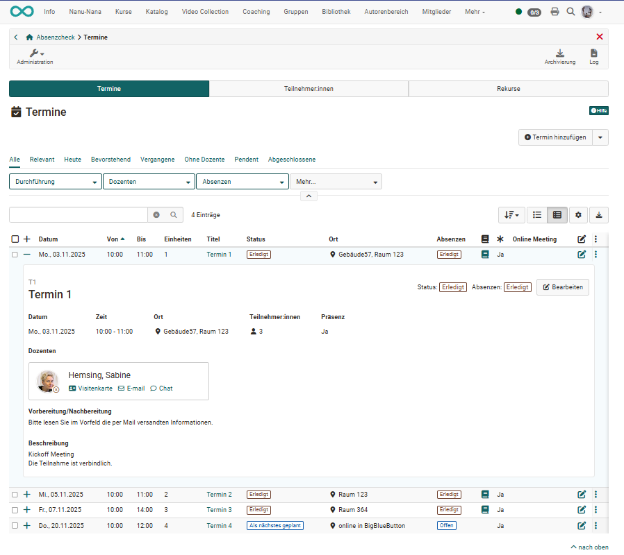{ class="shadow lightbox" }

### Termine anzeigen {: #display_events}

Im Tab "Termine" können dem Kurs Termine hinzugefügt und nach unterschiedlichen Kriterien gefiltert angezeigt werden. Wurde der Termin z.B. Fachbereichen zugeordnet (Taxonomie), kann nach diesen gefiltert werden. Um Details zu einem Termin anzuzeigen, klicken Sie auf das + zu Beginn der betreffenden Zeile.

Im 3-Punkte-Menü am Ende jeder Zeile finden Sie weitere Optionen für einen Termin. Hier können Sie den Termin bearbeiten, kopieren, löschen, in ein Online Meeting ändern, als Prüfung markieren, PDF-Listen erstellen sowie weitere Downloads generieren. Auch können erledigte Termine wiedergeöffnet werden.

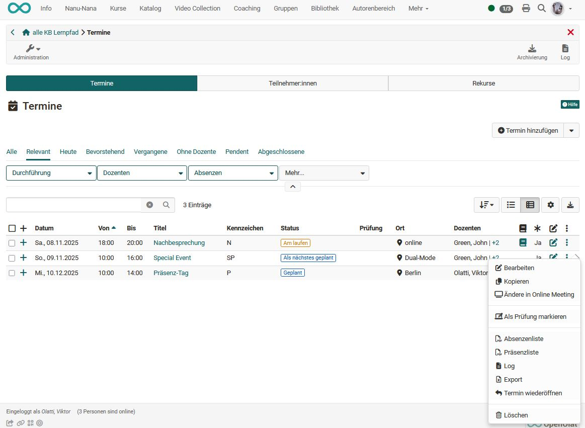{ class="shadow lightbox" }

[Zum Seitenanfang ^](#course_admin_events_and_absences)

---

### Termin erstellen/bearbeiten {: #edit_events}

Zum Hinzufügen (weiterer) Termine verwenden Sie den Button "Termin hinzufügen" rechts oben über der Liste im Tab "Termine".

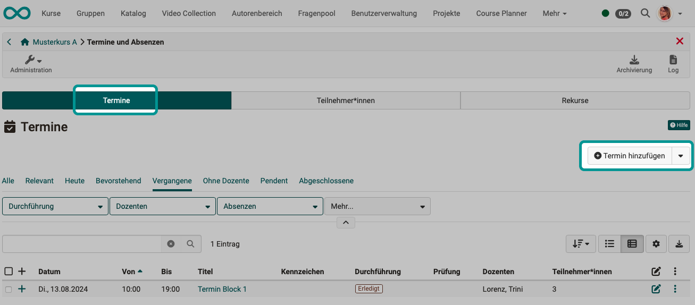{ class="shadow lightbox" }

!!! info "Wichtig"

    Der Button "Termin hinzufügen" wird nur angezeigt, wenn es sich um einen eigenständigen Kurs handelt. Siehe `Kurs > Administration > Einstellungen > Tab Freigabe > Abschnitt Verwendung`. Wird der Kurs im Course Planner verwendet, werden die Termine im Course Planner erstellt und verwaltet.

Es öffnet sich ein Popup zur Erfassung aller Angaben zum Termin. 

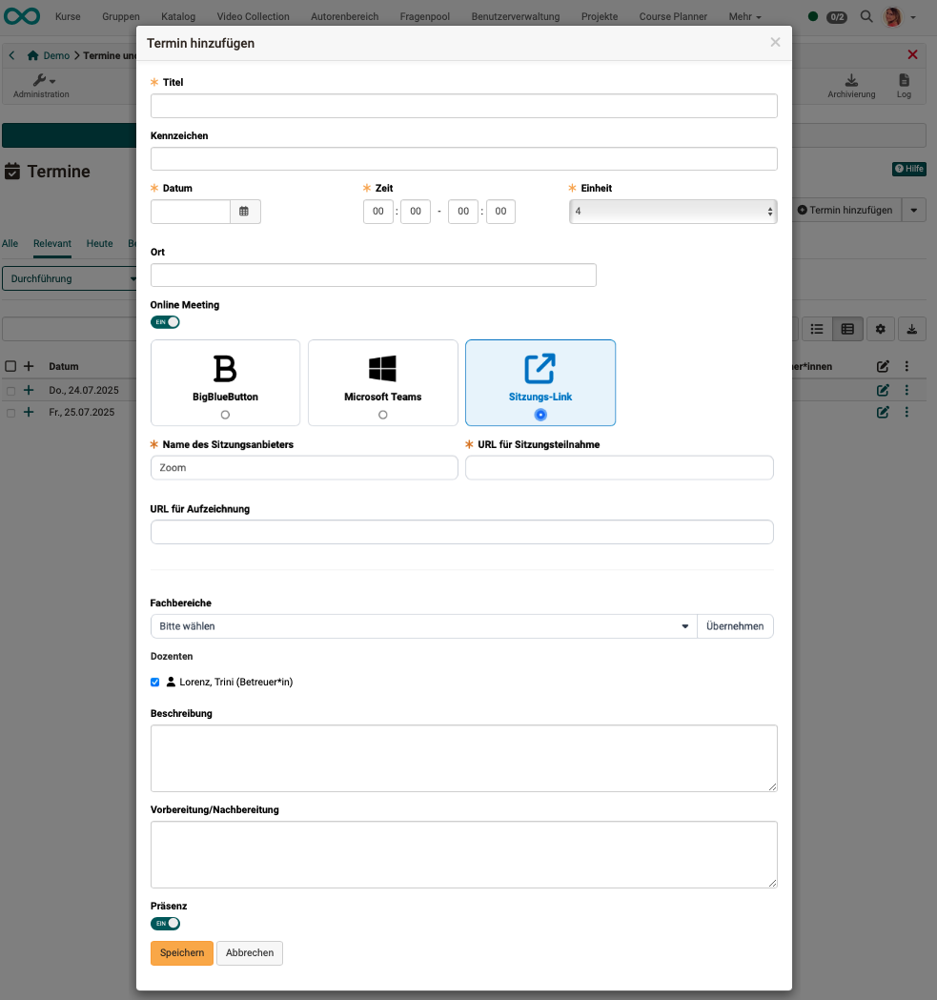{ class="shadow lightbox" }

 **Titel**: Vergeben Sie einen sinnvollen Namen.

 **Kennzeichen**: Die optionale Angabe eines Kennzeichens dient zur Unterscheidung bei Terminen mit gleichem Titel.

 **Datum**: Ein Datum muss zwingend angegeben werden.

 **Zeit**: Auch die Zeitangabe ist ein Pflichtfeld. Denn z.B. können Kalendereinträge nur mit einer Zeitangabe korrekt angezeigt werden.

 **Einheit**: Hier wird angegeben, wie viele (Zeit-)Einheiten dieser Termin umfasst. 
 Ein Termin kann 1 - 12 Einheiten umfassen. 
 Beispiel: Ein Termin umfasst 2 Stunden, die in 4 thematische Einheiten gegliedert sind (4 x 0.5 Stunden).

 **Ort**: Hier wird angegeben, wo dieser Termin stattfindet. Das kann z.B. ein Präsenzort oder die genaue Zimmerbezeichnung sein.

 **Online Meeting**: Soll der Termin online stattfinden, schalten Sie den Toggle-Button "Online Meeting" ein. Zur Auswahl stehen BigBlueButton, Microsoft Teams und "Sitzungs-Link". Der Sitzungs-Link deckt weitere Anbieter ab, zum Beispiel Zoom. Geben Sie dafür den "Name des Sitzungsanbieters" und die "URL für Sitzungsteilnahme" an. 
 Das Online Meeting übernimmt Titel, Zeit und Personen aus dem Termin. Später öffnen Sie es in der Terminliste über "Online Meeting beitreten".
Lernende haben Zugriff über den Kalender oder das Icon "Termine" in der Toolbar.

**URL für Aufzeichnung**: Es kann eine beliebige URL angegeben werden, unter der eine Aufzeichnung des Meetings aufgerufen wird. Die URL kann auch angegeben werden, wenn der Toggle-Button "Online Meeting" ausgeschaltet ist.

**Fachbereiche**: Hier können Sie den Termin einem oder mehreren Begriffen einer hinterlegten Taxonomie zuordnen. Dadurch kann der Termin dann schneller gefunden werden.

**Dozenten**: Für jeden Termin muss ein:e Kursbetreuer:in ausgewählt werden. Nur die ausgewählten Kursbetreuer:innen können die Anwesenheitskontrolle durchführen. (Als Dozent:in kann nur eine Person hinzugefügt werden, die auch die Rolle "Betreuer:in" besitzt.) Möchte ein:e Kursbesitzer:in ebenfalls diese Funktion übernehmen, muss sich diese Person zusätzlich als Kursbetreuer:in in den Kurs eintragen.

**Beschreibung**: Hier können Sie optional eine Beschreibung für den Termin hinzufügen.

**Vorbereitung/Nachbereitung**: Falls Sie den Teilnehmenden einen Vor- bzw. Nachbereitungsauftrag zum jeweiligen Termin geben möchten, kann dieser hier hinzugefügt werden. Er wird im Kalender angezeigt, sofern die Termine mit dem Kurskalender synchronisiert werden: `Kurs > Administration > Einstellungen > Tab Durchführung`.

**Präsenz**: Wird der Schalter auf "Aus" gestellt, ist die Absenzenerfassung für den Termin deaktiviert.

[Zum Seitenanfang ^](#course_admin_events_and_absences)

---

### Termine kopieren oder löschen {: #copy_delete_events}

Sobald in der ersten Spalte mindestens ein Termin selektiert ist, erscheinen über der Liste der Termine die Buttons zum Kopieren und Löschen von Terminen. 
Alternativ können die Optionen zum Kopieren und Löschen unter den 3 Punkten am Ende einer Zeile aufgerufen werden.

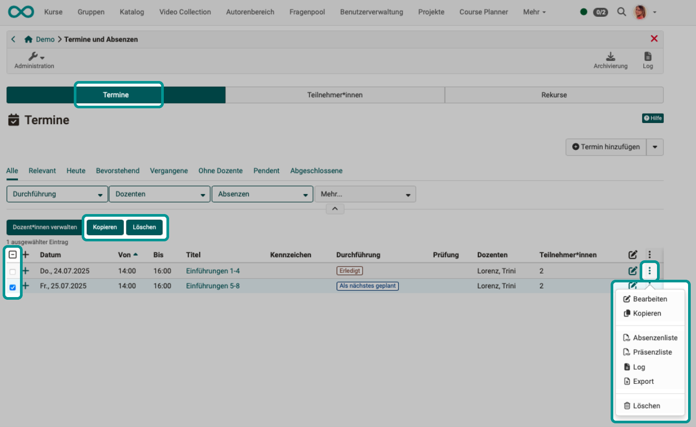{ class="shadow lightbox" }

[Zum Seitenanfang ^](#course_admin_events_and_absences)

---

### Termine importieren {: #import_events}

Es ist auch möglich, Termine zu importieren, die an anderer Stelle in OpenOlat exportiert wurden. Klicken Sie dazu im Tab "Termine" auf den kleinen Pfeil neben dem Button "Termin hinzufügen".

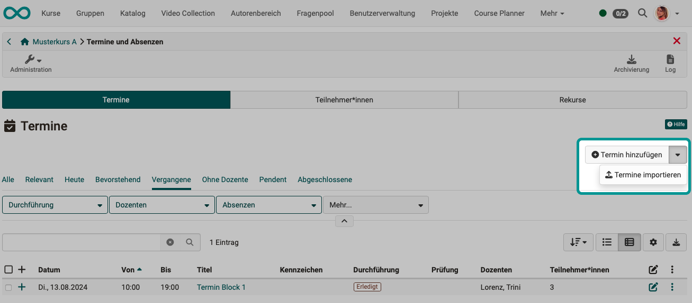{ class="shadow lightbox" }

[Zum Seitenanfang ^](#course_admin_events_and_absences)

---

### Termin als Prüfung markieren {: #mark_event_as_exam}

Unter den 3 Punkten kann ein Termin auch als Prüfung markiert werden. Für einen so markierten Termin kann z.B. der [Safe Exam Browser](../../manual_how-to/SEB/SEB.de.md) aktiviert werden.

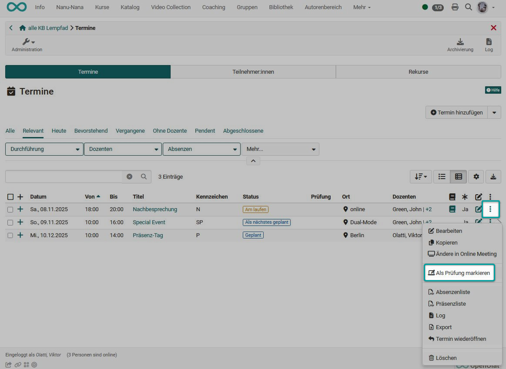{ class="shadow lightbox" }

[Zum Seitenanfang ^](#course_admin_events_and_absences)

---

### Termine absagen {: #cancel_events}

Das Absagen von Terminen findet über das [Termin-Icon in der Toolbar](../learningresources/Toolbar_Events.de.md#cancel_events) statt.

[Zum Seitenanfang ^](#course_admin_events_and_absences)

---

### Termine abschliessen {: #close_events}

Das Abschliessen von Terminen findet über das [Termin-Icon in der Toolbar](../learningresources/Toolbar_Events.de.md#close_events) statt.

[Zum Seitenanfang ^](#course_admin_events_and_absences)

---

### Termine wiederöffnen {: #reopen_events}

Ein bereits abgeschlossener Termin kann von Kursbesitzer:innen wiedergeöffnet werden. Sie finden die Option "Termin wiederöffnen" unter den 3 Punkten in der Zeile eines Termins.

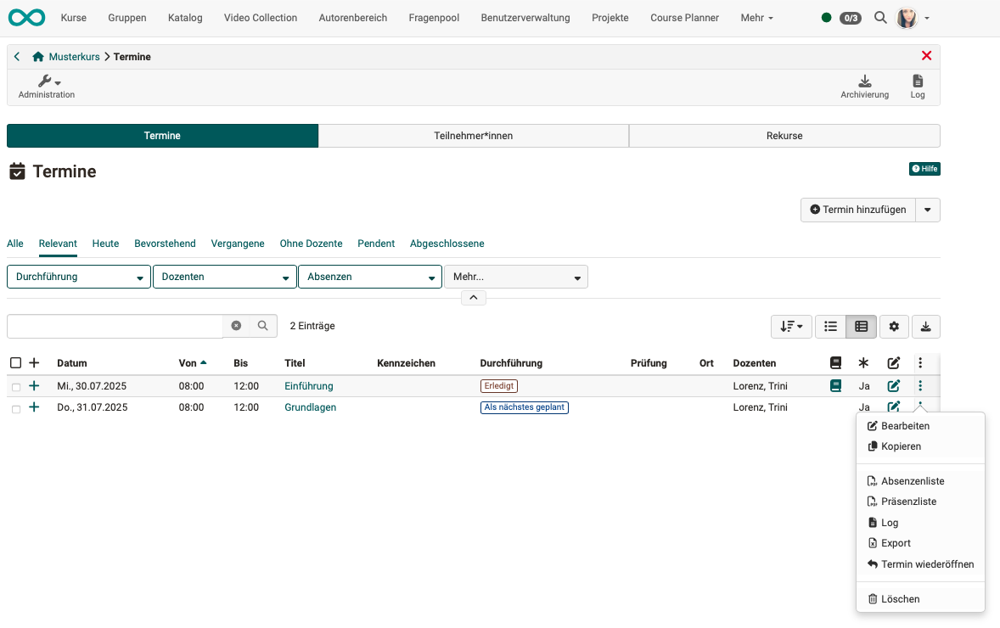{ class="shadow lightbox" }

Alternativ kann ein Termin auch über das Buch-Symbol (Absenz editieren) wiedergeöffnet werden.

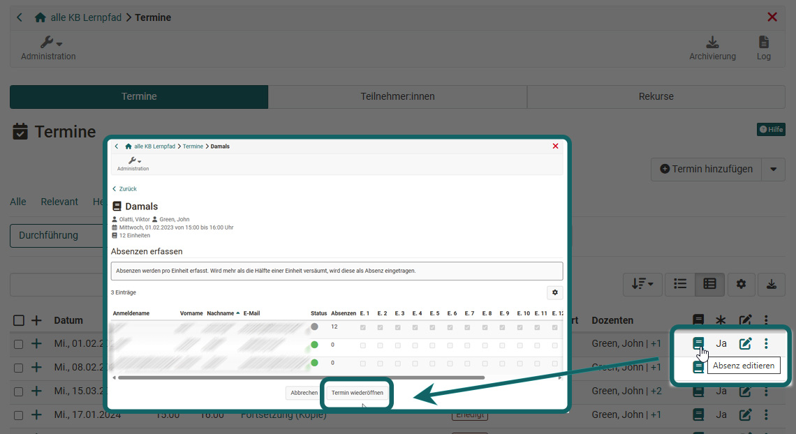{ class="shadow lightbox" }

[Zum Seitenanfang ^](#course_admin_events_and_absences)

---

### Dozent:innen verwalten {: #manage_teachers}

Sobald in der ersten Spalte mindestens ein Termin selektiert ist, erscheint über der Liste der Termine der Button "Dozent:innen verwalten".

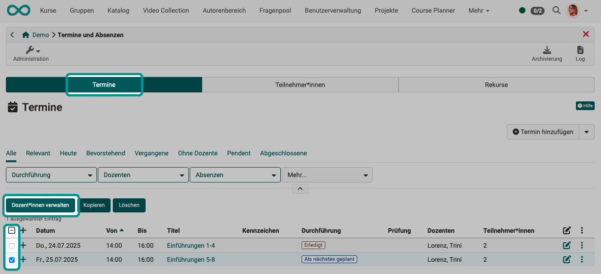{ class="shadow lightbox" }

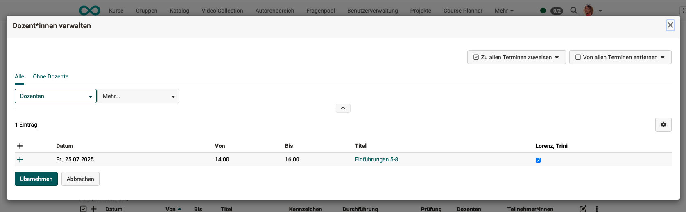{ class="shadow lightbox" }

[Zum Seitenanfang ^](#course_admin_events_and_absences)

---

### Teilnehmer:innen ausschliessen {: #exclude_participants}

Bei geöffneter Detailansicht eines Termins (nach Klick auf das + zu Beginn der betreffenden Zeile) wird am unteren Rand ein Icon mit 3 Punkten angezeigt. Dort finden Sie die Möglichkeit, die Teilnehmer:innen vom gewählten Termin auszuschliessen.

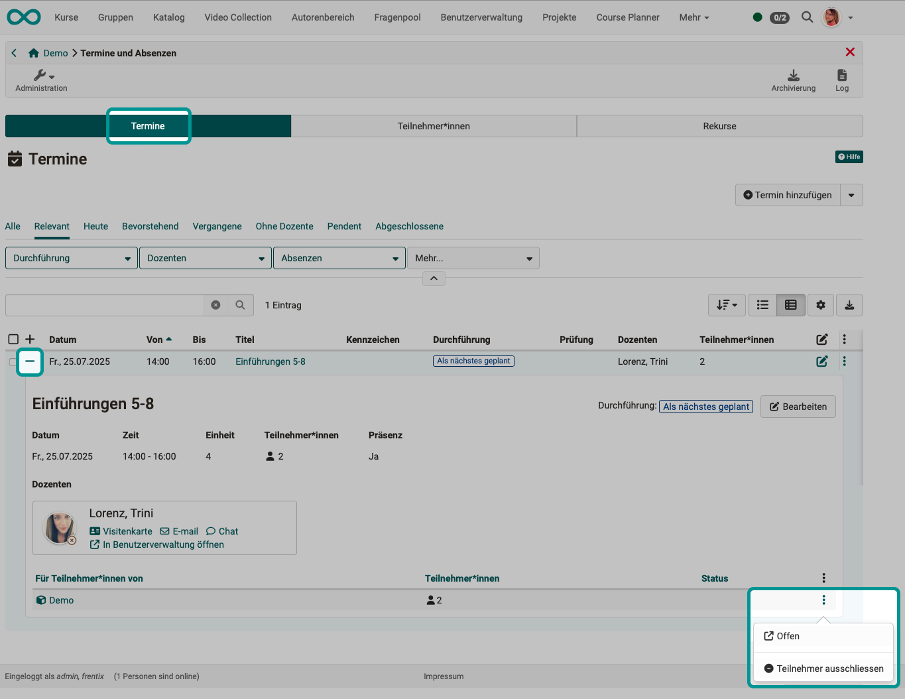{ class="shadow lightbox" }

[Zum Seitenanfang ^](#course_admin_events_and_absences)

---

## Tab Teilnehmer:innen {: #tab_participants}

Im Tab "Teilnehmer:innen" erhalten Sie eine Übersicht über alle Teilnehmer:innen des Kurses oder der ausgewählten Gruppen. (Ohne Besitzer:innen und Betreuer:innen, sofern diese nicht zusätzlich in der Rolle Teilnehmer:in eingetragen sind.) Über den Button "Drucken" kann die Liste gedruckt werden.

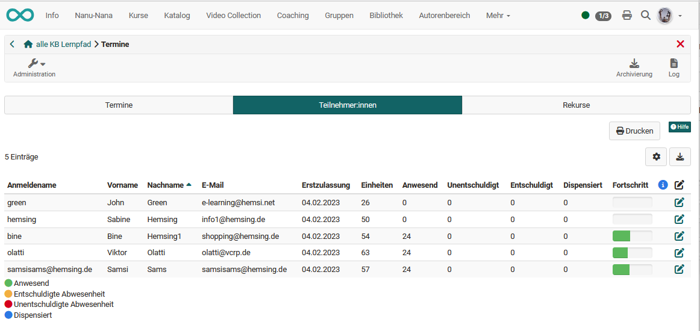{ class="shadow lightbox" }

**Erstzulassung** 
Mit der Erstzulassung wird definiert, wann der Teilnehmende mit dem Kurs begonnen hat.

**Einheiten** 
Hier wird die maximale Anzahl von Einheiten, die eine Person erreichen kann, angezeigt, unabhängig davon, ob der Termin schon stattgefunden hat oder nicht.

**Anwesend** 
Hier wird angezeigt, an wie vielen Einheiten die Person anwesend war. Berücksichtigt wird dabei die Anzahl der abgeschlossenen (erledigten) Absenzen.

**Unentschuldigt** 
Einheiten, bei denen die Person als unentschuldigt gekennzeichnet wurde.

**Entschuldigt** 
Einheiten, bei denen die Person als entschuldigt gekennzeichnet wurde. Der Grund kann angegeben werden.

**Dispensiert** 
Einheiten, für die die Person dispensiert wurde. Ob Dispensen als anwesend gezählt werden, legt die Konfiguration des Absenzenmanagements fest.

**Fortschritt** 
Im Fortschritt wird die Anwesenheit grafisch dargestellt. Grün symbolisiert die Anwesenheit, orange entschuldigte, rot abwesende bzw. unentschuldigte und blau dispensierte Einheiten.

:o_icon_o_midwarn: 
In der Achtungsspalte mit diesem Symbol wird angezeigt, ob die definierte Anwesenheitsquote erreicht worden ist. Das rote Symbol :o_icon_o_icon_error: bedeutet, dass die Quote unter dem erforderlichen Limit liegt. Das Warnsymbol :o_icon_o_icon_warning: erscheint, wenn die Quote weniger als fünf Prozentpunkte über dem Limit liegt.

:fontawesome-solid-circle-info: 
In der Infospalte werden Informationen angezeigt, welche von der Standardeinstellung abweichen. Dies ist beispielsweise ein persönlicher Schwellwert oder ein späterer Kursstart. Diese beiden Optionen können in den Einstellungen (Stift) definiert werden. Der persönliche Schwellwert definiert die zu erreichende Anwesenheitsquote für die betreffende Person.

Wenn Änderungen nicht sofort sichtbar sind, loggen Sie sich bitte aus und wieder ein. 

[Zum Seitenanfang ^](#course_admin_events_and_absences)

---

### Schwellwert für Präsenzpflicht individuell anpassen {: #personal_rate}

Der für den Kurs generell eingestellte Schwellwert für die Anwesenheitspflicht kann individuell angepasst werden. Wählen Sie dazu im Tab "Teilnehmer:innen" die betreffende Person und klicken Sie auf das Icon zum Bearbeiten.

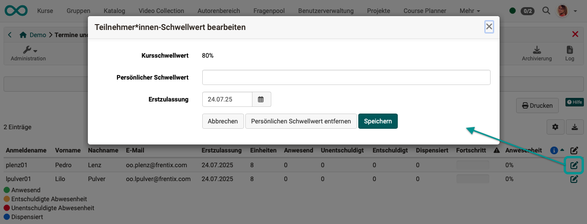{ class="shadow lightbox" }

[Zum Seitenanfang ^](#course_admin_events_and_absences)

---

## Tab Rekurse {: #tab_appeals}

Wurden Rekurse eingereicht, können Sie sich als Kursbesitzer:in unter diesem Tab einen Überblick verschaffen. Filter helfen Ihnen bei einer grösseren Anzahl von Rekursen.

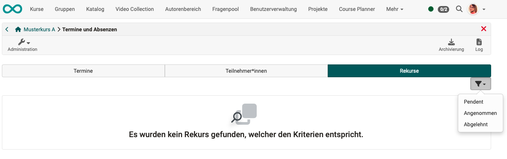{ class="shadow lightbox" }

Die Bearbeitung der Rekurse erfolgt in der Regel durch Absenzenverwalter:innen, die kursübergreifend alle Rekurse in der zentralen [kursübergreifenden Absenzenverwaltung](../area_modules/Absence_Management.de.md) abrufen können. 

[Zum Seitenanfang ^](#course_admin_events_and_absences)

---

## Weiterführende Informationen {: #further_information}

[Basiskonzept Termine und Absenzen >](../basic_concepts/Events_and_Absences.de.md) 
[Aktivierung und Konfiguration des Absenzenmanagements durch Administrator:innen >](../../manual_admin/administration/Modules_Events_and_Absences.de.md) 
[Konfiguration der Absenzenverwaltung in einem Kurs >](../learningresources/Course_Settings_Execution.de.md#config_event_and_absence_management) 
[Erfassung und Verwaltung der Absenzen in einem Kurs durch Betreuer:innen >](../learningresources/Toolbar_Events.de.md) 
[Persönliche Absenzen >](../personal_menu/Absences.de.md) 
[Kursübergreifende Absenzenerfassung im Coachingtool >](../area_modules/Coaching.de.md) 
[Kursübergreifende Absenzenverwaltung durch Absenzenverwalter:innen >](../area_modules/Absence_Management.de.md) 

[Zum Seitenanfang ^](#course_admin_events_and_absences)

