# Termine und Absenzen {: #course_admin_events_and_absences}

Mit den Terminen und Absenzen führen Sie Anwesenheitslisten online und dokumentieren Fehlzeiten. Die Anwesenheit erfassen Sie immer innerhalb eines Kurses.

Dazu legen Sie im Kurs Termine an und teilen jeden Termin in Einheiten. Ein Vormittag ist zum Beispiel ein Termin mit vier Einheiten zu je einer Stunde. Fehlt eine Person nur eine Stunde, erfassen Sie die Absenz für diese eine Einheit und nicht für den ganzen Termin.

Die Termine legen Kursbesitzer:innen selbst an, oder sie kommen aus einem externen Verwaltungssystem Ihrer Organisation. Im Kurskalender erscheinen die Termine, wenn für den Kurs "Kurs Kalender synchronisieren" eingeschaltet ist: [Kurseinstellungen - Tab Durchführung](../learningresources/Course_Settings_Execution.de.md#course_calendar_sync).

Damit Sie Termine und Absenzen im Kurs nutzen können, schalten Sie als Kursbesitzer:in die "Termin- und Absenzenverwaltung" ein: 
`Kurs > Administration > Einstellungen > Tab Durchführung` 
Danach stehen dort weitere Einstellungen bereit, und in der Kurs-Toolbar erscheint das Icon "Termine".

## "Termine" in der Toolbar {: #toolbar_events}

Als Kursbesitzer:in legen Sie hier Termine an und verwalten die Absenzen. Dieselben Möglichkeiten finden Sie weitgehend auch im Menü Administration unter "Termine und Absenzen".

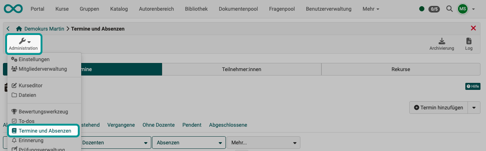{ class="shadow lightbox" title="Menü Administration eines Kurses" }

Als Betreuer:in öffnen Sie die Termine nur über das Icon "Termine" in der Toolbar; im Menü Administration fehlt der Eintrag "Termine und Absenzen". Neue Termine legen Sie nicht an. Sie sehen die vorhandenen Termine und erfassen, sofern im Kurs eingeschaltet, die Absenzen. Mit "Zeigt nur meine" sehen Sie nur die Termine, bei denen Sie als Dozent:in eingetragen sind.

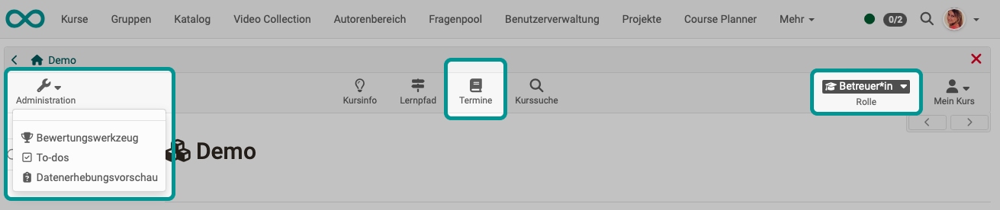{ class="shadow lightbox" title="Kurs-Toolbar in der Sicht der Betreuer:innen" }

Teilnehmende öffnen über das Icon "Termine" in der Toolbar ihre Termine im Kurs, vor Ort wie online, etwa in einem Blended-Learning-Kurs.

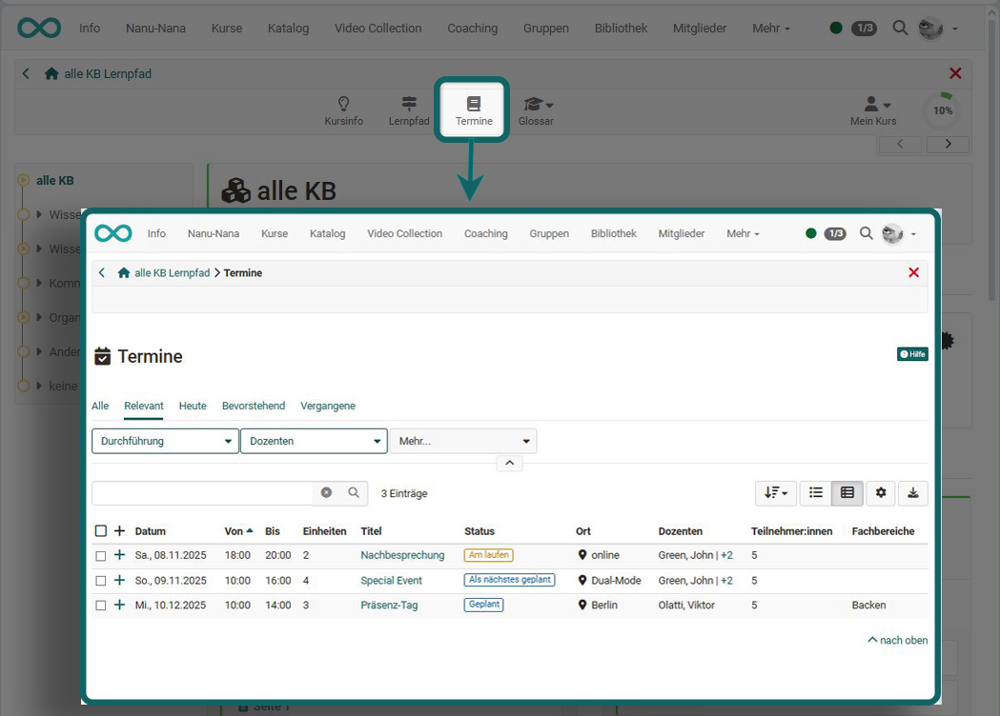{ class="shadow lightbox" title="Terminliste in der Sicht der Teilnehmenden" }

Ihre eigenen Fehlzeiten finden Teilnehmende in den persönlichen Werkzeugen im [Menü "Absenzen"](../personal_menu/Absences.de.md).

[Zum Seitenanfang ^](#course_admin_events_and_absences)

---

Die folgenden Abschnitte beschreiben die Ansicht der Kursbesitzer:innen.

## Tab Termine [:octicons-tag-16:{ title="ab Release 12.0 (OO-2636)" }](https://track.frentix.com/issue/OO-2636) {: #tab_events}

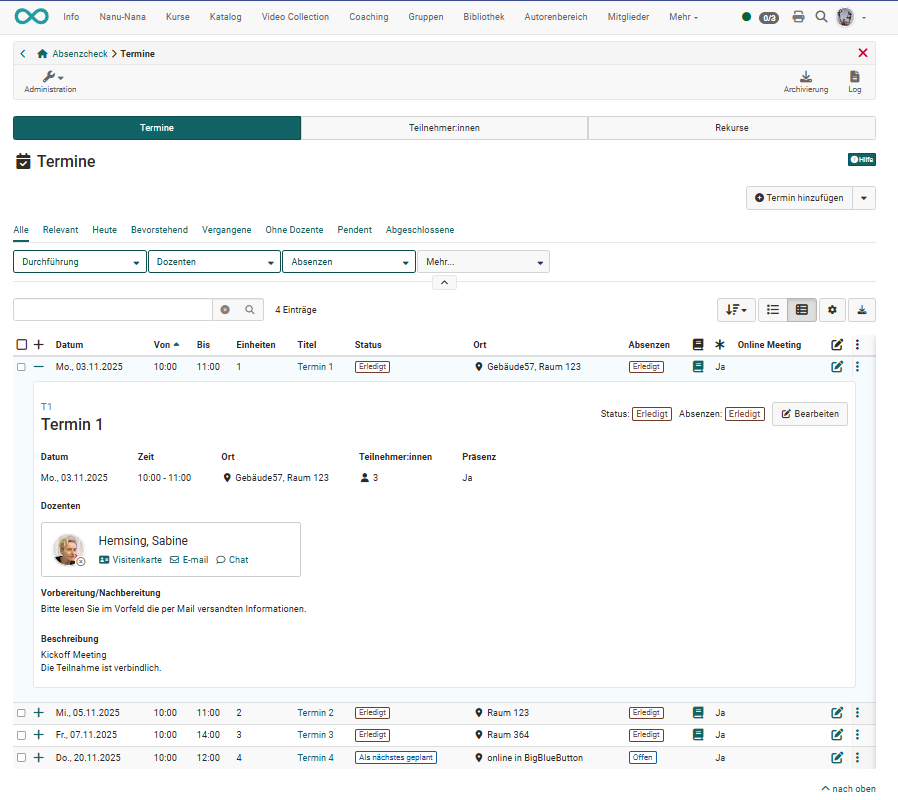{ class="shadow lightbox" title="Tab Termine in der Kurs-Administration" }

### Termine anzeigen {: #display_events}

Im Tab "Termine" fügen Sie dem Kurs Termine hinzu und grenzen die Liste mit den Tabs und Filtern ein. Haben Sie Termine Fachbereichen (Taxonomie) zugeordnet, filtern Sie auch nach diesen. Die Details eines Termins klappen Sie mit dem + am Anfang seiner Zeile auf.

Im 3-Punkte-Menü am Ende jeder Zeile finden Sie die Aktionen zu einem Termin:

- **Bearbeiten** und **Kopieren**
- **Ändere in Online Meeting** oder "Ändere in vor Ort Termin", bei einem Termin mit Online Meeting zusätzlich "Online Meeting beitreten"
- **Als Prüfung markieren**, bei einem bereits markierten Termin stattdessen "Prüfung editieren" und "Prüfung löschen", siehe [Termin als Prüfung markieren](#mark_event_as_exam)
- **Absenzenliste** und "Präsenzliste" als PDF, "Log" und "Export" als Excel-Datei
- **Termin wiederöffnen** bei einem abgeschlossenen oder abgesagten Termin, siehe [Termine wiederöffnen](#reopen_events)
- **Löschen**

Wird der Kurs im Course Planner verwendet, fehlen Bearbeiten, Kopieren, die Umstellung auf ein Online Meeting oder einen vor Ort Termin und Löschen, weil die Termine im Course Planner verwaltet werden. Stammen die Termine aus einem externen Verwaltungssystem, können Bearbeiten und Löschen ebenfalls fehlen. Welche Einträge Betreuer:innen im selben Menü sehen, beschreibt die Seite zur Toolbar: [Menü am Zeilenende](../learningresources/Toolbar_Events.de.md#lists_and_export)

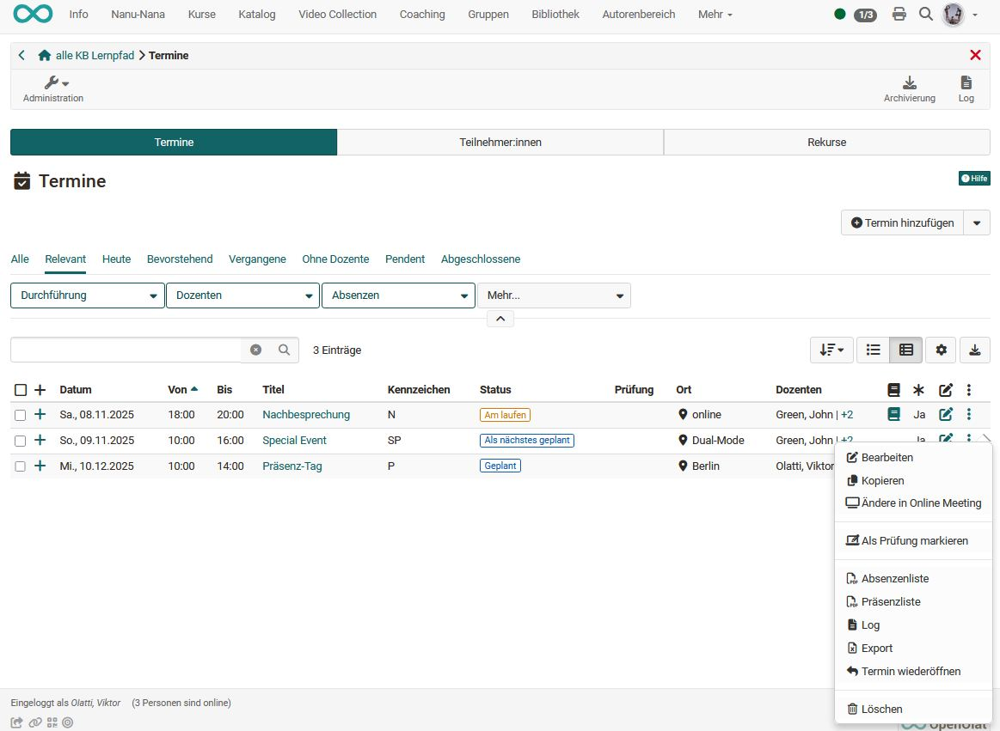{ class="shadow lightbox" title="Tab Termine in der Kurs-Administration" }

Über die Spaltenauswahl (Zahnrad) blenden Sie weitere Spalten ein. Ist das Modul "Räume" aktiviert, steht dort zusätzlich die Spalte "Räume" mit den gebuchten Räumen des Termins. Sie ist standardmässig ausgeblendet.

[Zum Seitenanfang ^](#course_admin_events_and_absences)

---

### Ansichten: Zeitansicht und Tabelle {: #views}

Die Terminliste steht in zwei Ansichten zur Verfügung. Rechts über der Liste stehen die beiden Umschalter nebeneinander: links die "Zeitansicht", rechts die "Tabellenansicht". Für Kursbesitzer:innen ist die Tabellenansicht voreingestellt, Teilnehmende sehen die Zeitansicht.

In der Zeitansicht steht jeder Termin als eigener Block, nach Jahr und Datum gruppiert. Der Kopf des Blocks nennt links den Titel und das Kennzeichen des Termins mit dem Statusabzeichen, darunter die Zeit. Rechts steht das 3-Punkte-Menü mit den Aktionen zum Termin. Optional kommen dazu: die Fachbereiche als Etiketten unter dem Titel, der Ort, und bei einem Online Meeting die Schaltfläche zum Beitreten. Sind Vor- oder Nachlaufzeiten erfasst, erscheinen sie als Minutenangabe hinter der Zeit.

[Zum Seitenanfang ^](#course_admin_events_and_absences)

---

### Detailansicht eines Termins [:octicons-tag-16:{ title="ab Release 21.0 (OO-9526)" }](https://track.frentix.com/issue/OO-9526){:target="_blank"} {: #event_details}

In der Tabellenansicht klappt ein Klick auf das + zu Beginn einer Zeile die Detailansicht auf, in der Zeitansicht der Pfeil am unteren Rand des Blocks. Der Inhalt ist in beiden Ansichten derselbe.

In der Tabellenansicht steht zuoberst eine Titelzeile mit Titel und Kennzeichen des Termins, den Abzeichen "Status" und "Absenzen" und rechts der Aktion "Bearbeiten". In der Zeitansicht fehlt diese Zeile, weil der Kopf des Blocks dieselben Angaben zeigt; dort bearbeiten Sie den Termin über das 3-Punkte-Menü.

Darunter sehen Sie auf einer Zeile Datum, Zeit, Teilnehmer:innen und Präsenz. "Einheit" erscheint nur, wenn der Termin mehr als eine Einheit umfasst, "Ort" nur, wenn ein Ort erfasst ist.

Danach folgen die Dozent:innen als Personenkarten mit Visitenkarte, E-Mail und Chat. Ist niemand eingetragen, steht dort "Keine Dozenten verfügbar.".

Die übrigen Angaben erscheinen nur, wenn sie am Termin gepflegt sind:

* **Online Meeting**: "Online Meeting beitreten" als hervorgehobene Schaltfläche, dazu der Link auf eine hinterlegte Aufzeichnung.
* **Raum**: die Raumkarte unter dem Label "Raum", bei mehreren Räumen unter "Räume". Ist ein Raum im Zeitraum des Termins doppelt gebucht, steht die Warnung unterhalb der Raumkarte und die Karte erhält einen gelben Rand. [:octicons-tag-16:{ title="ab Release 21.0.2 (OO-9641)" }](https://track.frentix.com/issue/OO-9641){:target="_blank"}
* **Beschreibung** und **Vorbereitung/Nachbereitung** als eigene Absätze.

Zuunterst zeigt eine Tabelle, für wen der Termin gilt: eine Zeile pro Kurs, Gruppe oder Element des Course Planner, mit der Anzahl Teilnehmender und ob sie eingeschlossen oder ausgeschlossen sind. Wie Sie Teilnehmende ausnehmen, steht unter [Teilnehmer:innen ausschliessen](#exclude_participants).

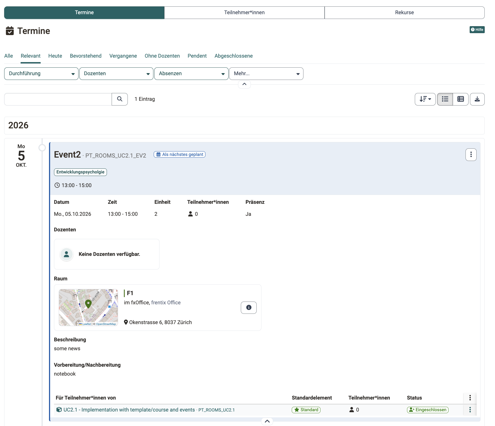{ class="shadow lightbox" title="Zeitansicht der Terminliste" }

Räume werden im Course Planner zugewiesen. Ein eigenständiger Kurs zeigt deshalb keine Raumkarten: [Räume für einen Termin belegen >](../area_modules/Course_Planner_Events.de.md#room_booking)

[Zum Seitenanfang ^](#course_admin_events_and_absences)

---

### Termin erstellen/bearbeiten {: #edit_events}

Einen Termin legen Sie mit dem Button "Termin hinzufügen" rechts über der Liste im Tab "Termine" an.

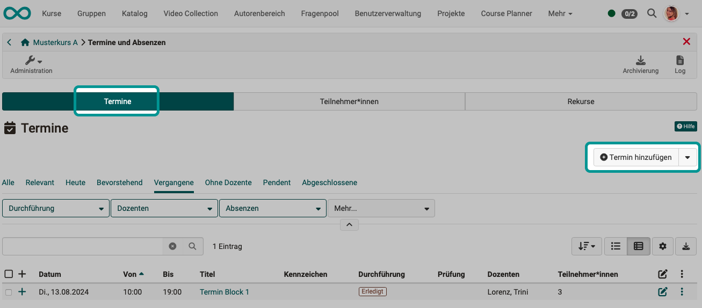{ class="shadow lightbox" title="Tab Termine in der Kurs-Administration" }

!!! info "Wichtig"

    Der Button "Termin hinzufügen" wird nur angezeigt, wenn es sich um einen eigenständigen Kurs handelt. Siehe `Kurs > Administration > Einstellungen > Tab Freigabe > Abschnitt Verwendung`. Wird der Kurs im Course Planner verwendet, werden die Termine im Course Planner erstellt und verwaltet.

Im Dialog "Termin hinzufügen" erfassen Sie die Angaben zum Termin.

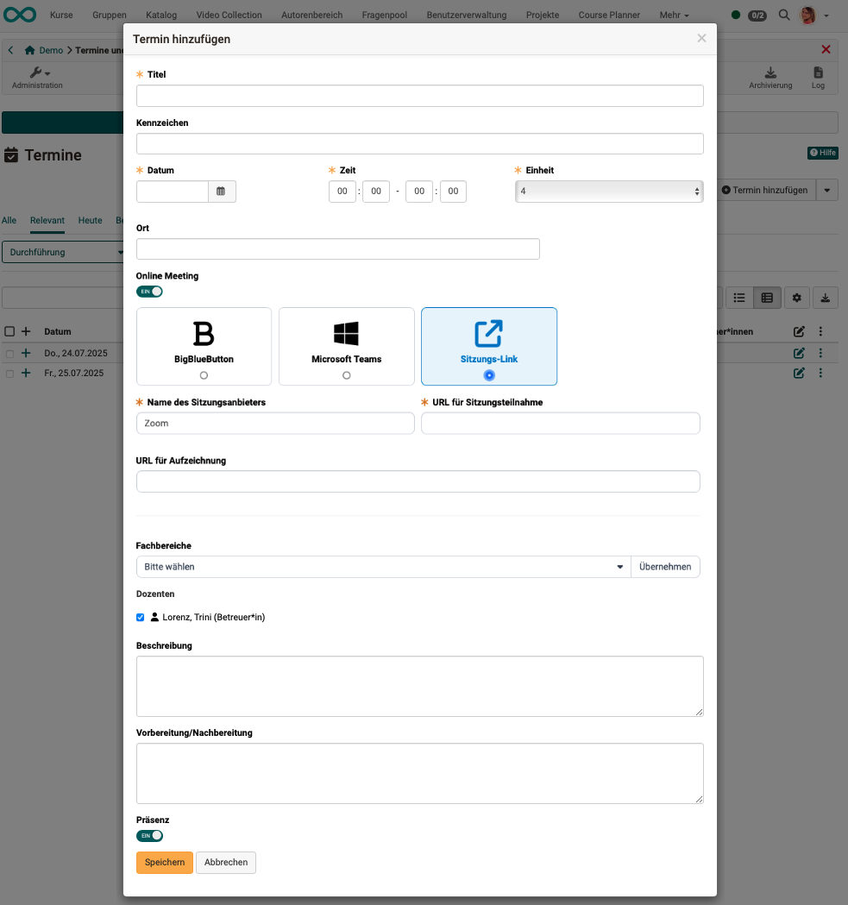{ class="shadow lightbox" title="Dialog Termin hinzufügen" }

 **Titel**: Vergeben Sie einen sinnvollen Namen.

 **Kennzeichen**: Die optionale Angabe eines Kennzeichens dient zur Unterscheidung bei Terminen mit gleichem Titel.

 **Datum**: Ein Datum muss zwingend angegeben werden.

 **Zeit**: Auch die Zeitangabe ist ein Pflichtfeld. Denn z.B. können Kalendereinträge nur mit einer Zeitangabe korrekt angezeigt werden.

 **Einheit**: Hier wird angegeben, wie viele (Zeit-)Einheiten dieser Termin umfasst. 
 Ein Termin kann 1 - 12 Einheiten umfassen. 
 Beispiel: Ein Termin umfasst 2 Stunden, die in 4 thematische Einheiten gegliedert sind (4 x 0.5 Stunden).

!!! info "Wichtig"

    Stammen die Termine aus einem externen Verwaltungssystem, das sie nach OpenOlat synchronisiert, ist das Feld "Einheit" in OpenOlat gesperrt. Der Wert kommt aus diesem System und wird dort geändert. Gesperrt ist das Feld ausserdem, sobald die Anwesenheitskontrolle des Termins abgeschlossen ist.

 **Ort**: Hier wird angegeben, wo dieser Termin stattfindet. Das kann z.B. ein Präsenzort oder die genaue Zimmerbezeichnung sein.

 **Online Meeting**: Soll der Termin online stattfinden, schalten Sie "Online Meeting" ein. Zur Auswahl stehen BigBlueButton, Microsoft Teams und "Sitzungs-Link". Der Sitzungs-Link deckt weitere Anbieter ab, zum Beispiel Zoom. Geben Sie dafür den "Name des Sitzungsanbieters" und die "URL für Sitzungsteilnahme" an. 
 Das Online Meeting übernimmt Titel, Zeit und Personen aus dem Termin. Später öffnen Sie es in der Terminliste über "Online Meeting beitreten".
Lernende haben Zugriff über den Kalender oder das Icon "Termine" in der Toolbar.

**URL für Aufzeichnung**: Es kann eine beliebige URL angegeben werden, unter der eine Aufzeichnung des Meetings aufgerufen wird. Die URL kann auch angegeben werden, wenn der Schalter "Online Meeting" ausgeschaltet ist.

**Fachbereiche**: Hier können Sie den Termin einem oder mehreren Begriffen einer hinterlegten Taxonomie zuordnen. Dadurch kann der Termin dann schneller gefunden werden.

**Dozenten**: Für jeden Termin muss ein:e Kursbetreuer:in ausgewählt werden. Nur die ausgewählten Kursbetreuer:innen können die Anwesenheitskontrolle durchführen. (Als Dozent:in kann nur eine Person hinzugefügt werden, die auch die Rolle "Betreuer:in" besitzt.) Möchte ein:e Kursbesitzer:in ebenfalls diese Funktion übernehmen, muss sich diese Person zusätzlich als Kursbetreuer:in in den Kurs eintragen.

**Beschreibung**: Hier können Sie optional eine Beschreibung für den Termin hinzufügen.

**Vorbereitung/Nachbereitung**: Falls Sie den Teilnehmenden einen Vor- bzw. Nachbereitungsauftrag zum jeweiligen Termin geben möchten, kann dieser hier hinzugefügt werden. Er wird im Kalender angezeigt, sofern die Termine mit dem Kurskalender synchronisiert werden: `Kurs > Administration > Einstellungen > Tab Durchführung`.

**Präsenz**: Wird der Schalter auf "Aus" gestellt, ist die Absenzenerfassung für den Termin deaktiviert.

[Zum Seitenanfang ^](#course_admin_events_and_absences)

---

### Termine kopieren oder löschen {: #copy_delete_events}

Setzen Sie in der ersten Spalte ein Häkchen bei einem oder mehreren Terminen. Über der Liste erscheinen dann die Buttons "Kopieren" und "Löschen". 
Einen einzelnen Termin kopieren oder löschen Sie auch über das 3-Punkte-Menü am Ende seiner Zeile.

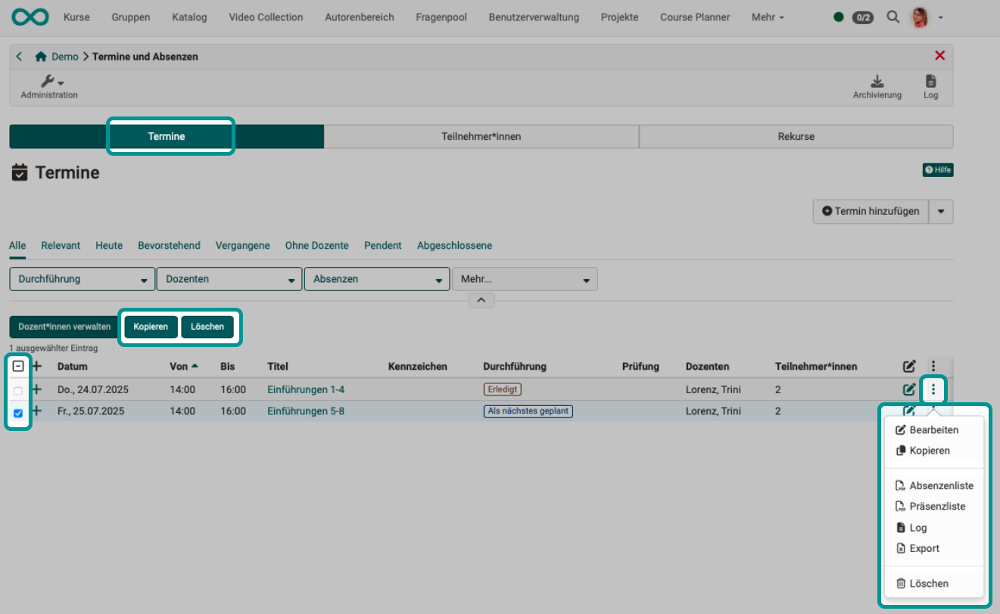{ class="shadow lightbox" title="Tab Termine in der Kurs-Administration" }

[Zum Seitenanfang ^](#course_admin_events_and_absences)

---

### Termine importieren [:octicons-tag-16:{ title="ab Release 13.0 (OO-3666)" }](https://track.frentix.com/issue/OO-3666){:target="_blank"} {: #import_events}

Viele Termine auf einmal erfassen Sie schneller mit einer Excel-Datei als einzeln im Dialog. Klicken Sie dazu im Tab "Termine" auf den kleinen Pfeil neben dem Button "Termin hinzufügen" und wählen Sie "Termine importieren". Der Assistent "Termine aus Excel importieren" bietet die "Vorlage Excelimport" zum Herunterladen. Kopieren Sie die ausgefüllten Zeilen aus der Excel-Datei in das Feld "Kopierte Zeilen aus Exceldatei (Kommasepariert)".

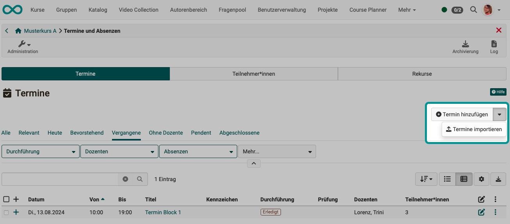{ class="shadow lightbox" title="Tab Termine in der Kurs-Administration" }

[Zum Seitenanfang ^](#course_admin_events_and_absences)

---

### Termin als Prüfung markieren [:octicons-tag-16:{ title="ab Release 14.0 (OO-4045)" }](https://track.frentix.com/issue/OO-4045) {: #mark_event_as_exam}

Findet ein Termin als Prüfung statt, markieren Sie ihn über "Als Prüfung markieren" im 3-Punkte-Menü. OpenOlat legt dafür einen Prüfungsmodus an, der Datum, Zeit und Teilnehmende aus dem Termin übernimmt. Im folgenden Dialog wählen Sie die Kursbausteine der Prüfung und schalten bei Bedarf den [Safe Exam Browser](../../manual_how-to/SEB/SEB.de.md) ein: [Prüfungsmodus aus einem Termin](../learningresources/Assessment_mode.de.md#exam_from_event)

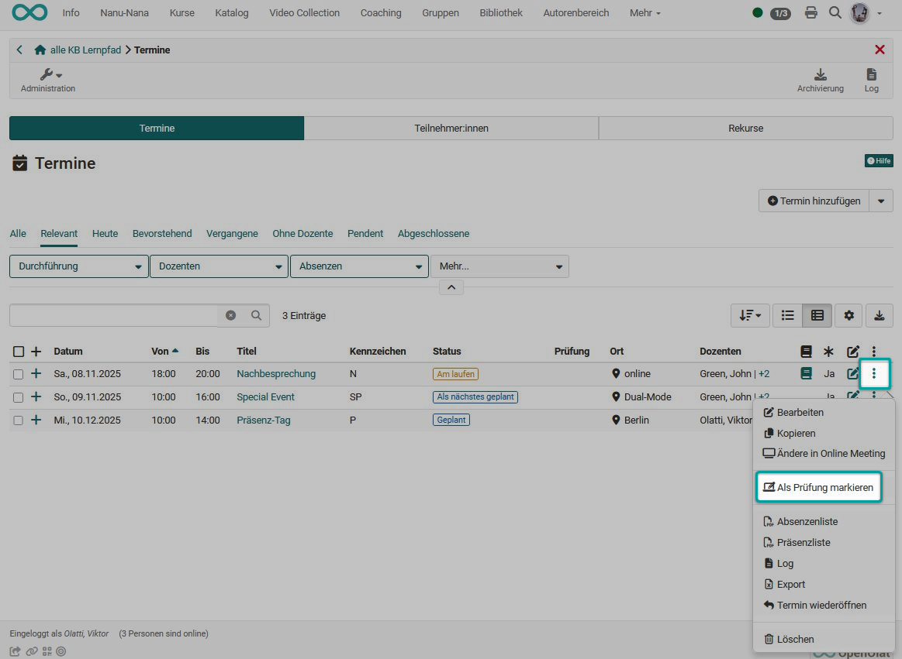{ class="shadow lightbox" title="Tab Termine in der Kurs-Administration" }

Nach dem Speichern zeigt die Spalte "Prüfung" ein Symbol, und das 3-Punkte-Menü bietet "Prüfung editieren" und "Prüfung löschen". Die Prüfung erscheint zudem in der Prüfungsverwaltung des Kurses unter `Kurs > Administration > Prüfungsverwaltung`.

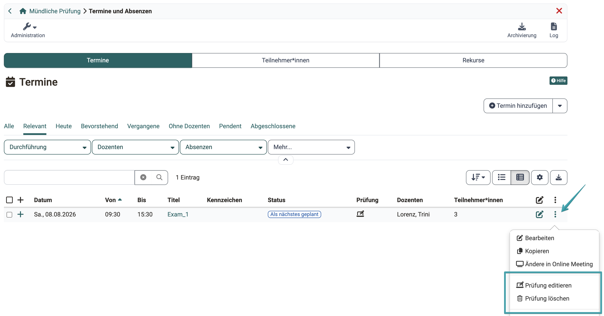{ class="shadow lightbox" title="Tab Termine in der Kurs-Administration · 2026.10.02" }

Denselben Eintrag haben Betreuer:innen in der Toolbar. Wer ihn ausserdem nutzen kann und warum er fehlen kann, beschreibt die Seite zur Toolbar: [Wenn "Als Prüfung markieren" fehlt](../learningresources/Toolbar_Events.de.md#mark_as_exam_missing)

[Zum Seitenanfang ^](#course_admin_events_and_absences)

---

### Termine absagen {: #cancel_events}

Termine sagen Sie über das [Icon "Termine" in der Toolbar](../learningresources/Toolbar_Events.de.md#cancel_events) ab.

[Zum Seitenanfang ^](#course_admin_events_and_absences)

---

### Termine abschliessen {: #close_events}

Termine schliessen Sie über das [Icon "Termine" in der Toolbar](../learningresources/Toolbar_Events.de.md#close_events) ab.

[Zum Seitenanfang ^](#course_admin_events_and_absences)

---

### Termine wiederöffnen [:octicons-tag-16:{ title="ab Release 13.0 (OO-3716)" }](https://track.frentix.com/issue/OO-3716){:target="_blank"} {: #reopen_events}

Als Kursbesitzer:in öffnen Sie einen abgeschlossenen Termin wieder: Wählen Sie im 3-Punkte-Menü seiner Zeile "Termin wiederöffnen".

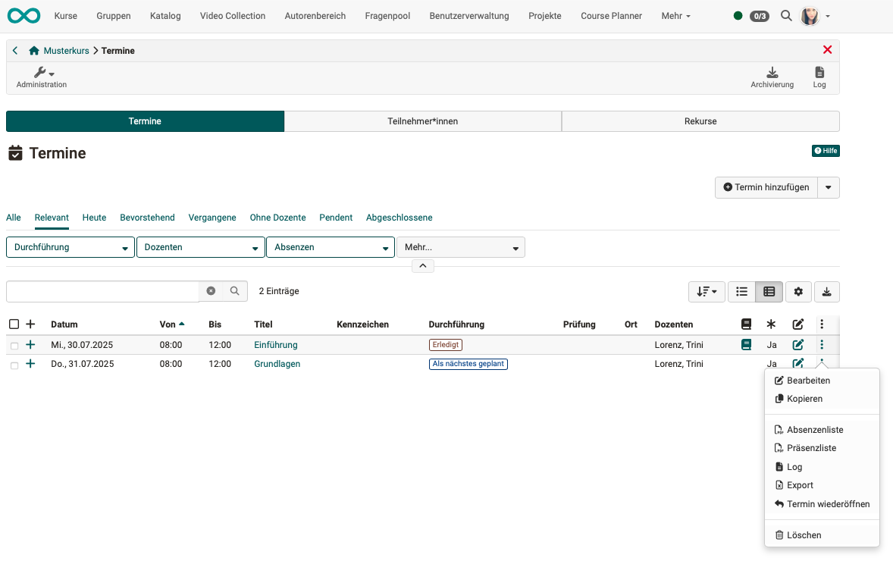{ class="shadow lightbox" title="Tab Termine in der Kurs-Administration" }

Alternativ öffnen Sie mit dem Buch-Symbol ("Absenz editieren") die Absenzenerfassung und klicken dort auf "Termin wiederöffnen".

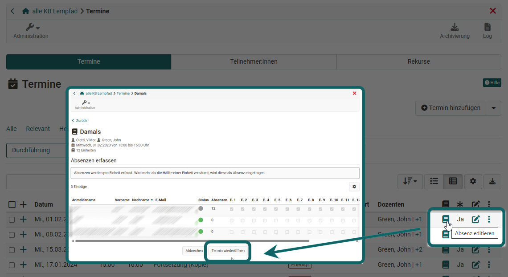{ class="shadow lightbox" title="Absenzenerfassung eines Termins" }

[Zum Seitenanfang ^](#course_admin_events_and_absences)

---

### Dozent:innen verwalten [:octicons-tag-16:{ title="ab Release 20.0.3 (OO-8622)" }](https://track.frentix.com/issue/OO-8622) {: #manage_teachers}

Setzen Sie in der ersten Spalte ein Häkchen bei einem oder mehreren Terminen. Über der Liste erscheint dann der Button "Dozent:innen verwalten". Im gleichnamigen Dialog weisen Sie Dozent:innen mit einem Häkchen einzelnen Terminen zu, oder mit "Zu allen Terminen zuweisen" und "Von allen Terminen entfernen" allen gewählten Terminen auf einmal.

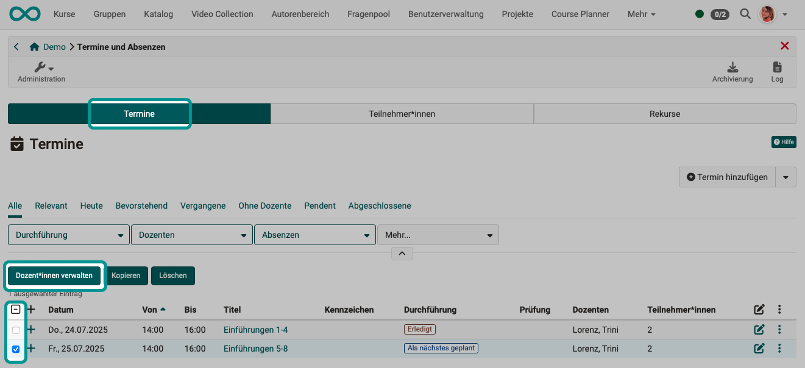{ class="shadow lightbox" title="Tab Termine in der Kurs-Administration" }

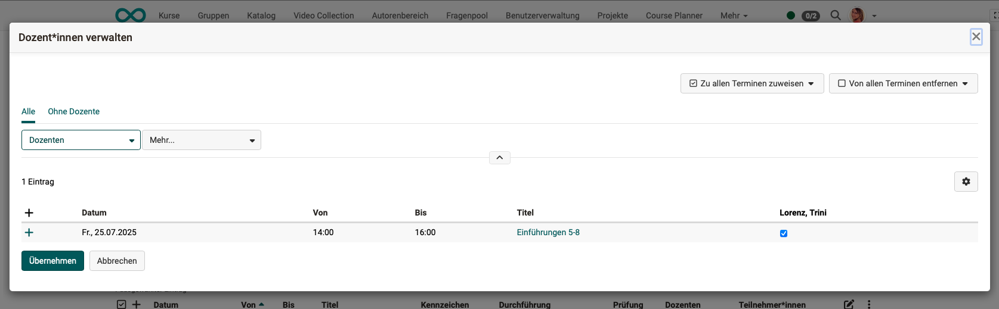{ class="shadow lightbox" title="Dialog Dozent:innen verwalten" }

[Zum Seitenanfang ^](#course_admin_events_and_absences)

---

### Teilnehmer:innen ausschliessen {: #exclude_participants}

Soll eine Gruppe von Teilnehmenden nicht an einem Termin teilnehmen, nehmen Sie sie von diesem Termin aus. Öffnen Sie dazu die Detailansicht des Termins (Klick auf das + am Anfang der Zeile). In der Tabelle zuunterst steht eine Zeile pro Kurs, Gruppe oder Element. Öffnen Sie das 3-Punkte-Menü am Ende der Zeile und wählen Sie "Teilnehmer ausschliessen". Die Spalte "Status" zeigt danach "Ausgeschlossen"; mit "Teilnehmer wieder einschliessen" im selben Menü nehmen Sie die Teilnehmenden wieder auf.

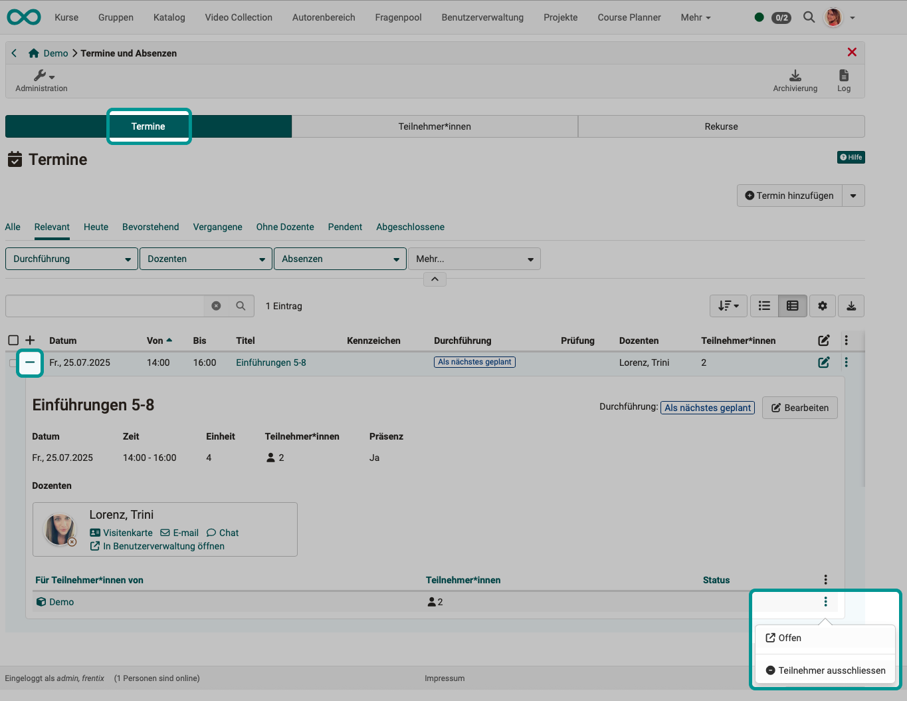{ class="shadow lightbox" title="Detailansicht eines Termins" }

[Zum Seitenanfang ^](#course_admin_events_and_absences)

---

## Tab Teilnehmer:innen {: #tab_participants}

Im Tab "Teilnehmer:innen" erhalten Sie eine Übersicht über alle Teilnehmer:innen des Kurses oder der ausgewählten Gruppen. (Ohne Besitzer:innen und Betreuer:innen, sofern diese nicht zusätzlich in der Rolle Teilnehmer:in eingetragen sind.) Über den Button "Drucken" kann die Liste gedruckt werden.

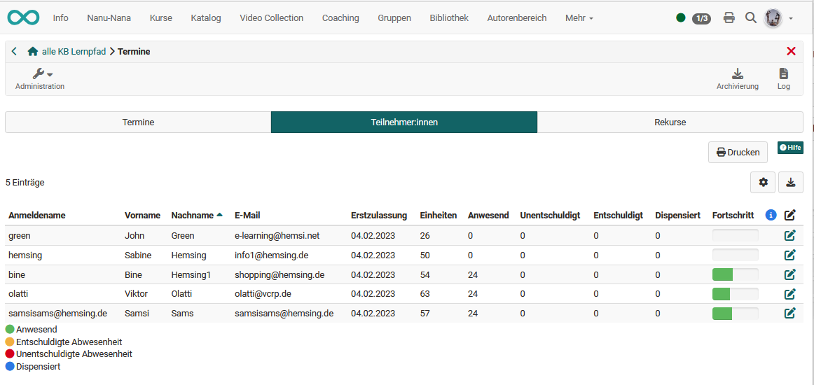{ class="shadow lightbox" title="Tab Teilnehmer:innen in der Kurs-Administration" }

**Erstzulassung** 
Mit der Erstzulassung wird definiert, wann der Teilnehmende mit dem Kurs begonnen hat.

**Einheiten** 
Hier wird die maximale Anzahl von Einheiten, die eine Person erreichen kann, angezeigt, unabhängig davon, ob der Termin schon stattgefunden hat oder nicht.

**Anwesend** 
Hier wird angezeigt, an wie vielen Einheiten die Person anwesend war. Berücksichtigt wird dabei die Anzahl der abgeschlossenen (erledigten) Absenzen.

**Unentschuldigt** 
Einheiten, bei denen die Person als unentschuldigt gekennzeichnet wurde.

**Entschuldigt** 
Einheiten, bei denen die Person als entschuldigt gekennzeichnet wurde. Der Grund kann angegeben werden.

**Dispensiert** 
Einheiten, für die die Person dispensiert wurde. Ob Dispensen als anwesend zählen, legt die Konfiguration der Termin- und Absenzenverwaltung fest.

**Fortschritt** 
Im Fortschritt wird die Anwesenheit grafisch dargestellt. Grün symbolisiert die Anwesenheit, orange entschuldigte, rot abwesende bzw. unentschuldigte und blau dispensierte Einheiten.

:o_icon_o_midwarn: 
In der Achtungsspalte mit diesem Symbol wird angezeigt, ob die definierte Anwesenheitsquote erreicht worden ist. Das rote Symbol :o_icon_o_icon_error: bedeutet, dass die Quote unter dem erforderlichen Limit liegt. Das Warnsymbol :o_icon_o_icon_warning: erscheint, wenn die Quote weniger als fünf Prozentpunkte über dem Limit liegt.

:fontawesome-solid-circle-info: 
In der Infospalte werden Informationen angezeigt, welche von der Standardeinstellung abweichen. Dies ist beispielsweise ein persönlicher Schwellwert oder ein späterer Kursstart. Diese beiden Optionen können in den Einstellungen (Stift) definiert werden. Der persönliche Schwellwert definiert die zu erreichende Anwesenheitsquote für die betreffende Person.

Wenn Änderungen nicht sofort sichtbar sind, loggen Sie sich bitte aus und wieder ein. 

[Zum Seitenanfang ^](#course_admin_events_and_absences)

---

### Schwellwert für Präsenzpflicht individuell anpassen {: #personal_rate}

Der für den Kurs generell eingestellte Schwellwert für die Anwesenheitspflicht kann individuell angepasst werden. Wählen Sie dazu im Tab "Teilnehmer:innen" die betreffende Person und klicken Sie auf das Icon zum Bearbeiten.

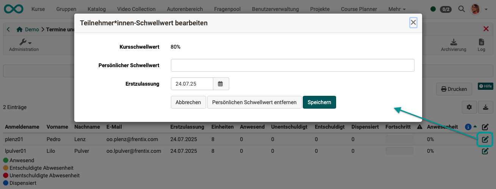{ class="shadow lightbox" title="Dialog Teilnehmer:innen-Schwellwert bearbeiten" }

[Zum Seitenanfang ^](#course_admin_events_and_absences)

---

## Tab Rekurse {: #tab_appeals}

Halten Teilnehmende eine erfasste Absenz für falsch, reichen sie einen Rekurs ein. Im Tab "Rekurse" sehen Sie als Kursbesitzer:in diese Rekurse. Bei vielen Rekursen zeigen Sie mit dem Filter rechts über der Liste nur die pendenten, angenommenen oder abgelehnten an.

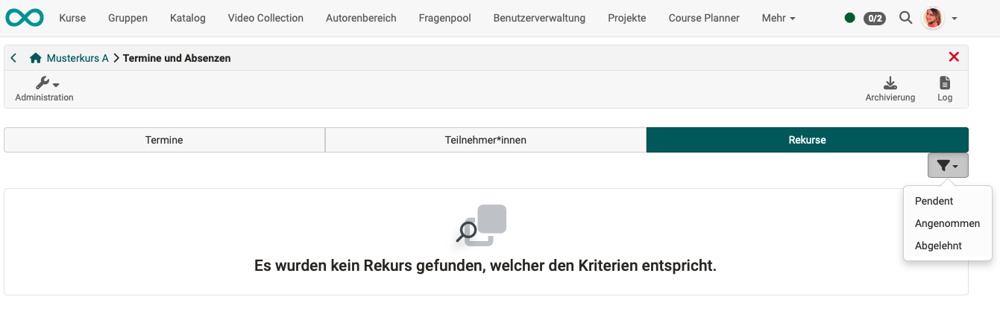{ class="shadow lightbox" title="Tab Rekurse in der Kurs-Administration" }

In der Regel bearbeiten Absenzenverwalter:innen die Rekurse, und zwar für alle Kurse gemeinsam in der [Absenzenverwaltung](../area_modules/Absence_Management.de.md).

[Zum Seitenanfang ^](#course_admin_events_and_absences)

---

## Weiterführende Informationen {: #further_information}

**Auf dieser Seite erwähnt** 
[Kurseinstellungen - Tab Durchführung >](../learningresources/Course_Settings_Execution.de.md) 
[Persönliche Werkzeuge: Absenzen >](../personal_menu/Absences.de.md) 
[Toolbar: Termine >](../learningresources/Toolbar_Events.de.md) 
[Course Planner: Termine >](../area_modules/Course_Planner_Events.de.md) 
[Wie bereite ich eine Prüfung mit dem Safe Exam Browser (SEB) vor? >](../../manual_how-to/SEB/SEB.de.md) 
[Prüfungsverwaltung: Prüfungsmodus >](../learningresources/Assessment_mode.de.md) 
[Absenzenverwaltung >](../area_modules/Absence_Management.de.md)

**Weiterführend** 
[Termine und Absenzen (Basiskonzept) >](../basic_concepts/Events_and_Absences.de.md) 
[Modul Termine und Absenzen >](../../manual_admin/administration/Modules_Events_and_Absences.de.md) 
[Coaching - Übersicht >](../area_modules/Coaching.de.md) 
[Coaching - Termine und Absenzen >](../area_modules/Coaching_Events_Absences.de.md) 
[Modul Räume >](../../manual_admin/administration/Modules_Rooms.de.md)

[Zum Seitenanfang ^](#course_admin_events_and_absences)

