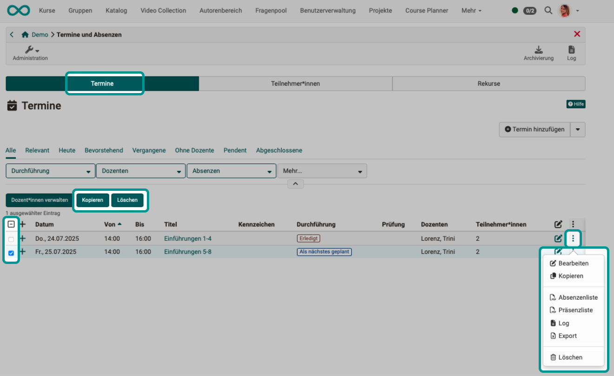
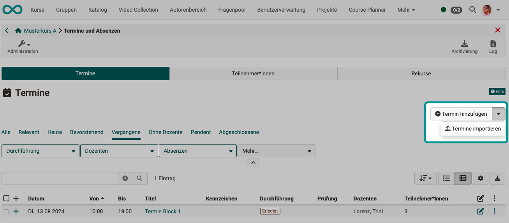
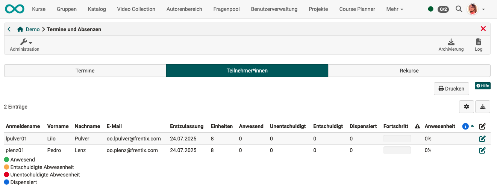
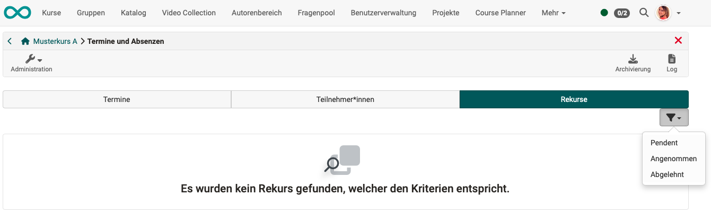

# Termine und Absenzen {: #course_admin_events_and_absences}

Das Absenzenmanagement bietet die Möglichkeit, Anwesenheitslisten online zu führen und Fehlzeiten zu dokumentieren. Die Anwesenheitskontrolle wird pro Kurs geführt. Dafür können im Kurs Termine erstellt werden, die noch in mehrere Einheiten unterteilt werden können. Z.B. kann ein Vormittag (=Termin) in mehrere Zeitblöcke (=Einheiten) unterteilt sein.
Die Einheiten ermöglichen es, dass Teilnehmende einzelne Einheiten an einem Termin fehlen können und nicht gleich den gesamten Termin als abwesend eingetragen bekommen. Die Erstellung dieser Einheiten erfolgt ebenfalls im Kurs durch Kursbesitzer:innen (oder wird von einem externen Verwaltungssystem ins OpenOlat synchronisiert). 

Wurde durch den/die Kursbesitzer:in in **Administration > Einstellungen > Tab Durchführung**
die Termin- und Absenzenverwaltung für den Kurs eingeschaltet (konfiguriert), wird den Kursbesitzer:innen in der Kursadministration der Menüpunkt "Termine und Absenzen" angezeigt (zur Erfassung der Laufzeit-Daten).

Hier können Sie Termine zum Kurs erstellen und bearbeiten, sowie Absenzen erfassen.

{ class="shadow lightbox" }

!!! info "Hinweis"

    Kurs**betreuer:innen** finden diesen Punkt nicht im Menü der Kursadministration. Sie rufen den Screen zum Erfassen der Absenzen über das Icon in der Toolbar auf.

    Kurs**besitzer:innen** können das Icon in der Toolbar ebenfalls zum Erfassen verwenden. Im Menü unter der Administration finden Sie jedoch zusätzlich die ihnen vorbehaltene Möglichkeit zum Erstellen von Terminen.
    
    { class="shadow lightbox" }

[Zum Seitenanfang ^](#course_admin_events_and_absences)

---

## Tab Termine {: #tab_events}

### Termine anzeigen {: #display_events}

In diesem Tab können die Termine nach verschiedenen Kriterien vorgefiltert angezeigt werden und neue erstellt werden.

Für Details zu einem Termin klicken Sie auf das + zu Beginn der betreffenden Zeile.

Unter den 3 Punkten am Ende jeder Zeile finden Sie weitere Optionen zum Bearbeiten des jeweiligen Termins und zum Erstellen von Listen.  

{ class="shadow lightbox" }

[Zum Seitenanfang ^](#course_admin_events_and_absences)

---

### Termin erstellen/bearbeiten {: #edit_events}

Zum Hinzufügen weiterer Termine verwenden Sie den Button "Termin hinzufügen" rechts oben über der Liste im Tab "Termine".

{ class="shadow lightbox" }

Es öffnet sich ein Popup zur Erfassung aller Angaben zum Termin. 

{ class="shadow lightbox" }

 **Titel**: Vergeben Sie einen sinnvollen Namen.

 **Kennzeichen**: Die optionale Angabe eines Kennzeichens dient zur Unterscheidung bei Terminen mit gleichem Titel.

 **Datum**: Ein Datum muss zwingend angegeben werden.

 **Zeit**: Auch die Zeitangabe ist ein Pflichtfeld. Denn z.B. können Kalendereinträge nur mit einer Zeitangabe korrekt angezeigt werden.

 **Einheit**: Hier wird angegeben, wieviele (Zeit-)Einheiten dieser Termin umfasst. 
 Ein Termin kann 1 - 12 Einheiten umfassen. 
 Beispiel: Ein Termin umfasst 2 Stunden, die in 4 thematische Einheiten gegliedert sind (4 x 0.5 Stunden).

 **Ort**: Hier wird angegeben, wo dieser Termin stattfindet. Das kann z.B. ein Präsenzort oder die genaue Zimmerbezeichnung sein.

 **Online Meeting**: Soll der Termin online stattfinden, kann das Meeting direkt von hier aus  organisiert werden.

**Dozent:innen**: Für jeden Termin muss ein:e Kursbetreuer:in ausgewählt werden. Nur die ausgewählten Kursbetreuer:innen können die Anwesenheitskontrolle durchführen. (Als Dozent:in kann nur eine Person hinzugefügt werden, die auch die Rolle "Betreuer:in" besitzt.) Möchte ein:e Kursbesitzer:in ebenfalls diese Funktion übernehmen, muss er/sie sich zusätzlich als Kursbetreuer:in in den Kurs eintragen.

**Beschreibung**: Hier können Sie optional eine Beschreibung für den Termin hinzufügen.

**Vorbereitung/Nachbereitung**: Falls Sie den Teilnehmenden einen Vor- bzw. Nachbereitungsauftrag zum jeweiligen Termin geben möchten, kann dieser hier hinzugefügt werden. Er wird im Kalender angezeigt, sofern die Termine mit dem Kurskalender synchronisiert werden (Kurs-Administration > Einstellungen > Tab Durchführung).

**Präsenz**: Wird der Schalter auf "Aus" gestellt, ist die Absenzenerfassung deaktiviert.

[Zum Seitenanfang ^](#course_admin_events_and_absences)

---

### Termine kopieren oder löschen {: #copy_delete_events}

Sobald in der ersten Spalte mindestens ein Termin selektiert ist, erscheinen über der Liste der Termine die Buttons zum Kopieren und Löschen von Terminen. 
Alternativ können die Optionen zum Kopieren und Löschen unter den 3 Punkten am Ende einer Zeile aufgerufen werden.

{ class="shadow lightbox" }

[Zum Seitenanfang ^](#course_admin_events_and_absences)

---

### Termine importieren {: #import_events}

Es ist auch möglich, Termine zu importieren, die an anderer Stelle in OpenOlat exportiert wurden. Klicken Sie dazu im Tab "Termine" auf den kleinen Pfeil neben dem Button "Termin erstellen".

{ class="shadow lightbox" }

[Zum Seitenanfang ^](#course_admin_events_and_absences)

---

### Termine absagen {: #cancel_events}

Das Absagen von Terminen findet über das [Termin-Icon in der Toolbar](../learningresources/Toolbar_Events.de.md#cancel_events) statt.

[Zum Seitenanfang ^](#course_admin_events_and_absences)

---

### Termine abschliessen {: #close_events}

Das Abschliessen von Terminen findet über das [Termin-Icon in der Toolbar](../learningresources/Toolbar_Events.de.md#close_events) statt.

[Zum Seitenanfang ^](#course_admin_events_and_absences)

---

### Dozenten/Dozentinnen verwalten {: #manage_teachers}

Sobald in der ersten Spalte mindestens ein Termin selektiert ist, erscheint über der Liste der Termine der Button zum Verwalten der Dozenten/Dozentinnen.

{ class="shadow lightbox" }

{ class="shadow lightbox" }

[Zum Seitenanfang ^](#course_admin_events_and_absences)

---

### Teilnehmer:innen ausschliessen {: #exclude_participants}

Bei geöffneter Detailansicht eines Termins (nach Klick auf das + zu Beginn der betreffenden Zeile) wird am unteren Rand ein Icon mit 3 Punkten angezeigt. Dort finden Sie die Möglichkeit, die Teilnehmer:innen vom gewählten Termin auszuschliessen.

{ class="shadow lightbox" }

[Zum Seitenanfang ^](#course_admin_events_and_absences)

---

## Tab Teilnehmer:innen {: #tab_participants}

Im Tab "Teilnehmer" erhalten Sie eine Übersicht über alle Teilnehmer:innen des Kurses oder der ausgewählten Gruppen. (Ohne Besitzer:innen und Betreuer:innen.)

{ class="shadow lightbox" }

**Erstzulassung** 
Mit der Erstzulassung wird definiert, wann der Teilnehmende mit dem Kurs begonnen hat.

**Einheiten** 
Hier ist ersichtlich, wieviele Einheiten dieser Termin umfasst.

**Anwesend** 
In der Spalte "Anwesend" wird die Anwesenheitsquote für die bereits stattgefundenen Termine berechnet. Wenn beispielsweise erst ein Termin stattgefunden hat und der/die Teilnehmende anwesend war, wird in der Spalte "Anwesenheit" 100% angezeigt. 
Die Anwesenheitsquote wird basierend auf der Erstzulassung berechnet. Termine, die vor dem Datum der Erstzulassung stattgefunden haben, werden nicht mitgerechnet.

**Unentschuldigt** 

**Entschuldigt** 

**Dispensiert** 

**Fortschritt** 
Im Fortschritt wird die Anwesenheit grafisch dargestellt. Grün symbolisiert die Anwesenheit, orange entschuldigte und rot abwesende bzw. unentschuldigte Termine.

{class="size24"} 
In der Achtungsspalte mit dem Symbol wird angezeigt, ob die definierte Anwesenheitsquote erreicht worden ist. Wird ein rotes Ausrufezeichen angezeigt, wurde das erforderliche Limit nicht erreicht.

{class="size24"} 
In der Infospalte werden Informationen angezeigt, welche von der Standardeinstellung abweichen. Dies ist beispielsweise ein persönlicher Schwellwert oder ein späterer Kursstart. Diese beiden Optionen können in den Einstellungen (Stift) definiert werden. Der persönliche Schwellwert definiert die zu erreichende Anwesenheitsquote für den/die entsprechenden Teilnehmende:n. 

[Zum Seitenanfang ^](#course_admin_events_and_absences)

---

### Schwellenwert für Präsenzpflicht individuell anpassen {: #personal_rate}

Der für den Kurs generell eingestellte Schwellenwert für die Anwesenheitspflicht kann individuell angepasst werden. Wählen Sie dazu im Tab Teilnehmer:innen die betreffende Person und klicken Sie auf das Icon zum Bearbeiten.

{ class="shadow lightbox" }

[Zum Seitenanfang ^](#course_admin_events_and_absences)

---

## Tab Rekurse {: #tab_appeals}

Wurden Rekurse eingereicht, können Sie sich als Kursbesitzer:in unter diesem Tab einen Überblick verschaffen. Filter helfen Ihnen bei einer grösseren Anzahl von Rekursen.

{ class="shadow lightbox" }

Die Bearbeitung der Rekurse erfolgt in der Regel durch Absenzenverwalter:innen, die kursübergreifend alle Rekurse in der zentralen [kursübergreifenden Absenzenverwaltung](../area_modules/Absence_Management.de.md) abrufen können. 

[Zum Seitenanfang ^](#course_admin_events_and_absences)

---

## Weiterführende Informationen {: #further_information}

[Basiskonzept Termine und Absenzen >](../basic_concepts/Events_and_Absences.de.md) 
[Aktivierung und Konfiguration des Absenzenmanagements durch Administrator:innen >](../../manual_admin/administration/Modules_Events_and_Absences.de.md) 
[Konfiguration der Absenzenverwaltung in einem Kurs >](../learningresources/Course_Settings_Execution.de.md#config_event_and_absence_management) 
[Erfassung und Verwaltung der Absenzen in einem Kurs durch Betreuer:innen >](../learningresources/Toolbar_Events.de.md) 
[Persönliche Absenzen >](../personal_menu/Absences.de.md) 
[Kursübergreifende Absenzenerfassungung im Coachingtool >](../area_modules/Coaching.de.md) 
[Kursübergreifende Absenzenverwaltung durch Absenzenverwalter:innen>](../area_modules/Absence_Management.de.md) 

