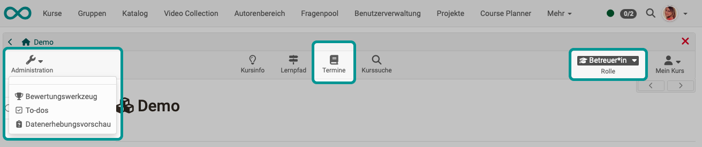
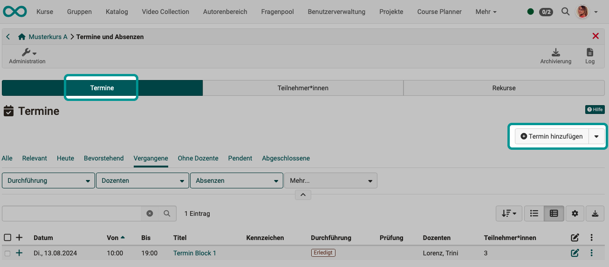
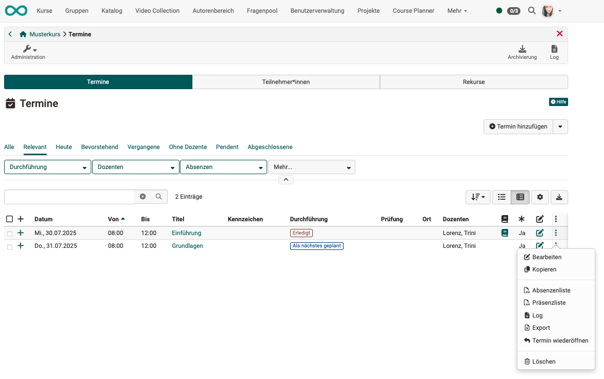
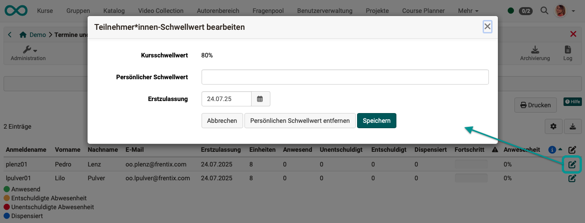

# Termine und Absenzen {: #course_admin_events_and_absences}

Das Absenzenmanagement ermöglicht es, Anwesenheitslisten online zu führen und Fehlzeiten zu dokumentieren. Die Anwesenheitskontrolle wird jeweils kursbezogen durchgeführt.

Dazu können im Kurs **Termine** angelegt werden, die sich in mehrere **Einheiten** unterteilen lassen. So kann beispielsweise ein Vormittag (Termin) in mehrere Zeitblöcke (Einheiten) gegliedert werden. Dadurch ist es möglich, dass Teilnehmende nur für einzelne Einheiten eines Termins als abwesend markiert werden, ohne den gesamten Termin zu verlieren.

Termine und Einheiten werden entweder von den Kursbesitzer:innen selbst erstellt oder über ein externes Verwaltungssystem mit OpenOlat synchronisiert. Alle Termine erscheinen auch im Kurskalender, sofern der Kurs einen Kalender beinhaltet.

Bevor das Absenzenmanagement genutzt werden kann, muss es von den Kursbesitzenden aktiviert werden. Dies geschieht unter Administration > Einstellungen > Tab Durchführung. Nach der Aktivierung können weitere Einstellungen vorgenommen werden, und in der Toolbar erscheint zusätzlich die Option „Termine“.

## "Termine" in der Toolbar

**Kursbesitzer:innen** können hier "Termine hinzufügen" und Absenzen organisieren. Zusätzlich erscheint für Kursbesitzer:innen in der Kursadministration das Menü "Termine und Absenzen". Die Möglichkeiten sind dabei überwiegend identisch. 

{ class="shadow lightbox" }

**Kursbetreuer:innen** sehen nur das Menü "Termine" in der Toolbar nicht aber in der Kursadministration. Auch können sie *keine* neuen Termine anlegen, nur die vorhandenen einsehen und sofern aktiviert, Absenzen erfassen. Es kann auch nach Terminen gefiltert werden für die man als Betreuer:in eingetragen ist.   

{ class="shadow lightbox" }

**Teilnehmende** sehen das Menü "Termine" in der Toolbar und können so rasch synchrone Präsenz- oder Online-Termine erkennen, z.B. im Rahmen von Blended-Learning. 

{ class="shadow lightbox" }

Persönliche Fehlzeiten finden Teilnehmende dann bei den "Persönlichen Werkzeugen" im [Menü "Absenzen".](../personal_menu/Absences.de.md).
 

[Zum Seitenanfang ^](#course_admin_events_and_absences)

---

Im Folgenden wird die Ansicht der Termine und Absenzen für **Kursbesitzer:innen** näher beschrieben. 

## Tab Termine {: #tab_events}

{ class="shadow lightbox" }

### Termine anzeigen {: #display_events}

Im Tab "Termine" können dem Kurs Termine hinzugefügt und nach unterschiedlichen Kriterien gefiltert angezeigt werden. Um Details zu einem Termin anzuzeigen, klicken Sie auf das + zu Beginn der betreffenden Zeile.

Im 3-Punkte Menü am Ende jeder Zeile finden Sie weitere Optionen für einen Termin. Hier können Sie den Termin bearbeiten, kopieren, löschen, als Prüfung markieren, PDF-Listen erstellen sowie weitere Downloads generieren. Auch können erledigte Termine wieder geöffnet werden.

{ class="shadow lightbox" }

[Zum Seitenanfang ^](#course_admin_events_and_absences)

---

### Termin erstellen/bearbeiten {: #edit_events}

Zum Hinzufügen (weiterer) Termine verwenden Sie den Button "Termin hinzufügen" rechts oben über der Liste im Tab "Termine".

{ class="shadow lightbox" }

Es öffnet sich ein Popup zur Erfassung aller Angaben zum Termin. 

{ class="shadow lightbox" }

 **Titel**: Vergeben Sie einen sinnvollen Namen.

 **Kennzeichen**: Die optionale Angabe eines Kennzeichens dient zur Unterscheidung bei Terminen mit gleichem Titel.

 **Datum**: Ein Datum muss zwingend angegeben werden.

 **Zeit**: Auch die Zeitangabe ist ein Pflichtfeld. Denn z.B. können Kalendereinträge nur mit einer Zeitangabe korrekt angezeigt werden.

 **Einheit**: Hier wird angegeben, wie viele (Zeit-)Einheiten dieser Termin umfasst. 
 Ein Termin kann 1 - 12 Einheiten umfassen. 
 Beispiel: Ein Termin umfasst 2 Stunden, die in 4 thematische Einheiten gegliedert sind (4 x 0.5 Stunden).

 **Ort**: Hier wird angegeben, wo dieser Termin stattfindet. Das kann z.B. ein Präsenzort oder die genaue Zimmerbezeichnung sein.

 **Online Meeting**: Soll der Termin online stattfinden, kann das Meeting direkt von hier aus organisiert werden. Man hat die Möglichkeit, aus einem Termin ein BigBlueButton-, Teams- oder z.B. Zoom-Meeting zu starten und es auch später wieder über "Termine" abzurufen.
 Das Online Meeting übernimmt dabei Personen und Beschreibungen aus dem Termin (Personen, Titel, Zeit...).
Lernende haben Zugriff über den Kalender oder das Icon "Termine" in der Toolbar.

**Dozent:innen**: Für jeden Termin muss ein:e Kursbetreuer:in ausgewählt werden. Nur die ausgewählten Kursbetreuer:innen können die Anwesenheitskontrolle durchführen. (Als Dozent:in kann nur eine Person hinzugefügt werden, die auch die Rolle "Betreuer:in" besitzt.) Möchte ein:e Kursbesitzer:in ebenfalls diese Funktion übernehmen, muss er/sie sich zusätzlich als Kursbetreuer:in in den Kurs eintragen.

**Beschreibung**: Hier können Sie optional eine Beschreibung für den Termin hinzufügen.

**Vorbereitung/Nachbereitung**: Falls Sie den Teilnehmenden einen Vor- bzw. Nachbereitungsauftrag zum jeweiligen Termin geben möchten, kann dieser hier hinzugefügt werden. Er wird im Kalender angezeigt, sofern die Termine mit dem Kurskalender synchronisiert werden (Kurs-Administration > Einstellungen > Tab Durchführung).

**Präsenz**: Wird der Schalter auf "Aus" gestellt, ist die Absenzenerfassung für den Termin deaktiviert.

[Zum Seitenanfang ^](#course_admin_events_and_absences)

---

### Termine kopieren oder löschen {: #copy_delete_events}

Sobald in der ersten Spalte mindestens ein Termin selektiert ist, erscheinen über der Liste der Termine die Buttons zum Kopieren und Löschen von Terminen. 
Alternativ können die Optionen zum Kopieren und Löschen unter den 3 Punkten am Ende einer Zeile aufgerufen werden.

{ class="shadow lightbox" }

[Zum Seitenanfang ^](#course_admin_events_and_absences)

---

### Termine importieren {: #import_events}

Es ist auch möglich, Termine zu importieren, die an anderer Stelle in OpenOlat exportiert wurden. Klicken Sie dazu im Tab "Termine" auf den kleinen Pfeil neben dem Button "Termin erstellen".

{ class="shadow lightbox" }

[Zum Seitenanfang ^](#course_admin_events_and_absences)

---

### Termine absagen {: #cancel_events}

Das Absagen von Terminen findet über das [Termin-Icon in der Toolbar](../learningresources/Toolbar_Events.de.md#cancel_events) statt.

[Zum Seitenanfang ^](#course_admin_events_and_absences)

---

### Termine abschliessen {: #close_events}

Das Abschliessen von Terminen findet über das [Termin-Icon in der Toolbar](../learningresources/Toolbar_Events.de.md#close_events) statt.

[Zum Seitenanfang ^](#course_admin_events_and_absences)

---

### Termine wiedereröffnen {: #reopen_events}

Ein bereits abgeschlossener Termin kann von Kursbesitzer:innen wiedereröffnet werden. Sie finden die Option unter den 3 Punkten in der Zeile eines Termins.

{ class="shadow lightbox"}

Alternativ kann ein Termin auch über das Buch-Symbol (Absenz editieren) wiedereröffnet werden.

[Zum Seitenanfang ^](#course_admin_events_and_absences)

---

### Dozenten/Dozentinnen verwalten {: #manage_teachers}

Sobald in der ersten Spalte mindestens ein Termin selektiert ist, erscheint über der Liste der Termine der Button zum Verwalten der Dozenten/Dozentinnen.

{ class="shadow lightbox" }

{ class="shadow lightbox" }

[Zum Seitenanfang ^](#course_admin_events_and_absences)

---

### Teilnehmer:innen ausschliessen {: #exclude_participants}

Bei geöffneter Detailansicht eines Termins (nach Klick auf das + zu Beginn der betreffenden Zeile) wird am unteren Rand ein Icon mit 3 Punkten angezeigt. Dort finden Sie die Möglichkeit, die Teilnehmer:innen vom gewählten Termin auszuschliessen.

{ class="shadow lightbox" }

[Zum Seitenanfang ^](#course_admin_events_and_absences)

---

## Tab Teilnehmer:innen {: #tab_participants}

Im Tab "Teilnehmer" erhalten Sie eine Übersicht über alle Teilnehmer:innen des Kurses oder der ausgewählten Gruppen. (Ohne Besitzer:innen und Betreuer:innen sofern diese nicht zusätzlich in der Rolle Teilnehmer:in eingetragen sind.)

{ class="shadow lightbox" }

**Erstzulassung** 
Mit der Erstzulassung wird definiert, wann der Teilnehmende mit dem Kurs begonnen hat.

**Einheiten** 
Hier wird die maximale Anzahl von Einheiten, die eine Person erreichen kann, angezeigt, unabhängig davon ob der Termin schon stattgefunden hat oder nicht.  

**Anwesend** 
Hier wird angezeigt an wie vielen Einheiten die Person anwesend war. Berücksichtig wird dabei die Anzahl der abgeschlossenen (erledigten) Absenzen. 

**Unentschuldigt** 
Einheiten bei denen die Person als unentschuldigt gekennzeichnet wurde. 

**Entschuldigt** 
Einheiten bei denen die Person als entschuldigt gekennzeichnet wurde. Der Grund kann angegeben werden. 

**Dispensiert** 

**Fortschritt** 
Im Fortschritt wird die Anwesenheit grafisch dargestellt. Grün symbolisiert die Anwesenheit, orange entschuldigte und rot abwesende bzw. unentschuldigte Termine.

{class="size24"} 
In der Achtungsspalte mit dem Symbol wird angezeigt, ob die definierte Anwesenheitsquote erreicht worden ist. Wird ein rotes Ausrufezeichen angezeigt, wurde das erforderliche Limit nicht erreicht.

{class="size24"} 
In der Infospalte werden Informationen angezeigt, welche von der Standardeinstellung abweichen. Dies ist beispielsweise ein persönlicher Schwellwert oder ein späterer Kursstart. Diese beiden Optionen können in den Einstellungen (Stift) definiert werden. Der persönliche Schwellwert definiert die zu erreichende Anwesenheitsquote für den/die entsprechenden Teilnehmende:n. 

Wenn Änderungen nicht sofort sichtbar sind, loggen Sie sich bitte aus und wieder ein. 

[Zum Seitenanfang ^](#course_admin_events_and_absences)

---

### Schwellenwert für Präsenzpflicht individuell anpassen {: #personal_rate}

Der für den Kurs generell eingestellte Schwellenwert für die Anwesenheitspflicht kann individuell angepasst werden. Wählen Sie dazu im Tab Teilnehmer:innen die betreffende Person und klicken Sie auf das Icon zum Bearbeiten.

{ class="shadow lightbox" }

[Zum Seitenanfang ^](#course_admin_events_and_absences)

---

## Tab Rekurse {: #tab_appeals}

Wurden Rekurse eingereicht, können Sie sich als Kursbesitzer:in unter diesem Tab einen Überblick verschaffen. Filter helfen Ihnen bei einer grösseren Anzahl von Rekursen.

{ class="shadow lightbox" }

Die Bearbeitung der Rekurse erfolgt in der Regel durch Absenzenverwalter:innen, die kursübergreifend alle Rekurse in der zentralen [kursübergreifenden Absenzenverwaltung](../area_modules/Absence_Management.de.md) abrufen können. 

[Zum Seitenanfang ^](#course_admin_events_and_absences)

---

## Weiterführende Informationen {: #further_information}

[Basiskonzept Termine und Absenzen >](../basic_concepts/Events_and_Absences.de.md) 
[Aktivierung und Konfiguration des Absenzenmanagements durch Administrator:innen >](../../manual_admin/administration/Modules_Events_and_Absences.de.md) 
[Konfiguration der Absenzenverwaltung in einem Kurs >](../learningresources/Course_Settings_Execution.de.md#config_event_and_absence_management) 
[Erfassung und Verwaltung der Absenzen in einem Kurs durch Betreuer:innen >](../learningresources/Toolbar_Events.de.md) 
[Persönliche Absenzen >](../personal_menu/Absences.de.md) 
[Kursübergreifende Absenzenerfassung im Coachingtool >](../area_modules/Coaching.de.md) 
[Kursübergreifende Absenzenverwaltung durch Absenzenverwalter:innen >](../area_modules/Absence_Management.de.md) 

[Zum Seitenanfang ^](#course_admin_events_and_absences)

