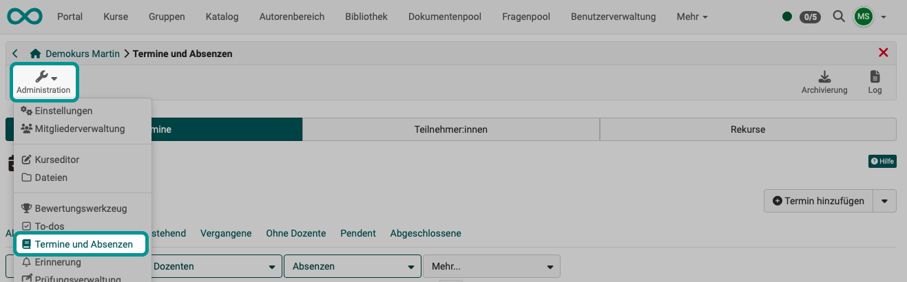
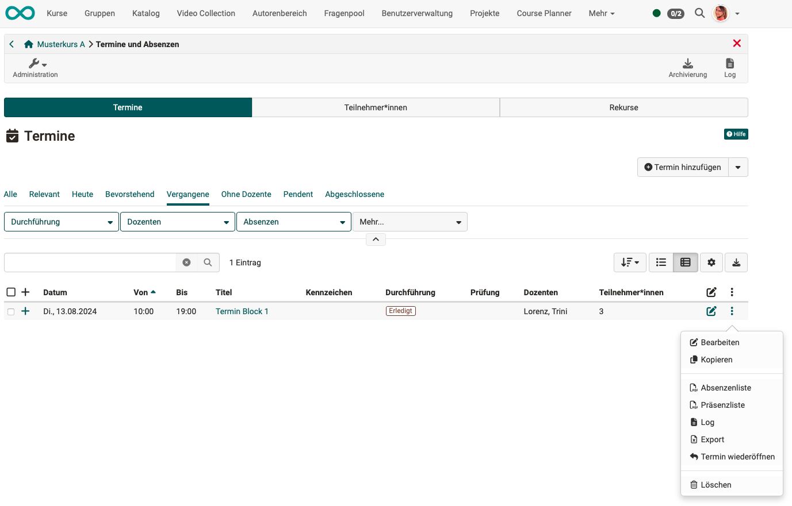
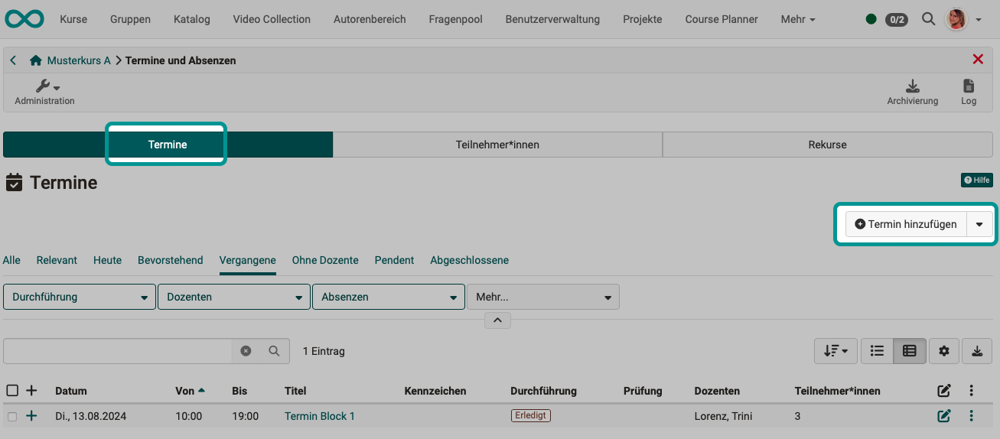
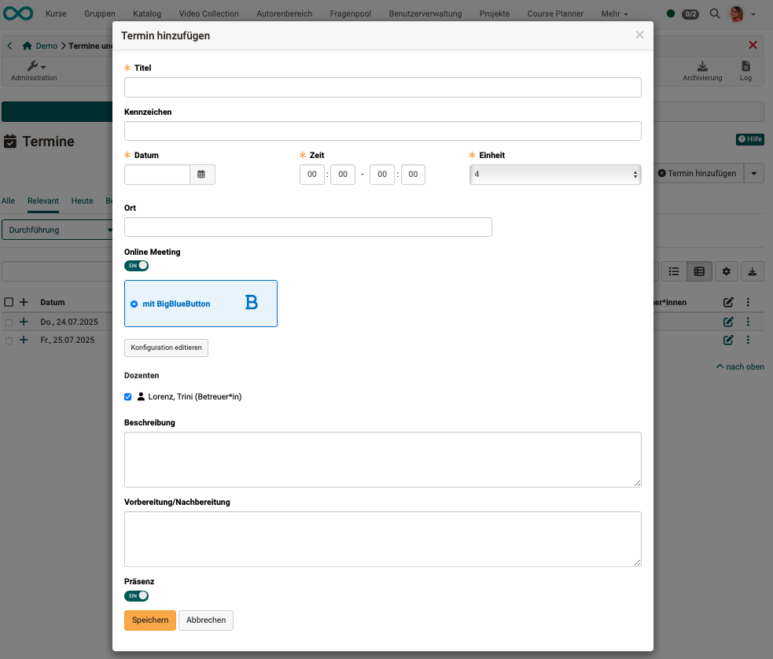
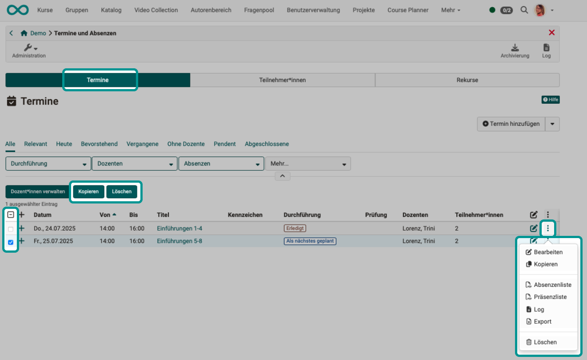
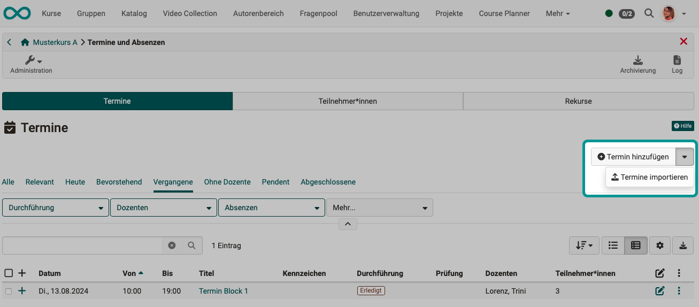
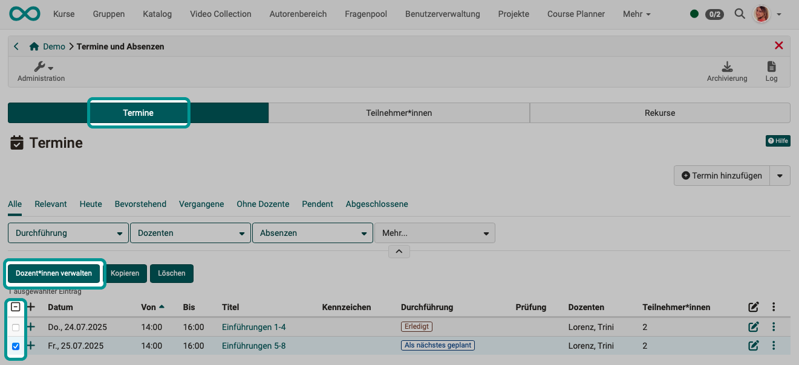
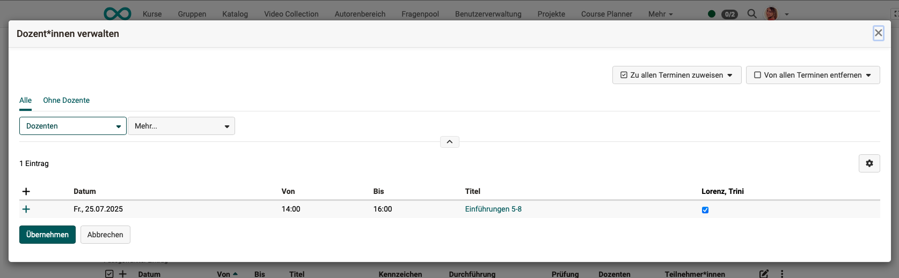

# Events and absences {: #course_admin_events_and_absences}

Absence management offers the option of keeping attendance lists online and documenting absences. Attendance is monitored for each course. To this end, appointments can be created for the course, which can then be divided into several units. For example, a morning (=appointment) can be divided into several time blocks (=units).
The units allow participants to miss individual units on a date without being marked as absent for the entire date. These units are also created in the course by course owners (or synchronized with OpenOlat from an external administration system).

If the course owner has enabled (configured) appointment and absence management for the course in **Administration > Settings > Implementation**, the menu item "Events and absences" is displayed to course owners in the course administration (for recording the duration data).

Here you can create and edit course dates and record absences.

{ class="shadow lightbox" }

!!! info "Note"

    Course **coaches** will not find this item in the course administration menu. They can access the screen for recording absences via the icon in the toolbar.

    Course owners can also use the icon in the toolbar to record data. However, in the menu under Administration, you will also find the option reserved for them to create appointments.

    { class="shadow lightbox" }

[To the top of the page ^](#course_admin_events_and_absences)

---

## Tab Events {: #tab_events}

### Display events {: #display_events}

In this tab, event can be pre-filtered according to various criteria and new ones can be created.

For details about an event, click on the + at the beginning of the relevant line.

Under the three dots at the end of each line, you will find additional options for editing the respective event and creating lists.

{ class="shadow lightbox" }

[To the top of the page ^](#course_admin_events_and_absences)

---

### Create/Edit event {: #edit_events}

To add further events, use the "Add event" button at the top right above the list in the "Events" tab.

{ class="shadow lightbox" }

A pop-up window will open for you to enter all the details for the event.

{ class="shadow lightbox" }

**Title**: Give it a meaningful name.

**Characteristic**: The optional specification of a label serves to distinguish between events with the same title.

**Date**: A date must be specified.

**Time**: The time field is also mandatory. This is because calendar entries, for example, can only be displayed correctly if a time is specified.

**Unit**: This specifies how many (time) units this event comprises. 
An event can comprise 1–12 units. 
Example: An event lasts 2 hours, divided into 4 thematic units (4 x 0.5 hours).

**Place**: This is where you specify where this appointment will take place. This could be a location or the exact room name, for example.

**Online Meeting**: If the appointment is to take place online, the meeting can be organized directly from here.

**Lecturers**: A course coach must be selected for each appointment. Only the selected course coach can carry out attendance checks. (Only a person who also has the role of "Coach" can be added as a lecturer.) If a course owner also wishes to take on this role, they must additionally register as a course coach for the course.

**Description**: Here you can optionally add a description for the appointment.

**Preparation/Follow-up**: If you would like to give participants a pre- or post-assignment for the respective event, you can add it here. It will be displayed in the calendar if the dates are synchronized with the course calendar (Course Administration > Settings > Implementation tab).

**Presence**: If the switch is set to "Off," absence recording is deactivated.

[To the top of the page ^](#course_admin_events_and_absences)

---

### Copy or delete events {: #copy_delete_events}

As soon as at least one event is selected in the first column, buttons for copying and deleting events appear above the list of events. 
Alternatively, the options for copying and deleting can be accessed via the three dots at the end of a line.

{ class="shadow lightbox" }

[To the top of the page ^](#course_admin_events_and_absences)

---

### Import events {: #import_events}

It is also possible to import events that have been exported elsewhere in OpenOlat. To do this, click on the small arrow next to the "Create event" button in the "Events" tab.

{ class="shadow lightbox" }

[To the top of the page ^](#course_admin_events_and_absences)

---

### Cancel events {: #cancel_events}

Events can be canceled using the [event icon in the toolbar](../learningresources/Toolbar_Events.md#cancel_events).

[To the top of the page ^](#course_admin_events_and_absences)

---

### Close events {: #close_events}

Events are closed using the [appointment icon in the toolbar](../learningresources/Toolbar_Events.md#close_events).

[To the top of the page ^](#course_admin_events_and_absences)

---

### Manage teachers {: #manage_teachers}

As soon as at least one date is selected in the first column, the button for managing teachers appears above the list of events.

{ class="shadow lightbox" }

{ class="shadow lightbox" }

[To the top of the page ^](#course_admin_events_and_absences)

---

