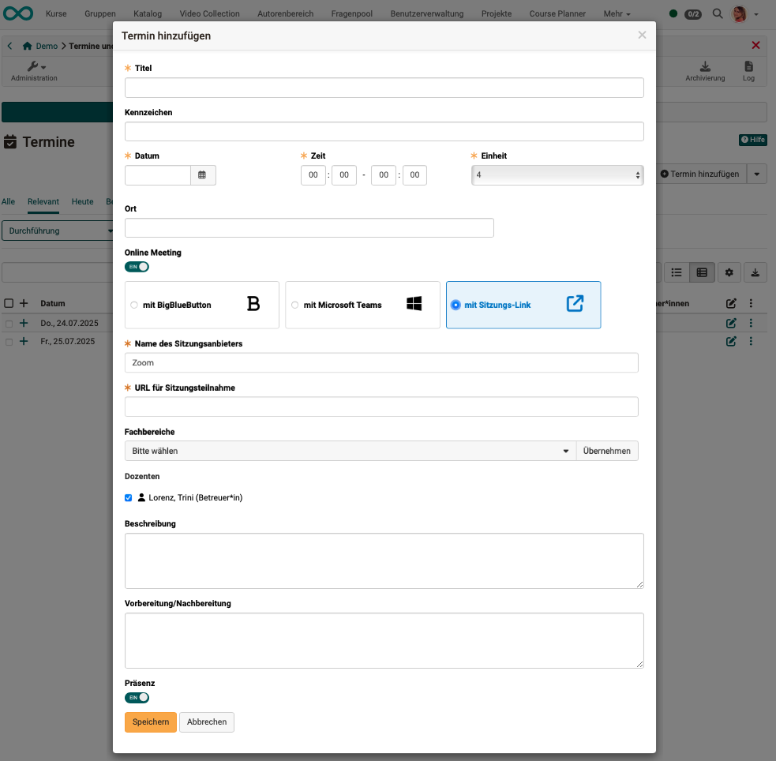
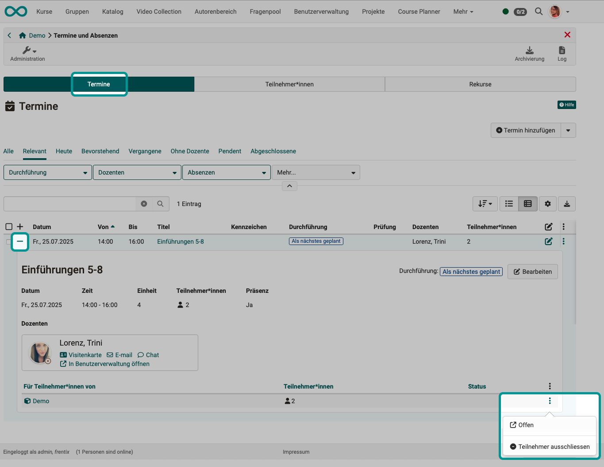
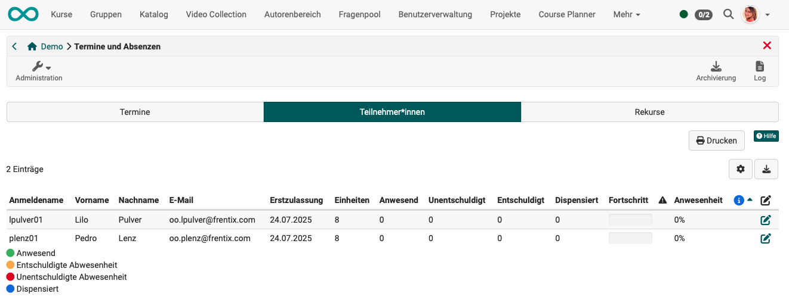
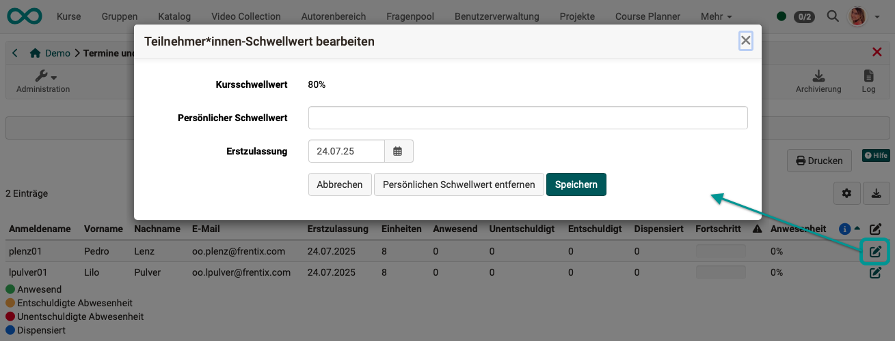
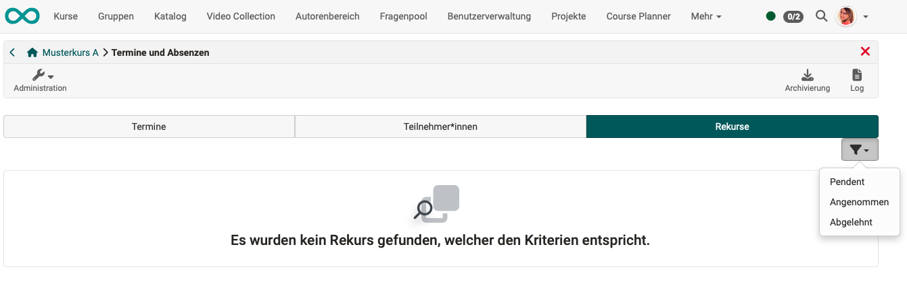

# Events and absences {: #course_admin_events_and_absences}

Absence management offers the option of keeping attendance lists online and documenting absences. Attendance is monitored for each course. To this end, appointments can be created for the course, which can then be divided into several units. For example, a morning (=appointment) can be divided into several time blocks (=units).
The units allow participants to miss individual units on a date without being marked as absent for the entire date. These units are also created in the course by course owners (or synchronized with OpenOlat from an external administration system).

If the course owner has enabled (configured) appointment and absence management for the course in **Administration > Settings > Implementation**, the menu item "Events and absences" is displayed to course owners in the course administration (for recording the duration data).

Here you can create and edit course dates and record absences.

{ class="shadow lightbox" }

!!! info "Note"

    Course **coaches** will not find this item in the course administration menu. They can access the screen for recording absences via the icon in the toolbar.

    Course owners can also use the icon in the toolbar to record data. However, in the menu under Administration, you will also find the option reserved for them to create appointments.

    { class="shadow lightbox" }

[To the top of the page ^](#course_admin_events_and_absences)

---

## Tab Events {: #tab_events}

### Display events {: #display_events}

In this tab, event can be pre-filtered according to various criteria and new ones can be created.

For details about an event, click on the + at the beginning of the relevant line.

Under the three dots at the end of each line, you will find additional options for editing the respective event and creating lists.

{ class="shadow lightbox" }

[To the top of the page ^](#course_admin_events_and_absences)

---

### Create/Edit event {: #edit_events}

To add further events, use the "Add event" button at the top right above the list in the "Events" tab.

{ class="shadow lightbox" }

A pop-up window will open for you to enter all the details for the event.

{ class="shadow lightbox" }

**Title**: Give it a meaningful name.

**Characteristic**: The optional specification of a label serves to distinguish between events with the same title.

**Date**: A date must be specified.

**Time**: The time field is also mandatory. This is because calendar entries, for example, can only be displayed correctly if a time is specified.

**Unit**: This specifies how many (time) units this event comprises. 
An event can comprise 1–12 units. 
Example: An event lasts 2 hours, divided into 4 thematic units (4 x 0.5 hours).

**Place**: This is where you specify where this event will take place. This could be a location or the exact room name, for example.

**Online Meeting**: If the event is to take place online, the meeting can be organised directly from here. You have the option of starting a BigBlueButton, Teams or, for example, Zoom meeting from an event and also accessing it later via ‘Events’.
The online meeting takes over people and descriptions from the event (people, title, time, etc.).
Learners can access it via the calendar or the ‘Events’ icon in the toolbar.

**Lecturers**: A course coach must be selected for each event. Only the selected course coach can carry out attendance checks. (Only a person who also has the role of "Coach" can be added as a lecturer.) If a course owner also wishes to take on this role, they must additionally register as a course coach for the course.

**Description**: Here you can optionally add a description for the event.

**Preparation/Follow-up**: If you would like to give participants a pre- or post-assignment for the respective event, you can add it here. It will be displayed in the calendar if the dates are synchronized with the course calendar (Course Administration > Settings > Implementation tab).

**Presence**: If the switch is set to "Off," absence recording is deactivated.

[To the top of the page ^](#course_admin_events_and_absences)

---

### Copy or delete events {: #copy_delete_events}

As soon as at least one event is selected in the first column, buttons for copying and deleting events appear above the list of events. 
Alternatively, the options for copying and deleting can be accessed via the three dots at the end of a line.

{ class="shadow lightbox" }

[To the top of the page ^](#course_admin_events_and_absences)

---

### Import events {: #import_events}

It is also possible to import events that have been exported elsewhere in OpenOlat. To do this, click on the small arrow next to the "Create event" button in the "Events" tab.

{ class="shadow lightbox" }

[To the top of the page ^](#course_admin_events_and_absences)

---

### Cancel events {: #cancel_events}

Events can be canceled using the [event icon in the toolbar](../learningresources/Toolbar_Events.md#cancel_events).

[To the top of the page ^](#course_admin_events_and_absences)

---

### Close events {: #close_events}

Events are closed using the [appointment icon in the toolbar](../learningresources/Toolbar_Events.md#close_events).

[To the top of the page ^](#course_admin_events_and_absences)

---

### Reopen events {: #reopen_events}

A completed event can be reopened by course owners. You will find the option under the three dots in the row of an appointment.

{ class="shadow lightbox"}

[To the top of the page ^](#course_admin_events_and_absences)

---

### Manage teachers {: #manage_teachers}

As soon as at least one date is selected in the first column, the button for managing teachers appears above the list of events.

{ class="shadow lightbox" }

{ class="shadow lightbox" }

[To the top of the page ^](#course_admin_events_and_absences)

---

### Exclude Participants {: #exclude_participants}

When you open the detailed view of an event (by clicking on the + at the beginning of the relevant line), an icon with three dots is displayed at the bottom. There you will find the option to exclude participants from the selected event.

{ class="shadow lightbox" }

[To the top of the page ^](#course_admin_events_and_absences)

---

## Tab Participants {: #tab_participants}

The "Participants" tab provides an overview of all participants in the course or selected groups. (Excluding owners and coaches.)

{ class="shadow lightbox" }

**Initial registration** 
The date of initial registration defines when participants started the course.

**Units** 
Here you can see how many units this event comprises.

**Present** 
The "Present" column calculates the attendance rate for events that have already taken place. For example, if only one event has taken place and the participant was present, 100% will be displayed in the "Attendance" column. 
The attendance rate is calculated based on the date of initial registration. Events that took place before the date of initial registration are not included in the calculation.

**Unexcused** 

**Excused** 

**Dispensed** 

**Progress** 
Progress is displayed graphically. Green symbolizes attendance, orange symbolizes excused absences, and red symbolizes unexcused absences or missed events.

{class="size24"} 
The attention column with the symbol indicates whether the defined attendance rate has been achieved. If a red exclamation mark is displayed, the required limit has not been reached.

{class=“size24”} 
The info column displays information that deviates from the default settings. This could be a personal threshold value or a later course start date, for example. These two options can be defined in the settings (pencil icon). The personal threshold value defines the attendance rate to be achieved for the participant(s) in question. 

[To the top of the page ^](#course_admin_events_and_absences)

---

### Customize the threshold for mandatory attendance {: #personal_rate}

The threshold value for compulsory attendance set for the course can be adjusted individually. To do this, select the relevant person in the Participants tab and click on the edit icon.

{ class="shadow lightbox" }

[To the top of the page ^](#course_admin_events_and_absences)

---

## Tab Appeals {: #tab_appeals}

If appeals have been submitted, you can get an overview under this tab as the course owner. Filters help you when there are a large number of appeals.

{ class="shadow lightbox" }

Appeals are usually processed by absence administrators, who can access all appeals across courses in the central [cross-course absence management system](../area_modules/Absence_Management.md).

[To the top of the page ^](#course_admin_events_and_absences)

---

## Further information {: #further_information}

[Basic concept Events and Absences >](../basic_concepts/Events_and_Absences.md) 
[Activation and configuration of absence management by administrators >](../../manual_admin/administration/Modules_Events_and_Absences.md) 
[Configuring absence management in a course >](../learningresources/Course_Settings_Execution.md#config_event_and_absence_management) 
[Registering and managing absences in a course by coaches>](../learningresources/Toolbar_Events.md) 
[Personal absences >](../personal_menu/Absences.md) 
[Cross-course absence recording in the coaching tool >](../area_modules/Coaching.md) 
[Cross-course absence management by absence administrators>](../area_modules/Absence_Management.md) 

[To the top of the page ^](#course_admin_events_and_absences)

