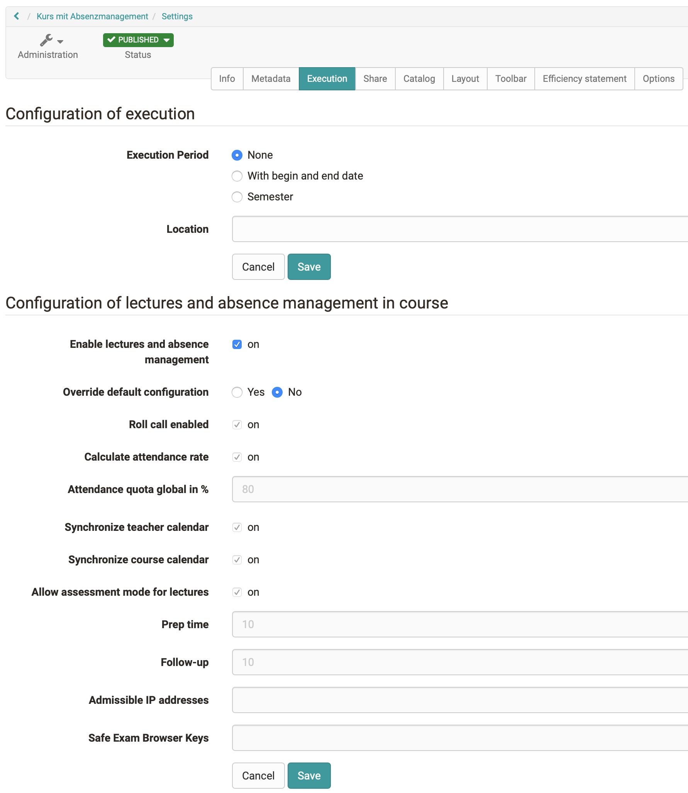
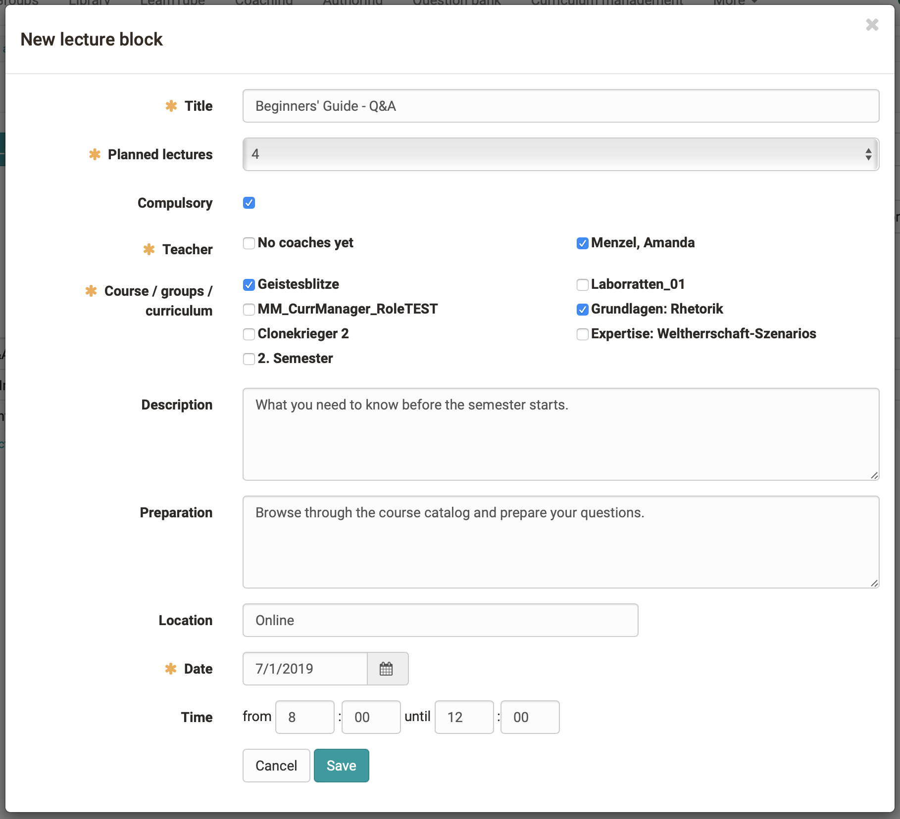
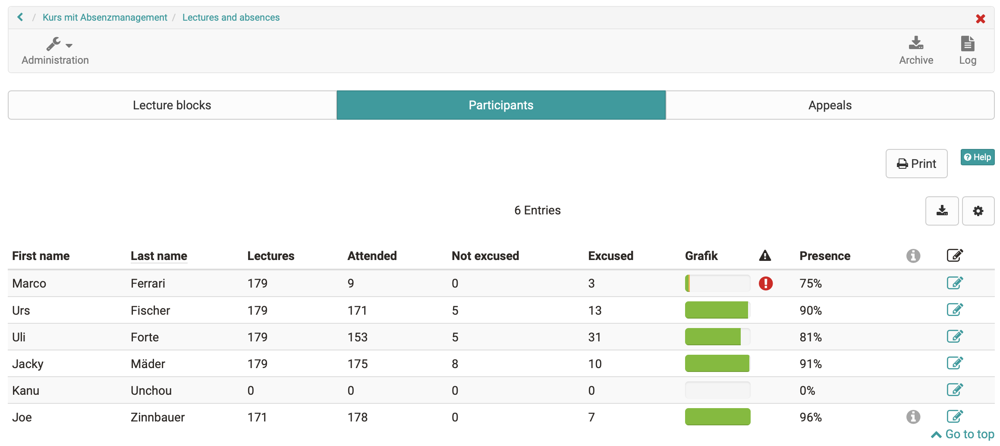

# Events and absences: Overview {: #events_and_absences_overview} 

Absence management allows you to keep attendance lists online and document absences. Attendance monitoring is carried out for each course. For this purpose, lecture blocks with 1-12 lessons can be created in the course. The individual lessons make it possible for participants to miss individual lessons from a lecture block and not have the entire lecture block entered as absent.

The general settings are made system-wide in the [administration](../../manual_admin/administration/Lecture_and_roll_call_management.md). Furthermore, absence management can generally be switched on or off by the OpenOlat administrator.

On this page you will find the course owner's view. Information on handling for the [course coach](../learningresources/Lectures_Teacher_view.md) and the [course participants](../learningresources/Lectures_User_view.md) can be found in the corresponding chapters. The roll call is then carried out by individual instructors (course coaches). If a course does not contain course coaches, the tool cannot be used meaningfully.

## Course owner perspective

### Activate lectures management as course owner

In the "Administration" menu of the course, you can configure the lectures and absence management in the "Settings" menu → tab "Execution" and accept or change the default configuration.

Afterwards, the menu "Lectures and absences" appears under Course Administration.

Here you can create lecture blocks, delete them and get an overview of the attendance status of the participants and edit entries. The creation of these lecture blocks is done in the course by the course owner (or is synchronized into OpenOlat from an external administration system).

### Tab Lecture blocks

In the first tab "Lecture blocks" new lecture blocks can be created and existing can be edited and deleted. A logfile can also be displayed.

With the button "Create new lecture block", a new block is created.

### Create Lecture block

 **Title**: Assign a meaningful name.

 **Planned lectures**: Specifies how many lessons this lesson block contains. A lecture block can contain 1 - 12 lessons.

 **Compulsory**: If attendance is mandatory, an attendance check must be carried out. The lecture block is then also included in the attendance rate. If the block is voluntary, it is not included in the attendance calculation.

 **Teacher**: A course coach must be selected for each lecture block. Only the selected course coach can carry out the attendance check. If a course owner also wants to take over this function, he/she must also register as a course coach in the course.

 **Course / groups / curriculum**: Here you define for whom this block of lectures is intended. Either for the whole course, for the corresponding groups or a whole curriculum. For example, absence management can only be used for a part of the course members.

 **Description**: Here you can optionally add a description for the lesson block.

 **Preparation**: If you want to give the participants a preparation or postprocessing order for the respective date, this can be added here. It is displayed in the calendar if the lectures are synchronized with the course calendar (setting in Administration).

 **Location**: Here you specify where this lecture block takes place. This can be e.g. a presence place or the exact room description.

 **Date**: A date must be specified.

 **Time**: The time can be added optionally. However, the calendar entries can only be displayed correctly with a time entry.

## Tab Participants

In the tab "Participants" you get an overview of all participants of this course or the selected groups. The total number of lectures recorded is displayed, followed by the number of lectures the participant was present, absent and, if necessary, excused for. The attendance is displayed graphically in progress. Green symbolizes the presence, orange excused and red absent or unexcused lessons. In the presence column, the attendance rate is calculated for lectures that have already taken place. If, for example, only one lecture has taken place and the participant was present, 100% is displayed in the "Attendance" column.

{class="size24"}The column with the symbol indicates whether the defined attendance rate has been reached. If a red exclamation mark is displayed, the required limit has not been reached.

{class="size24"}The info column displays information that deviates from the default setting. This is, for example, a personal threshold value or a later course start. These two options can be defined in the settings. The personal threshold defines the attendance rate to be achieved for the relevant participant. First admission defines when the participant started the course. The attendance rate is calculated based on the first admission. Lectures that took place before the date of first admission are not included.
