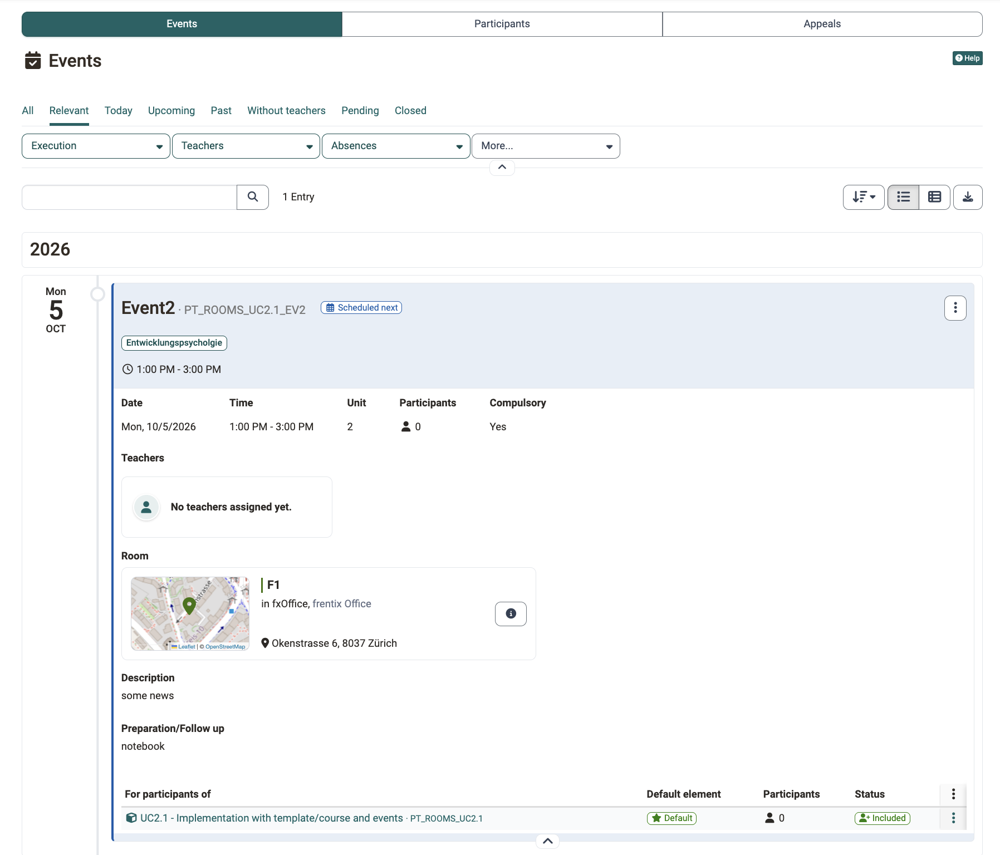

# Events and absences {: #course_admin_events_and_absences}

Absence management allows attendance lists to be kept online and absences to be documented. Attendance is monitored on a course-by-course basis.

For this purpose, **events** can be created in the course, which can be divided into several **units**. For example, a morning (event) can be divided into several time blocks (units). This makes it possible for participants to be marked as absent for individual units of an event without losing the entire event.

Events and units are either created by the course owners themselves or synchronized with OpenOlat via an external administration system. All events also appear in the course calendar, provided the course includes a calendar.

Before absence management can be used, it must be activated by the course owners. This is done under `Course > Administration > Settings > Tab Execution`. After activation, further settings can be made, and the "Events" option additionally appears in the toolbar.

## "Events" in the toolbar {: #toolbar_events}

**Course owners** can add events and organize absences here. In addition, the menu "Events and absences" appears for course owners in the course administration. The options are largely identical. 

{ class="shadow lightbox" }

**Course coaches** see the "Events" menu only in the toolbar, not in the course administration. They also cannot create *new* events, only view existing ones and, if activated, record absences. It is also possible to filter by events for which you are registered as coach.

{ class="shadow lightbox" }

**Participants** see the "Events" menu in the toolbar and can quickly identify synchronous face-to-face or online events, e.g. in the context of blended learning. 

{ class="shadow lightbox" }

Participants can find their personal absences under "Personal tools" in the [Absences menu](../personal_menu/Absences.md).

[To the top of the page ^](#course_admin_events_and_absences)

---

The following section describes the events and absences view for **course owners** in more detail. 

## Tab Events {: #tab_events}

{ class="shadow lightbox" }

### Display events {: #display_events}

In the "Events" tab, events can be added to the course and displayed filtered according to various criteria. If, for example, the event has been assigned to subjects (taxonomy), it can be filtered by these. To display details about an event, click on the + at the beginning of the relevant line.

In the 3-dot menu at the end of each line, you will find further options for an event. Here you can edit, copy, delete the event, change it to an online meeting, mark it as an exam, create PDF lists and generate further downloads. Completed events can also be reopened.

{ class="shadow lightbox" }

Use the column selection (gear icon) to show further columns. If the module "Rooms" is activated, the column "Rooms" with the booked rooms of the event is available there. It is hidden by default.

[To the top of the page ^](#course_admin_events_and_absences)

---

### Views: timeline and table {: #views}

The event list is available in two views. The two switches sit next to each other above the list on the right: the "Timeline" on the left, the "Table view" on the right. For course owners the table view is preset, participants see the timeline.

In the timeline, each event stands as its own block, grouped by year and date. The head of the block names the title and the reference of the event with the status badge on the left, and the time below it. The 3-dot menu with the actions for the event is on the right. Optional additions are: the subjects as labels below the title, the location, and for an online meeting the button to join. If lead or follow-up times are recorded, they appear as a minute value after the time.

[To the top of the page ^](#course_admin_events_and_absences)

---

### Detail view of an event [:octicons-tag-16:{ title="from Release 21.0 (OO-9526)" }](https://track.frentix.com/issue/OO-9526){:target="_blank"} {: #event_details}

In the table view, a click on the + at the beginning of a line expands the detail view; in the timeline it is the arrow at the bottom edge of the block. The content is the same in both views.

In the table view, a title line at the top names the title and the reference of the event, the badges "Status" and "Absences", and on the right the action "Edit". In the timeline it is omitted, because the head of the block already carries this information; editing runs through the 3-dot menu there.

The attributes line sums up the key values: date, time, participants and compulsory presence. "Unit" only appears if the event covers more than one unit, "Location" only if a location is recorded.

The teachers follow as user cards with business card, e-mail and chat. If nobody is assigned, it says "No teachers assigned yet.".

The remaining details only appear if they are maintained for the event:

* **Online meeting**: "Join online meeting" as a highlighted button, plus the link to a stored recording.
* **Room**: the room card under the label "Room", with several rooms under "Rooms". If a room is double-booked during the period of the event, the warning appears below the room card and the card gets a yellow border. [:octicons-tag-16:{ title="from Release 21.0.2 (OO-9641)" }](https://track.frentix.com/issue/OO-9641){:target="_blank"}
* **Description** and **Preparation/Follow up** as their own paragraphs.

At the very bottom you find the table of the elements whose participants belong to the event.

{ class="shadow lightbox" }

Rooms are assigned in the Course Planner. A standalone course therefore shows no room cards: [Book rooms for an event >](../area_modules/Course_Planner_Events.md#room_booking)

[To the top of the page ^](#course_admin_events_and_absences)

---

### Create/Edit event {: #edit_events}

To add (further) events, use the "Add event" button at the top right above the list in the "Events" tab.

{ class="shadow lightbox" }

!!! info "Important"

    The "Add event" button is only displayed if the course is a standalone course. See `Course > Administration > Settings > Tab Share > Section Usage`. If the course is used in the Course Planner, the events are created and managed in the Course Planner.

A popup opens for entering all details of the event. 

{ class="shadow lightbox" }

 **Title**: Give the event a meaningful name.

 **Reference**: The optional reference serves to distinguish events with the same title.

 **Date**: A date must be specified.

 **Time**: The time is also a mandatory field. This is because, for example, calendar entries can only be displayed correctly with a time specification.

 **Unit**: This specifies how many (time) units this event comprises. 
 An event can comprise 1 - 12 units. 
 Example: An event comprises 2 hours, divided into 4 thematic units (4 x 0.5 hours).

!!! info "Important"

    If the events come from an external administration system that synchronises them to OpenOlat, the "Unit" field is locked in OpenOlat. The value comes from this system and is changed there. The field is also locked as soon as the roll call of the event has been closed.

 **Location**: This specifies where this event takes place. This can be, for example, an on-site location or the exact room designation.

 **Online meeting**: If the event is to take place online, switch on the toggle button "Online meeting". Available options are BigBlueButton, Microsoft Teams and "Meeting link". The meeting link covers other providers, for example Zoom. For this option, enter the "Meeting provider name" and the "URL to join the meeting". 
 The online meeting takes over the title, time and people from the event. You open it later in the event list via "Join online meeting".
Learners have access via the calendar or the "Events" icon in the toolbar.

**Recording URL**: Any URL can be specified under which a recording of the meeting is accessed. The URL can also be specified if the toggle button "Online meeting" is switched off.

**Subjects**: Here you can assign the event to one or more terms of a stored taxonomy. This makes the event easier to find.

**Teacher**: A course coach must be selected for each event. Only the selected course coaches can carry out the attendance check. (Only a person who also has the role "Coach" can be added as a teacher.) If a course owner also wants to take on this function, this person must additionally register as a course coach in the course.

**Description**: Here you can optionally add a description for the event.

**Preparation/Follow up**: If you want to give the participants a preparation or follow-up assignment for the respective event, it can be added here. It is displayed in the calendar, provided the events are synchronized with the course calendar: `Course > Administration > Settings > Tab Execution`.

**Compulsory**: If the switch is set to "Off", absence recording is deactivated for the event.

[To the top of the page ^](#course_admin_events_and_absences)

---

### Copy or delete events {: #copy_delete_events}

As soon as at least one event is selected in the first column, the buttons for copying and deleting events appear above the list of events. 
Alternatively, the options for copying and deleting can be accessed under the 3 dots at the end of a line.

{ class="shadow lightbox" }

[To the top of the page ^](#course_admin_events_and_absences)

---

### Import events [:octicons-tag-16:{ title="from Release 13.0 (OO-3666)" }](https://track.frentix.com/issue/OO-3666){:target="_blank"} {: #import_events}

It is also possible to import events that have been exported elsewhere in OpenOlat. To do this, click on the small arrow next to the "Add event" button in the "Events" tab.

{ class="shadow lightbox" }

[To the top of the page ^](#course_admin_events_and_absences)

---

### Mark event as exam {: #mark_event_as_exam}

Under the 3 dots, an event can also be marked as an exam. For an event marked this way, for example the [Safe Exam Browser](../../manual_how-to/SEB/SEB.md) can be activated.

{ class="shadow lightbox" }

[To the top of the page ^](#course_admin_events_and_absences)

---

### Cancel events {: #cancel_events}

Events are cancelled via the [event icon in the toolbar](../learningresources/Toolbar_Events.md#cancel_events).

[To the top of the page ^](#course_admin_events_and_absences)

---

### Close events {: #close_events}

Events are closed via the [event icon in the toolbar](../learningresources/Toolbar_Events.md#close_events).

[To the top of the page ^](#course_admin_events_and_absences)

---

### Reopen events {: #reopen_events}

An already closed event can be reopened by course owners. You will find the option "Reopen event" under the 3 dots in the line of an event.

{ class="shadow lightbox" }

Alternatively, an event can also be reopened via the book icon (edit absence).

{ class="shadow lightbox" }

[To the top of the page ^](#course_admin_events_and_absences)

---

### Manage teachers {: #manage_teachers}

As soon as at least one event is selected in the first column, the button "Manage teachers" appears above the list of events.

{ class="shadow lightbox" }

{ class="shadow lightbox" }

[To the top of the page ^](#course_admin_events_and_absences)

---

### Exclude participants {: #exclude_participants}

When the detail view of an event is open (after clicking on the + at the beginning of the relevant line), an icon with 3 dots is displayed at the bottom. There you will find the option to exclude the participants from the selected event.

{ class="shadow lightbox" }

[To the top of the page ^](#course_admin_events_and_absences)

---

## Tab Participants {: #tab_participants}

In the "Participants" tab you get an overview of all participants of the course or the selected groups. (Excluding owners and coaches, unless they are additionally registered in the role participant.) The list can be printed via the "Print" button.

{ class="shadow lightbox" }

**First admission** 
The first admission defines when the participant started the course.

**Units** 
Here the maximum number of units a person can achieve is displayed, regardless of whether the event has already taken place or not.

**Attended** 
Here it is displayed at how many units the person was present. The number of closed (done) absences is taken into account.

**Not authorized** 
Units for which the person was marked as not authorized.

**Authorized** 
Units for which the person was marked as authorized. The reason can be specified.

**Dispensed** 
Units for which the person was dispensed. Whether dispensations are counted as attended is determined by the configuration of the absence management.

**Progress** 
The progress shows attendance graphically. Green symbolizes attendance, orange authorized, red absent or not authorized, and blue dispensed units.

:o_icon_o_midwarn: 
The attention column with this icon shows whether the defined attendance rate has been reached. The red icon :o_icon_o_icon_error: means that the rate is below the required limit. The warning icon :o_icon_o_icon_warning: appears when the rate is less than five percentage points above the limit.

:fontawesome-solid-circle-info: 
The info column displays information that deviates from the default settings. This is, for example, a personal rate or a later course start. These two options can be defined in the settings (pencil). The personal rate defines the attendance rate to be achieved for the person in question.

If changes are not immediately visible, please log out and log in again. 

[To the top of the page ^](#course_admin_events_and_absences)

---

### Customize the threshold for mandatory attendance {: #personal_rate}

The threshold for mandatory attendance set for the course in general can be adjusted individually. To do this, select the person in question in the "Participants" tab and click on the edit icon.

{ class="shadow lightbox" }

[To the top of the page ^](#course_admin_events_and_absences)

---

## Tab Appeals {: #tab_appeals}

If appeals have been submitted, you can get an overview under this tab as course owner. Filters help you with a larger number of appeals.

{ class="shadow lightbox" }

Appeals are usually processed by absence managers, who can access all appeals across courses in the central [cross-course absence management](../area_modules/Absence_Management.md). 

[To the top of the page ^](#course_admin_events_and_absences)

---

## Further information {: #further_information}

**Mentioned on this page** 
[Personal absences >](../personal_menu/Absences.md) 
[Safe Exam Browser >](../../manual_how-to/SEB/SEB.md) 
[Recording and managing absences in a course by coaches >](../learningresources/Toolbar_Events.md) 
[Cross-course absence management by absence managers >](../area_modules/Absence_Management.md) 
[Course Planner: Events >](../area_modules/Course_Planner_Events.md)

**Further reading** 
[Basic concept Events and Absences >](../basic_concepts/Events_and_Absences.md) 
[Activation and configuration of absence management by administrators >](../../manual_admin/administration/Modules_Events_and_Absences.md) 
[Configuration of absence management in a course >](../learningresources/Course_Settings_Execution.md) 
[Cross-course absence recording in the coaching tool >](../area_modules/Coaching.md) 
[Module Rooms (Admin) >](../../manual_admin/administration/Modules_Rooms.md)

[To the top of the page ^](#course_admin_events_and_absences)
