# Events and absences {: #course_admin_events_and_absences}

With events and absences you keep attendance lists online and document absences. You always record attendance within one course.

For this, you create events in the course and divide each event into units. A morning, for example, is an event with four units of one hour each. If a person misses only one hour, you record the absence for this one unit and not for the whole event.

Course owners create the events themselves, or they come from an external administration system of your organization. The events appear in the course calendar if "Synchronize course calendar" is switched on for the course: [Course Settings - Tab Execution](../learningresources/Course_Settings_Execution.md#course_calendar_sync).

To use events and absences in the course, you as course owner switch on "Event & absence management": 
`Course > Administration > Settings > Tab Execution` 
After that, further settings are available there, and the "Events" icon appears in the course toolbar.

## "Events" in the toolbar {: #toolbar_events}

As a course owner, you create events here and manage the absences. You find largely the same options in the Administration menu under "Events and Absences".

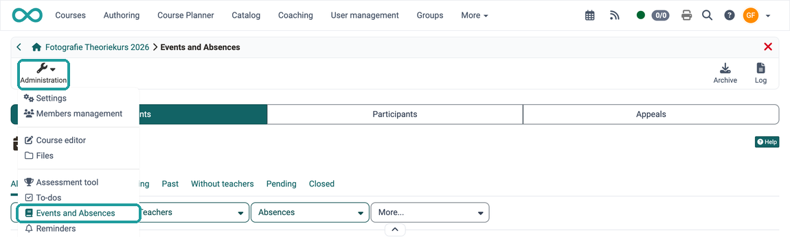{ class="shadow lightbox" title="Menu Administration of a course" }

As a coach, you open the events only via the "Events" icon in the toolbar; the Administration menu has no entry "Events and Absences". You do not create new events. You see the existing events and, if switched on in the course, record the absences. With "Show only mine" you see only the events where you are entered as teacher.

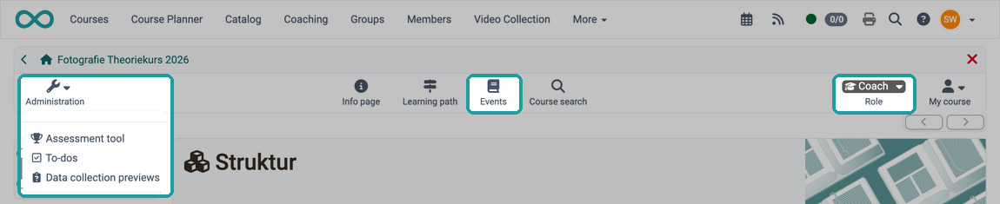{ class="shadow lightbox" title="Course toolbar in the coaches' view" }

Participants open their events in the course via the "Events" icon in the toolbar, on site as well as online, for example in a blended learning course.

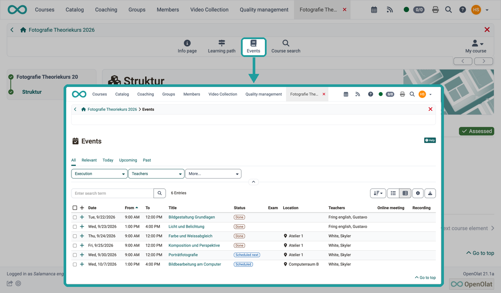{ class="shadow lightbox" title="Event list in the participants' view" }

Participants find their own absences in the personal tools in the [Absences menu](../personal_menu/Absences.md).

[To the top of the page ^](#course_admin_events_and_absences)

---

The following sections describe the view of the course owners.

## Tab Events [:octicons-tag-16:{ title="from Release 12.0 (OO-2636)" }](https://track.frentix.com/issue/OO-2636) {: #tab_events}

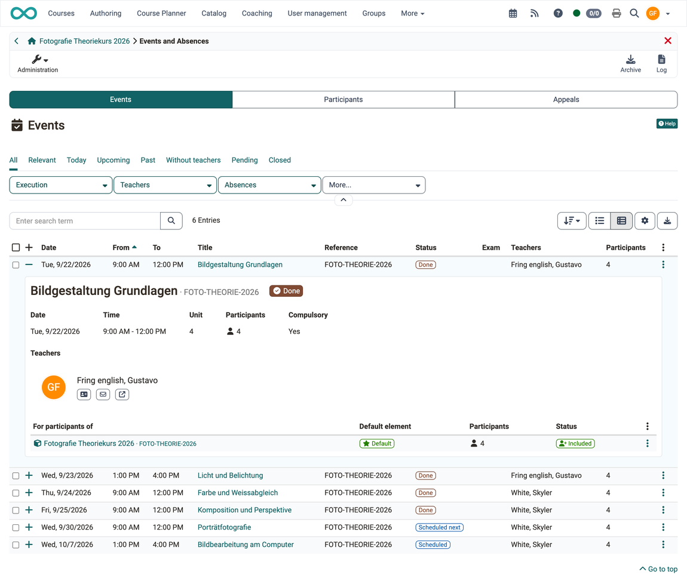{ class="shadow lightbox" title="Tab Events in the course administration" }

### Display events {: #display_events}

In the "Events" tab you add events to the course and narrow down the list with the tabs and filters. If you have assigned events to subjects (taxonomy), you can also filter by them. You expand the details of an event with the + at the beginning of its row.

In the 3-dot menu at the end of each line, you find the actions for an event:

- **Edit** and **Copy**
- **Change to an online meeting** or "Change to an on-location meeting", for an event with an online meeting additionally "Join online meeting"
- **Mark as exam**, for an event already marked instead "Edit exam" and "Delete exam", see [Mark event as exam](#mark_event_as_exam)
- **Absence list** and "Attendance list" as PDF, "Log" and "Export" as Excel file
- **Reopen event** for a closed or cancelled event, see [Reopen events](#reopen_events)
- **Delete**

If the course is used in the Course Planner, Edit, Copy, the change to an online meeting or an on-location meeting and Delete are missing, because the events are managed in the Course Planner. If the events come from an external administration system, Edit and Delete can be missing as well. The page on the toolbar describes which entries coaches see in the same menu: [Menu at the end of the row](../learningresources/Toolbar_Events.md#lists_and_export)

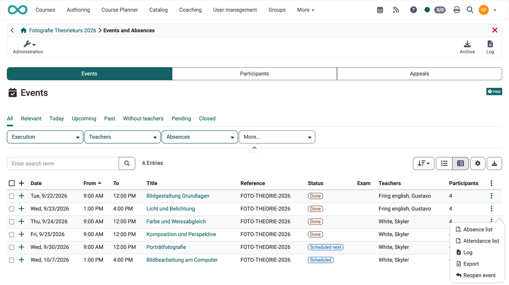{ class="shadow lightbox" title="Tab Events in the course administration" }

Use the column selection (gear icon) to show further columns. If the module "Rooms" is activated, the column "Rooms" with the booked rooms of the event is available there. It is hidden by default.

[To the top of the page ^](#course_admin_events_and_absences)

---

### Views: timeline and table {: #views}

The event list is available in two views. The two switches sit next to each other above the list on the right: the "Timeline" on the left, the "Table view" on the right. For course owners the table view is preset, participants see the timeline.

In the timeline, each event stands as its own block, grouped by year and date. The head of the block names the title and the reference of the event with the status badge on the left, and the time below it. The 3-dot menu with the actions for the event is on the right. Optional additions are: the subjects as labels below the title, the location, and for an online meeting the button to join. If lead or follow-up times are recorded, they appear as a minute value after the time.

[To the top of the page ^](#course_admin_events_and_absences)

---

### Detail view of an event [:octicons-tag-16:{ title="from Release 21.0 (OO-9526)" }](https://track.frentix.com/issue/OO-9526){:target="_blank"} {: #event_details}

In the table view, a click on the + at the beginning of a line expands the detail view; in the timeline it is the arrow at the bottom edge of the block. The content is the same in both views.

In the table view, a title line at the top names the title and the reference of the event, the badges "Status" and "Absences", and on the right the action "Edit". In the timeline this line is missing because the head of the block shows the same information; there you edit the event via the 3-dot menu.

Below it, one line shows the date, time, participants and compulsory presence. "Unit" only appears if the event covers more than one unit, "Location" only if a location is recorded.

The teachers follow as user cards with business card, e-mail and chat. If nobody is assigned, it says "No teachers assigned yet.".

The remaining details only appear if they are maintained for the event:

* **Online meeting**: "Join online meeting" as a highlighted button, plus the link to a stored recording.
* **Room**: the room card under the label "Room", with several rooms under "Rooms". If a room is double-booked during the period of the event, the warning appears below the room card and the card gets a yellow border. [:octicons-tag-16:{ title="from Release 21.0.2 (OO-9641)" }](https://track.frentix.com/issue/OO-9641){:target="_blank"}
* **Description** and **Preparation/Follow up** as their own paragraphs.

At the very bottom a table shows who the event is for: one row per course, group or element of the Course Planner, with the number of participants and whether they are included or excluded. How to leave participants out is described under [Exclude participants](#exclude_participants).

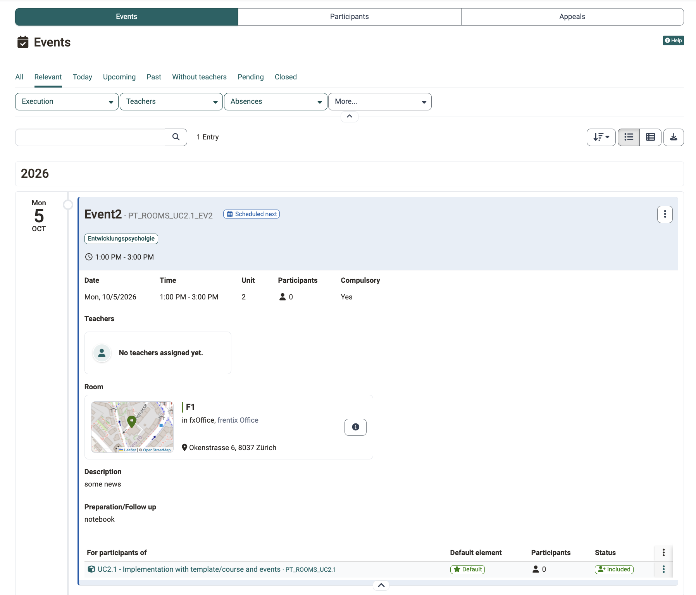{ class="shadow lightbox" title="Timeline of the event list" }

Rooms are assigned in the Course Planner. A standalone course therefore shows no room cards: [Book rooms for an event >](../area_modules/Course_Planner_Events.md#room_booking)

[To the top of the page ^](#course_admin_events_and_absences)

---

### Create/Edit event {: #edit_events}

You create an event with the "Add event" button at the top right above the list in the "Events" tab.

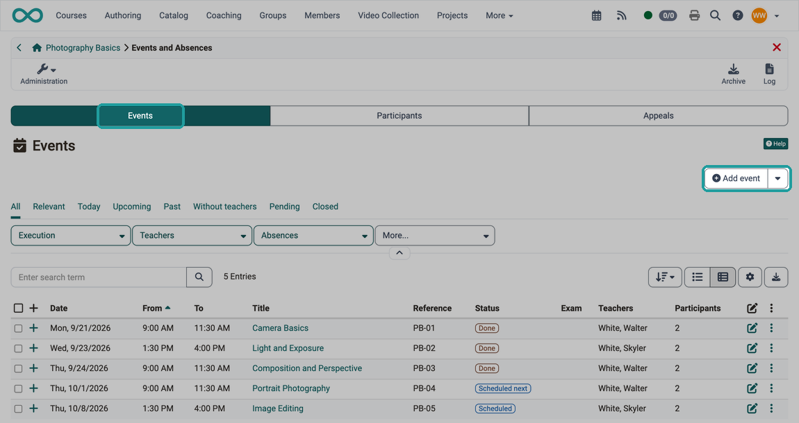{ class="shadow lightbox" title="Tab Events in the course administration" }

!!! info "Important"

    The "Add event" button is only displayed if the course is a standalone course. See `Course > Administration > Settings > Tab Share > Section Usage`. If the course is used in the Course Planner, the events are created and managed in the Course Planner.

In the dialog "Add event" you enter the details of the event.

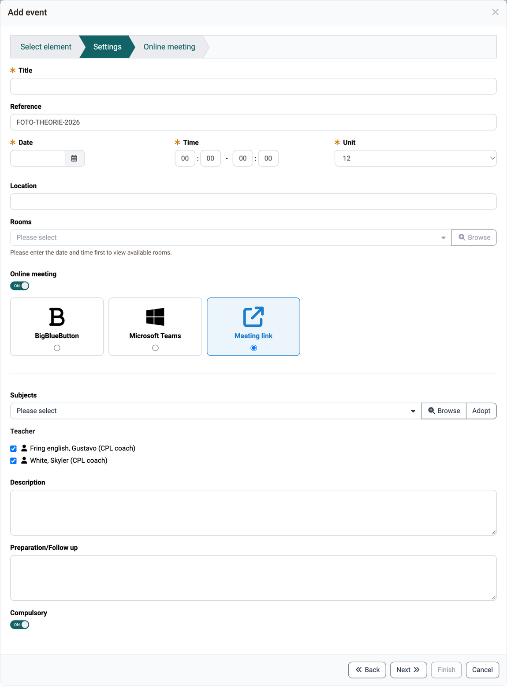{ class="shadow lightbox" title="Dialog Add event" }

 **Title**: Give the event a meaningful name.

 **Reference**: The optional reference serves to distinguish events with the same title.

 **Date**: A date must be specified.

 **Time**: The time is also a mandatory field. This is because, for example, calendar entries can only be displayed correctly with a time specification.

 **Unit**: This specifies how many (time) units this event comprises. 
 An event can comprise 1 - 12 units. 
 Example: An event comprises 2 hours, divided into 4 thematic units (4 x 0.5 hours).

!!! info "Important"

    If the events come from an external administration system that synchronises them to OpenOlat, the "Unit" field is locked in OpenOlat. The value comes from this system and is changed there. The field is also locked as soon as the roll call of the event has been closed.

 **Location**: This specifies where this event takes place. This can be, for example, an on-site location or the exact room designation.

 **Online meeting**: If the event is to take place online, switch on "Online meeting". Available options are BigBlueButton, Microsoft Teams and "Meeting link". The meeting link covers other providers, for example Zoom. For this option, enter the "Meeting link provider name" and the "URL to join meeting". 
 The online meeting takes over the title, time and people from the event. You open it later in the event list via "Join online meeting".
Learners have access via the calendar or the "Events" icon in the toolbar.

**Recording URL**: Any URL can be specified under which a recording of the meeting is accessed. The URL can also be specified if the switch "Online meeting" is switched off.

**Subjects**: Here you can assign the event to one or more terms of a stored taxonomy. This makes the event easier to find.

**Teacher**: Select the course coaches who hold the event. For a new event, all course coaches are preselected. Only the selected course coaches can carry out the attendance check. (Only a person who also has the role "Coach" can be added as a teacher.) If a course owner also wants to take on this function, this person must additionally register as a course coach in the course.

**Description**: Here you can optionally add a description for the event.

**Preparation/Follow up**: If you want to give the participants a preparation or follow-up assignment for the respective event, it can be added here. It is displayed in the calendar, provided the events are synchronized with the course calendar: `Course > Administration > Settings > Tab Execution`.

**Compulsory**: If the switch is set to "Off", absence recording is deactivated for the event.

[To the top of the page ^](#course_admin_events_and_absences)

---

### Copy or delete events {: #copy_delete_events}

Tick one or several events in the first column. The buttons "Copy" and "Delete" then appear above the list. 
You also copy or delete a single event via the 3-dot menu at the end of its row.

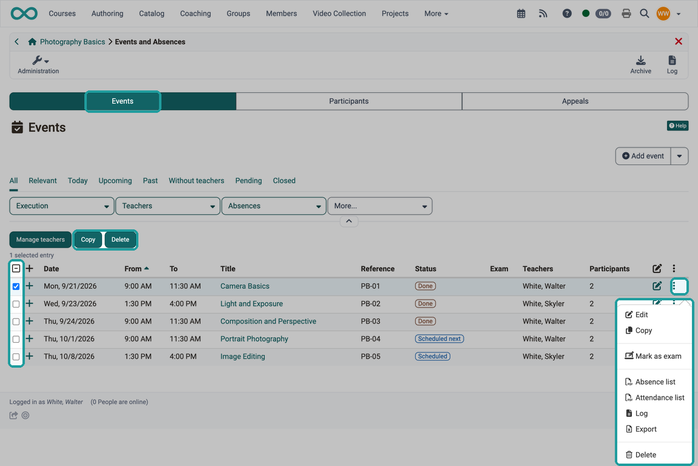{ class="shadow lightbox" title="Tab Events in the course administration" }

[To the top of the page ^](#course_admin_events_and_absences)

---

### Import events [:octicons-tag-16:{ title="from Release 13.0 (OO-3666)" }](https://track.frentix.com/issue/OO-3666){:target="_blank"} {: #import_events}

You enter many events at once faster with an Excel file than one by one in the dialog. To do this, click on the small arrow next to the "Add event" button in the "Events" tab and select "Import events". The wizard "Import events from Excel" offers the "Template excel import" for download. Copy the completed rows from the Excel file into the field "Copied columns from Excel (comma separated)".

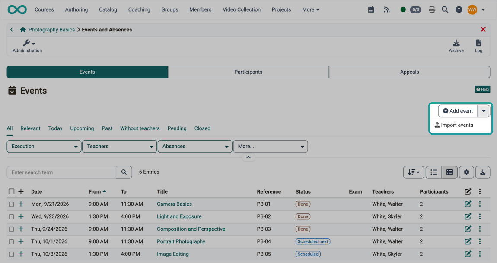{ class="shadow lightbox" title="Tab Events in the course administration" }

[To the top of the page ^](#course_admin_events_and_absences)

---

### Mark event as exam [:octicons-tag-16:{ title="from Release 14.0 (OO-4045)" }](https://track.frentix.com/issue/OO-4045) {: #mark_event_as_exam}

If an event takes place as an exam, you mark it via "Mark as exam" in the 3-dot menu. OpenOlat creates an assessment mode for this, which takes the date, time and participants from the event. In the following dialog, you select the course elements of the exam and, if required, switch on the [Safe Exam Browser](../../manual_how-to/SEB/SEB.md): [Assessment mode from an event](../learningresources/Assessment_mode.md#exam_from_event)

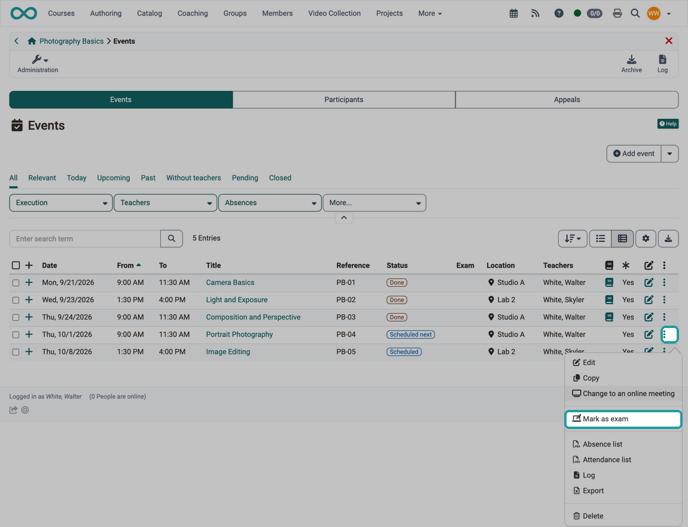{ class="shadow lightbox" title="Tab Events in the course administration" }

After saving, the column "Exam" shows a symbol, and the 3-dot menu offers "Edit exam" and "Delete exam". The exam also appears in the assessment management of the course under `Course > Administration > Assessment management`.

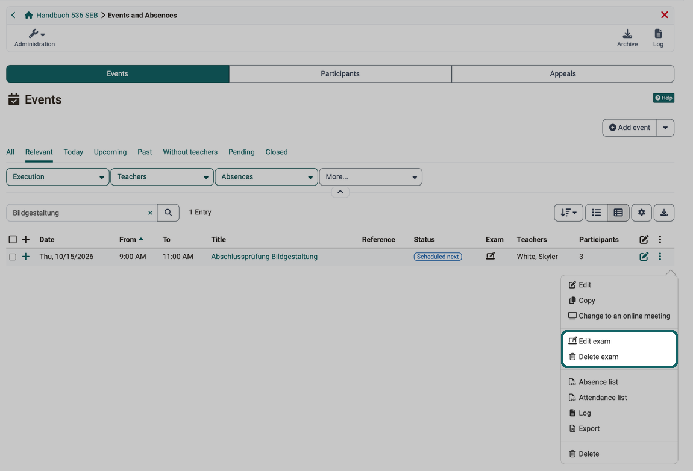{ class="shadow lightbox" title="Tab Events in the course administration · 2026.10.02" }

Coaches have the same entry in the toolbar. The page on the toolbar describes who else can use it and why it can be missing: [If "Mark as exam" is missing](../learningresources/Toolbar_Events.md#mark_as_exam_missing)

[To the top of the page ^](#course_admin_events_and_absences)

---

### Cancel events {: #cancel_events}

You cancel events via the ["Events" icon in the toolbar](../learningresources/Toolbar_Events.md#cancel_events).

[To the top of the page ^](#course_admin_events_and_absences)

---

### Close events {: #close_events}

You close events via the ["Events" icon in the toolbar](../learningresources/Toolbar_Events.md#close_events).

[To the top of the page ^](#course_admin_events_and_absences)

---

### Reopen events [:octicons-tag-16:{ title="from Release 13.0 (OO-3716)" }](https://track.frentix.com/issue/OO-3716){:target="_blank"} {: #reopen_events}

As a course owner, you reopen a closed event: choose "Reopen event" in the 3-dot menu of its row.

Alternatively, you open the absence recording with the book icon ("Edit absence") and click "Reopen event" there.

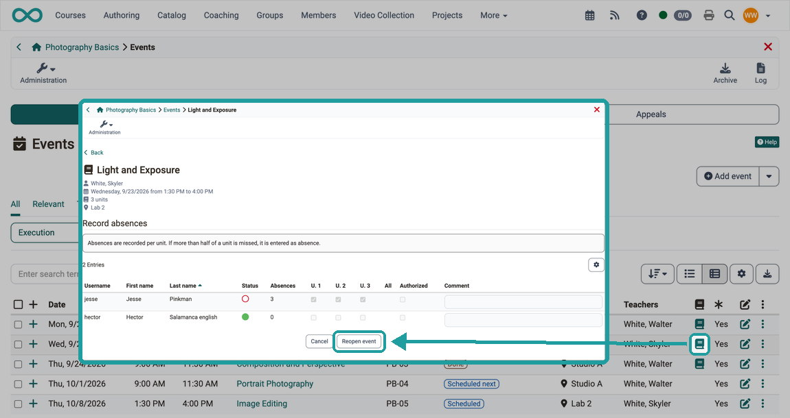{ class="shadow lightbox" title="Absence recording of an event" }

[To the top of the page ^](#course_admin_events_and_absences)

---

### Manage teachers [:octicons-tag-16:{ title="from Release 20.0.3 (OO-8622)" }](https://track.frentix.com/issue/OO-8622) {: #manage_teachers}

Tick one or several events in the first column. The button "Manage teachers" then appears above the list. In the dialog of the same name, you assign teachers to individual events with a tick, or to all selected events at once with "Assign to all events" and "Remove from all events".

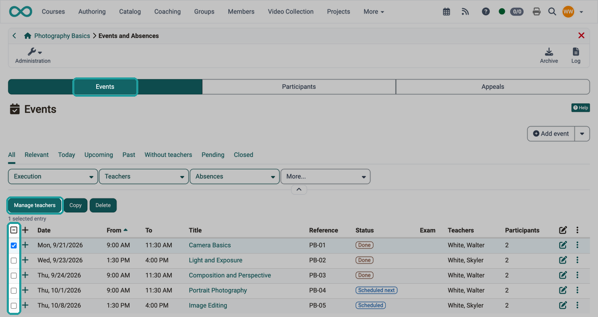{ class="shadow lightbox" title="Tab Events in the course administration" }

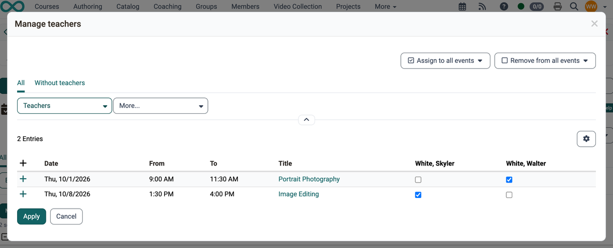{ class="shadow lightbox" title="Dialog Manage teachers" }

[To the top of the page ^](#course_admin_events_and_absences)

---

### Exclude participants {: #exclude_participants}

If a group of participants is not to take part in an event, you leave them out of this event. To do so, open the detail view of the event (click on the + at the beginning of the row). The table at the very bottom has one row per course, group or element. Open the 3-dot menu at the end of the row and choose "Exclude participants". The column "Status" then shows "Excluded"; with "Include participants again" in the same menu you add the participants back.

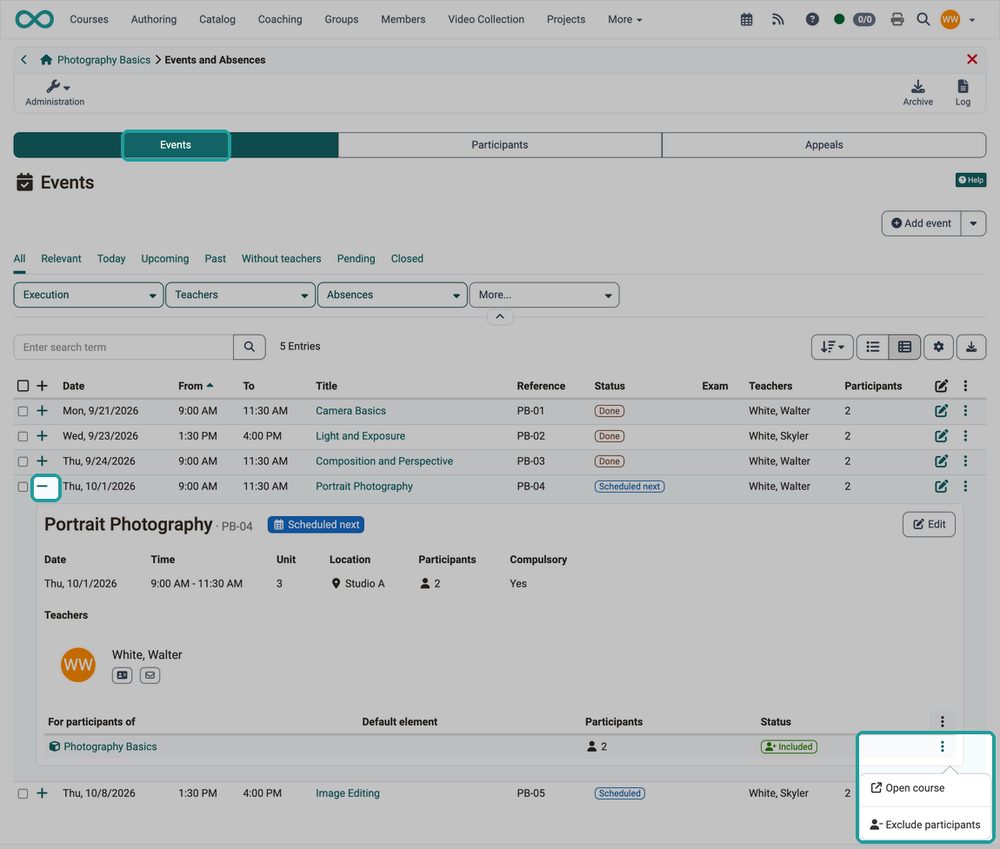{ class="shadow lightbox" title="Detail view of an event" }

[To the top of the page ^](#course_admin_events_and_absences)

---

## Tab Participants {: #tab_participants}

In the "Participants" tab you get an overview of all participants of the course or the selected groups. (Excluding owners and coaches, unless they are additionally registered in the role participant.) The list can be printed via the "Print" button.

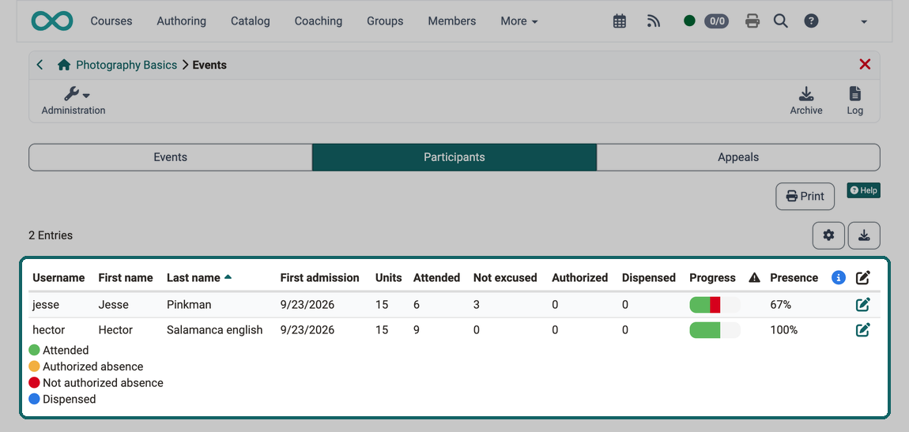{ class="shadow lightbox" title="Tab Participants in the course administration · 2026.10.09" }

**First admission** 
The first admission defines when the participant started the course.

**Units** 
Here the maximum number of units a person can achieve is displayed, regardless of whether the event has already taken place or not.

**Attended** 
Here it is displayed at how many units the person was present. The number of closed (done) absences is taken into account.

**Not excused** 
Units for which the person was marked as not authorized.

**Authorized** 
Units for which the person was marked as authorized. The reason can be specified.

**Dispensed** 
Units for which the person was dispensed. Whether dispensations count as attended is determined by the configuration of the Event & absence management.

**Progress** 
The bar in the column "Progress" shows attendance graphically. Green symbolizes attendance, orange authorized, red absent or not authorized, and blue dispensed units.

:o_icon_o_midwarn: 
The attention column with this icon shows whether the defined attendance rate has been reached. The red icon :o_icon_o_icon_error: means that the rate is below the required limit. The warning icon :o_icon_o_icon_warning: appears when the rate is less than five percentage points above the limit.

**Presence** 
The attendance rate of the person in percent. The column appears together with the attention column when the attendance rate is calculated for the course.

:fontawesome-solid-circle-info: 
The info column displays information that deviates from the default settings. This is, for example, a personal rate or a later course start. These two options can be defined in the settings (pencil). The personal rate defines the attendance rate to be achieved for the person in question.

If changes are not immediately visible, please log out and log in again. 

[To the top of the page ^](#course_admin_events_and_absences)

---

### Customize the threshold for mandatory attendance {: #personal_rate}

The threshold for mandatory attendance set for the course in general can be adjusted individually. To do this, select the person in question in the "Participants" tab and click on the edit icon.

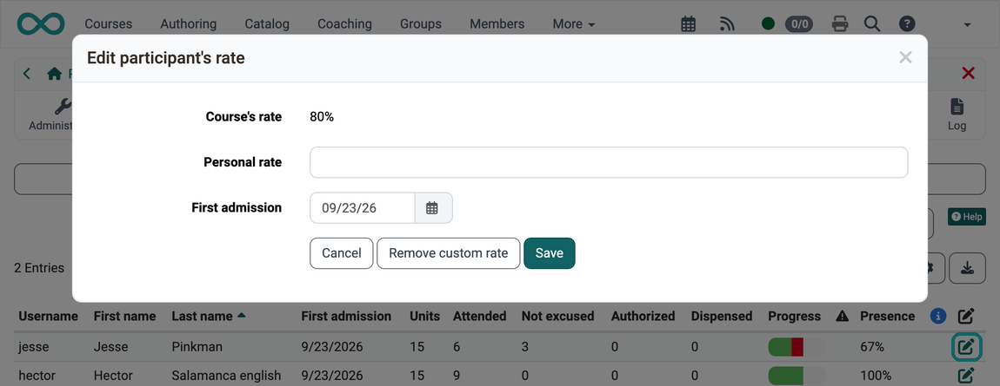{ class="shadow lightbox" title="Dialog Edit participant's rate · 2026.10.09" }

[To the top of the page ^](#course_admin_events_and_absences)

---

## Tab Appeals {: #tab_appeals}

If participants consider a recorded absence to be wrong, they submit an appeal. In the tab "Appeals" you as course owner see these appeals. With many appeals, use the filter at the top right above the list to show only the pending, approved or rejected ones.

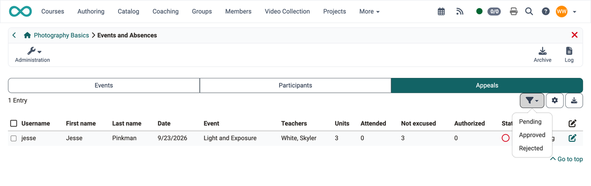{ class="shadow lightbox" title="Tab Appeals in the course administration" }

As a rule, absence managers process the appeals, for all courses together in the [Absence management](../area_modules/Absence_Management.md).

[To the top of the page ^](#course_admin_events_and_absences)

---

## Further information {: #further_information}

**Mentioned on this page** 
[Course Settings - Tab Execution >](../learningresources/Course_Settings_Execution.md) 
[Personal tools: Absences >](../personal_menu/Absences.md) 
[Toolbar: Events >](../learningresources/Toolbar_Events.md) 
[Course Planner: Events >](../area_modules/Course_Planner_Events.md) 
[How do I prepare an exam with the Safe Exam Browser (SEB)? >](../../manual_how-to/SEB/SEB.md) 
[Assessment management: Assessment mode >](../learningresources/Assessment_mode.md) 
[Absence management >](../area_modules/Absence_Management.md)

**Further reading** 
[Events and Absences (basic concept) >](../basic_concepts/Events_and_Absences.md) 
[Module Events and Absences >](../../manual_admin/administration/Modules_Events_and_Absences.md) 
[Coaching - Overview >](../area_modules/Coaching.md) 
[Coaching - Events and Absences >](../area_modules/Coaching_Events_Absences.md) 
[Module Rooms >](../../manual_admin/administration/Modules_Rooms.md)

[To the top of the page ^](#course_admin_events_and_absences)
