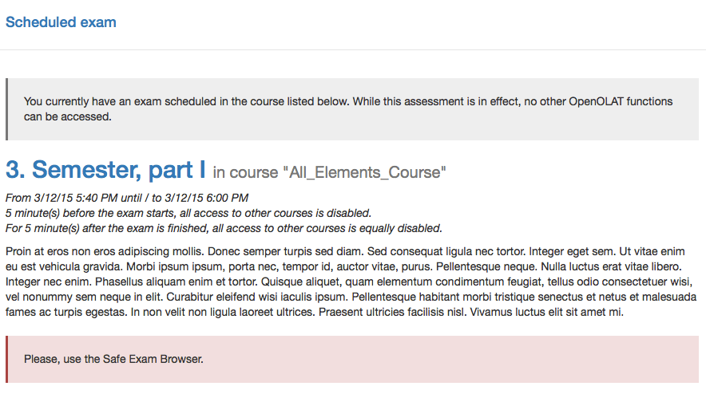

# Exams

OpenOlat supports the execution of tests or other tasks in order to assess students achievements. You might have already heard of exam courses in the chapter ["Creating course"](../learningresources/Creating_Course.md). In order to conduct such efficiency controls under regulated conditions, Authors can implement an assessment mode. While the assessment mode is in effect, access to all OpenOlat functions are restricted, bar the configured relevant course elements and the logout. Such an regulated assessment always has a defined duration and may include preparation and follow-up time, during which all OpenOlat functions are also inaccessible.

It is possible that the use of the Safe Exam Browser is required in order to take the assessment. You will be notified of this requirement in the unlikely case that you didn’t already start OpenOlat in the Safe Exam Browser. In that case, however, you will need to log in to OpenOlat with the Safe Exam Browser in order to take the exam.

