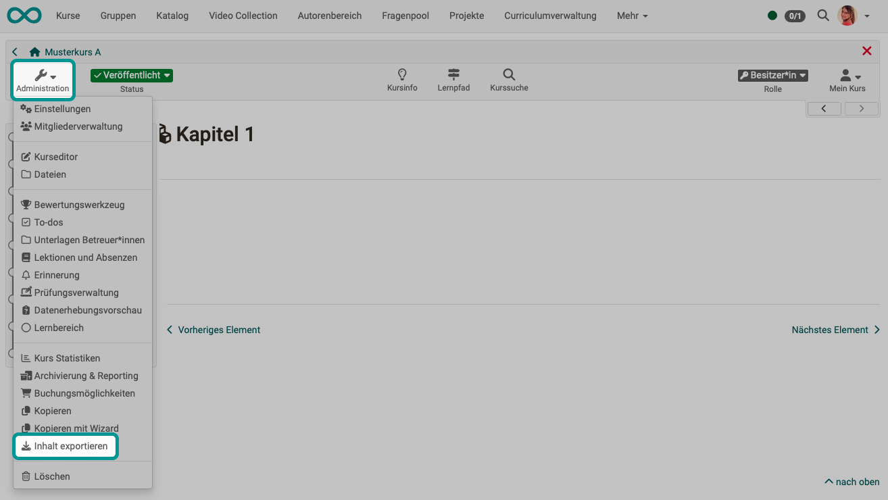

# Inhalt exportieren {: #export_content}

{ class="shadow lightbox" }

Exportieren Sie Ihre Lernressourcen als ZIP-Datei um eine Sicherungskopie zu erhalten oder um die Lernressource in einer anderen OpenOlat Instanz z.B. einer anderen Bildungseinrichtung zu importieren und so weiterzuverwenden. Das Erlauben einer Kurskopie für andere Autoren bietet sich z.B. für Kursvorlagen an.

Als Besitzer:in einer Lernressource können Sie darüber hinaus im Administrationsmenü unter **"Einstellungen" → "Freigabe für andere Autor:innen"** bestimmen, ob Ihre Lernressource von allen anderen OpenOlat-Autor:innen des Systems exportiert, kopiert oder referenziert werden darf.  Weitere Infos dazu finden Sie [hier](../learningresources/Access_configuration.de.md).

[Zum Seitenanfang ^](#export_content)

