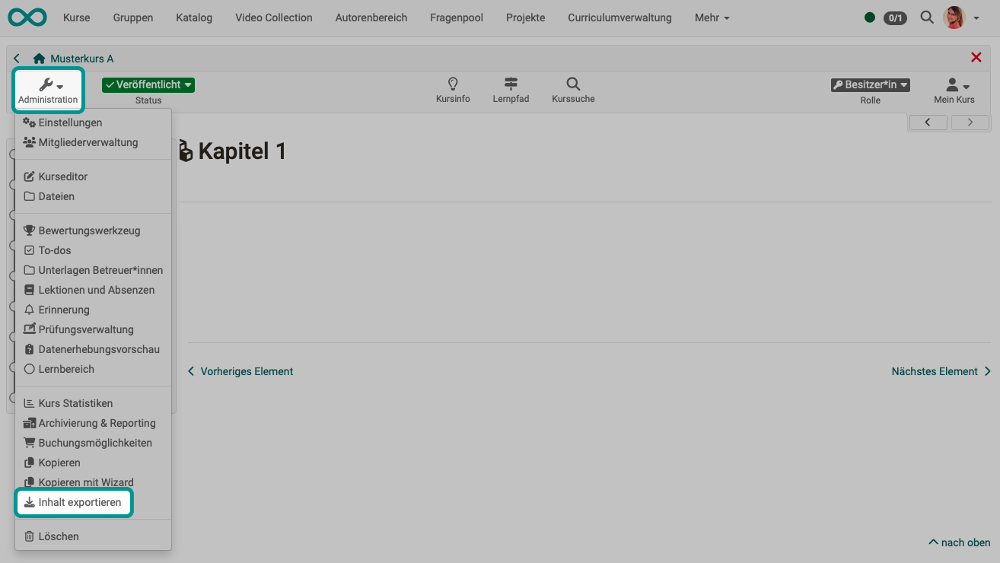

# Export content {: #export_content}

{ class="shadow lightbox" }

Export your learning resources as a ZIP file to keep a backup copy or to import the learning resource into another OpenOlat instance e.g. another educational institution for further use.
Allowing a course copy for other authors is useful for course templates, for example.

As the owner of a learning resource, you can also determine in the administration menu under **"Settings" → "Shared to other authors"** whether your learning resource may be exported, copied or referenced by all other OpenOlat authors in the system.
You can find further information [here](../learningresources/Access_configuration.md).

[To the top of the page ^](#export_content)
