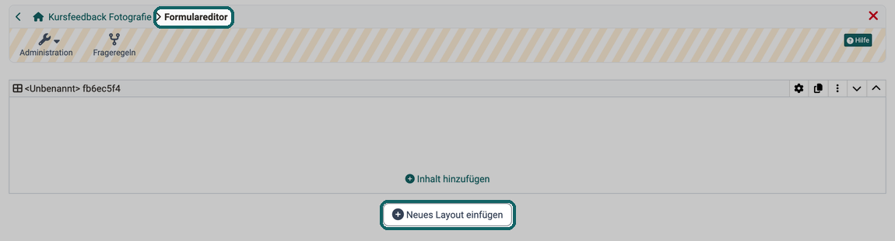
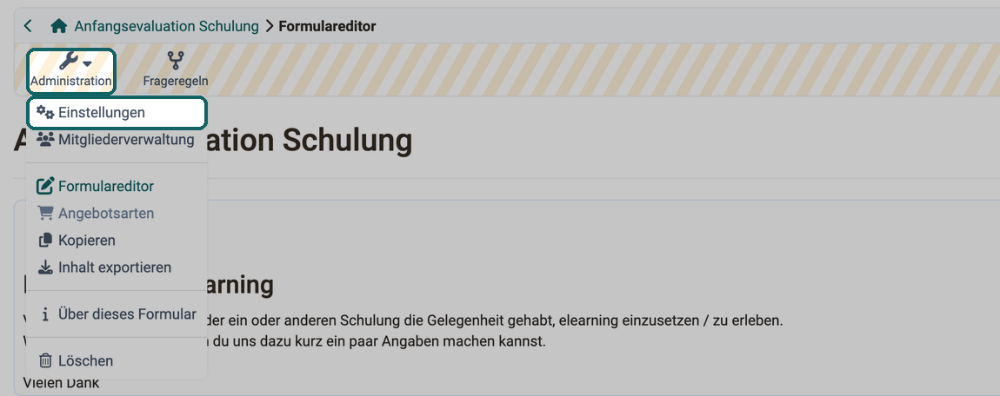

# Der Formulareditor {: #editor} 

## Aufruf des Editors {: #open_editor} 

Der Editor zum Erstellen und Bearbeiten einer Formular-Lernressource kann von verschiedenen Stellen aus aufgerufen werden. Den Formulareditor öffnen die Besitzer:innen der Formular-Lernressource sowie Lernressourcenverwalter:innen und Administrator:innen.

<h3> Möglichkeit 1</h3>

Benötigen Sie den Formulareditor zum Erstellen einer neuen Formular-Lernressource, öffnen Sie ihn am einfachsten im Autorenbereich: Via Menü zum Erstellen neuer Lernressourcen.

`Autorenbereich > Erstellen > Formular`

{ class="shadow lightbox" title="Menü Erstellen im Autorenbereich" }

<h3> Möglichkeit 2</h3>

Bereits im Autorenbereich angelegte Formular-Lernressourcen öffnen Sie im Editor nach Auswahl im Autorenbereich. Verwenden Sie zur Suche z.B. den Filter "Typ = Formular".

Klicken Sie im Suchergebnis am Ende der Zeile auf die 3 Punkte und wählen Sie im Menü den Eintrag "Formulareditor".

`Autorenbereich > Formular-Lernressource suchen > Menü unter den 3 Punkten > Formulareditor`

{ class="shadow lightbox" title="Suche im Autorenbereich" }

<h3> Möglichkeit 3</h3>

Wenn Sie zuerst einen Kursbaustein im Kurseditor einfügen, können Sie in den "leeren" Kursbaustein anschliessend eine Formular-Lernressource einfügen. Das heisst, eine bestehende Formular-Lernressource aus dem Autorenbereich auswählen, eine Formular-Lernressource importieren oder eine neue Lernressource Formular erstellen. 

`Kurseditor > Kursbausteine einfügen > Formular > Tab "Formular" > Wählen, erstellen oder importieren`

{ class="shadow lightbox" title="Tab Formular eines Kursbausteins im Kurseditor" }

Auf die gleiche Art und Weise ist der Formulareditor auch von anderen Kursbausteinen aus aufrufbar (z.B. [Kursbaustein Umfrage](../learningresources/Course_Element_Survey.de.md)). 

!!! tip "Tipp"

    Da die Lernressource Formular sehr unterschiedlich verwendet werden kann, ist es sinnvoll schon bei der Vergabe des Titels die spätere Verwendung zu berücksichtigen, z.B. ein passendes Kürzel voranzustellen. Das erleichtert später das Auffinden und Zuordnen.

[zum Seitenanfang ^](#editor)

---

## Erstellen einer Formular-Lernressource {: #create} 

Ein neues Formular enthält bereits ein Layout mit einer Spalte. Dort fügen Sie direkt die ersten Inhaltselemente ein. Weitere Layouts fügen Sie über den Button "Neues Layout einfügen" hinzu. [:octicons-tag-16:{ title="ab Release 20.2 (OO-9019)" }](https://track.frentix.com/issue/OO-9019)

{ class="shadow lightbox" title="Formulareditor · 2026.09.28" }

---

### Layout hinzufügen {: #insert_layout} 

Ein Formular ist in Layouts gegliedert, welche die Seitenstruktur wiedergeben.

Ein Layout ist ein übergeordneter Block, der unterschiedliche Strukturierungen des Inhalts durch Spalten und Zeilen ermöglicht. Innerhalb einer Spalte und Zeile können beliebig viele Inhalts-Blöcke (Inhaltselemente) hinzugefügt werden. 

Aktuell sind folgende Layoutvorlagen verfügbar:

{ class="shadow lightbox" title="Layoutvorlagen im Formulareditor" }

[zum Seitenanfang ^](#editor)

---

### Layout bearbeiten {: #edit_layout} 

Immer wenn Sie im Formulareditor ein Objekt auswählen, erscheint ein **Inspektor-Popup**, in dem Sie Einstellungen zum aktuell markierten Objekt vornehmen können.

Um den Inspektor für ein Layout anzuzeigen,  
- wählen Sie das Layout 
- und klicken auf das kleine Zahnrad :material-cog: rechts oben am Markierungsrahmen (aktuell gewähltes Layout).

Weitere Optionen zum Bearbeiten dieses Layouts finden Sie in den Icons rechts daneben (Duplizieren, Löschen, Verschieben).

{ class="shadow lightbox" title="Inspektor eines Layouts" }

!!! info "Kann ich ein bestehendes Layout noch ändern?"

    Bestehende Layouts können geändert werden. Löschen oder verändern Sie Layouts, werden existierende Blöcke in die vorhandenen Spalten geschoben. 

[zum Seitenanfang ^](#editor)

---

### Inhaltselemente hinzufügen {: #insert_content_element} 

Klicken Sie im Layout auf einen der Buttons "Inhalt hinzufügen" zum Einfügen weiterer Inhaltselemente.

Es können mehrere Inhaltselemente in einem Layoutbereich eingefügt werden. 

Das neue Element wird in dem Layoutbereich eingefügt, in dem sich der Button befindet.

{ class="shadow lightbox" title="Layout mit drei Bereichen im Formulareditor" }

[zum Seitenanfang ^](#editor)

---

### Verfügbare Inhaltselemente {: #content_elements} 

{ class="shadow lightbox" title="Dialog Inhalt hinzufügen" }

Eine Beschreibung der Inhaltselemente finden Sie [hier >](Form_Elements.de.md#form_element_title) 

[zum Seitenanfang ^](#editor)

---

### Inhaltselemente bearbeiten {: #edit_content_element} 

Die Einstellungen zu den jeweiligen Blöcken befinden sich (wie beim Layout) im **Inspektor**. Auf grösseren Bildschirmen öffnet er sich standardmässig rechts neben dem selektierten Block. Man kann das Fenster mit Klick auf das Einstellungsicon :material-cog: anzeigen oder ausblenden.

Mit dem Klick auf der Titelzeile des Inspektorfensters kann dieser auch verschoben werden. Wenn Sie einen neuen Block selektieren, springt der Inspektor wieder an die Standardposition.

{ class="shadow lightbox" title="Inspektor eines Textelements" }

Je nach gewähltem Inhaltsblock werden im Inspektor verschiedene Optionen angezeigt.

**Beispiel Inspektor zum Titel, Tab "Style"**

Hier können Sie für den Titel eine vordefinierte Schriftgrösse wählen.

{ class="shadow lightbox" title="Inspektor eines Titels, Tab Style" }

**Beispiel Inspektor zum Titel, Tab "Layout"**

Hier können Sie die Grösse des Abstands zwischen den Inhaltsblöcken wählen. (Vergleichbar einem "leeren Rahmen" um das Inhaltselement.)

{ class="shadow lightbox" title="Inspektor eines Titels, Tab Layout" }

[zum Seitenanfang ^](#editor)

---

### Inhaltselemente verschieben {: #move_content_element} 

Unter den Icons in der linken oberen Ecke - sie erscheinen sobald ein Inhaltselement ausgewählt ist - befindet sich auch ein Doppelkreuz. Wenn Sie den Mauszeiger darauf positionieren, können Sie mit gedrückter Maustaste das Inhaltselement an eine andere Position im Layout verschieben. Das ist über die verschiedenen Layoutbereiche hinweg möglich. 

{ class="shadow lightbox" title="Ausgewähltes Inhaltselement im Formulareditor" }

[zum Seitenanfang ^](#editor)

---

## Formular konfigurieren {: #config} 

Um für die Formular-Lernressource als Ganzes Einstellungen vorzunehmen, verlassen Sie den Formulareditor. Den Formulareditor rufen Sie jederzeit wieder auf unter: 
`Formular > Administration > Formulareditor`

Der Eintrag zum Editor im Menü Administration nennt den Editor immer beim Namen: bei einem Formular "Formulareditor", bei einem Test "Testeditor", bei einem Video "Videoeditor" und bei einem Kurs "Kurseditor". Bei allen übrigen Lernressourcen heisst er "Inhalt editieren". [:octicons-tag-16:{ title="ab Release 21.1 (OO-9780)" }](https://track.frentix.com/issue/OO-9780){:target="_blank"}

Wählen Sie für die Konfiguration: 
`Formular > Administration > Einstellungen`

{ class="shadow lightbox" title="Menü Administration im Formulareditor · 2026.09.28" }

Sie können hier die Konfiguration vornehmen, wie Sie es von anderen Lernressourcen kennen.

* Tab Metadaten (z.B. Titel, Kennzeichen, Lizenz, usw.)
* Tab Info (z.B. Titelbild, Beschreibung, Hauptsprache, usw.)
* Tab Freigabe (z.B. Verwendungszweck, Referenzierbarkeit durch andere Autoren, usw.)

!!! info "Wichtig"

    Wenn Sie das Formular in Kursen verwenden wollen, brauchen Sie den Tab "Freigabe" der Lernressource Formular nicht weiter einzurichten. Die Einrichtung des Tabs "Freigabe" ist vorrangig relevant, wenn Sie die Lernressource Stand-Alone verwenden wollen.

[zum Seitenanfang ^](#editor)

---

## Tipps zur Nutzung des Formulareditors {: #hints} 

Hier noch ein paar Tipps zur Verwendung des Formulareditors:

* Bei der Wahl des Inhaltselements "Rubrik" werden die Fragen und Antworten zusammen erstellt. Bei allen anderen Fragetypen werden die Fragen mit Hilfe des Elements "Text" erstellt und den Antworten des passenden Fragetyps zugeordnet.
* Verwenden Sie [Frageregeln](../learningresources/Form_Question_Rules.de.md), wenn Sie komplexere Formulare mit Verzweigungen erstellen möchten.
* Vergessen Sie nicht, den Blöcken Namen zu geben, wenn Sie eine selektive Freigabe per Frageregeln erstellen wollen.

[zum Seitenanfang ^](#editor)

---

## Weiterführende Informationen {: #further_information}

[Kursbaustein "Umfrage"](../learningresources/Course_Element_Survey.de.md) 
[Formular-Elemente](Form_Elements.de.md) 
[Frageregeln in Formularen](Form_Question_Rules.de.md) 
[Wie erstelle ich eine Formular-Lernressource?](../../manual_how-to/create_a_form/create_a_form.de.md) 
[Das Formular-Element Rubrik](Form_Element_Rubric.de.md)

[Zum Seitenanfang ^](#editor)