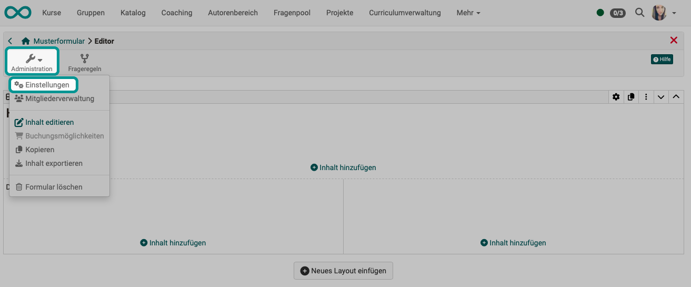

# Der Formular-Editor {: #editor} 

## Aufruf des Editors {: #open_editor} 

Der Editor zum Erstellen und Bearbeiten einer Formular-Lernressource kann von verschiedenen Stellen aus aufgerufen werden:

<h3> Möglichkeit 1</h3>

Benötigen Sie den Formular-Editor zum Erstellen einer neuen Formular-Lernressource, öffnen Sie ihn am einfachsten im Autorenbereich: Via Menü zum Erstellen neuer Lernressourcen.

**Autorenbereich > Erstellen > Formular**

{ class="shadow lightbox" }

<h3> Möglichkeit 2</h3>

Bereits im Autorenbereich angelegte Formular-Lernressourcen öffnen Sie im Editor nach Auswahl im Autorenbereich. Verwenden Sie zur Suche z.B. den Filter "Typ = Formular".

Wählen Sie im Suchergebnis die entsprechende Zeile und klicken Sie am Ende der Zeile auf den Button zum Editieren.

**Autorenbereich öffnen > Formular-Lernressource suchen > editieren**

{ class="shadow lightbox" }

<h3> Möglichkeit 3</h3>

Wenn Sie zuerst einen Kursbaustein im Kurseditor einfügen, können Sie in den "leeren" Kursbausstein anschliessend eine Formular-Lernressource einfügen. Das heisst, eine bestehende Formular-Lernressource aus dem Autorenbereich auswählen, eine Formular-Lernressource importieren oder eine neue Lernressource Formular erstellen. 

**Kurseditor > Kursbaustein einfügen > Tab Formular > erstellen**

{ class="shadow lightbox" }

Auf die gleiche Art und Weise ist der Formular-Editor auch von anderen Kursbausteinen aus aufrufbar (z.B. Kursbaustein Umfrage). 

!!! hint "Tipp"

    Da die Lernressource Formular sehr unterschiedlich verwendet werden kann, ist es sinnvoll schon bei der Vergabe des Titels die spätere Verwendung zur berücksichtigen, z.B. ein passendes Kürzel voranzustellen. Das erleichtert später das Auffinden und Zuordnen.

[zum Seitenanfang ^](#editor)

---

## Erstellen einer Formular-Lernressource {: #create} 

Nach dem Aufruf des Editors ist das neue Formular zunächst noch leer. Fügen Sie als Erstes ein neues Layout hinzu.

{ class="shadow lightbox" }

---

### Layout hinzufügen {: #insert_layout} 

Die Erstellung eines neuen Formulars beginnt immer mit der Erstellung eines Layouts, das die Seitenstruktur wiedergibt.

Ein Layout ist ein übergeordneter Block, der unterschiedliche Strukturierungen des Inhalts durch Spalten und Zeilen ermöglicht. Innerhalb einer Spalte und Zeile können beliebig viele Inhalts-Blöcke (Inhaltselemente) hinzugefügt werden. 

Aktuell sind folgende Layoutvorlagen verfügbar:

[zum Seitenanfang ^](#editor)

---

### Layout bearbeiten {: #edit_layout} 

Immer wenn Sie im Formular-Editor ein Objekt auswählen, erscheint ein **Inspektor-Popup**, in dem Sie Einstellungen zum aktuell markierten Objekt vornehmen können.

Um den Inspektor für ein Layout anzuzeigen,  
- wählen Sie das Layout 
- und klicken auf das kleine Zahnrad :material-cog: rechts oben am Markierungsrahmen (aktuell gewähltes Layout).

Weitere Optionen zum Bearbeiten dieses Layouts finden Sie in den Icons rechts daneben (Duplizieren, Löschen, Verschieben).

{ class="shadow lightbox" }

!!! info "Kann ich ein bestehendes Layout noch ändern?"

    Bestehende Layouts können geändert werden. Löschen oder verändern Sie Layouts, werden existierende Blöcke in die vorhandenen Spalten geschoben. 

[zum Seitenanfang ^](#editor)

---

### Inhaltselemente hinzufügen {: #insert_content_element} 

Klicken Sie im Layout auf einen der Buttons "Inhalt hinzufügen" zum Einfügen weiterer Inhaltselemente.

Es können mehrere Inhaltselemente in einem Layoutbereich eingefügt werden. 

Das neue Element wird in dem Layoutbereich eingefügt, in dem sich der Button befindet.

{ class="shadow lightbox" }

[zum Seitenanfang ^](#editor)

---

### Verfügbare Inhalteselemente {: #content_elements} 

{ class="shadow lightbox" }

Eine Beschreibung der Inhaltelemente finden Sie [hier >](Form_Elements.de.md#form_element_title) 

[zum Seitenanfang ^](#editor)

---

### Inhaltselemente bearbeiten {: #edit_content_element} 

Die Einstellungen zu den jeweiligen Blöcken befinden sich (wie beim Layout) im **Inspektor**. Auf grösseren Bildschirmen öffnet er sich standardmässig rechts neben dem selektierten Block. Man kann das Fenster mit Klick auf das Einstellungsicon :material-cog: anzeigen oder ausblenden.

Mit dem Klick auf der Titelzeile des Inspektorfensters kann dieser auch verschoben werden. Wenn Sie einen neuen Block selektieren, springt der Inspektor wieder an die Standardposition.

{ class="shadow lightbox" }

**Je nach gewähltem Inhaltsblock werden im Inspektor verschiedene Optionen angezeigt.**

**Beispiel Inspektor zum Titel, Tab "Style"**

Hier können Sie für den Titel eine vordefinierte Schriftgrösse wählen.

{ class="shadow lightbox" }

**Beispiel Inspektor zum Titel, Tab "Layout"**

Hier können Sie die Grösse des Abstands zwischen den Inhaltsblöcken wählen. (Vergleichbar einem "leeren Rahmen" um das Inhaltselement.)

{ class="shadow lightbox" }

[zum Seitenanfang ^](#editor)

---

### Inhaltselemente verschieben {: #move_content_element} 

Unter den Icons in der linken oberen Ecke - sie erscheinen sobald ein Inhaltselement ausgewählt ist - befindet sich auch ein Doppelkreuz. Wenn Sie den Mauszeiger darauf positionieren, können Sie mit gedrückter Maustaste das Inhaltselement an eine andere Position im Layout verschieben. Das ist über die verschiedenen Layoutbereiche hinweg möglich. 

{ class="shadow lightbox" }

[zum Seitenanfang ^](#editor)

---

## Formular konfigurieren {: #config} 

Um für die Formular-Lernressource als Ganzes Einstellungen vorzunehmen, verlassen Sie den Inhaltseditor. (Sie können den Inhaltseditor jederzeit wieder aufrufen unter **Administration > Inhalt editieren**.)

Wählen Sie für die Konfiguration **Administration > Einstellungen**.

{ class="shadow lightbox" }

Sie können hier die Konfiguration vornehmen, wie Sie es von anderen Lernressourcen kennen.

* Tab Info  (z.B. Titel, Beschreibung, Titelbild, usw.)
* Tab Metadaten (z.B. Angaben zu Sprache, usw., die bei der Suche helfen)
* Tab Freigabe (z.B. Verwendungszweck, Referenzierbarkeit durch andere Autoren, usw.)

!!! info "Hinweis"

    Wenn Sie das Formular in Kursen verwenden wollen, brauchen Sie den Tab "Freigabe" der Lernressource Formular nicht weiter einzurichten. Die Einrichtung des Tabs "Freigabe" ist vorrangig relevant, wenn Sie die Lernressource Stand-Alone verwenden wollen.

[zum Seitenanfang ^](#editor)

---

## Tipps zur Nutzung des Formular Editors {: #hints} 

Hier noch ein paar Tipps zur Verwendung des Formular-Editors:

* Bei der Wahl "Rubrik" werden die Fragen und Antworten zusammen erstellt. Bei allen anderen Fragetypen werden die Fragen mit Hilfe des Elements "Paragraph" erstellt und den Antworten des passenden Fragetyps zugeordnet.
* Verwenden Sie [Frageregeln](../learningresources/Forms_Question_Rules.de.md), wenn Sie komplexere Formulare mit Verzweigungen erstellen möchten.
* Vergessen Sie nicht, den Blöcken Namen zu geben, wenn Sie eine selektive Freigabe per Frageregeln erstellen wollen.

[zum Seitenanfang ^](#editor)

---

## Weitere Informationen

[Wie erstelle ich eine Formular-Lernressource?](../../manual_how-to/create_a_form/create_a_form.de.md) 
[Inhaltselemente eines Formulars](Form_Elements.de.md) 
[Das Formular-Element Rubrik](Form_Element_Rubric.de.md) 
[Einrichtung von Frageregeln im Formular](Form_Question_Rules.de.md) 