# The form editor {: #editor}

## Calling up the editor {: #open_editor} 

The editor for creating and editing a form learning resource can be called up from various places. The form editor can be opened by the owners of the form learning resource as well as by learning resource managers and administrators.

<h3> Option 1</h3>

If you need the form editor to create a new form learning resource, the easiest way to open it is in the authoring area: via the menu for creating new learning resources.

`Authoring > Create > Form`

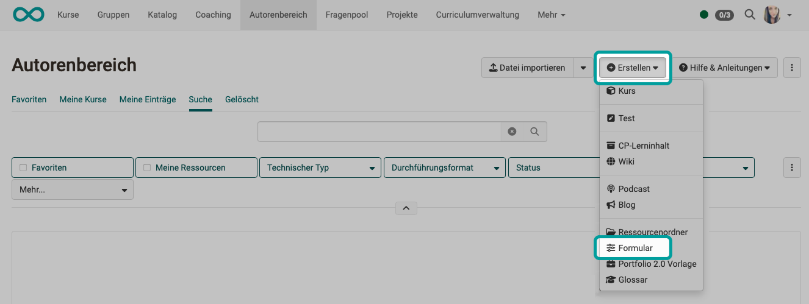{ class="shadow lightbox" title="Menu Create in the authoring area" }

<h3> Option 2</h3>

You can open form learning resources that have already been created in the authoring area in the editor after selecting them in the authoring area. Use the "Type = Form" filter to search, for example.

In the search result, click on the 3 dots at the end of the line and select the entry "Form editor" in the menu.

`Authoring > Search for form learning resource > Menu under the 3 dots > Form editor`

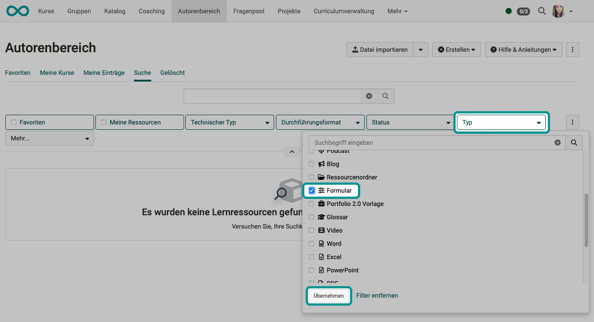{ class="shadow lightbox" title="Search in the authoring area" }

<h3> Option 3</h3>

If you first insert a course element in the course editor, you can then insert a form learning resource into the "empty" course element. This means selecting an existing form learning resource from the authoring area, importing a form learning resource or creating a new form learning resource.

`Course editor > Insert course elements > Form > Tab "Form" > Choose, create or import`

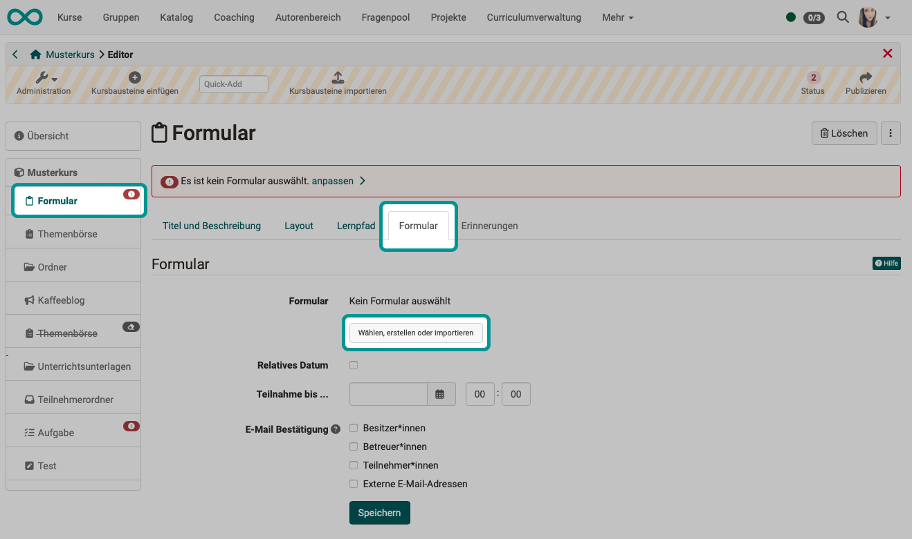{ class="shadow lightbox" title="Tab Form of a course element in the course editor" }

The form editor can also be called up from other course elements in the same way (e.g. [course element Survey](../learningresources/Course_Element_Survey.md)).

!!! tip "Tip"

    As the learning resource form can be used in very different ways, it makes sense to consider the later use when assigning the title, e.g. to prefix it with a suitable abbreviation. This makes it easier to find and assign later.

[To the top of the page ^](#editor)

---

## Creating a form learning resource {: #create} 

A new form already contains a layout with one column. You can insert the first content elements there directly. You add further layouts with the button "Add a new layout". [:octicons-tag-16:{ title="from Release 20.2 (OO-9019)" }](https://track.frentix.com/issue/OO-9019)

{ class="shadow lightbox" title="Form editor · 2026.09.28" }

---

### Insert layout {: #insert_layout}

A form is structured in layouts that reflect the page structure.

A layout is a superordinate block that enables different structuring of the content using columns and rows. Any number of content blocks (content elements) can be added within a column and row.

The following layout templates are currently available:

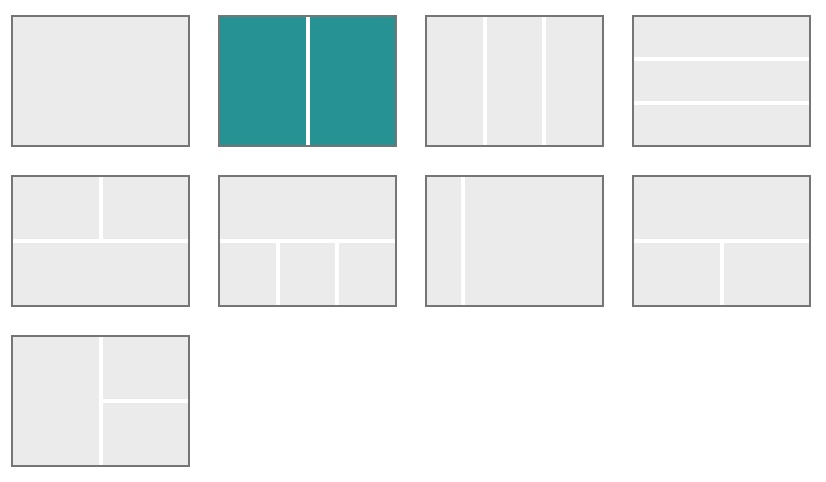{ class="shadow lightbox" title="Layout templates in the form editor" }

[To the top of the page ^](#editor)

---

### Edit layout {: #edit_layout} 

Whenever you select an object in the form editor, an **Inspector pop-up** appears in which you can make settings for the currently selected object.

To display the inspector for a layout, 
- select the layout 
- and click on the small gear wheel :material-cog: at the top right of the selection frame (currently selected layout).

Further options for editing this layout can be found in the icons to the right (duplicate, delete, move).

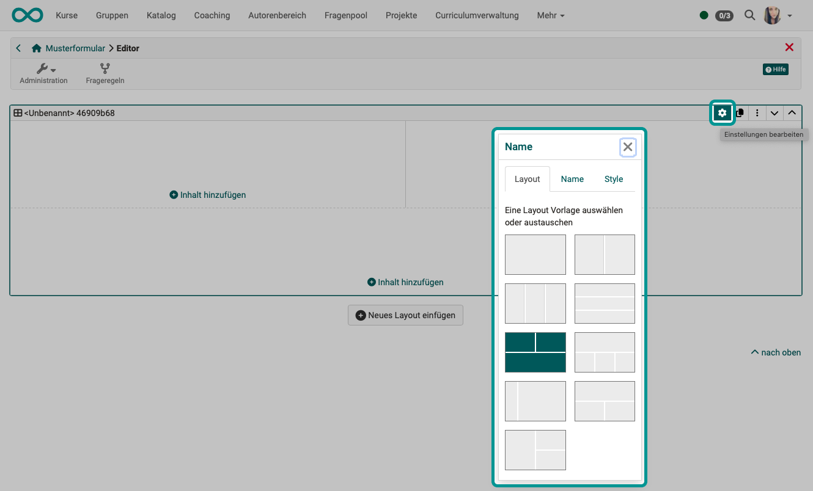{ class="shadow lightbox" title="Inspector of a layout" }

!!! info "Can I change an already existing layout?"

    Existing layouts can be changed. If you delete or change layouts, existing blocks are moved into the existing columns. 

[To the top of the page ^](#editor)

---

### Insert content elements {: #insert_content_element} 

Click on one of the "Add content" buttons in the layout to insert additional content elements.

Several content elements can be inserted in one layout area.

The new element is inserted in the layout area in which the button is located.

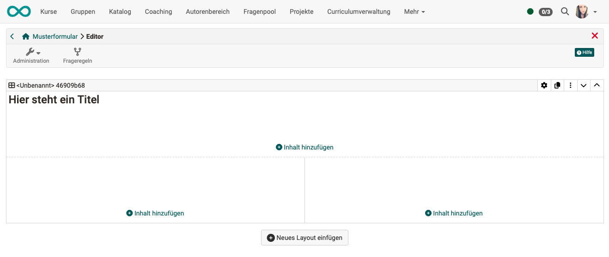{ class="shadow lightbox" title="Layout with three areas in the form editor" }

[To the top of the page ^](#editor)

---

### Available content elements {: #content_elements}

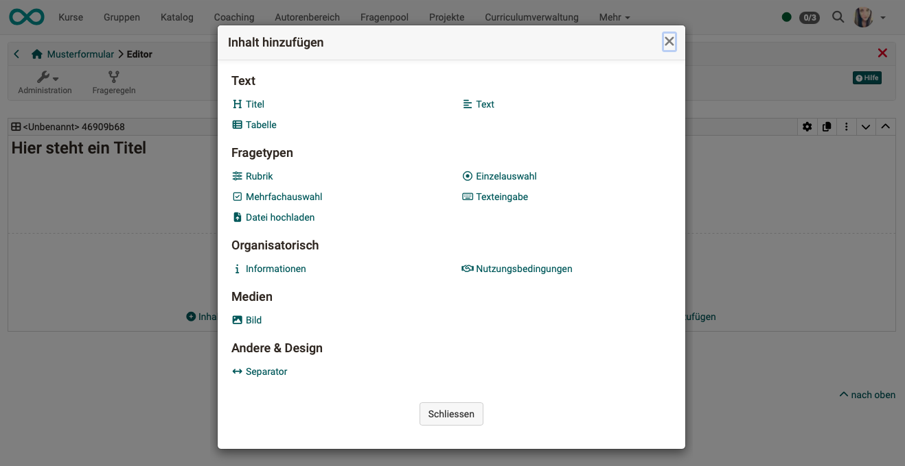{ class="shadow lightbox" title="Dialog Add content" }

You can find a description of the content elements [here >](Form_Elements.md#form_element_title) 

[To the top of the page ^](#editor)

---

### Edit content elements {: #edit_content_element} 

The settings for the respective blocks can be found (as with the layout) in the **Inspector**. On larger screens, it opens by default to the right of the selected block. You can show or hide the window by clicking on the :material-cog: settings icon.

The inspector can also be moved by clicking on the title bar of the inspector window. If you select a new block, the inspector jumps back to the default position.

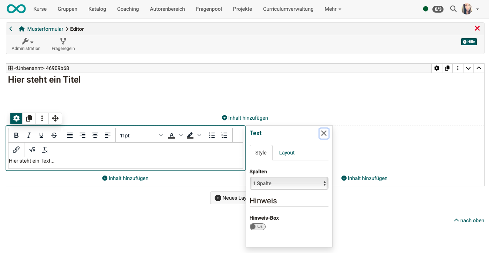{ class="shadow lightbox" title="Inspector of a text element" }

Depending on the content block selected, different options are displayed in the inspector.

**Example inspector for the title, "Style" tab**

Here you can select a predefined font size for the title.

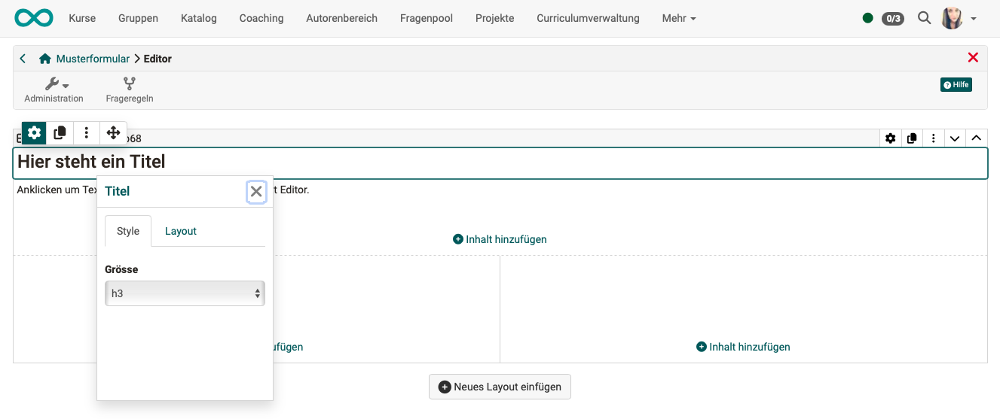{ class="shadow lightbox" title="Inspector of a title, tab Style" }

**Example inspector for the title, "Layout" tab**

Here you can select the size of the space between the content blocks. (Comparable to an "empty frame" around the content element).

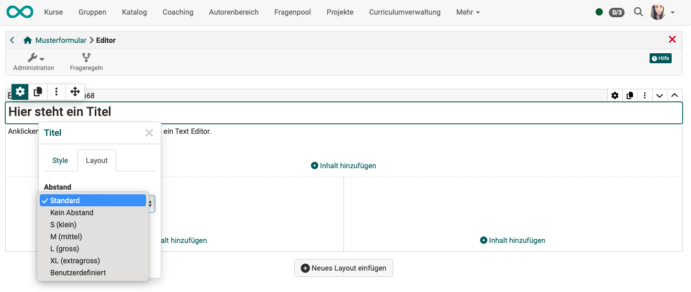{ class="shadow lightbox" title="Inspector of a title, tab Layout" }

[To the top of the page ^](#editor)

---

### Move content elements {: #move_content_element} 

Among the icons in the top left-hand corner - they appear as soon as a content element is selected - there is also a double cross. If you position the mouse pointer on it, you can move the content element to another position in the layout by holding down the mouse button. This is possible across the various layout areas.

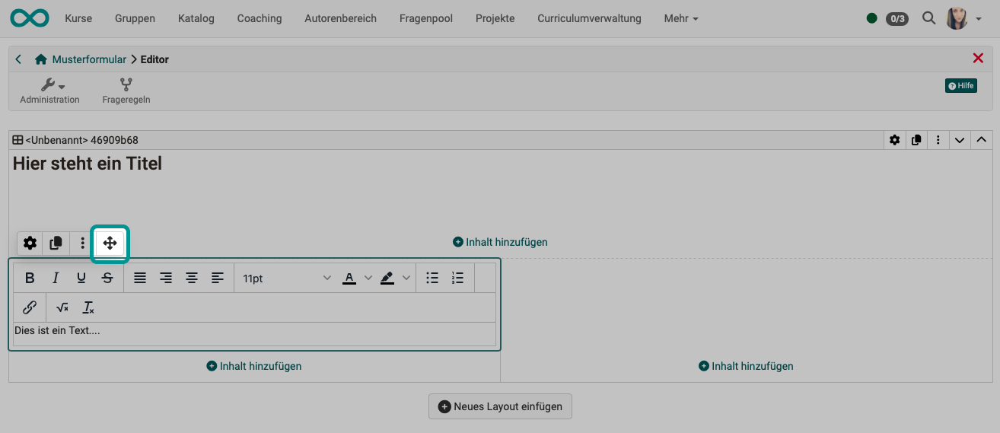{ class="shadow lightbox" title="Selected content element in the form editor" }

[To the top of the page ^](#editor)

---

## Configure Form {: #config}

To make settings for the form learning resource as a whole, exit the form editor. You can call up the form editor again at any time under: 
`Form > Administration > Form editor`

The entry for the editor in the menu Administration always calls the editor by its name: for a form "Form editor", for a test "Test editor", for a video "Video editor" and for a course "Course editor". For all other learning resources it is called "Edit content". [:octicons-tag-16:{ title="from Release 21.1 (OO-9780)" }](https://track.frentix.com/issue/OO-9780){:target="_blank"}

Select for the configuration: 
`Form > Administration > Settings`

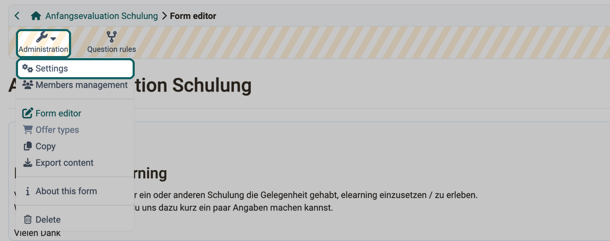{ class="shadow lightbox" title="Menu Administration in the form editor · 2026.09.28" }

You can make the configuration here as you know it from other learning resources.

* Metadata tab (e.g. title, reference, license, etc.)
* Info tab (e.g. cover image, description, main language, etc.)
* Share tab (e.g. intended use, referenceability by other authors, etc.)

!!! info "Important"

    If you want to use the form in courses, you do not need to set up the "Share" tab of the learning resource form any further. Setting up the "Share" tab is primarily relevant if you want to use the learning resource stand-alone.

[To the top of the page ^](#editor)

---

## Tips for using the form editor {: #hints}

Here are a few more tips for using the form editor:

* For the "Rubric" choice, the questions and answers are created together. For all other question types, the questions are created using the "Text" element and assigned to the answers of the appropriate question type.
* Use [Question rules](../learningresources/Form_Question_Rules.md) if you want to create more complex forms with branches.
* Do not forget to assign names to the blocks if you want to create a selective release via question rules.

[To the top of the page ^](#editor)

---

## Further information {: #further_information}

[Course Element "Survey"](../learningresources/Course_Element_Survey.md) 
[Form elements](Form_Elements.md) 
[Question rules in forms](Form_Question_Rules.md) 
[How do I create a form learning resource?](../../manual_how-to/create_a_form/create_a_form.md) 
[The form element rubric](Form_Element_Rubric.md)

[To the top of the page ^](#editor)

