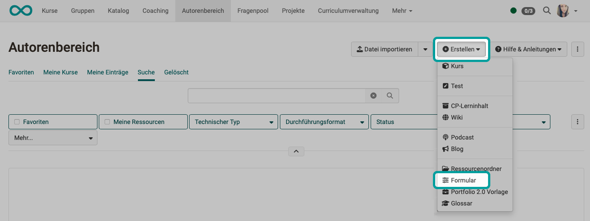
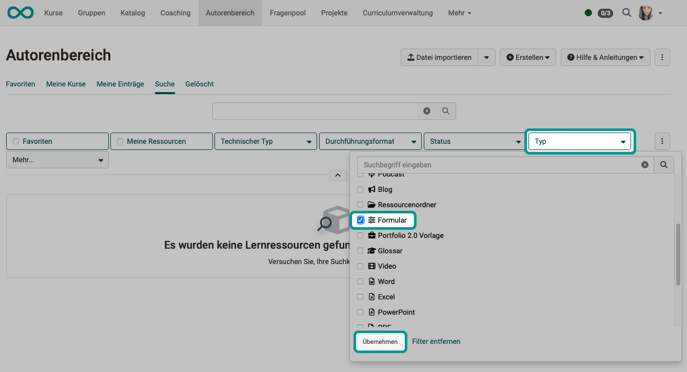
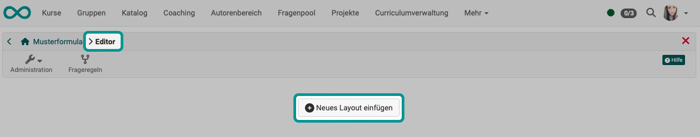
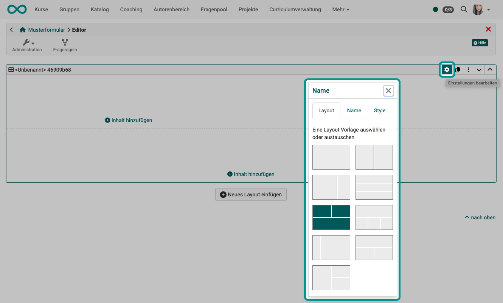
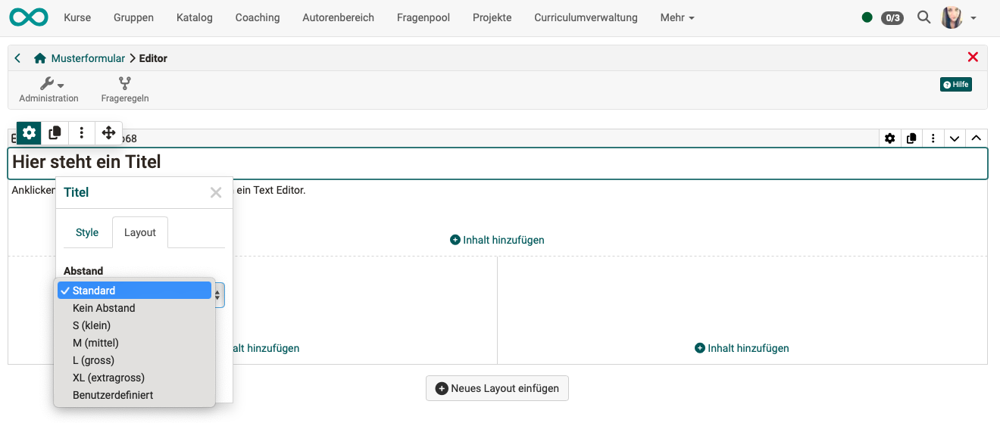
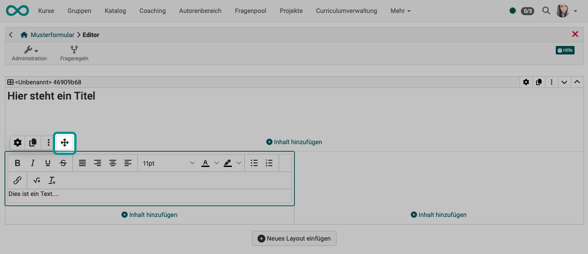

# The Form Editor {: #editor}

## Calling up the editor {: #open_editor} 

The editor for creating and editing a form learning resource can be called up from various places:

<h3> Option 1</h3>

If you need the form editor to create a new form learning resource, the easiest way to open it is in the authoring area: via the menu for creating new learning resources.

**Authoring > Create > Form**

{ class="shadow lightbox" }

<h3> Option 2</h3>

You can open form learning resources that have already been created in the authoring area in the editor after selecting them in the authoring area. Use the "Type = Form" filter to search, for example.

Select the corresponding line in the search result and click on the edit button at the end of the line.

**Open Authoring > Search for form learning resource > edit**

{ class="shadow lightbox" }

<h3> Option 3</h3>

If you first insert a course element in the course editor, you can then insert a form learning resource into the "empty" course element. This means selecting an existing form learning resource from the authoring area, importing a form learning resource or creating a new form learning resource.

**Course editor > Insert course element > Tab Form > Create**

{ class="shadow lightbox" }

The form editor can also be called up from other course elements in the same way (e.g. course element Survey).

!!! hint "Hint"

    As the learning resource form can be used in very different ways, it makes sense to consider the later use when assigning the title, e.g. to prefix it with a suitable abbreviation. This makes it easier to find and assign later.

[To the top of the page ^](#the-form-editor--editor)

---

## Creating a form learning resource {: #create} 

After calling up the editor, the new form is initially still empty. First add a new layout.

{ class="shadow lightbox" }

---

### Insert layout {: #insert_layout}

The creation of a new form always begins with the creation of a layout that reflects the page structure.

A layout is a superordinate block that enables different structuring of the content using columns and rows. Any number of content blocks (content elements) can be added within a column and row.

The following layout templates are currently available:

[To the top of the page ^](#the-form-editor--editor)

---

### Edit layout {: #edit_layout} 

Whenever you select an object in the form editor, an **Inspector pop-up** appears in which you can make settings for the currently selected object.

To display the inspector for a layout, 
- select the layout 
- and click on the small gear wheel :materical-cog: at the top right of the selection frame (currently selected layout).

Further options for editing this layout can be found in the icons to the right (duplicate, delete, move).

{ class="shadow lightbox" }

!!! info "Can I change an already existing layout?"

    Existing layouts can be changed. If you delete or change layouts, existing blocks are moved into the existing columns. 

[To the top of the page ^](#the-form-editor--editor)

---

### Insert content elements {: #insert_content_element} 

Click on one of the "Add content" buttons in the layout to insert additional content elements.

Several content elements can be inserted in one layout area.

The new element is inserted in the layout area in which the button is located.

{ class="shadow lightbox" }

[To the top of the page ^](#the-form-editor--editor)

---

### Edit content elements {: #edit_content_element} 

The settings for the respective blocks can be found (as with the layout) in the **Inspector**. On larger screens, it opens by default to the right of the selected block. You can show or hide the window by clicking on the :material-cog: settings icon.

The inspector can also be moved by clicking on the title bar of the inspector window. If you select a new block, the inspector jumps back to the default position.

{ class="shadow lightbox" }

**Depending on the content block selected, different options are displayed in the inspector.**

**Example inspector for the title, "Style" tab**

Here you can select a predefined font size for the title.

{ class="shadow lightbox" }

**Example inspector for the title, "Layout" tab**

Here you can select the size of the space between the content blocks. (Comparable to an "empty frame" around the content element).

{ class="shadow lightbox" }

[To the top of the page ^](#the-form-editor--editor)

---

### Move content elements {: #move_content_element} 

Among the icons in the top left-hand corner - they appear as soon as a content element is selected - there is also a double cross. If you position the mouse pointer on it, you can move the content element to another position in the layout by holding down the mouse button. This is possible across the various layout areas.

{ class="shadow lightbox" }

[To the top of the page ^](#the-form-editor--editor)

---

### Configure Form

To make settings for the form learning resource as a whole, exit the content editor. (You can call up the content editor again at any time under **Administration > Edit content**).

Select **Administration > Settings** for the configuration.

{ class="shadow lightbox" }

You can make the configuration here as you know it from other learning resources.

* Info tab (e.g. title, description, cover picture, etc.)
* Metadata tab (e.g. information on language, etc., which helps with the search)
* Share tab (e.g. intended use, referenceability by other authors, etc.)

!!! info "Note"

    If you want to use the form in courses, you do not need to set up the "Release" tab of the learning resource form any further. Setting up the "Release" tab is primarily relevant if you want to use the learning resource stand-alone.

[To the top of the page ^](#the-form-editor--editor)

---

## Tips for using the Form Editor

Here are a few more tips for using the Form Editor:

* For the "Rubric" choice, the questions and answers are created together. For all other question types, the questions are created using the "Paragraph" element and assigned to the answers of the appropriate question type.
* Use [Question rules](../learningresources/Form_Question_Rules.md) if you want to create more complex forms with branches.
* Do not forget to assign names to the blocks if you want to create a selective release via question rules.

[To the top of the page ^](#the-form-editor--editor)

---

## Further information

[How do I create a form learning resource?](../../manual_how-to/create_a_form/create_a_form.md) 
[Contents elements of a form](Form_Elements.md) 
[The form elements rubric](Form_Element_Rubric.md) 
[Setting up question rules in the form](Form_Question_Rules.md) 

