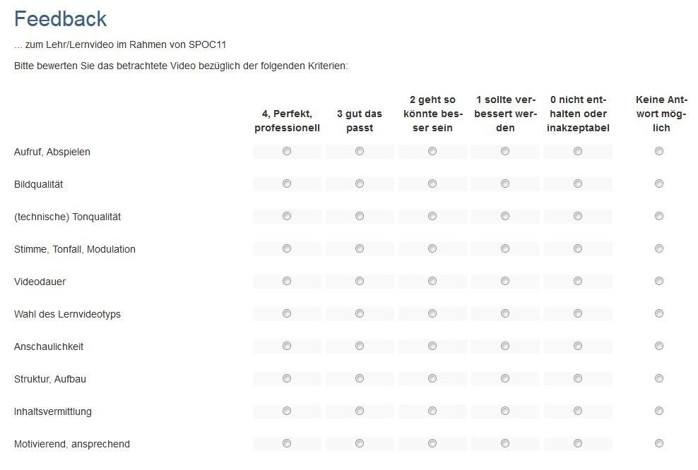
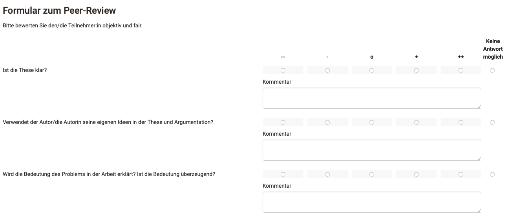
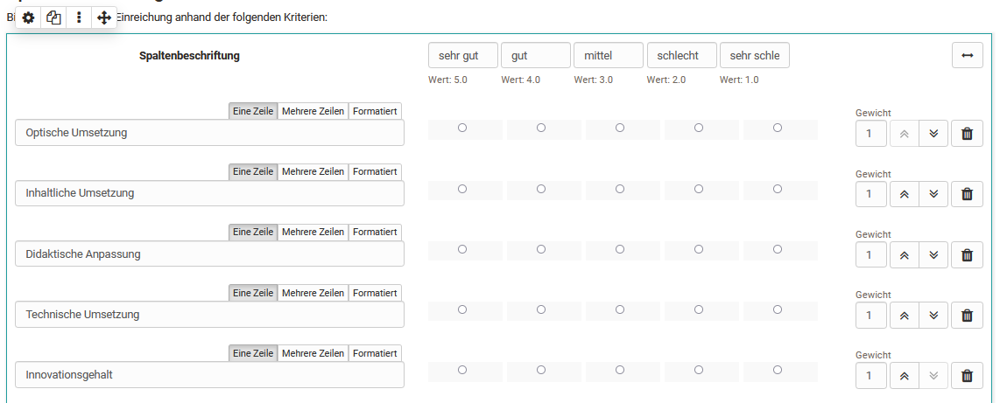
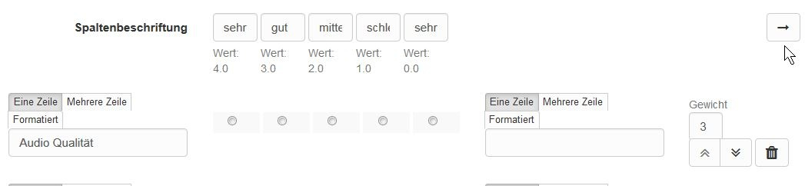
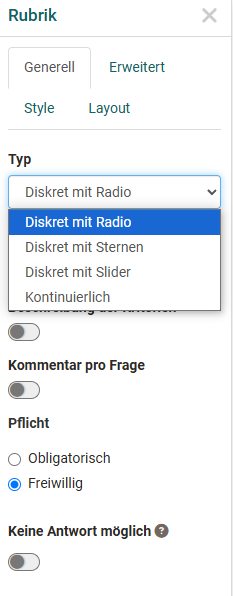
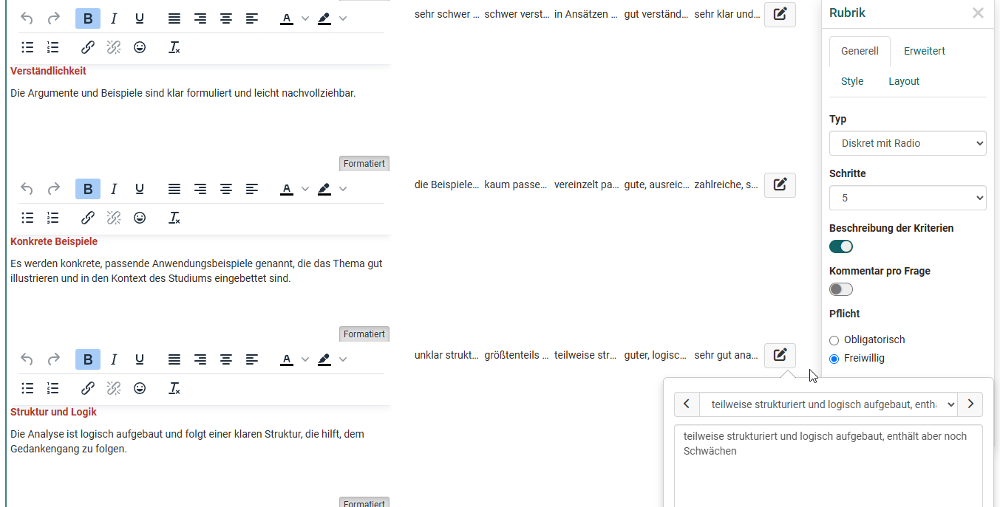

# Das Formular-Element Rubrik

Ein Rubrik ist in OpenOlat ein Element der Lernressource "Formular". Rubriks bieten sich an, wenn Sie mehrere Fragen für die gleiche Bewertungsskala verwenden wollen. Der Anwendungsbereich von Rubrik Bewertungen ist gross. Generell können Rubrik Elemente in allen Formularen und für sämtliche Kursbausteine und Lernressourcen, die Formulare nutzen, verwendet werden. Konkret sind das:

* [Kursbaustein Umfrage](../learningresources/Course_Element_Survey.de.md)
* [Kursbaustein Formular](../learningresources/Course_Element_Form.de.md)
* [Kursbaustein Bewertung](Forms_in_Rubric_Scoring.de.md)
* [Kursbaustein Aufgabe mit Peer-Review](Course_Element_Task.de.md#revisions)
* [Portfolio 2.0 Vorlage](Forms_in_the_ePortfolio_template.de.md)

## Einsatzbeispiele für Rubriks

In OpenOlat können Rubriks z.B. eingesetzt werden um

* den Zustimmungsgrad zu einer Fragestellung abzufragen

  { class="shadow lightbox" }

 

* Ausprägungen zwischen zwei extremen Skalen abzufragen

  { class="shadow lightbox" }

 

* Bewertungsraster für Lernenden-Aktionen zu erstellen

  { class="shadow lightbox" }

 

* eine Selbsteinschätzung z.B. Stärken und Schwächen vornehmen zu lassen

  { class="shadow lightbox" }

 

* Kriterien bezogene Punkte zu vergeben

  { class="shadow lightbox" }

 

* in einem Peer-Review die anderen Teilnehmer:innen zu bewerten und/oder eine Bewertung durch Betreuer:innen vorzunehmen

  { class="shadow lightbox" }

 

Rubriks können über "Inhalt hinzufügen" einem OpenOlat Formular hinzugefügt und anschliessend konfiguriert werden.

## Rubrik Konfiguration im Formular Editor

{ class="shadow lightbox" }

Ein Rubrik besteht in der Regel aus Zeilen und Spalten die sinnvoll beschriftet und definiert werden müssen. 

Geben Sie im Bereich "Spaltenbeschriftung" für jede Spalte eine sinnvolle _Bewertungsskala_ ein z.B. sehr gut, gut mittel, schlecht, sehr schlecht. Jede Spalte ist immer mit einem bestimmten Wert verbunden, der in den erweiterten Einstellungen des Rubrik Inspektors konkreter spezifiziert werden kann.
  
Geben Sie im Bereich der Zeilen einzelne (Bewertungs-)Kriterien, Statements oder Fragestellungen ein. Weitere Zeilen werden über "Frage hinzufügen" ergänzt. Sie können die kurzen Statements auch formatieren. Einzelne Zeilen können mit Hilfe der oben/unten Doppelpfeile verschoben werden. Zusätzlich können Sie jede Zeile mit einer Gewichtung  versehen und so einzelne Kriterien besondere Bedeutung zuweisen, was sich auch bei der Punktevergabe widerspiegelt, z.B. durch doppelte oder dreifache Punkte. 
Ferner ist es möglich den Wert auf 0 zu setzen um einzelne Fragen aus den Reports auszuschliessen. 
 
Ein bearbeitetes Rubrik kann, eingebunden in einen Kurs, automatisch eine entsprechende Punktzahl erhalten, was besonders bei der Verwendung im Kursbaustein "[Bewertung](../learningresources/Course_Element_Assessment.de.md)" relevant ist. 
 
Über den Quer-Doppelpfeil kann ein Rubrik mit zwei Enden erstellt werden. 

{ class="shadow lightbox" }

!!! info "Hinweis"

    Wird ein Rubrik in einem Kursbaustein Bewertung eingebunden kann die Gewichtung nicht mehr geändert werden.

### Einstellungen im Rubrik Inspektor

{ class="shadow lightbox" }

#### Tab: Generell

Im Tab "Generell" wird der Basis Typ des Rubriks definiert.
  * **Diskret mit Radio**: Die einzelnen Rubrikfelder erhalten Radio-Buttons von denen jeweils ein Button pro Zeile ausgewählt werden kann. Die Spaltenbeschriftung wird angezeigt. Eine erweiterte Beschreibung der Kriterien für einzelne Bewertungsfelder ist bei diesem Typ möglich. 

  * **Diskret mit Sternchen**: Den Statements der Zeilen wird pauschal eine Sternchenbewertung zugewiesen. Eine Spaltenbeschriftung wird nur angezeigt, wenn die auch die Option "Keine Antwort möglich" aktiviert wurde, ansonsten ist die Anzeige der Sternchen mit der entsprechenden Auswahl selbsterklärend.  
  * **Diskret mit Slider**: Hierbei kann ein Schieberegler entsprechend der Skala verschoben werden. Die Spaltenbeschriftung wird angezeigt. Diese Form bietet sich besonders an, wenn ein Rubrik mit 2 Skalen-Enden verwendet wird. 
  * **Kontinuierlich**: Ähnlich wie "Diskret mit Slider" aber mit einer fließenden nicht stufenweisen Bewertung. Eine Spaltenbeschriftung kann nicht definiert werden.  

Die Anzahl der **Schritte** legt die Anzahl der Spalten fest bzw. bei der Sternchenbewertung die Anzahl der maximalen Sternchen. Bei einem kontinuierlichen Rubrik gibt es keine Schritte. 

Für Rubriks vom Typ "Diskrete mit Radio" erscheint zusätzlich die Option **"Beschreibung der Kriterien".** Diese ermöglicht es deutlich differenziertere Rubriks zu erstellen. Aktiviert man das Feld "Beschreibung der Kriterien" kann über das Stiftsymbol ein Eingabefeld aktiviert werden, das es ermöglicht für jedes Kriterium eine konkretere Beschreibung zu hinterlegen. 

{ class="shadow lightbox" }

Aktiviert man das Feld **"Kommentar pro Frage"** können User für jede Zeile eines Rubriks noch einen Kommentar zu ihrer Bewertung hinterlassen (Freitextfeld).

Ferner kann definiert werden ob die Bearbeitung des gesamten Rubriks freiwillig oder obligatorisch ist. 

Wird **"Keine Antwort möglich"** aktiviert, erscheint neben den Bewertungsoptionen zusätzlich die Auswahl "Keine Antwort möglich". Damit kann das Rubrik-Element als bearbeitet gelten, auch wenn keine konkrete Bewertung abgegeben wird. Diese Option ist besonders sinnvoll, wenn ein Bewertungskriterium für einzelne Nutzer nicht relevant oder unpassend ist.

#### Tab: Erweitert

Im Tab "Erweitert" des Inspektors können Sie dem Rubrik Element einen Namen geben und entscheiden ob der Name in der Durchführung und in den Reports angezeigt werden soll. 

!!! info "Tipp"

    Wenn Sie planen ein Formular mit [Verzweigungen und Frageregeln](../learningresources/Form_Question_Rules.de.md) zu erstellen sollten Sie für Einzelauswahl und Mehrfachauswahl-Elemente undbedingt einen sinnvollen Namen vergeben. Das erleichtert Ihnen später die Zuordnung.

Unter "Skalentyp" können Sie die Art der verwendeten Likert–Skala näher bestimmen und somit auch den Wertebereich definieren: Legen Sie fest an welchem Ende der Skala sich die positive Bewertung befindet und wo die Skala beginnen soll. Definieren Sie bei Bedarf auch die Bereiche für ungenügend, neutral und gut. Diese Information wird in der Auswertung des Formulars berücksichtigt.

#### Tab: Style

Wie bei anderen Fragetypen kann auch ein Rubrik mit einer Hinweis-Box versehen werden, zum Beispiel um besonders wichtige Rubriks hervorzuheben. Diese werden dann visuell besonders kenntlich gemacht.

#### Tab: Layout

Hier kann der Abstand des Rubrik-Elements zu anderen Formular Elementen festgelegt werden.

!!! note "Tipp"

    Der Rubrik-Inspektor kann frei im Formularbereich positioniert und verschoben werden. Verschieben Sie ihn so, dass er sie nicht stört oder andere wichtige Elemente überdeckt.

## Weitere Informationen

[Formular als Rubrik Bewertung](Forms_in_Rubric_Scoring.de.md)

