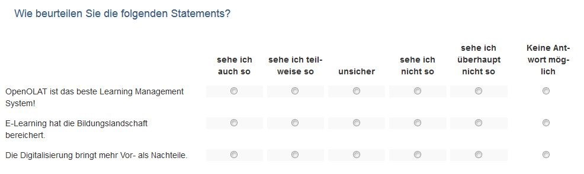
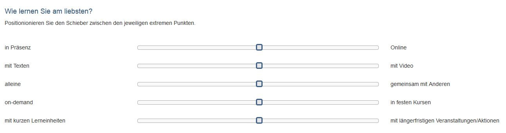
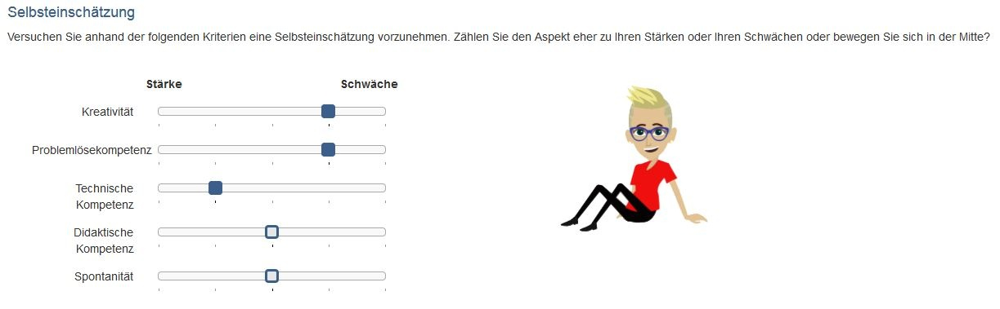
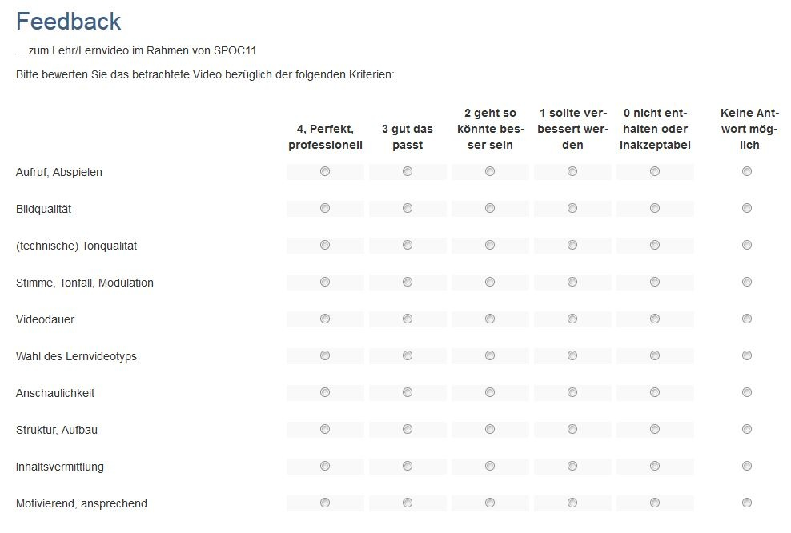
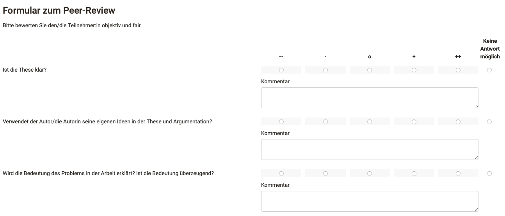
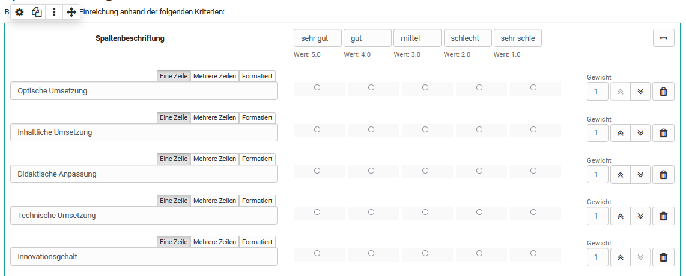
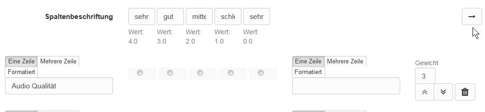
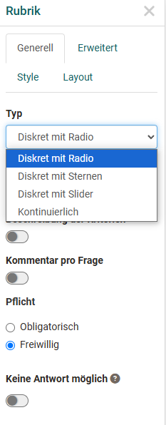
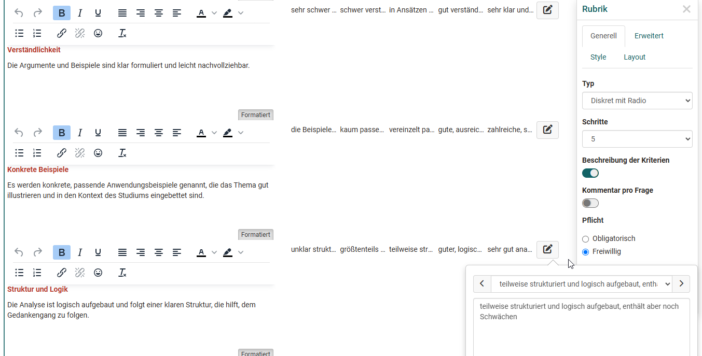

# Das Formular-Element Rubrik

Eine Rubrik ist in OpenOlat ein Element der Lernressource "Formular". Rubriken bieten sich an, wenn Sie mehrere Fragen für die gleiche Bewertungsskala verwenden wollen. Der Anwendungsbereich von Rubrik-Bewertungen ist gross. Generell können Rubrik-Elemente in allen Formularen und für sämtliche Kursbausteine und Lernressourcen, die Formulare nutzen, verwendet werden. Konkret sind das:

* [Kursbaustein Umfrage](../learningresources/Course_Element_Survey.de.md)
* [Kursbaustein Formular](../learningresources/Course_Element_Form.de.md)
* [Kursbaustein Bewertung](Forms_in_Rubric_Scoring.de.md)
* [Kursbaustein Aufgabe mit Peer-Review](Course_Element_Task.de.md#revisions)
* [Portfolio 2.0 Vorlage](Forms_in_the_ePortfolio_template.de.md)

## Einsatzbeispiele für Rubriken

In OpenOlat können Rubriken z.B. eingesetzt werden, um

* den Zustimmungsgrad zu einer Fragestellung abzufragen

  { class="shadow lightbox" }

 

* Ausprägungen zwischen zwei extremen Skalen abzufragen

  { class="shadow lightbox" }

 

* Bewertungsraster für Lernenden-Aktionen zu erstellen

  { class="shadow lightbox" }

 

* eine Selbsteinschätzung z.B. Stärken und Schwächen vornehmen zu lassen

  { class="shadow lightbox" }

 

* Kriterien bezogene Punkte zu vergeben

  { class="shadow lightbox" }

 

* in einem Peer-Review die anderen Teilnehmer:innen zu bewerten und/oder eine Bewertung durch Betreuer:innen vorzunehmen

  { class="shadow lightbox" }

 

Rubriken können über "Inhalt hinzufügen" einem OpenOlat-Formular hinzugefügt und anschliessend konfiguriert werden.

## Rubrik-Konfiguration im Formular-Editor

{ class="shadow lightbox" }

Eine Rubrik besteht in der Regel aus Zeilen und Spalten, die sinnvoll beschriftet und definiert werden müssen.

Geben Sie im Bereich "Spaltenbeschriftung" für jede Spalte eine sinnvolle _Bewertungsskala_ ein, z.B. sehr gut, gut, mittel, schlecht, sehr schlecht. Jede Spalte ist immer mit einem bestimmten Wert verbunden, der in den erweiterten Einstellungen des Rubrik-Inspektors konkreter spezifiziert werden kann.

Geben Sie im Bereich der Zeilen einzelne (Bewertungs-)Kriterien, Statements oder Fragestellungen ein. Weitere Zeilen werden über "Frage hinzufügen" ergänzt. Sie können die kurzen Statements auch formatieren. Einzelne Zeilen können mit Hilfe der oben/unten Doppelpfeile verschoben werden. Zusätzlich können Sie jede Zeile mit einer Gewichtung versehen und so einzelnen Kriterien besondere Bedeutung zuweisen, was sich auch bei der Punktevergabe widerspiegelt, z.B. durch doppelte oder dreifache Punkte.
Ferner ist es möglich, den Wert auf 0 zu setzen, um einzelne Fragen aus den Reports auszuschliessen.

Eine bearbeitete Rubrik kann, eingebunden in einen Kurs, automatisch eine entsprechende Punktzahl erhalten, was besonders bei der Verwendung in den Kursbausteinen "[Bewertung](../learningresources/Course_Element_Assessment.de.md)" oder für Peer-Review-Bewertungen im Kursbaustein ["Aufgabe"](../learningresources/Course_Element_Task.de.md) relevant ist.

Über den Quer-Doppelpfeil kann eine Rubrik mit zwei Enden erstellt werden.

{ class="shadow lightbox" }

!!! info "Wichtig"

    Wird eine Rubrik in einem Kursbaustein eingebunden, kann die Gewichtung nicht mehr geändert werden.

### Einstellungen im Rubrik-Inspektor

{ class="shadow lightbox" }

#### Tab "Generell"

Im Tab "Generell" wird der Basistyp der Rubrik definiert.
  * **Diskret mit Radio**: Die einzelnen Rubrikfelder erhalten Radio-Buttons, von denen jeweils ein Button pro Zeile ausgewählt werden kann. Die Spaltenbeschriftung wird angezeigt. Eine erweiterte Beschreibung der Kriterien für einzelne Bewertungsfelder ist bei diesem Typ möglich. 

  * **Diskret mit Sternen**: Den Statements der Zeilen wird pauschal eine Sternchenbewertung zugewiesen. Eine Spaltenbeschriftung wird nur angezeigt, wenn auch die Option "Keine Antwort möglich" aktiviert wurde, ansonsten ist die Anzeige der Sternchen mit der entsprechenden Auswahl selbsterklärend. 
  * **Diskret mit Slider**: Hierbei kann ein Schieberegler entsprechend der Skala verschoben werden. Die Spaltenbeschriftung wird angezeigt. Diese Form bietet sich besonders an, wenn eine Rubrik mit 2 Skalen-Enden verwendet wird. 
  * **Kontinuierlich**: Ähnlich wie "Diskret mit Slider", aber mit einer fliessenden, nicht stufenweisen Bewertung. Eine Spaltenbeschriftung kann nicht definiert werden.  

Die Anzahl der **Schritte** legt die Anzahl der Spalten fest bzw. bei der Sternchenbewertung die Anzahl der maximalen Sternchen. Bei einer kontinuierlichen Rubrik gibt es keine Schritte.

Für Rubriken vom Typ "Diskret mit Radio" erscheint zusätzlich die Option **"Beschreibung der Kriterien"**. Diese ermöglicht es, deutlich differenziertere Rubriken zu erstellen. Aktiviert man das Feld "Beschreibung der Kriterien", kann über das Stiftsymbol ein Eingabefeld aktiviert werden, das es ermöglicht, für jedes Kriterium eine konkretere Beschreibung zu hinterlegen.

{ class="shadow lightbox" }

Aktiviert man das Feld **"Kommentar pro Frage"**, können Nutzende für jede Zeile einer Rubrik noch einen Kommentar zu ihrer Bewertung hinterlassen (Freitextfeld).

Ferner kann definiert werden, ob die Bearbeitung der gesamten Rubrik freiwillig oder obligatorisch ist.

Wird **"Keine Antwort möglich"** aktiviert, erscheint neben den Bewertungsoptionen zusätzlich die Auswahl "Keine Antwort möglich". Damit kann das Rubrik-Element als bearbeitet gelten, auch wenn keine konkrete Bewertung abgegeben wird. Diese Option ist besonders sinnvoll, wenn ein Bewertungskriterium für einzelne Nutzende nicht relevant oder unpassend ist.

#### Tab "Erweitert"

Im Tab "Erweitert" des Inspektors können Sie dem Rubrik-Element einen Namen geben und entscheiden, ob der Name in der Durchführung und in den Reports angezeigt werden soll.

!!! tip "Tipp"

    Wenn Sie planen, ein Formular mit [Verzweigungen und Frageregeln](../learningresources/Form_Question_Rules.de.md) zu erstellen, sollten Sie für Einzelauswahl- und Mehrfachauswahl-Elemente unbedingt einen sinnvollen Namen vergeben. Das erleichtert Ihnen später die Zuordnung.

Unter "Skalentyp" können Sie die Art der verwendeten Likert-Skala näher bestimmen und somit auch den Wertebereich definieren: Legen Sie fest, an welchem Ende der Skala sich die positive Bewertung befindet, und wo die Skala beginnen soll. Definieren Sie bei Bedarf auch die Bereiche für ungenügend, neutral und gut. Diese Information wird in der Auswertung des Formulars berücksichtigt.

#### Tab "Style"

Wie bei anderen Fragetypen kann auch eine Rubrik mit einer Hinweis-Box versehen werden, zum Beispiel um besonders wichtige Rubriken hervorzuheben. Diese werden dann visuell besonders kenntlich gemacht.

#### Tab "Layout"

Hier kann der Abstand des Rubrik-Elements zu anderen Formular-Elementen festgelegt werden.

!!! tip "Tipp"

    Der Rubrik-Inspektor kann frei im Formularbereich positioniert und verschoben werden. Verschieben Sie ihn so, dass er Sie nicht stört oder andere wichtige Elemente überdeckt.

## Weiterführende Informationen {: #further_information}

**Auf dieser Seite erwähnt** 
[Kursbaustein "Umfrage"](../learningresources/Course_Element_Survey.de.md) 
[Kursbaustein "Formular"](../learningresources/Course_Element_Form.de.md) 
[Formular als Rubrik-Bewertung](Forms_in_Rubric_Scoring.de.md) 
[Kursbaustein "Aufgabe"](Course_Element_Task.de.md) 
[Formular in der Portfolio 2.0 Vorlage](Forms_in_the_ePortfolio_template.de.md) 
[Kursbaustein "Bewertung"](../learningresources/Course_Element_Assessment.de.md) 
[Frageregeln in Formularen](../learningresources/Form_Question_Rules.de.md)

**Weiterführend** 
[Formulare - Übersicht](Form.de.md) 
[Formular-Editor](Form_Editor.de.md) 
[Formular-Elemente](Form_Elements.de.md)

[Zum Seitenanfang ^](#das-formular-element-rubrik)

