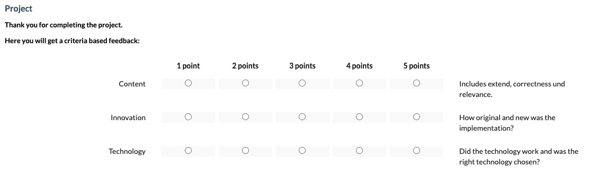
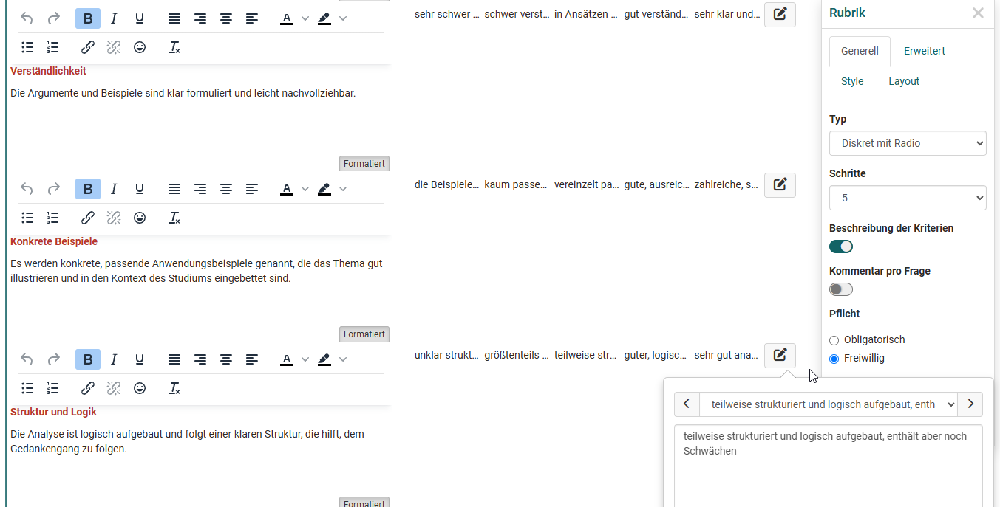

# The form element rubric

A rubric in OpenOlat is an element of the learning resource "Form". Rubrics are useful when you want to use multiple questions for the same rating scale. The scope of rubric assessments is wide. In general, rubric elements can be used in all forms and for all course elements and learning resources that use forms. 

* [Course element Survey](../learningresources/Course_Element_Survey.md)
* [Course element Form](../learningresources/Course_Element_Form.md)
* [Course element Assessment](Forms_in_Rubric_Scoring.md)
* [Course element Task with Peer Review](Course_Element_Task.md#revisions)
* [Portfolio 2.0 template](Forms_in_the_ePortfolio_template.md)

## Examples of use for Rubrics

In OpenOlat, rubrics can be used, for example,

* to query the degree of agreement on a question

  { class="shadow lightbox" }

 

* to query characteristics between two extreme scales

  { class="shadow lightbox" }
 
 
 
* to create a valuation grid for learner actions.

  { class="shadow lightbox" }

 

* to have a self-assessment carried out, e.g. of strengths and weaknesses

 

  { class="shadow lightbox" }

* to award criteria related points

 

  { class="shadow lightbox" }

 

* to assess other participants in a peer review and/or to carry out an assessment by coaches.

  { class="shadow lightbox" }

 

Rubrics can be added to an OpenOlat form via "Add content" and then configured.

## Rubric configuration in form editor

{ class="shadow lightbox" }

A rubric usually consists of rows and columns that must be labeled and defined in a meaningful way.

In the "Column label" area, enter a meaningful _rating scale_ for each column, e.g. very good, good, medium, bad, very bad.  Each column is always associated with a certain value, which can be specified more concretely in the advanced settings of the rubric inspector.

Enter individual (assessment) criteria, statements or questions in the rows. Additional lines are added via "Add question". 
You can also format the short statements. Individual lines can be moved using the up/down double arrows. In addition, you can assign a weighting to each line and thus assign special importance to individual criteria, which is also reflected in the points awarded, e.g. by double or triple points. 
It is also possible to set the value to 0 to exclude individual questions from the reports.

An edited rubric can therefore automatically receive a corresponding number of points, which is particularly relevant when used in the course element "[Assessment](../learningresources/Course_Element_Assessment.md)".

The cross double arrow can be used to create a section with two ends.

{ class="shadow lightbox" }

!!! info "Note"

    If a rubric is included in a course module evaluation, the weighting can no longer be changed.

### Rubric inspector settings

{ class="shadow lightbox" }

#### General

The basic type of rubric is defined in the “General” tab. 

#### Tab: Generell

Im Tab „Generell“ wird der Basis Typ des Rubriks definiert.
  * **Diskret mit Radio**: Die einzelnen Rubrikfelder erhalten Radio-Buttons von denen jeweils ein Button pro Zeile ausgewählt werden kann. Die Spaltenbeschriftung wird angezeigt. Eine erweiterte Beschreibung der Kriterien für einzelne Bewertungsfelder ist bei diesem Typ möglich. 

  * **Diskret mit Sternchen**: Den Statements der Zeilen wird pauschal eine Sternchenbewertung zugewiesen. Eine Spaltenbeschriftung wird nur angezeigt, wenn die auch die Option "Keine Antwort möglich" aktiviert wurde, ansonsten ist die Anzeige der Sternchen mit der entsprechenden Auswahl selbsterklärend.  
  * **Diskret mit Slider**: Hierbei kann ein Schieberegler entsprechend der Skala verschoben werden. Die Spaltenbeschriftung wird angezeigt. Diese Form bietet sich besonders an, wenn ein Rubrik mit 2 Skalen-Enden verwendet wird. 
  * **Kontinuierlich**: Ähnlich wie „Diskret mit Slider“ aber mit einer fließenden nicht stufenweisen Bewertung. Eine Spaltenbeschriftung kann nicht definiert werden.  

Die Anzahl der **Schritte** legt die Anzahl der Spalten fest bzw. bei der Sternchenbewertung die Anzahl der maximalen Sternchen. Bei einem kontinuierlichen Rubrik gibt es keine Schritte. 

Für Rubriks vom Typ "Diskrete mit Radio" erscheint zusätzlich die Option **"Beschreibung der Kriterien".** Diese ermöglicht es deutlich differenziertere Rubriks zu erstellen. Aktiviert man das Feld "Beschreibung der Kriterien" kann über das Stiftsymbol ein Eingabefeld aktiviert werden, das es ermöglicht für jedes Kriterium eine konkretere Beschreibung zu hinterlegen. 

{ class="shadow lightbox" }

Aktiviert man das Feld **„Kommentar pro Frage“** können User für jede Zeile eines Rubriks noch einen Kommentar zu ihrer Bewertung hinterlassen (Freitextfeld).

Ferner kann definiert werden ob die Bearbeitung des gesamten Rubriks freiwillig oder obligatorisch ist. 

Wird **„Keine Antwort möglich“** aktiviert, erscheint neben den Bewertungsoptionen zusätzlich die Auswahl „Keine Antwort möglich“. Damit kann das Rubrik-Element als bearbeitet gelten, auch wenn keine konkrete Bewertung abgegeben wird. Diese Option ist besonders sinnvoll, wenn ein Bewertungskriterium für einzelne Nutzer nicht relevant oder unpassend ist.

#### Tab: Erweitert

Im Tab "Erweitert" des Inspektors können Sie dem Rubrik Element einen Namen geben und entscheiden ob der Name in der Durchführung und in den Reports angezeigt werden soll.

!!! info "Tipp

    Wenn Sie planen ein Formular mit [Verzweigungen und Frageregeln](../learningresources/Form_Question_Rules.md) zu erstellen sollten Sie für Einzelauswahl und Mehrfachauswahl-Elemente undbedingt einen sinnvollen Namen vergeben. Das erleichtert Ihnen später die Zuordnung.

Under “Scale type”, you can specify the type of Likert scale used and thus also define the value range: Specify at which end of the scale the positive rating is located and where the scale should start. If necessary, also define the ranges for unsatisfactory, neutral and good. This information is taken into account in the evaluation of the form.

#### Tab: Style

Wie bei anderen Fragetypen kann auch ein Rubrik mit einer Hinweis-Box versehen werden, zum Beispiel um besonders wichtige Rubriks hervorzuheben. Diese werden dann visuell besonders kenntlich gemacht.

#### Tab: Layout

Hier kann der Abstand des Rubrik-Elements zu anderen Formular Elementen festgelegt werden.

!!! note "Info"

    The rubric inspector can be freely positioned and moved in the form area. Move it so that it does not disturb you or cover other important elements.

## Further information

[Forms in Rubric Scoring](Forms_in_Rubric_Scoring.md)