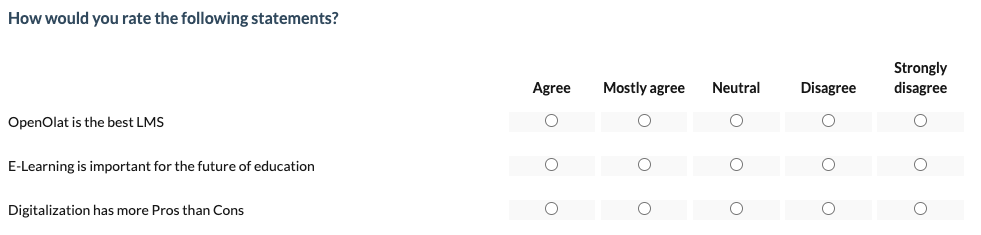
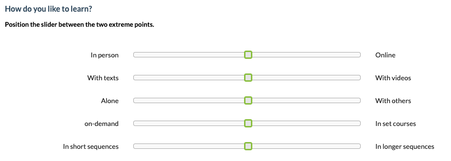
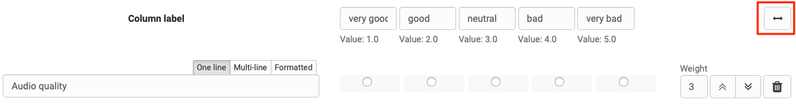

# The form element rubric

A rubric in OpenOlat is an element of the learning resource "Form". Rubrics are useful when you want to use multiple questions for the same rating scale. The scope of rubric assessments is wide. In general, rubric elements can be used in all forms and for all course elements and learning resources that use forms. 

* [Course element Survey](../learningresources/Course_Element_Survey.md)
* [Course element Form](../learningresources/Course_Element_Form.md)
* [Course element Assessment](Forms_in_Rubric_Scoring.md)
* [Course element Task with Peer Review](Course_Element_Task.md#revisions)
* [Portfolio 2.0 template](Forms_in_the_ePortfolio_template.md)

## Examples of use for Rubrics

In OpenOlat, rubrics can be used, for example,

* to query the degree of agreement on a question

  { class="shadow lightbox" }

 

* to query characteristics between two extreme scales

  { class="shadow lightbox" }
 
 
 
* to create a valuation grid for learner actions.

  { class="shadow lightbox" }

 

* to have a self-assessment carried out, e.g. of strengths and weaknesses

 

  { class="shadow lightbox" }

* to award criteria related points

 

  { class="shadow lightbox" }

 

* to assess other participants in a peer review and/or to carry out an assessment by coaches.

  { class="shadow lightbox" }

 

Rubrics can be added to an OpenOlat form via "Add content" and then configured.

## Rubric configuration in form editor

{ class="shadow lightbox" }

A rubric usually consists of rows and columns that must be labeled and defined in a meaningful way.

In the "Column label" area, enter a meaningful _rating scale_ for each column, e.g. very good, good, medium, bad, very bad.  Each column is always associated with a certain value, which can be specified more concretely in the advanced settings of the rubric inspector.

Enter individual (assessment) criteria, statements or questions in the rows. Additional lines are added via "Add question". You can also format the short statements. Individual lines can be moved using the up/down double arrows. In addition, you can assign a weighting to each line and thus assign special importance to individual criteria, which is also reflected in the points awarded, e.g. by double or triple points. 
It is also possible to set the value to 0 to exclude individual questions from the reports.

An edited rubric can therefore automatically receive a corresponding number of points, which is particularly relevant when used in the course element "[Assessment](../learningresources/Course_Element_Assessment.md)" or for peer review assessments in the course element [”Task"](../learningresources/Course_Element_Task.md). 

The cross double arrow can be used to create a section with two ends.

{ class="shadow lightbox" }

!!! info "Note"

    If a rubric is included in a course module evaluation, the weighting can no longer be changed.

### Rubric inspector settings

{ class="shadow lightbox" }

#### Tab: General

The basic type of rubric is defined in the "General" tab.
  * **Discreet with radio**: The individual column fields have radio buttons, one of which can be selected for each row. The column labeling is displayed. An extended description of the criteria for individual evaluation fields is possible with this type.

  * **Discreet with an asterisk**: The statements in the rows are assigned a blanket star rating. A column label is only displayed if the "No answer possible" option has also been activated, otherwise the display of the asterisks with the corresponding selection is self-explanatory.  
  * **Discreet with slider**: A slider can be moved according to the scale. The column labeling is displayed. This form is particularly useful if a column with 2 scale ends is used.
  * **Continuous**: Similar to "Discrete with slider" but with a fluid, non-step-by-step evaluation. Column labeling cannot be defined.  

The number of **steps** determines the number of columns or, in the case of star ratings, the maximum number of stars. There are no steps for a continuous rubric. 

For rubrics of the type "Discrete with radio", the option **"Description of the criteria" appears in addition.** This makes it possible to create significantly more differentiated rubrics. If you activate the "Description of criteria" field, an input field can be activated via the pencil symbol, which allows you to enter a more specific description for each criterion.

{ class="shadow lightbox" }

If you activate the **"Comment per question"** field, users can leave a comment on their rating for each line of a rubric (free text field).

You can also define whether editing the entire section is voluntary or mandatory. 

If **"No answer possible"** is activated, the selection "No answer possible" also appears next to the rating options. This means that the rubric element can be considered edited, even if no specific rating is given. This option is particularly useful if an evaluation criterion is not relevant or inappropriate for individual users.

#### Tab: Advanced

In the "Advanced" tab of the inspector, you can give the category element a name and decide whether the name should be displayed in the execution and in the reports.

!!! info "Hint"

    If you are planning to create a form with [Branches and question rules](../learningresources/Form_Question_Rules.md), you should always assign a meaningful name for single selection and multiple selection elements. This will make it easier for you to assign them later.

Unter "Skalentyp" können Sie den Typ der verwendeten Likert-Skala angeben und damit auch den Wertebereich festlegen: Geben Sie an, an welchem Ende der Skala sich die positive Bewertung befindet und wo die Skala beginnen soll. Definieren Sie ggf. auch die Bereiche für unbefriedigend, neutral und gut. Diese Angaben werden bei der Auswertung des Formulars berücksichtigt.

#### Tab: Style

As with other question types, a rubric can also be provided with a hint box, for example to highlight particularly important rubrics. These are then highlighted visually.

#### Tab: Layout

The distance between the category element and other form elements can be defined here.

!!! note "Info"

    The rubric inspector can be freely positioned and moved in the form area. Move it so that it does not disturb you or cover other important elements.

## Further information

[Forms in Rubric Scoring](Forms_in_Rubric_Scoring.md)