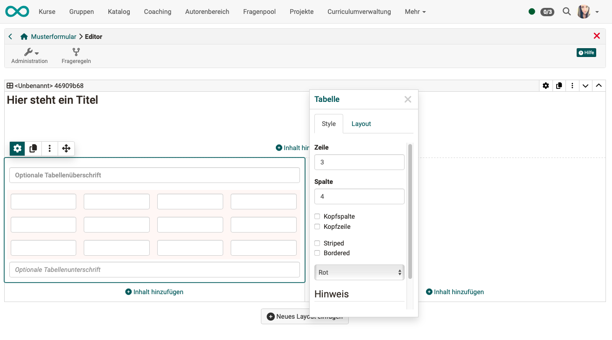
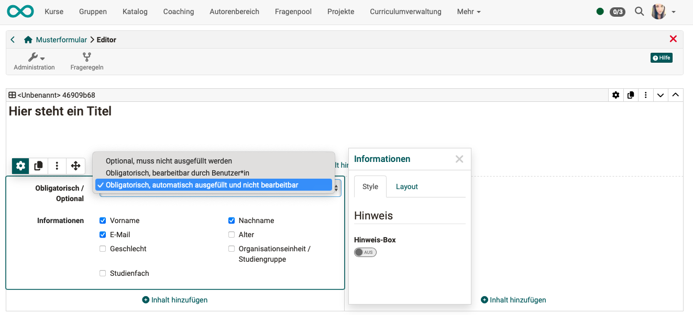
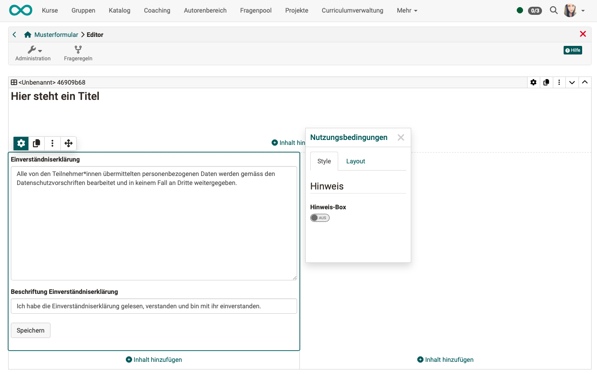
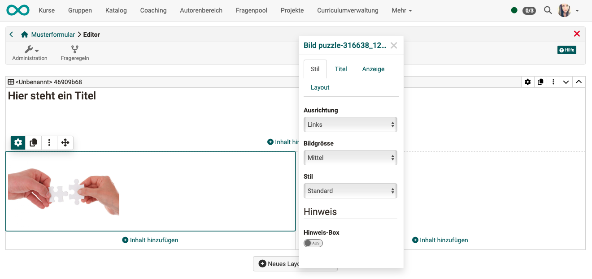
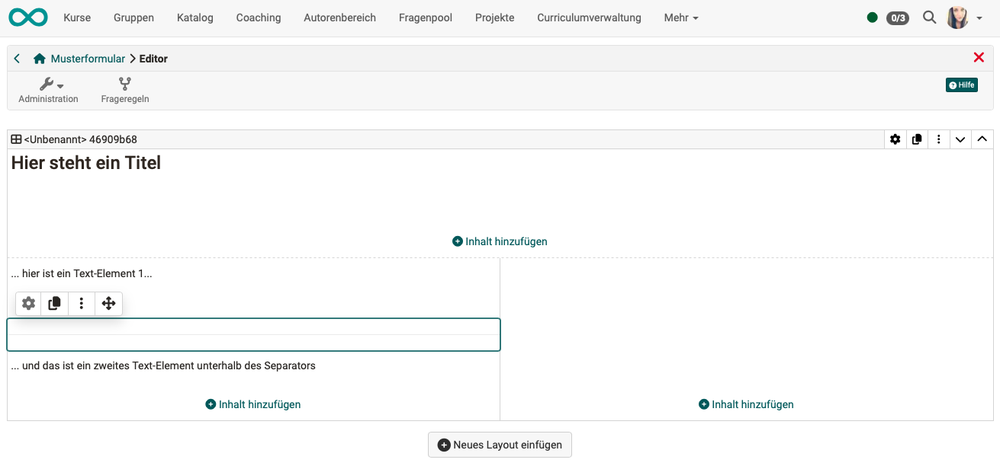

# Formular-Elemente {: #form_elements} 

In ein Formular können Sie über den Link "Inhalt hinzufügen" die folgenden Inhaltselemente  einem Layout hinzufügen:

{ class="shadow lightbox" }

Generell können alle Elemente aus dem Bereich "Fragetypen" als obligatorisch oder freiwillig konfiguriert werden. Obligatorisch bedeutet, dass die Teilnehmenden dieses Element zwingend ausfüllen müssen um das Formular final speichern zu können. Bei "freiwillig" kann das Formular auch gespeichert werden, wenn das Element nicht ausgefüllt wurde. 

Ferner können viele Elemente im Tab "Style" mit einer speziellen *Hinweisbox* versehen werden (siehe unten) und auch die Grösse des Abstandes zwischen einzelnen Elementen im Tab "Layout" definiert werden. 

---

## Titel {: #form_element_title} 

Das Inhaltselement "Titel" verwenden Sie für Überschriften. Sie können für die Schriftgrösse vordefinierte Formatierungen von h1 bis h6 auswählen.

{ class="shadow lightbox" }

[zum Seitenanfang ^](#form_elements)

---

## Text {: #form_element_text} 

Mit dem Textelement können sämtliche Varianten von Texten, z.B. Informationen oder Fragen einem Formular hinzugefügt werden. Ein kleiner Editor ermöglicht verschiedene Formatierungen, das Hinzufügen von Links, Hinzufügen von Aufzählungspunkten, usw...

{ class="shadow lightbox" }

[zum Seitenanfang ^](#form_elements)

---

## Tabelle {: #form_element_tabelle} 

Fügen Sie bei Bedarf dem Formular eine Tabelle hinzu und konfigurieren Sie diese.

{ class="shadow lightbox" }

[zum Seitenanfang ^](#form_elements)

---

## Rubrik {: #form_element_rubric}

Ein Rubrik-Element besteht aus einem Gitter mit Zeilen und Spalten. In den Zeilen werden die Bewertungskategorien bzw. Statements aufgeführt während die Spaltenüberschriften die Bewertungsskalen wiedergeben. So können sich mehrere unterschiedliche Statements auf eine Bewertungsskala beziehen. 
Je nach konkreter Konfiguration können dabei sehr unterschiedliche Rubrik-Varianten entstehen die in Kursen u.a. auch als Bewertungselement für Lehrende oder als [Peer-Reviews](../learningresources/Course_Element_Task.de.md) im Aufgabenbaustein verwendet werden können.

Mehr Information finden Sie in einer separaten Beschreibung des [Rubrik-Elements](Form_Element_Rubric.de.md).

{ class="shadow lightbox" }

[zum Seitenanfang ^](#form_elements)

---

## Einzelauswahl {: #form_element_sc}

In einer Einzelauswahl (Single-Choice) muss von den Kursteilnehmenden genau 1 Option aus einer Liste ausgewählt werden.

* Sie können mit dem Button "Eintrag hinzufügen" der Liste weitere Auswahloptionen hinzufügen.
* Die Einträge können über die Pfeiltasten nach oben oder unten verschoben werden.
* Die einzelnen Antwortmöglichkeiten können dabei nebeneinander, untereinander oder als Wahl Menü über die Option "Auswahlliste" dargestellt werden. 

!!! Tip "Hinweis"

    Soll die Auswahl mit einer Fragestellung verknüpft werden müssen Sie dafür ein separates Text-Element verwenden. Gleiches gilt für die Mehrfachauswahl.

Die Einzelauswahl kann auch als Basis (Bedingung) für die [Frageregeln](Form_Question_Rules.de.md) verwendet werden. Damit werden bestimmte Container und deren Inhalte in Abhängigkeit der vom User gewählten Antwort angezeigt.

Vergeben Sie einen sinnvollen Namen (Titel) für das Element, so dass Sie bei den Frageregeln den Überblick behalten.

{ class="shadow lightbox" }

[zum Seitenanfang ^](#form_elements)

---

## Mehrfachauswahl {: #form_element_mc}

In einer Mehrfachauswahl (Multiple-Choice) können von den Kursteilnehmenden mehrere Optionen aus einer Liste ausgewählt werden.

* Sie können mit dem Button "Eintrag hinzufügen" der Liste weitere Auswahloptionen hinzufügen.
* Die Einträge können über die Pfeiltasten nach oben oder unten verschoben werden.
* Die einzelnen Antwortmöglichkeiten können dabei nebeneinander, untereinander oder als Wahl Menü über die Option "Auswahlliste" dargestellt werden. 
* Den Teilnehmenden kann auch gestattet werden, selbst Antwortoptionen hinzuzufügen.

Die Mehrfachauswahl kann auch als Basis (Bedingung) für die [Frageregeln](Form_Question_Rules.de.md) verwendet werden. Damit werden bestimmte Container und deren Inhalte in Abhängigkeit der vom User gewählten Antwort angezeigt.

Vergeben Sie einen sinnvollen Namen (Titel) für das Element, so dass Sie bei den Frageregeln den Überblick behalten.

{ class="shadow lightbox" }

[zum Seitenanfang ^](#form_elements)

---

## Texteingabe {: #form_element_text_input}

Mit diesem Element erhalten die Teilnehmenden die Möglichkeit selbst Text im Formular einzutragen (eine Art Freitext Feld). 

* Formularersteller:innen können festlegen, welche Eingaben erlaubt sind (Text, nur Zahlen, nur Datum).
* Das Eingabefeld kann ein- oder mehrzeilig angeboten werden.

{ class="shadow lightbox" }

[zum Seitenanfang ^](#form_elements)

---

## Datei hochladen {: #form_element_file_upload}

Mit diesem Element erhalten die Lernenden die Möglichkeit, Dateien hochzuladen. 

* Lehrende können die Dateigrösse begrenzen.
* Der Upload kann auf bestimmte Dateitypen begrenzt werden (z.B. pdf oder Bild-Dateien).

{ class="shadow lightbox" }

[zum Seitenanfang ^](#form_elements)

---

## Informationen {: #form_element_info}

Mit dem Inhaltselement "Informationen" können weitere benutzerspezifische Informationen abgefragt werden. Als Autor:in bestimmen Sie im Editor durch Ankreuzen der Checkboxen, welche Angaben abgefragt werden.

Es kann eine der folgenden 3 Varianten ausgewählt werden:

a) die Angaben sind freiwillig (optional) 
b) die Angaben müssen vom Benutzer verpflichtend ausgefüllt werden (obligatorisch) 
c) die Angaben sind bereits automatisch eingetragen (nicht veränderbar)

!!! info "Hinweis"

    Beachten Sie: Durch diese Informationen verliert das Formular seine Anonymität.

{ class="shadow lightbox" }

[zum Seitenanfang ^](#form_elements)

---

## Nutzungsbedingungen {: #form_element_terms_of_use}

Dieses Element fügt dem Formular eine Einverständniserklärung hinzu, die von den Benutzer:innen abgehakt werden muss. Ansonsten ist nur ein Zwischenspeichern aber keine Abgabe des Formulars möglich.

{ class="shadow lightbox" }

[zum Seitenanfang ^](#form_elements)

---

## Bild {: #form_element_picture}

Wenn Sie nach Klick auf "Inhalte einfügen" im Popup mit der Übersicht der Inhaltselemente "Bild" auswählen, werden Sie zunächst aufgefordert eine Bild-Datei hochzuladen. Erst nach dem Upload gelangen Sie wieder in den Editor und es werden das Bild-Element und der Inspektor angezeigt.

{ class="shadow lightbox" }

Im Inspektor finden Sie die Optionen zur Darstellung des Bildes:

**Tab "Stil"**

* Die **Ausrichtung** des Bildes innerhalb des Layoutbereichs
* Verschiedene Skalierungsvarianten der **Bildgrösse** 
* Verschiedene **Stile** (z.B. mit Rahmen, mit Schatten. u.a.)
* Optionen zur Darstellung als **Hinweisbox** 

**Tab "Titel"**

* Ein Eingabefeld für einen **Titel** zum Bild
* Eine Angabe, **wo** der Titel angezeigt werden soll (über dem Bild, zentriert auf dem Bild, usw.)
* Wahl eines **Titelstils** ("hell" für dunkle Bilder, "dunkel" für hellere Bilder)

**Tab "Anzeige"**

* Eine **Beschreibung** zum Bild, die durch Klick auf ein kleines Fragezeichensymbol abgerufen werden kann
* Eine **Bildunterschrift** (in kleinerer Schriftgrösse unterhalb des Bildes dargestellt)

**Tab "Layout"**
* Möglichkeit den Abstand des Bildes zu konfigurieren

[zum Seitenanfang ^](#form_elements)

---

## Separator

Der Separator ist eine feine Trennlinie zum Gliedern Ihres Formulars in Bereiche.

{ class="shadow lightbox" }

[zum Seitenanfang ^](#form_elements)

## Hinweis-Box 

Kein Inhaltselement aber eine interessante Funktion, die für viele Inhaltselemente wie Text, Tabelle, Bild, Rubrik, Nutzungsbedingungen usw. zur Verfügung steht ist die Hinweis-Box. Sie wird im Tab "Style" aktiviert und hilft ein Element besonders hervorzuheben.  

{ class="shadow lightbox" }

Es werden die nachfolgenden Optionen zur Konfiguration angeboten.

**Typ** 
Mit dem Typ wird angegeben, welche vorformatierte Version der Box verwendet wird, bzw. ob sie benutzerdefiniert gestaltet wird.

Es stehen folgende Typen zur Auswahl:

* Notiz
* Information
* Tipp
* Wichtig
* Warnung
* Fehler
* Erfolg
* Benutzerdefiniert (Hier können Sie selbst ein Icon wählen und die Hintergrundfarbe der Box auswählen.)

**Titel** 
Der Titel, den sie hier angeben, erscheint im Head der Hinweisbox.

**Mit Icon** 
Wählen Sie diese Option, wird in der linken oberen Ecke der Hinweisbox ein Icon angezeigt, z.B. eine "i" wenn als Typ "Information" gewählt wird.

**Einklappbar** 
Wahlen Sie diese Option, kann die ganze Box in der Teilnehmeransicht durch Klick auf das Symbol in der rechten oberen Ecke eingeklappt werden (nur die Titelzeile wird angezeigt). Mit erneutem Klick auf das Symbol wird die Box wieder in Normalgrösse angezeigt.

---

## Weitere Informationen

[Wie erstelle ich eine Formular-Lernressource?](../../manual_how-to/create_a_form/create_a_form.de.md) 
[Der Formular-Editor](Form_Editor.de.md) 
[Das Formular-Element Rubrik](Form_Element_Rubric.de.md) 
[Einrichtung von Frageregeln im Formular](Form_Question_Rules.de.md) 

