# Form elements {: #form_elements} 

You can insert the following content elements into a form layout using the "Add content" link:

{ class="shadow lightbox" }

In general, all elements from the "Question types" section can be configured as mandatory or voluntary. Mandatory means that participants must complete this element in order to be able to save the form. With "voluntary", the form can also be saved if the element has not been completed. 

Furthermore, many elements can be provided with a special *hint box* (see below) and the size of the space between individual elements can also be defined in the "Layout" tab. 

---

## Title {: #form_element_title} 

You use the "Title" content element for headings. You can select predefined formatting from h1 to h6 for the font size.

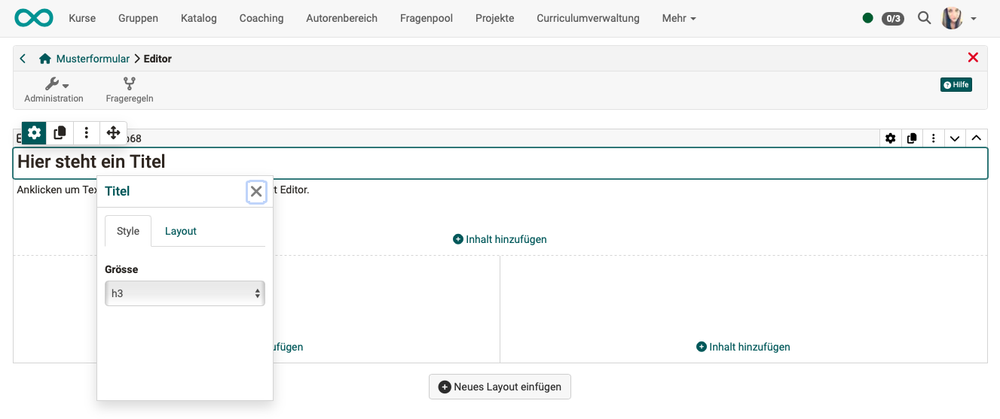{ class="shadow lightbox" }

[To the top of the page ^](#form_elements)

---

## Text {: #form_element_text} 

The text element can be used to add all types of text, e.g. information or questions, to a form. A small editor enables various formatting, the addition of links, the addition of bullet points, etc...

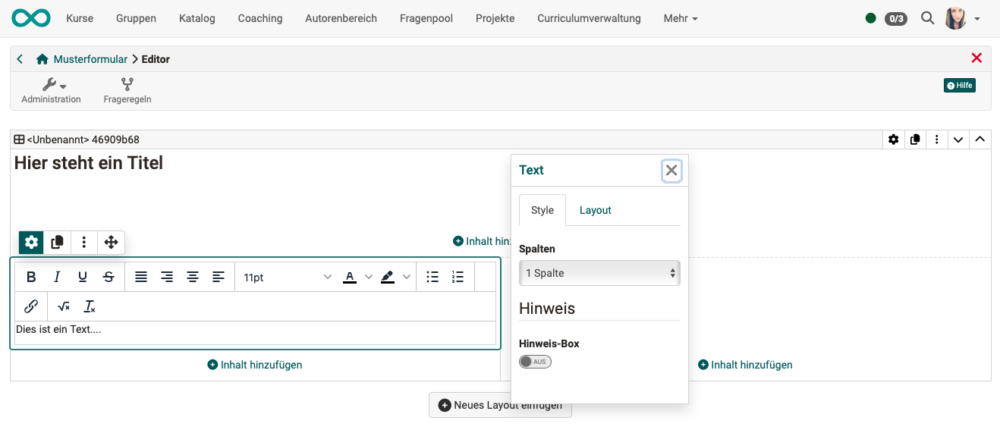{ class="shadow lightbox" }

[To the top of the page ^](#form_elements)

---

  
## Table {: #form_element_tabelle} 

If required, add a table to the form and configure it.

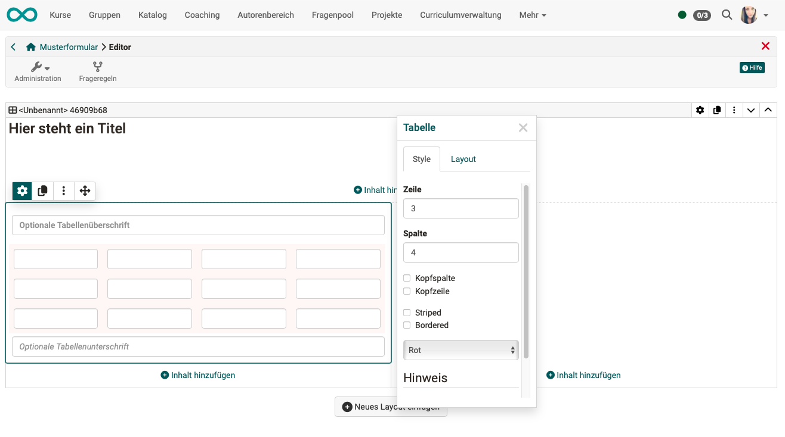{ class="shadow lightbox" }

[To the top of the page ^](#form_elements)

---
  
## Rubric {: #form_element_rubric}

A rubric element consists of a grid with rows and columns. The assessment categories or statements are listed in the rows, while the column headings reflect the assessment scales. In this way, several different statements can refer to one rating scale.
Depending on the specific configuration, very different rubric variants can be created which can also be used in courses as an assessment element for teachers or as [Peer-Reviews](../learningresources/Course_Element_Task.md) in the task module.

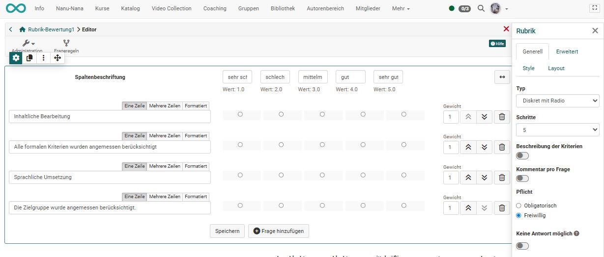{ class="shadow lightbox" }

[To the top of the page ^](#form_elements)

---
  
## Single choice {: #form_element_sc}

In a single choice, course participants must select exactly 1 option from a list.

* You can add further selection options to the list using the "Add entry" button.
* The entries can be moved up or down using the arrow buttons.
* The individual answer options can be displayed next to each other, one below the other or as a selection menu using the "Selection list" option.

!!! Tip "Note"

    If the selection is to be linked to a question, you must use a separate text element for this. The same applies to multiple selections.

The individual selection can also be used as the basis (condition) for the [Question rules](Form_Question_Rules.md). This allows certain containers and their contents to be displayed depending on the answer selected by the user.

Assign a meaningful name (title) to the element so that you can keep track of the question rules.

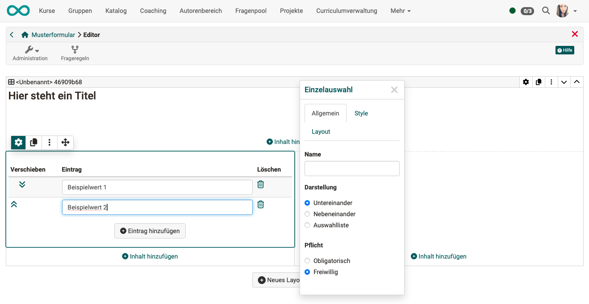{ class="shadow lightbox" }

[To the top of the page ^](#form_elements)

---

## Multiple choice {: #form_element_mc}

In multiple choice, course participants can select several options from a list.

* You can add further selection options to the list using the "Add entry" button.
* The entries can be moved up or down using the arrow buttons.
* The individual answer options can be displayed next to each other, one below the other or as a selection menu using the "Selection list" option. 
* Participants can also be allowed to add answer options themselves.

The multiple selection can also be used as a basis (condition) for the [Question rules](Form_Question_Rules.md). This allows certain containers and their contents to be displayed depending on the answer selected by the user.

Assign a meaningful name (title) to the element so that you can keep track of the question rules.

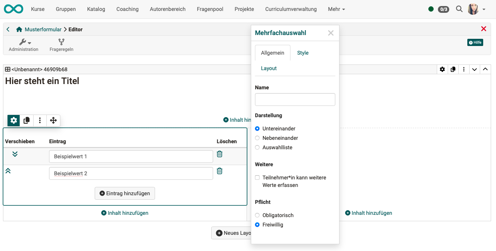{ class="shadow lightbox" }

[To the top of the page ^](#form_elements)

---

  
## Text input {: #form_element_text_input}

This element gives participants the opportunity to enter their own text in the form (a kind of free text field).

* Form creators can specify which entries are permitted (text, numbers only, date only).
* The input field can be displayed on one or more lines.

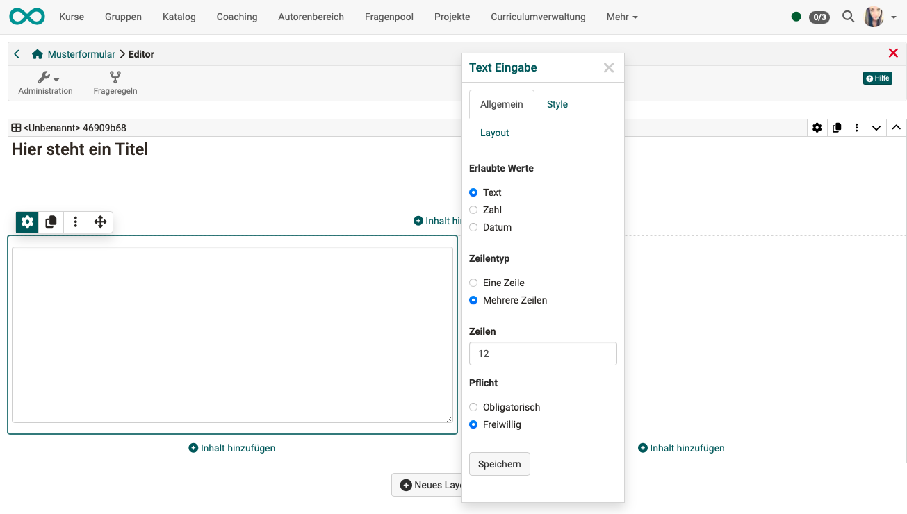{ class="shadow lightbox" }

[To the top of the page ^](#form_elements)

---

  
## Upload file {: #form_element_file_upload}

This element gives learners the opportunity to upload files.

* Teachers can limit the file size.
* The upload can be limited to certain file types (e.g. pdf or image files).

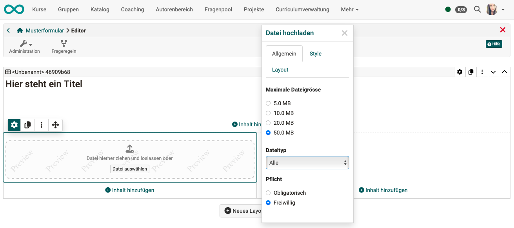{ class="shadow lightbox" }
  
[To the top of the page ^](#form_elements)

---

## Information {: #form_element_info}

The "Information" content element can be used to request further user-specific information. As the author, you determine which information is requested by ticking the checkboxes in the editor.

One of the following 3 variants can be selected:

a) the information is voluntary (optional) 
b) the information must be completed by the user (mandatory) 
c) the information is transferred automatically (automatically mandatory)

!!! info "Note"

    Please note: This information makes the form anonymous.

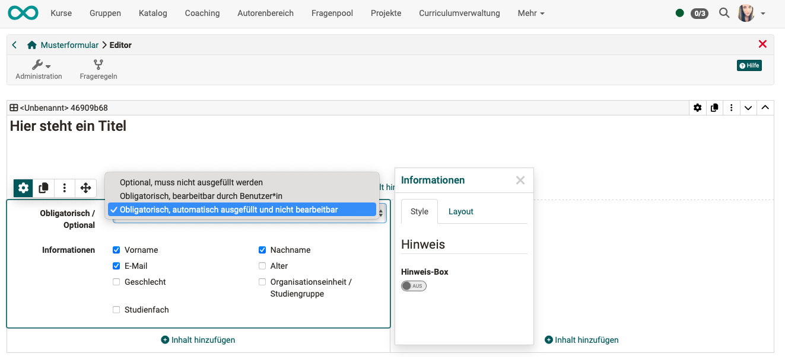{ class="shadow lightbox" }

[To the top of the page ^](#form_elements)

---

## Terms of use {: #form_element_terms_of_use}

This element adds a declaration of consent to the form, which must be ticked off by the user. Otherwise, the form can only be saved temporarily but not submitted.

{ class="shadow lightbox" }

[To the top of the page ^](#form_elements)

---

## Image {: #form_element_picture}

If you select "Image" in the pop-up with the overview of content elements after clicking on "Insert content", you will first be asked to upload an image file. Only after uploading will you return to the editor and the image element and the inspector will be displayed.

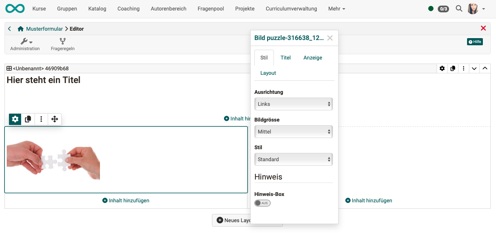{ class="shadow lightbox" }

In the inspector you will find the options for displaying the image:

**Tab "Style"**

* The **alignment** of the image within the layout area
* Different scaling variants of the **image size**
* Various **styles** (e.g. with frame, with shadow, etc.)
* Options for display as **Hint box** 

**Tab "Title"**

* An input field for a **title** for the image
* An indication of **where** the title should be displayed (above the image, centered on the image, etc.)
* Selection of a **title style** (“light” for dark images, "dark" for lighter images)

**Tab "Display"**

* A **description** of the image, which can be called up by clicking on a small question mark symbol
* A **caption** (displayed in a smaller font size below the image)

**Tab "Layout"**
* Option to configure the spacing of the image

[To the top of the page ^](#form_elements)

---

## Seperator

Separation line for structuring areas

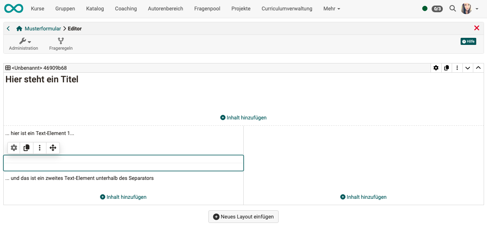{ class="shadow lightbox" }

[To the top of the page ^](#form_elements)

---

  
## Hint box

The hint box is not a content element but an interesting function that is available for many content elements such as text, table, image, category, terms of use etc... It is activated in the "Style" tab and helps to emphasize an element.  

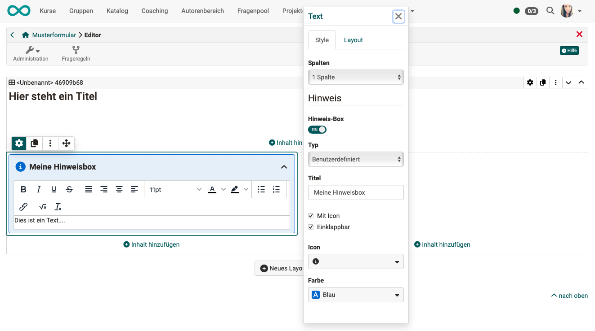{ class="shadow lightbox" }

The following configuration options are available.

**Type** 
The type is used to specify which pre-formatted version of the box is used or whether it is user-defined.

The following types are available:

* Note
* Information
* Hint
* Important
* Warning
* Mistake
* Success
* User-defined (Here you can choose an icon yourself and select the background color of the box).

**Title** 
The title you enter here will appear in the head of the hint box.

**With icon** 
If you select this option, an icon is displayed in the top left-hand corner of the message box, e.g. an "i" if "Information" is selected as the type.

**Foldable** 
If you select this option, the entire box in the participant view can be collapsed by clicking on the icon in the top right-hand corner (only the title bar is displayed). Click on the icon again to display the box in normal size again.

---

## Further information

[How do I create a form learning resource?](../../manual_how-to/create_a_form/create_a_form.md) 
[The form editor](Form_Editor.md) 
[The form element rubric](Form_Element_Rubric.md) 
[Setting up question rules in the form](Form_Question_Rules.md) 