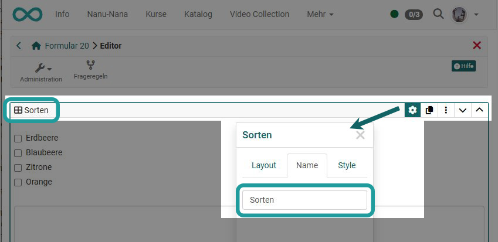
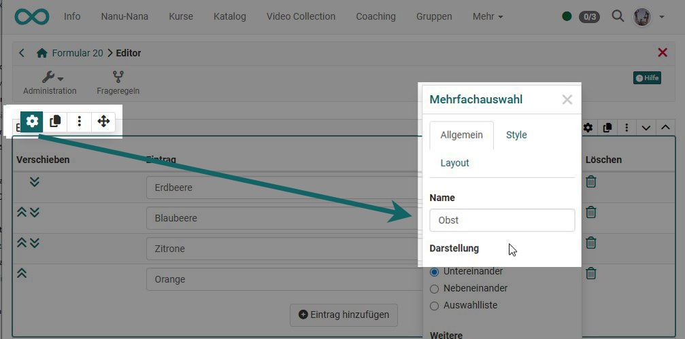
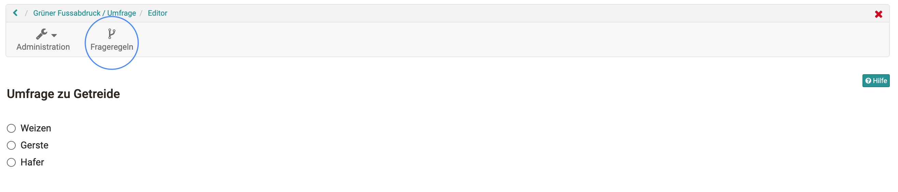
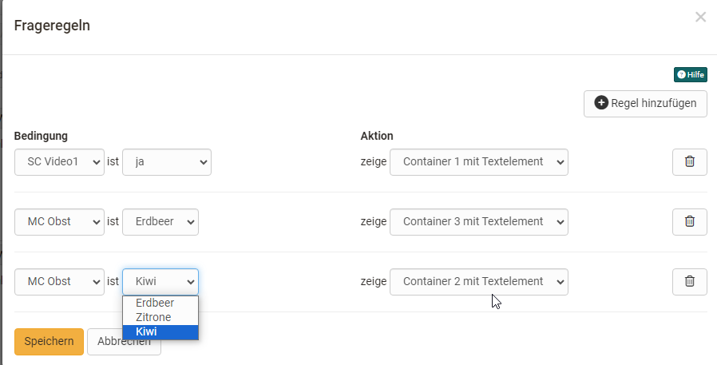

# Frageregeln in Formularen

Mit Frageregeln kann die Anzeige von Layout-Bereichen in Abhängigkeit von bestimmten Antworten der Einzel- oder Mehrfachauswahl (Bedingungsfeld) gesetzt werden. So wird ein Layout-Container mit den jeweiligen Elementen nur dann angezeigt, wenn Nutzende eine bestimmte vorgegebene Antwort ausgewählt haben.

Einem Formular können mehrere Regeln hinzugefügt werden. Dadurch können unterschiedliche Fragestränge erstellt werden.

## Erstellung einer Regel

Überlegen Sie sich zunächst, welche Bereiche Sie bei welcher Auswahl anzeigen wollen und setzen diese dann mit Hilfe der Frageregeln für das Formular um.

### Voraussetzungen
Um eine Frageregel zu erstellen, müssen folgende Bedingungen erfüllt sein:

* Mehrfachauswahl oder Einzelauswahl mit mind. 1 Antwort
* Ein Container-Layout, das einen anderen Fragebaustein oder Inhalt besitzt und nicht die oben genannten Fragebausteine.

Falls die Bedingungen nicht erfüllt sind, erfolgt eine Warnung und Sie können keine Regeln erstellen.

### Passende Namen vergeben

Wichtig, um den Überblick zu behalten, sollten Sie unbedingt für alle Layout- und Inhaltselemente, die Sie für die Frageregeln benötigen, sinnvolle Bezeichnungen vergeben. Dies erfolgt über den Inspektor, den Sie jeweils über das Zahnrad-Symbol aufrufen können, wenn er nicht bereits sichtbar ist.

Hier tragen Sie den Namen für ein Container-Layout-Element ein:

{ class="shadow lightbox" }

So tragen Sie den Namen für ein Einzel- oder Mehrfachauswahl-Element ein:

{ class="shadow lightbox" }

### Frageregeln im Menü hinterlegen
Die Frageregeln können oben, rechts neben dem Administrationsmenü, aufgerufen werden.

{ class="shadow lightbox" }

Ein neues Popup-Fenster erscheint, in dem Frageregeln erstellt und angezeigt werden können.

{ class="shadow lightbox" }

Eine Frageregel besteht immer aus einer Bedingung mit verschiedenen Optionen und einer zugeordneten Aktion, die angezeigt wird. Die Bedingung ist eine Mehrfachauswahl oder Einzelauswahl mit den konkreten Antwortmöglichkeiten. Für jede Antwortmöglichkeit kann dann ein Layout-Container ausgewählt werden, der z.B. konkrete Informationen oder weitere Fragen enthält. Speichern nicht vergessen.

{ class="shadow lightbox" }
