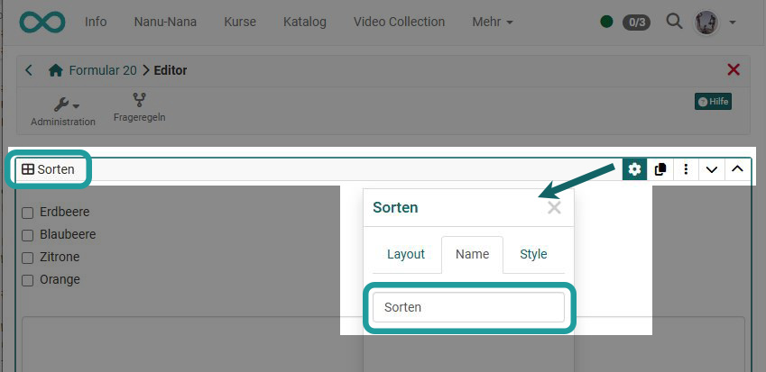
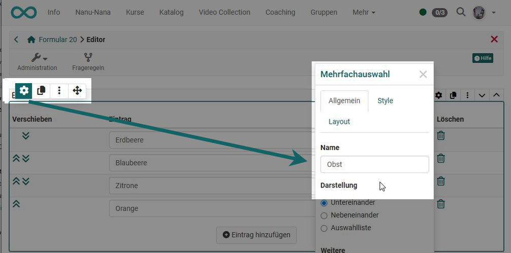
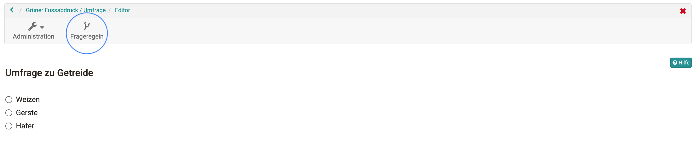
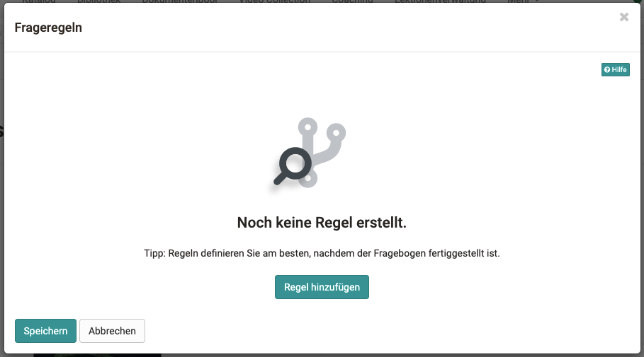
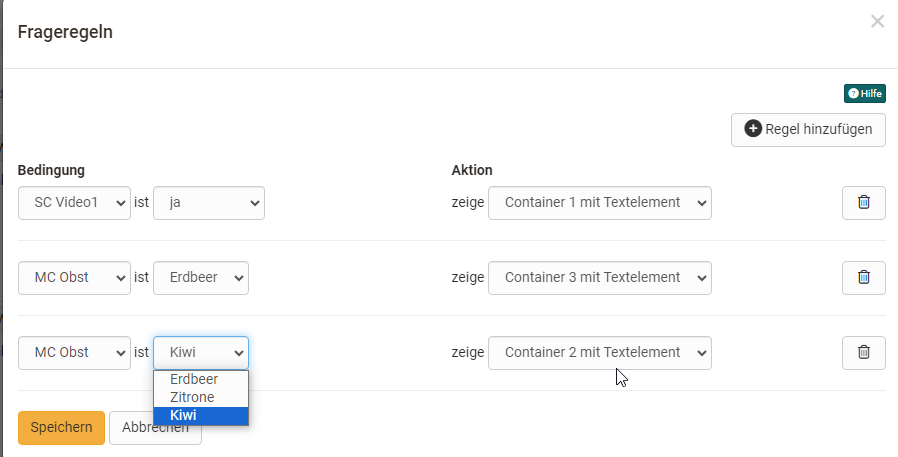

# Question rules in forms

Question rules can be used to set the display of layout areas depending on certain answers to the single or multiple choice (condition field). For example, a layout container with the respective elements is only displayed if the user has selected a certain predefined answer.

Currently it is only possible to display certain question containers. Thus, different question strings can be built.

## Creation of a rule

First think about which areas you want to display for which selection and then implement these using the question rules for the form.

### Requirements
To create a question rule, these conditions must have been met:

* Multiple selection/single selection with at least 1 answer.
* A container that has a different question module or content and not the question modules mentioned above.

If the conditions are not met, a warning will be issued and you will not be able to create a rule.

### Assign suitable names

To maintain an overview, it is important that you assign meaningful names to all layout and content elements that you need for the question rules. This is done via the inspector, which you can call up via the cogwheel symbol if it is not already visible.

Enter the name for a container layout element here:

{ class="shadow lightbox" }

To enter the name for a single or multiple selection element:

{ class="shadow lightbox" }

### Store question rules in the menu
The question rules can be accessed at the top, to the right of the administration menu.

{ class="shadow lightbox" }

A new pop-up window appears, allowing you to create and display questionnaires.

{ class="shadow lightbox" }
  
A question rule always consists of a condition with various options and an assigned action that is displayed. The condition is an MC or SC selection with the specific answer options. A layout container can then be selected for each answer option, e.g. containing specific information or further questions. Don't forget to save.

 { class="shadow lightbox" }
