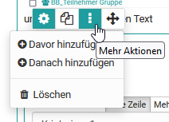
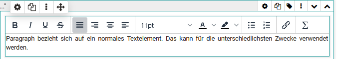
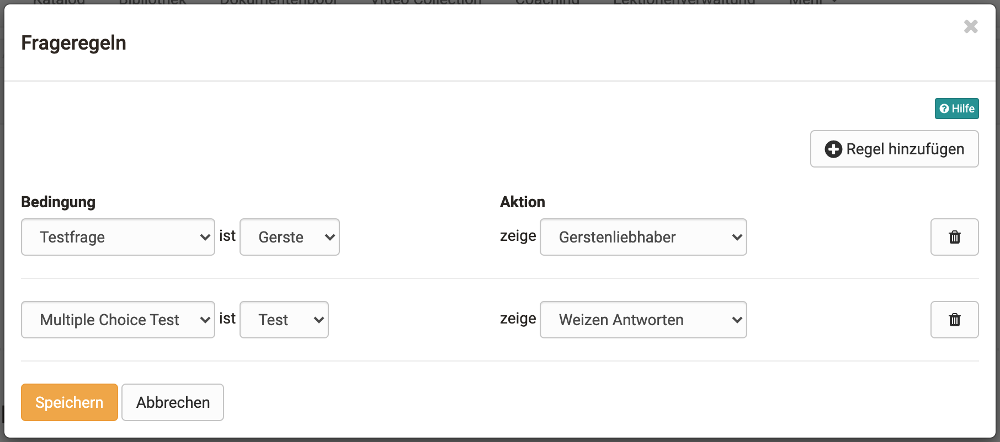

# Formular Editor

Wählen oder erstellen Sie eine Lernressource vom Typ "Formular". Klicken Sie dann in der Administration auf "Inhalt editieren". Es öffnet sich der Formular Editor. Hier können Sie ein oder mehrere Layouts wählen und den Bereichen  verschiedene Elemente hinzufügen. 

Über den Button "Inhalt hinzufügen" können sie jederzeit verschiedene Elemente hinzufügen. Sobald Sie ein Element erstellt haben, können Sie auch über die 3-Punkte Option über den Link davor/danach hinzufügen weitere Elemente passgenau hinzufügen. 

{ class="lightbox" }

Jedes Element kann auch dupliziert, per drag and drop verschoben oder gelöscht werden.

!!! info "Verfügbarkeit"

    Ab :octicons-tag-24: Release 17.1. ist dieser neugestaltete Formular Editor verfügbar. Er enthält konzeptionelle und UX Verbesserungen, um eine angenehmere Erstellung zu gewährleisten. Alte Formulare (erstellt mit 16.1.-17.0.X) können weiterhin geöffnet und bearbeitet werden. Wollen sie ein altes Formular mit neuem Inhalt befüllen, benutzen sie dafür die neuen Layouts.

## Bedienelemente und Blöcke des Formular Editors

* **Layoutmenü**: Hier kann eine Layout Vorlage ausgewählt, gewechselt, dupliziert, verschoben oder gelöscht werden. Ferner kann ein Name für das Layout-Element vergeben und weitere Layouts davor oder danach hinzugefügt werden.
* **Blockmenü** material-cog: Bezieht sich auf ein dem Layout hinzugefügtes Element z.B. einen "Paragraph" Text, eine "Einzelauswahl" usw. Sie können hier ein Element bzw. Block duplizieren, verschieben oder löschen sowie weitere Elemente davor oder danach hinzufügen.
* **Inspektor**: In dem rechts erscheinenden überlagernden Menü befinden sich alle Einstellungen, die den Funktionsumfang, sowie das Aussehen des jeweiligen Blocks oder Layouts verändern.

{ class="lightbox" }

### Layout

Ein Layout ist ein übergeordneter Block, der  unterschiedliche Strukturierungen des Inhalts durch Spalten und Zeilen ermöglicht. Innerhalb einer Spalte und Zeile können beliebig viele Blöcke hinzugefügt werden. Löschen oder verändern sie Layouts werden existierende Blöcke in die vorhandenen Spalten geschoben. 

Aktuell sind folgende Layoutvorlagen verfügbar:

### Inspektor

Die Einstellungen zu den jeweiligen Blöcken befinden sich im Inspektor. Auf grösseren Bildschirmen öffnet er sich standardmässig rechts neben dem selektierten Block. Man kann das Fenster mit Klick auf das Einstellungsicon :material-cog: anzeigen oder ausblenden.

Mit dem Klick auf der Titelzeile des Inspektorfensters kann dieser auch verschoben werden. Wenn sie einen neuen Block selektieren, springt der Inspektor wieder an die Standardposition.

## Titel

Einfügen von Überschriften und Formatierung mit h1 bis h6

{ class="shadow lightbox" }
  
## Paragraph

Hauptelement zum Hinzufügen von Textblöcken, auch für Fragestellungen. Das Paragraph Element beinhaltet zentrale Formatierungen sowie die Möglichkeit den Text auf Spalten zu verteilen.

{ class="shadow lightbox" }

## Tabelle

Fügen Sie bei Bedarf dem Formular eine Tabelle hinzu und konfigurieren Sie diese.

){ class="shadow lightbox" }

## Bild

Fügen Sie bei Bedarf dem Formular auch Bildelemente hinzu. Laden Sie dafür eine passende Grafikdatei hoch. 

{ class="shadow lightbox" }

## Rubrik

Für die Darstellung eines [Rubrik](Rubric.de.md) stehen drei unterschiedliche Typen zur Verfügung. "Diskret mit Radiobutton" und "Diskret mit Slider" funktionieren ähnlich wie Single-Choice Fragen und sind mit Punktwerten verknüpft. "Kontinuierlich" dagegen ermöglicht eine fließende Bewertung ohne Punkte. Anders als bei den anderen Fragetypen werden hier Fragen und Antworten über dasselbe Element organisiert.

){ class="shadow lightbox" }

Für Rubriken stehen diverse Einstellungsmöglichkeiten zur Verfügung, die Sie über das Zahnrad einblenden können. Weitere Infos zum Thema Rubrik finden Sie [hier](Rubric.de.md).

## Einzelauswahl

Erstellt eine Single-Choice Antwortskala. Die einzelnen Antworten können dabei nebeneinander, untereinander oder als Wahl Menü über die Option "Auswahlliste" dargestellt werden. Die Einträge können über die Pfeiltasten nach oben oder unten verschoben werden.

Im Bereich "Pflicht" kann man die Frage als obligatorisch oder freiwillig einstellen. Obligatorische Blöcke müssen ausgefüllt werden um das Formular absenden zu können.

Die Einzelauswahl kann auch als Basis (Bedingung) für die Frageregeln verwendet werden. Damit werden bestimmte Layouts und deren Inhalte in Abhängigkeit von der vom User gewählten Antwort angezeigt.

Wichtig, vergeben Sie einen sinnvollen Namen für das Element, so dass Sie bei den Frageregeln den Überblick behalten.

{ class="shadow lightbox" }

## Mehrfachauswahl

Erstellt eine Multiple-Choice Auswahlskala. Bei Bedarf können die User in die Liste auch eigene Ergänzungen eintragen. Die Reihenfolge der Antworten lässt sich über die Pfeile anpassen.

Im Bereich "Pflicht" kann man die Frage als obligatorisch oder freiwillig einstellen. Obligatorische Blöcke müssen ausgefüllt werden um das Formular absenden zu können.

Die Mehrfachauswahl kann auch als Basis (Bedingung) für die Frageregeln verwendet werden. Damit werden bestimmte Layouts und deren Inhalte in Abhängigkeit der vom User gewählten vorgegebenen Antwort angezeigt.

Wichtig, vergeben Sie einen sinnvollen Namen für das Element, so dass Sie bei den Frageregeln den Überblick behalten.

{ class="shadow lightbox" }

## Texteingabe

Mit der Texteingabe wird den Lernenden ein ein- oder mehrzeiliges Feld für die Texteingabe bereitgestellt. Auch eine Einschränkung auf Zahlen oder ein Datum ist möglich. Die Texteingabe kann für den User obligatorisch oder freiwillig sein (siehe Einzel- oder Mehrfachauswahl oben).

{ class="shadow lightbox" }

## Datei hochladen

Mit diesem Element erhalten die Lernenden die Möglichkeit Dateien hochzuladen. Eine Einstellung ob das Hochladen obligatorisch oder freiwillig erfolgt, ist ebenfalls gegeben (siehe Einzel- oder Mehrfachauswahl oben).

{ class="shadow lightbox" }
  
## Informationen

Mit dem Element Informationen können weitere userspezifische Informationen wie Name oder Alter abgefragt werden. Dabei kann eine der folgenden drei Varianten ausgewählt werden:

a) die Angaben sind freiwillig, User können bei Bedarf die Felder ausfüllen (optional)

b) die Angaben müssen vom Benutzer verpflichtend ausgefüllt werden sonst wird das Formular nicht gespeichert (obligatorisch)

c) die Angaben werden automatisch übertragen und könnten nicht geändert werden(automatisch obligatorisch)

Nutzt man das Formular im Rahmen des Kursbaustein "Umfrage" kann eine Befragung  ihre Anonymität verlieren.

{ class="shadow lightbox" }

## Nutzungsbedingungen

Mit diesem Element kann dem Formular eine Einverständniserklärung hinzugefügt werden, die von den Usern abgehakt werden muss, ansonsten ist nur ein zwischenspeichern aber keine Abgabe des Formulars möglich.

{ class="shadow lightbox" }

Ferner kann noch eine Trennlinie (Separator) hinzugefügt werden.

## Frageregeln

Mit Frageregeln kann die Anzeige von Layout-Bereichen in Abhängigkeit von bestimmten Antworten der Einzel- oder Mehrfachwahl (Bedingungsfeld) gesetzt werden. So wird ein Layout-Container mit den jeweiligen Elementen nur dann angezeigt, wenn der User eine bestimmte vorgegebene Antwort ausgewählt hat.

Einem Formular können mehrere Regeln hinzugefügt werden.

{ class="shadow lightbox" }

## Tipps zur Nutzung des Formular Editors

Hier noch ein paar Tipps zur Verwendung des Formular Editors:

* Bei der Wahl "Rubrik" werden die Fragen und Antworten zusammen erstellt. Bei allen anderen Fragetypen werden die Fragen mit Hilfe des Elements "Paragraph" erstellt und den Antworten des passenden Fragetyps zugeordnet.
* Über "Eintrag hinzufügen" können Sie bei der Einzel- bzw. Mehrfachauswahl weitere Antwortelemente ergänzen.
* Fügen Sie neben den Fragen bei Bedarf auch weitere Elemente z.B. "Nutzungsbedingungen" oder "Informationen" hinzu.
* Vergessen Sie nicht den Blöcken Namen zu hinterlegen wenn Sie eine selektive Freigabe per Frageregeln erstellen wollen.

