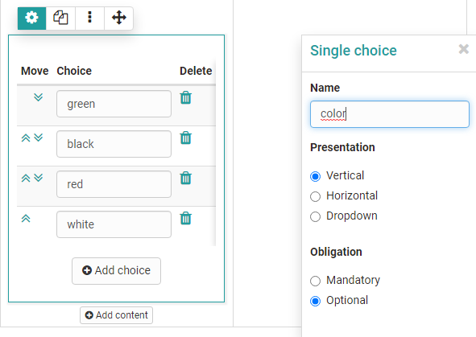
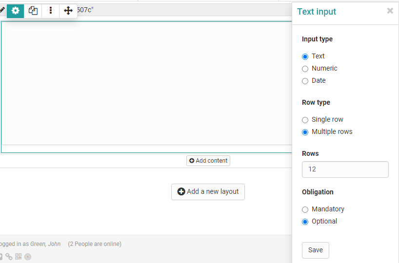

# Form editor

Select or create a learning resource of the type "Form" and click on "Edit content" in the administration. The editor opens. Here you can select one or more layouts and add various elements to the areas.

You can add various elements at any time using the "Add content" button and then configure them further. The creation of a new form always begins with the creation of a "layout" that reflects the page structure.

!!! info "Availability"

    As of :octicons-tag-24: release 17.1. this redesigned form editor is available. It contains conceptual and UX improvements to ensure a more pleasant creation. Old forms (created with 16.1.-17.0.X) can still be opened and edited. If you want to fill an old form with new content, use the new layouts for that.

## Controls and blocks of the form editor

* **Layout menu**: Here, you can set all the template for the layout, add layouts on top and bottom and move the layout in position or order. You can also assign a name for the layout element and add further layouts before or after it.
* **Block Menu** :material-cog: 
Refers to an element added to the layout, e.g. a "paragraph" of text, a "single selection", etc. You can duplicate, move or delete an element or block here, as well as add other elements before or after it.
* **Inspector**: In the overlaying menu that appears on the right there are all the settings that change the functionality, as well as the appearance of the particular block or layout.

{ class="lightbox" }

### Layout menu

A layout is a higher-level block that allows you to structure the content in different ways using columns and rows. Within a column and row you can add as many blocks as you want. If you delete or change layouts, existing blocks will be moved to the existing columns. If they are not

Currently the following layout templates are available:

### Inspector

The settings for each block are located in the Inspector. On larger screens it opens by default to the right of the selected block. You can show and hide the window by clicking on the :material-cog: settings icon.

By clicking on the title bar of the inspector window you can also move it around the content space. When you select a new block, the inspector jumps back to the default position.

## Block elements

### Title

Inserting headings and formatting with h1 to h6.

{ class="shadow lightbox" }

### Paragraph

Main element for adding text blocks, also for questions. The paragraph element contains central formatting and the possibility to distribute the text in columns.

{ class="shadow lightbox" }
  
### Table

If required, add a table to the form and configure it.

{ class="shadow lightbox" }
  
### Image

If necessary, add image elements to the form. To do this, upload a suitable graphic file. 

{ class="shadow lightbox" }

The positioning can also be further optimized by using the container element.  
  
### Rubric

Three different types are available for displaying a [rubric](Rubric.md). "Discrete with radio button" and "Discrete with slider" function similarly to single-choice questions and are linked to point values. "Continuous", on the other hand, allows for fluent scoring without points. Unlike the other question types, here questions and answers are organized using the same element.

{ class="shadow lightbox" }

For Rubrics, there are various setting options available that you can show via the cogwheel. 
Further information can be found [here](Rubric.md).
  
### Single choice

Creates a single choice answer scale. The individual answers can be displayed next to each other, below each other or as a selection menu via the option "Selection list". The entries can be moved up or down using the arrow keys.

Under "Obligation", one can set the question as obligatory or optional. Mandatory blocks must be filled in to submit the form.

The single choice question can also be used as a basis (condition) for the question rules. This way, certain containers and their contents are displayed depending on the answer selected by the user.

Give the element a meaningful name so that you can keep track of the question rules.

{ class="shadow lightbox" }

### Multiple choice

Creates a multiple choice selection scale. If necessary, participants can add additional items to the list. The order of the individual choices can be changed using the arrows.

Under "Obligation", one can set the question as obligatory or optional. Mandatory blocks must be filled in to submit the form.

The multiple choice can also be used as a basis (condition) for the question rules. This way, certain containers and their contents are displayed depending on the predefined answer selected by the user.

Give the element a meaningful name so that you can keep track of the question rules.

{ class="shadow lightbox" }
  
### Text input

The text input provides the learner with a single or multiline field for text input. Restriction to numbers or a date is also possible. The text input can be obligatory or optional (see single and multiple choice above).

{ class="shadow lightbox" }
  
## Upload file

This element gives learners the ability to upload files. The Upload can be obligatory or optional (see single or multiple selection above).

{ class="shadow lightbox" }
  
### Information

The Information element can be used to query further user-specific information such as name or age. 

One of the following three variants can be selected:

a) the information is voluntary, users can fill in the fields if necessary (optional)

b) the data must be filled in by the user, otherwise the form will not be saved (mandatory)

c) the data is transferred automatically and cannot be changed (automatically obligatory).

If the form is used in the context of the course element "Survey", a survey can lose its anonymity.

{ class="shadow lightbox" }

### Terms of use

With this element the coach can add a declaration of consent to the form, which must be checked off by the users, otherwise only an intermediate storage is possible but no delivery of the form.

{ class="shadow lightbox" }

A separator can also be added.
  

## Tips for using the Form Editor

Here are a few more tips for using the Form Editor:

* For the "Rubric" choice, the questions and answers are created together. For all other question types, the questions are created using the "Paragraph" element and assigned to the answers of the appropriate question type.
* Use "Add entry" to add additional answer elements for single or multiple choice.
* Do not forget to assign names to the blocks if you want to create a selective release via question rules.
* Use [Question rules](../learningresources/Question_rules.md) if you want to create more complex forms with branches.

