# Form editor (Questionnaire editor)

!!! info "Hinweis"

    OpenOlat Version 17.1 extensively changed the form editor. You can find information on the current form editor [here](Form_editor_Questionnaire_editor.md). 

    The following explanations refer to the previous form editor.

Select or create a learning resource of the type "Form" and click on "Edit content" in the administration. The editor opens and various options are available via the button "Add content".

As soon as you have created an element, you can also use the plus sign to add further elements above or below an element. Each element can also be duplicated, moved by drag and drop or deleted.

## Title

Inserting headings and formatting with h1 to h6.

{ class="shadow lightbox" }

## Paragraph

Main element for adding text blocks, also for questions. The paragraph element contains central formatting and the possibility to distribute the text in columns.

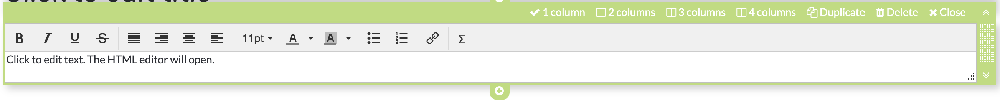{ class="shadow lightbox" }
  
## Table

If required, add a table to the form and configure it.

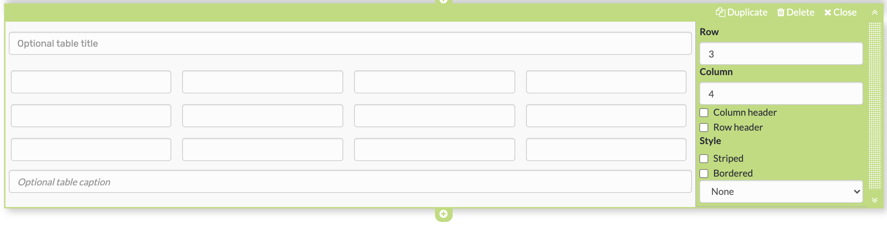{ class="shadow lightbox" }
  
## Image

If necessary, add image elements to the form. To do this, upload a suitable graphic file. Then you can further configure the file, e.g. place a title or subtitle and also define the size, placement or border.

The positioning can also be further optimized by using the container element. 

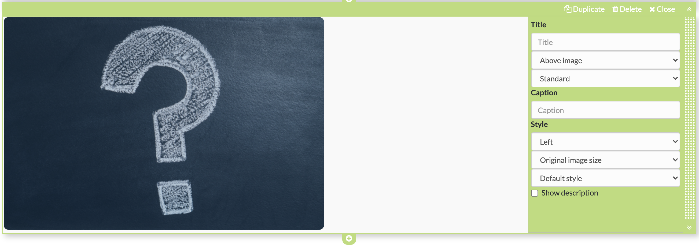{ class="shadow lightbox" }
  
## Rubric

Three different types are available for displaying a [rubric](Rubric.md). As with Single choice questions, the evaluations can relate to only one aspect or be continuous. Unlike the other question types, questions and answers are organized using the same element.

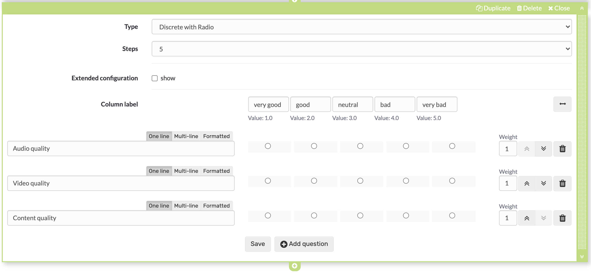{ class="shadow lightbox" }

Further information can be found [here](Rubric.md).
  
## Single choice

Creates a single choice answer scale. The individual answers can be displayed next to each other, below each other or as a selection menu via the option "Selection list". The entries can be moved up or down using the arrow keys.

Under "Obligation", one can set the question as obligatory or optional.

The single choice question can also be used as a basis (condition) for the question rules. This way, certain containers and their contents are displayed depending on the answer selected by the user.

Give the element a meaningful name so that you can keep track of the question rules.

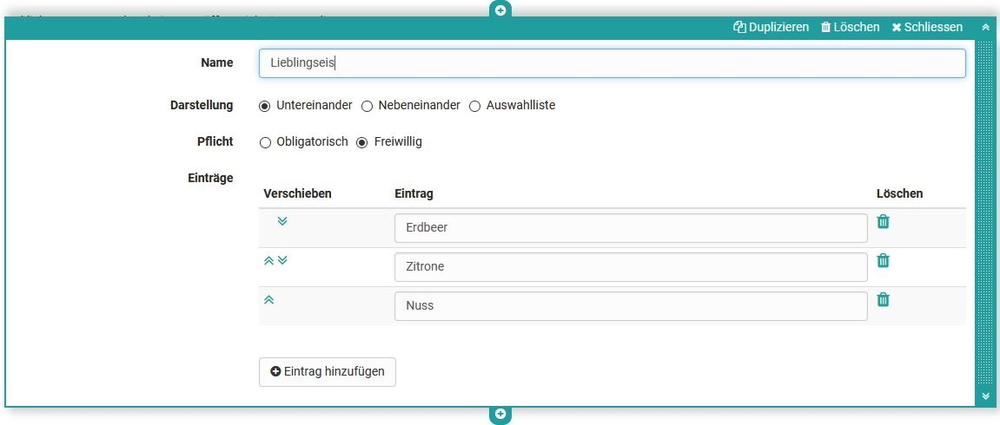{ class="shadow lightbox" }

## Multiple choice

Creates a multiple choice selection scale. If necessary, participants can add additional items to the list. The order of the individual choices can be changed using the arrows.

Under "Obligation", one can set the question as obligatory or optional.

The multiple choice can also be used as a basis (condition) for the question rules. This way, certain containers and their contents are displayed depending on the predefined answer selected by the user.

Give the element a meaningful name so that you can keep track of the question rules.

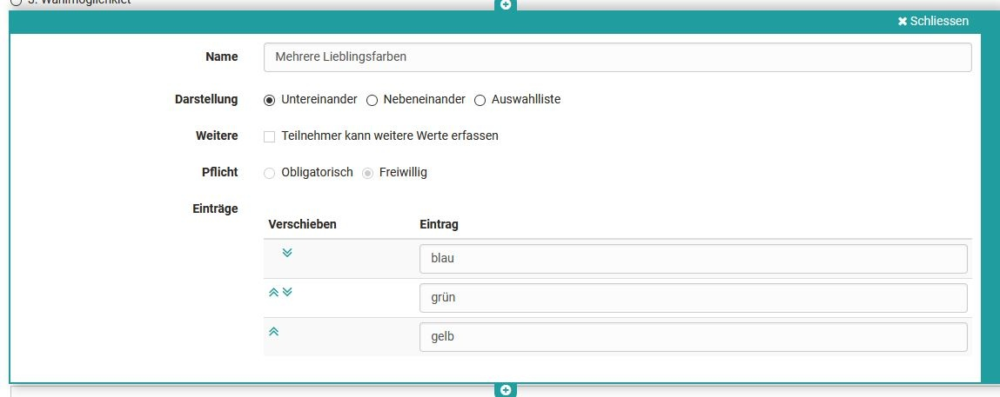{ class="shadow lightbox" }
  
## Text input

The text input provides the learner with a single or multiline field for text input. The text input can be obligatory or optional.

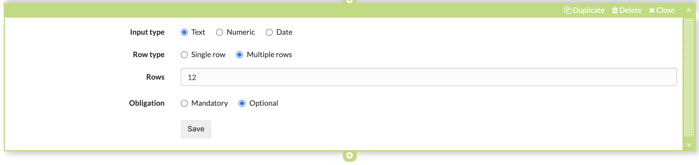{ class="shadow lightbox" }
  
## Upload file

This element gives learners the ability to upload files. The Upload can be obligatory or optional.

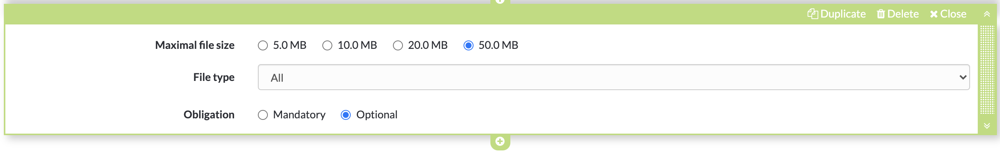{ class="shadow lightbox" }
  
## Information

The Information element can be used to query further user-specific information such as name or age. One of the following three variants can be selected:

a) the information is voluntary (optional)
b) the information must be completed by the user (mandatory)
c) the information is transferred automatically (automatically mandatory)

This information causes the questionnaire to lose its anonymity.

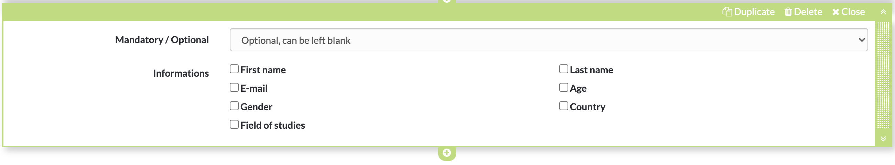{ class="shadow lightbox" }

## Terms of use

With this element the coach can add a declaration of consent to the form, which must be checked off by the users, otherwise only an intermediate storage is possible but no delivery of the questionnaire.

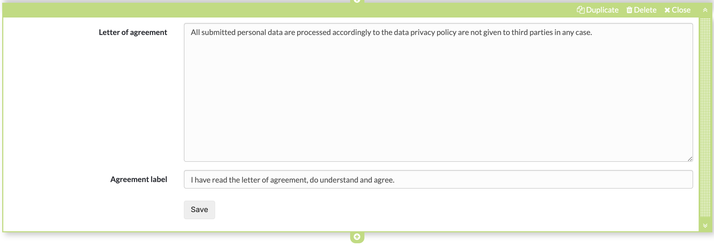{ class="shadow lightbox" }
  
## Container

You can use containers to further structure forms. A 1-4 column layout is available. Nesting within a container field is also possible.

Furthermore, containers can be used as collection elements and basis for the question rules (branching scenario).

Containers without content are not displayed.

## Seperator

Separation line for structuring areas

{ class="shadow lightbox" }
  
## Question rules

(Branching - Working Title)

With question rules, the display of containers can be made dependent on certain answers of the single or multiple choice (condition field). Thus, a container with the respective elements is only displayed if the user has selected a certain predefined answer.

Several rules can be added to a form.

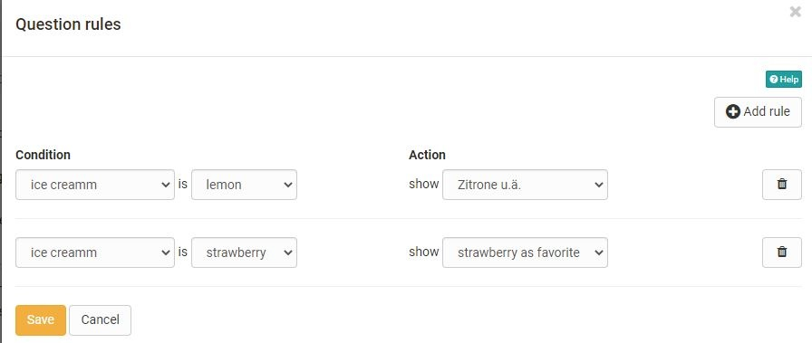{ class="shadow lightbox" }

## Tips for using the Form Editor

Here are a few more tips for using the Form Editor:

* For the "Rubric" choice, the questions and answers are created together.
* For all other question types, the questions are created using the "Paragraph" element and assigned to the answers of the appropriate question type.
* Use "Add entry" to add additional answer elements for single or multiple choice.
* In addition to the questions, add further elements if required, e.g. "Terms of use" or "Information".
* With the element "Container" you can create a multi-column design.