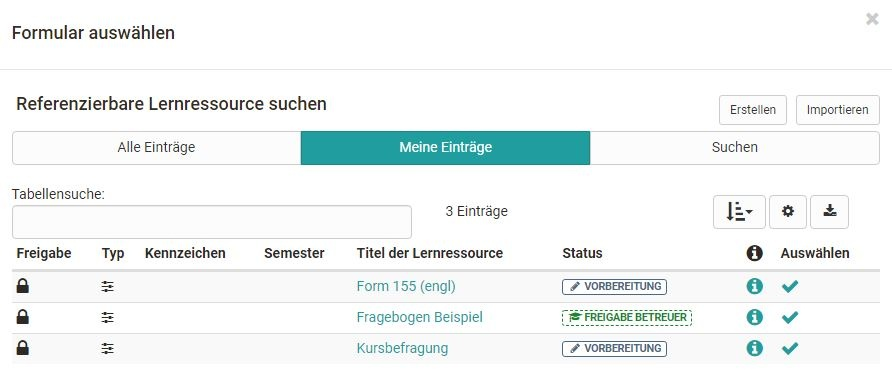

# Forms in forms element

Forms can be integrated into an OpenOlat course using the course element Form. How to create forms and integrate them into courses can be found [here](../forms/Three_Steps_to_your_Form.md).

After you have added the course element Form to your course, the following tabs will be available in the course editor:

{ class="shadow lightbox" }

In the tab "Title and description" as well as "Layout" general descriptions and information about the respective course element can be stored and the visual presentation can be defined. In the [tab learning path](../learningresources/Learning_path_course_Course_editor.md) special settings are defined, which are valid for learning path courses. Conventional courses, on the other hand, have the Visibility and Access tabs. Here you define who can see or edit this course element.

## Tab Form in the course editor

The central configuration is done in the tab "Form". The first step is to either create a new form or select an existing one.

{ class="shadow lightbox" }

After clicking on the button, all forms where you are the owner are displayed and can be selected simply by clicking on the checkmark.

{ class="shadow lightbox" }

If you have not yet created a form, you can create a new learning resource form using the "Create" button or add an externally existing form using the "Import" button. Afterwards, the just created or imported form also appears in the list and can be selected.

A newly created form does not yet contain any elements, questions or text fields. These have to be added in the course via "Edit" or alternatively directly in the learning resource in the [Form Editor](../learningresources/Form_editor_Questionnaire_editor.md).

If a form is created in the course editor, a new learning resource Form will be created automatically, which can also be found in the [Authoring Area](../area_modules/Authoring.md) under "My entries" and can be included in further courses and course elements.

!!! info "Note"

    After a form has been selected it can be designed via the link "Edit". If the form has already been configured appropriately, editing is no longer necessary.

{ class="shadow lightbox" }

In addition, you can define in the tab until when the form can be filled out by the learners. For this purpose, a fixed or a relative date can be used, e.g. x days after the first course visit. As soon as an end date is defined, the tab "[Reminders](../learningresources/Course_Reminders.md)" is also activated. For example, you could create a reminder that reminds learners to fill out the form a few days before the submission deadline. 

If e-mail confirmation is enabled, participants will receive a confirmation email and the form they completed as a PDF attachment. In addition, e-mail confirmations can also be sent to owners, coaches and external parties. 

!!! warning "Attention"

    Once a form has been viewed by at least one participant, it cannot be replaced or edited.

## View when course editor is closed

### For owners and coaches

When the course editor is closed, owners and tutors will see an overview of learners in the course and their editing status, e.g. "Not started". The filter function can also be used to display a specific group of people, e.g. all people who have not yet started the form. However, owners and supervisors do not see the actual form here. It is also possible to export the form data.

Owners also have the option of resetting the data of individual persons or all data and also have the "Reminders" tab if the form submission has a deadline. Here they can create new reminders and see which [Reminders](../learningresources/Course_Reminders.md) have already been sent.

{ class="shadow lightbox" }

### For participants

Participants, on the other hand, are shown the concrete form directly when they click on it and can fill it out. Caching is also possible.

{ class="shadow lightbox" }

The completed form must finally be saved and can then no longer be edited by the user, only displayed.
