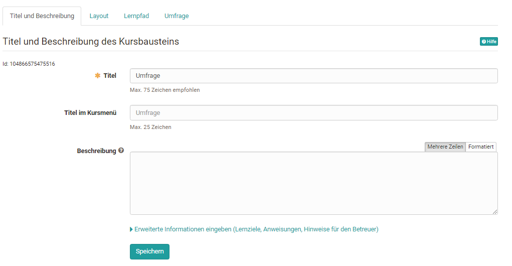
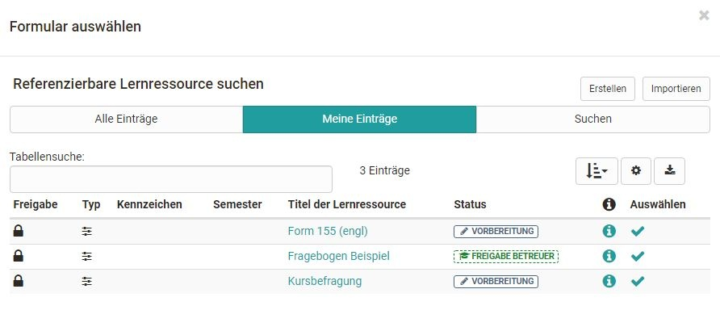
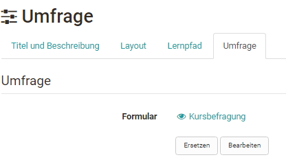
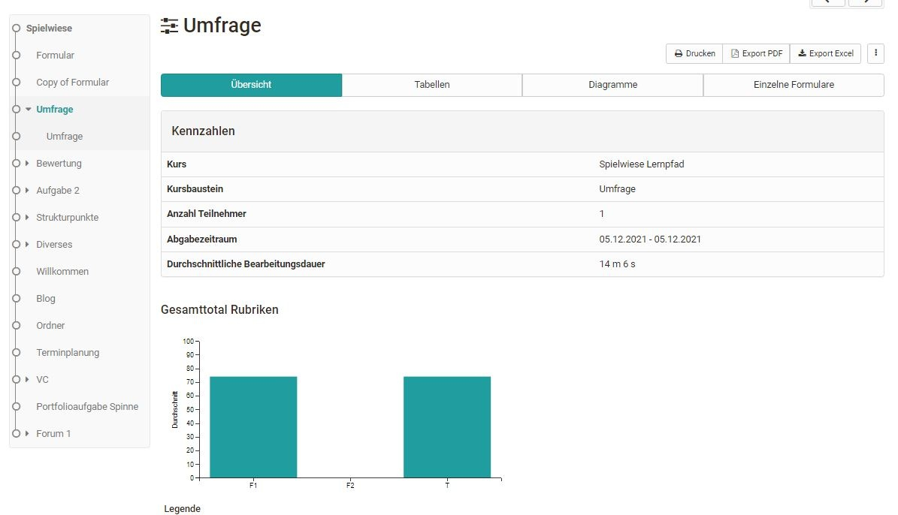
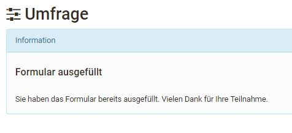
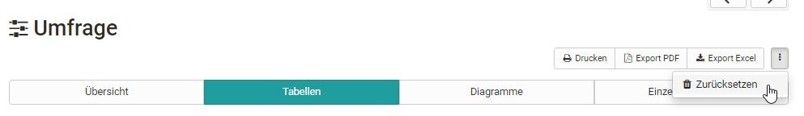

# Form in surveys

The learning resource Form is used in the course element "Survey" in the form of a questionnaire. Course owners can thus include questionnaires in their course, and learners can complete the surveys provided. The results are displayed to course owners and coaches accordingly.

OpenOlat ensures that participants can only fill out the survey or questionnaire once. By default, the results are stored anonymously. However, personalization is possible by selecting the appropriate form elements in the [Form Editor](../learningresources/Form_Editor.md).

You can learn how to create forms and integrate them into courses [here](../forms/Three_Steps_to_your_Form.md).

## In the course editor

Go to the course editor and add the course element Survey. After you have added the course element Survey to the course, the following tabs will be available in the course editor:

{ class="shadow lightbox" }

In the tab "Title and description" and "Layout", general descriptions and information about the respective course element can be stored, and the visual presentation can be defined. In the [tab Learning path](../learningresources/Learning_path_course_Course_editor.md), special settings that apply to learning path courses are defined, e.g. the completion criterion "Survey participated" can be selected.

Conventional courses, on the other hand, have the tabs "Visibility" and "Access". Here you define who can see or edit this course element.

## Tab Survey in the course editor

The central configuration is done in the tab "Survey". In the first step, you can either create a new form or select an existing one. In the overview that appears, all forms for which you are the owner are displayed and can be selected simply by clicking on the checkmark and thus added to the course.

{ class="shadow lightbox" }

If you have not yet created a form, a new learning resource Form can be created via the "Create" button, or an external form can be imported. Afterwards, the newly created or imported form will also appear in the list and can be selected.

A newly created form does not yet contain any elements, questions or text fields. These have to be added in the course via "Edit", or alternatively directly in the learning resource in the [Form Editor](../learningresources/Form_Editor.md).

If a form is created directly in the course editor, a new learning resource Form is automatically created, which can also be found in [Authoring](../area_modules/Authoring.md) under "My entries" and can be included in further courses.

After a form has been selected, it can be designed via the link "Edit". If the form has already been set up appropriately, editing it is no longer necessary.

{ class="shadow lightbox" }

Then you can define who can fill in the survey and who can see the results of the survey. The following options can be selected in each case:

* the owners of the course
* the coaches of the course
* the participants of the course: all people who are enrolled in the course in the role "Participant"
* guests: persons without an OpenOlat account

If the advanced configuration is activated, further settings can be made: for example, certain periods of participation can be defined for certain roles, and participation can be restricted to certain groups.

The results can also be released for all these groups and linked with a start and end date in the advanced configuration.

!!! tip "Release the course for the respective group of people"

    However, a prerequisite for editing the survey is that the entire course is also released for the respective group of people. So, for example, if a survey should also be fillable by external persons (guests), the course must also be released for guests in the menu "Settings" > [Release](../learningresources/Access_configuration.md) "open without booking".

If a form is included as a survey in a course, the form can be changed in a limited way in the course via the "Edit" button. Texts can be changed, but individual blocks can no longer be moved, and no new areas can be created or deleted. In the form, the message "The resource is already used..." appears.

!!! warning "Form can no longer be replaced after first viewing"

    Once a form has been viewed by at least one participant, it can no longer be replaced. The button "Replace" is then omitted.

## View with closed course editor

What owners, coaches and participants see when the editor is closed depends on which user permissions have been selected in the tab Survey. If the respective group of people has the right to fill in the questionnaire (participation by...), they will see the respective questionnaire first. As soon as the person has filled out the questionnaire, the survey statistics overview appears directly at the respective course element Survey, as long as the results are also visible for the user group.

{ class="shadow lightbox" }

If a group of people (e.g. learners) is authorized to fill out the survey but not authorized to see the results, the following message appears after completion:

{ class="shadow lightbox" }

The survey can be filled out only once and cannot be changed after it has been submitted. The person sees a corresponding message. If the questionnaire is not to be submitted directly, the option "Save temporarily" can be used.

If a group of people is neither authorized to fill in the questionnaire nor to see the results, the message "no access" appears.

## Viewing the results of a survey

The following evaluation tabs are available to authorized persons:

**Overview**: Here you can see how many people have filled out the questionnaire, the submission period, and the processing time. Depending on the question type, other key figures are also listed.

**Tables**: Here you can see the individual questions and answers as well as further statistical evaluations for rubrics. Free texts can also be downloaded as an Excel table.

**Diagrams**: In the tab Diagrams, you can see a graphical representation of the individual questions.

**Individual Forms**: Here you have access to all completed, anonymous questionnaires of individual persons.

Furthermore, the contents of all 4 tabs can also be printed or downloaded as an Excel table or as a PDF version.

The same evaluation can be found in the menu `Administration > Survey Statistics`.

The results can also be saved via the menu "[Data archiving](../learningresources/Course_Archiving.md)" > "Surveys". This is the same file as under "Export" in the course run.

### Reset surveys

Course owners can also reset already completed questionnaires via the link "Reset" in the 3-point menu of the respective course element. In this case, all questionnaires already submitted for this survey are deleted. It is not possible to reset individual questionnaires because they are submitted anonymously.

{ class="shadow lightbox" }

## Further information {: #further_information}

[Form Editor >](../learningresources/Form_Editor.md) 
[Three steps to your form >](../forms/Three_Steps_to_your_Form.md) 
[Learning path course - Course editor >](../learningresources/Learning_path_course_Course_editor.md) 
[Authoring - Overview >](../area_modules/Authoring.md) 
[Access configuration >](../learningresources/Access_configuration.md) 
[Course administration - Archiving & Reports >](../learningresources/Course_Archiving.md)

[To the top of the page ^](#form-in-surveys)
