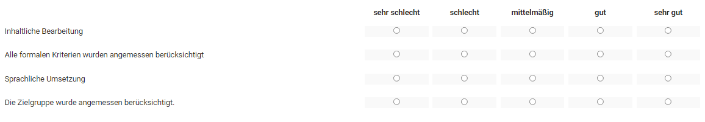

# Formular als Rubrik Bewertung

Die Lernressource Formular, insbesondere das dort integrierte [Rubrik](Rubric.de.md) Element eignet sich optimal für eine kriterienbasierte Bewertung von Leistungen. Dafür wird ein zuvor erstelltes Formular mit einem Rubrik Element in den Kursbaustein "Bewertung" eines Kurses eingebaut.

!!! info "Hinweis"

    Auch Bewertungen im Rahmen eines Peer-Reviews werden mit Rubrik-Formularen ausgeführt. Dazu benötigt es den [Kursbaustein Aufgabe](../learningresources/Course_Element_Task.de.md#coach_peer_review).

## Im Kurseditor

Gehen Sie in den Kurseditor und fügen Sie den [Kursbaustein "Bewertung"](../learningresources/Course_Element_Assessment.de.md) hinzu. Aktivieren Sie anschliessend den Tab "Bewertung" des Kursbausteins und setzen Sie den Haken bei "Rubrik-Bewertung".

{ class="shadow lightbox" }

Im nächsten Schritt können sie ein passendes Rubrik-Formular auswählen oder erstellen.

{ class="shadow lightbox" }

Die Basis des Rubriks ist die Lernressource Formular der im [Formular-Editor](Form_editor_Questionnaire_editor.de.md) ein Rubrik Element hinzugefügt wurde.

In der erscheinenden Übersicht werden alle Formulare, bei denen Sie Besitzer sind, angezeigt. Das gewünschte Formular mit dem Bewertungsrubrik kann einfach per Klick auf den Haken ausgewählt und so dem Kurs hinzugefügt werden.

Hat man noch kein Formular erstellt, kann auch eine neue Lernressource Formular über den Button "Erstellen" angelegt oder ein extern vorliegendes Formular importiert werden. Anschliessend erscheint das gerade angelegte oder importierte Formular ebenfalls in der Liste und kann ausgewählt werden.

Ein neu erstelltes Formular beinhaltet zunächst noch kein Rubrik Element. Dieses muss im Kurs über "Bearbeiten" oder alternativ direkt in der Lernressource im [Formular Editor](Form_editor_Questionnaire_editor.de.md) hinzugefügt werden.

Wenn ein Formular direkt im Kurseditor erstellt wird, wird automatisch eine neue Lernressource Formular angelegt, die auch im [Autorenbereich](../area_modules/Authoring.de.md) unter "Meine Einträge" zu finden ist und in weiteren Kursen eingebunden werden kann.

Nachdem ein Formular (mit Rubrik) ausgewählt wurde kann es über den Link "Bearbeiten" gestaltet werden. Wurde das Formular schon vorher passend eingerichtet ist eine Bearbeitung nicht mehr notwendig.

### Bewertungsrubrik Beispiel

So könnte ein Bewertungsrubrik aussehen:

{ class="shadow lightbox" }

#### Rubrik Bewertung konfigurieren

Nachdem ein Rubrik mit der Bewertung verknüpft wurde können im Tab "Bewertung" folgende weitere Konfigurationen vorgenommen werden:

**Status "Korrigieren" setzen, wenn Zugriff gewährt**: Wird der Haken gesetzt erscheint bei geschlossenem Editor für Besitzer und Betreuer unter Status die Anzeige "Korrigieren". Den Teilnehmenden wird passend dazu "In Korrektur" angezeigt. Ist der Haken nicht gesetzt, sieht der User "Keine Angabe" und den Lehrenden wird der Status "Nicht gestartet" oder "Bewertet" angezeigt, je nachdem ob eine Bewertung schon vorgenommen wurde oder nicht.  
  
**Punkte vergeben**: Punkte können, sofern aktiviert, automatisch oder manuell vergeben werden. Automatische Punkte können als Summe oder Durchschnitt aus dem Rubrik übernommen werden. Die minimalen und maximalen Punkte werden angezeigt bzw. können bei manueller Bewertung eingetragen werden.

**Bewertung mit Einstufung/Noten**: Sofern Punkte vergeben werden können diese auch mit einer Einstufung/Noten verbunden werden. Die Zuweisung kann Manuell oder automatisch erfolgen. Ferner muss eine Bewertungsskala ausgewählt werden. Weitere Infos finden Sie [hier](../learningresources/Assessment_translate_points_in_grades.de.md). 

**Bestanden/Nicht bestanden ausgeben**:  Sofern ein bestanden angezeigt werden soll kann definiert werden ob die Anzeige automatisch basierend auf einer Punkteschwelle erfolgen soll oder ob ein bestanden manuell gesetzt werden soll.

!!! Info

    Wenn Einstufung/Noten ausgewählt wurde ist hier bereits enthalten ob die Skala mit einem Bestehen kombiniert ist oder nicht. Eine separate Auswahl ist dann nicht mehr möglich. 

**Bei Kurs-Bewertung ausschliessen**: Ist der Haken gesetzt, wird die Bewertung des Kursbausteins nicht beim [Bestehen](../learningresources/Course_Settings.de.md) des Kurses berücksichtigt. 

**Individueller Kommentar**: Wenn aktiviert, kann ein individueller Kommentar zur (Rubrik-)Bewertung hinterlassen werden z.B. eine Bewertung oder ein Punktabzug näher erläutert werden.

**Individuelle Bewertungsdokumente**: Wenn aktiviert, können ergänzend zur (Rubrik-)Bewertung weitere, individuelle Dokumente dem Lerner zur Verfügung gestellt werden.

**Hinweise für Benutzer:innen**: Allgemeine Informationen zur Bewertung des Kursbausteins für alle Lernenden. Erläutern sie eventuell näher die Kategorien des Rubriks.  

**Hinweise für alle Betreuer:innen**: Hier können Hinweise für Betreuende hinterlegt werden, z.B. was bei der Bewertung der Rubrik-Kategorien wichtig und zu beachten ist. Die Teilnehmenden sehen die Hinweise nicht.
  
Weitere Informationen zum Kursbaustein Bewertung finden Sie [hier](../learningresources/Course_Element_Assessment.de.md).

### Rubrik-Bewertung vornehmen

Die eigentliche Bewertung der Lernenden erfolgt dann bei geschlossenem Kurs-Editor im Kursrun direkt beim gewünschten Kursbaustein oder im Bewertungswerkzeug.

{ class="shadow lightbox" }

Wählen Sie hierfür die zu bewertende Person aus der Liste aus und markieren Sie einfach die gewünschten Ausprägungen. Sofern aktiviert werden die Punkte aus der Rubrikbewertung automatisch übernommen und führen so schnell zu einer Kriterien basierten, transparenten Bewertung.

