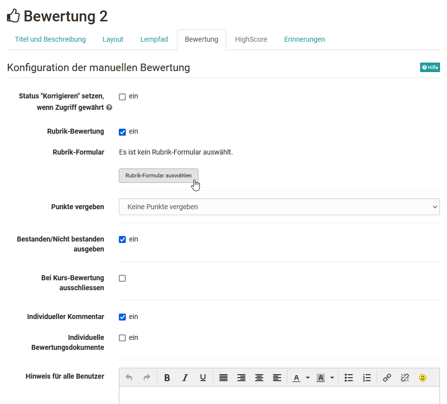

# Forms in Rubric Scoring

The learning resource Form, especially the [rubric](Rubric.md) element integrated there, is ideally suited for a criteria-based assessment of achievements. For this purpose, a previously created form with a rubric element is integrated into the course element "Assessment" of a course.

## In the course editor

Go to the course editor and add the [course element "Assessment"](../learningresources/Course_Element_Assessment.md). Then go to the "Assessment" tab and activate the "Rubric assessment".

{ class="shadow lightbox" }

In the next step they can select or create a suitable rubric form.

{ class="shadow lightbox" }

The basis of the rubric is the learning resource form to which a rubric element has been added in the [form editor](Form_editor_Questionnaire_editor.md).

In the overview that appears, all forms for which you are the owner are displayed. The desired form with the assessment rubric can be selected simply by clicking on the checkmark and thus added to the course.

If you have not yet created a form, you can also create a new learning resource form by clicking the button "Create" or import an existing external form. Afterwards, the just created or imported form will also appear in the list and can be selected.

A newly created form does not yet contain a rubric element. This has to be added in the course via "Edit" or alternatively directly in the learning resource in the [Form Editor](Form_editor_Questionnaire_editor.md).

If a form is created directly in the course editor, a new learning resource Form will be created automatically, which can also be found in the [Authoring Area](../area_modules/Authoring.md)under "My entries" and can be included in further courses.

After a form has been selected it can be designed via the link "Edit". If the form has already been set up appropriately, it is no longer necessary to edit it.

### Evaluation rubric example

This is how a rating rubric could look like:

{ class="shadow lightbox" }

#### Configure rubric assessment

After a rubric has been linked to the assessment, the following additional configurations can be made in the "Assessment" tab:

**Set status "To review" if accessible** : If the checkmark is set, the display "Correct" appears under status for owners and supervisors when the editor is closed. The participants will see "In correction". If the check mark is not set, the user will see "No indication" and the teachers will see the status "Not started" or "Assessed", depending on whether an assessment has already been made or not.  
  
**Score granted**: Points can be awarded automatically or manually, if enabled. Automatic points can be taken as sum or average. Die minimalen und maximalen Punkte werden angezeigt bzw. können bei manueller Bewertung eingetragen werden.

**Levels/Grading**: Sofern Punkte vergeben werden können diese auch mit einer Einstufung/Noten verbunden werden. Die Zuweisung kann Manuell oder automatisch erfolgen. Ferner muss eine Bewertungsskala ausgewählt werden. Weitere Infos finden Sie [hier](../learningresources/Assessment_translate_points_in_grades.md). 

**Display pass/not passed**: If a pass is to be displayed, you can define whether the display should be automatic based on a point threshold or whether a pass should be set manually.

!!! Info

    Wenn Einstufung/Noten ausgewählt wurde ist hier bereits enthalten ob die Skala mit einem Bestehen kombiniert ist oder nicht. Eine separate Auswahl ist dann nicht mehr möglich. 

**Ignore in course assessment**: If checked, the evaluation will not be taken into account when [passing the course](../learningresources/Course_Settings.md). 

**Individual comment** : If activated, an individual comment can be left on the rubric assessment e.g. an assessment can be explained in more detail.

**Individual assessment documents**: If activated, additional documents can be provided individually in addition to the rubric rating.

**Notice for all users**: Allgemeine Informationen zur Bewertung des Kursbausteins für alle Lernenden. Erläutern sie eventuell näher die Kategorien des Rubriks.  

**Notice for coaches**: Notes for supervisors can be left here  z.B. was bei der Bewertung der Rubrik-Kategorien wichtig und zu beachten ist.  Participants will not see the notes.

Further information on the course element Assessment can be found [here](../learningresources/Course_Element_Assessment.md).

### Carry out rubric assessment

The actual assessment of learners will then take place in course run directly at the desired course element or in the assessment tool when the course editor is closed.

{ class="shadow lightbox" }

To do this, select the person to be assessed from the list and simply mark the desired points. If activated, the points from the rubric rating are automatically taken over and thus quickly lead to a criteria-based, transparent rating.

{ class="shadow lightbox" }
