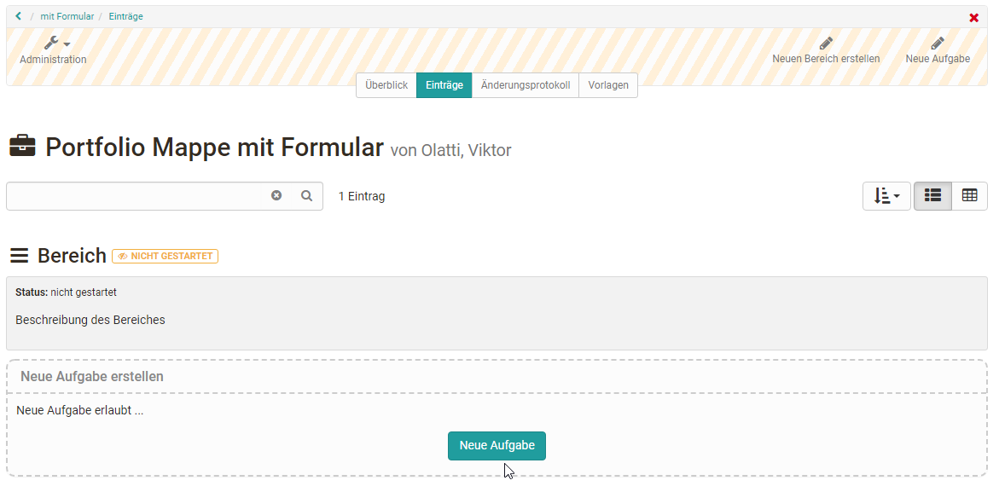
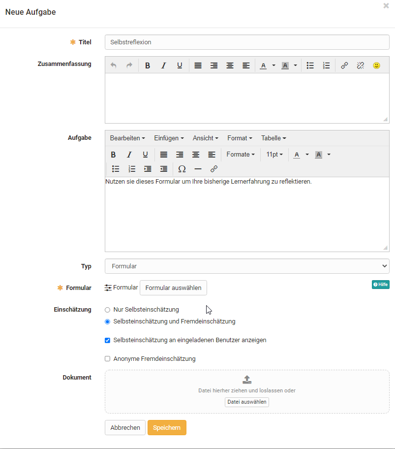
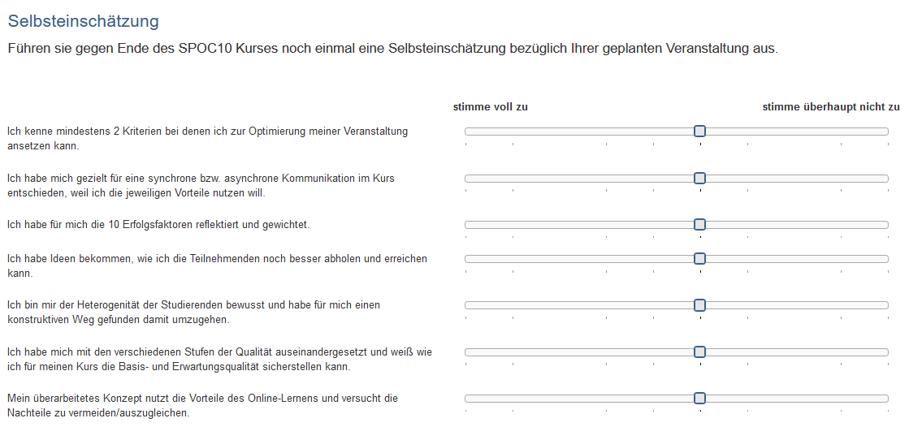

# Formular in der Portfolio 2.0 Vorlage

In die Lernressource "[Portfolio 2.0 Vorlage](Portfolio_template_Creation.de.md)" können ebenfalls Formulare z.B. zur Selbstreflexion oder für die Bewertung von eigenen Leistungen oder auch im Sinne eines Fragebogens eingebunden werden.

Hierfür muss zunächst eine Portfolio 2.0 Vorlage erstellt werden. Wählen oder erstellen Sie dann einen Portfolio "Bereich" und wählen sie "Neue Aufgabe". Weitere generelle Informationen zur Erstellung einer Portfolio 2.0 Vorlage finden sie [hier](../learningresources/Portfolio_template_Administration_and_editing.de.md).

{ class="shadow lightbox" }

Um ein Formular in eine Portfolio Aufgabe zu verwenden, wählen Sie unter Typ "Formular". Anschliessend können Sie ein vorbereitetes Formular verwenden oder ein neues Formular erstellen.

{ class="shadow lightbox" }

Hat man noch kein Formular erstellt, kann eine neue Lernressource Formular über den Button "Erstellen" erstellt oder ein extern vorliegendes Formular importiert werden. Anschliessend erscheint das gerade angelegte oder importierte Formular ebenfalls in der Liste und kann für die Portfolio Aufgabe ausgewählt werden.

Ein neu erstelltes Formular beinhaltet zunächst noch keine Elemente, Fragen oder Textfelder. Diese müssen im Kurs über "Bearbeiten" oder alternativ direkt in der Lernressource im [Formular Editor](../learningresources/Form_Editor.de.md) hinzugefügt werden.

Wenn ein Formular direkt im Kurseditor erstellt wird, wird automatisch eine neue Lernressource Formular angelegt, die auch im [Autorenbereich](../area_modules/Authoring.de.md) unter "Meine Einträge" zu finden ist und in weiteren Kursen und Kursbausteinen eingebunden werden kann.

Nachdem ein Formular ausgewählt wurde, kann es über den Link "Bearbeiten" gestaltet werden. Wurde das Formular schon vorher passend eingerichtet ist eine Bearbeitung nicht mehr notwendig.

 **Weitere Einstellungen:**

Sie können auch definieren, wer das Formular ausfüllen darf, nur der E-Portfolio Inhaber oder zusätzlich noch weitere Personen. Für die Beurteilung können auch weitere Personen eingeladen werden. Die Bewertung kann offen oder anonym erfolgen.

Die Portfolio 2.0 Vorlage kann dann über den Kursbaustein "[Portfolioaufgabe](../learningresources/Creating_Portfolio_Tasks.de.md)" auch in einen Kurs eingebaut werden.

## Beispiel für ein Portfolio Formular

{ class="shadow lightbox" }

