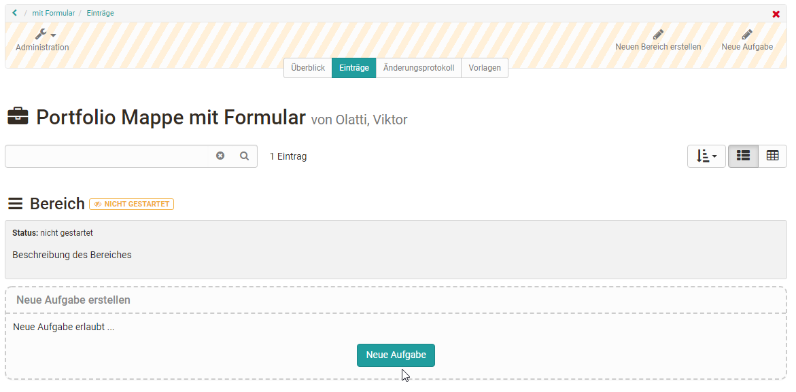
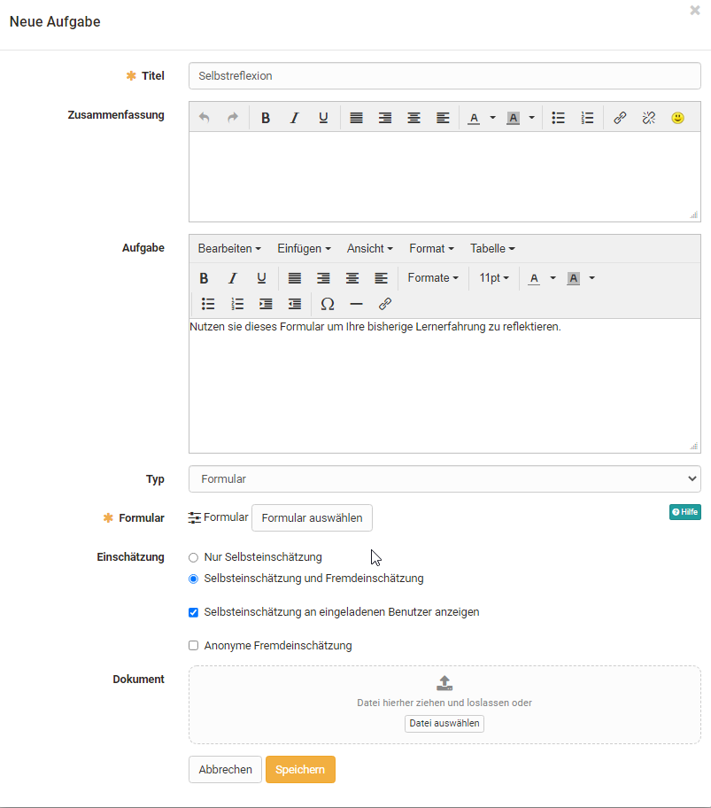
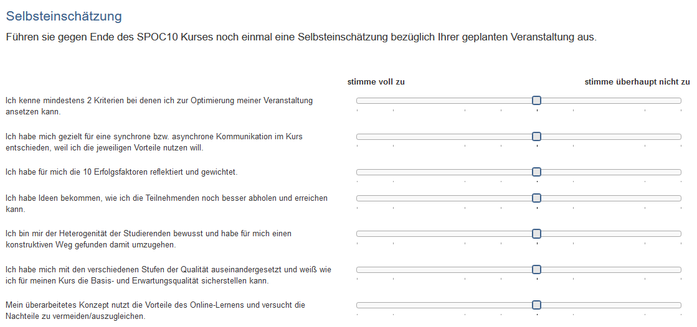

# Form in the Portfolio 2.0 template {: #eportfolio_template_forms}

Forms can also be integrated into the learning resource "[Portfolio 2.0 Template](Portfolio_template_Creation.md)", e.g. for self-reflection, for the evaluation of own achievements, or also in the sense of a questionnaire.

For this, a Portfolio 2.0 template must first be created. Then select or create a "Section" and select "New assignment". More general information about creating a Portfolio 2.0 template can be found [here](../learningresources/Portfolio_template_Administration_and_editing.md).

{ class="shadow lightbox" }

To use a form in a portfolio assignment, select "Form" under type. Then you can use a prepared form or create a new one.

{ class="shadow lightbox" }

If you haven't created a form yet, you can create a new "Form" learning resource via the "Create" button or import an externally existing form. Afterwards, the just created or imported form also appears in the list and can be selected for the portfolio assignment.

A newly created form does not yet contain any elements, questions or text fields. These have to be added in the course via "Edit" or alternatively directly in the learning resource in the [Form Editor](../learningresources/Form_Editor.md).

If a form is created directly in the course editor, a new "Form" learning resource is created automatically, which can also be found in the [Authoring Area](../area_modules/Authoring.md) under "My entries" and can be included in further courses and course elements.

After a form has been selected, it can be designed via the link "Edit". If the form has already been set up appropriately, editing is no longer necessary.

**Additional settings:**

You can also define who is allowed to fill out the form: only the owner of the ePortfolio, or additional people as well. Additional people can also be invited for the assessment. The assessment can be open or anonymous.

The Portfolio 2.0 template can then also be integrated into a course via the course element "[Portfolio task](../learningresources/Creating_Portfolio_Tasks.md)".

## Example for a portfolio form

{ class="shadow lightbox" }

## Further information {: #further_information}

**Mentioned on this page** 
[Portfolio template: Creation >](Portfolio_template_Creation.md) 
[Portfolio template: Administration and editing >](../learningresources/Portfolio_template_Administration_and_editing.md) 
[The Form Editor >](../learningresources/Form_Editor.md) 
[Authoring - Overview >](../area_modules/Authoring.md) 
[Creating Portfolio Tasks >](../learningresources/Creating_Portfolio_Tasks.md)

[To the top of the page ^](#eportfolio_template_forms)
