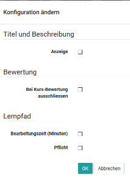
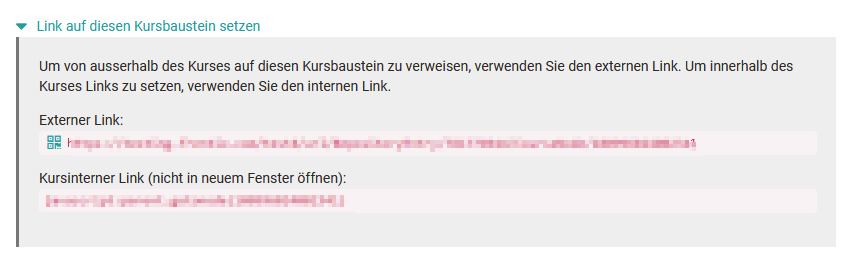
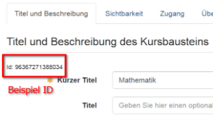
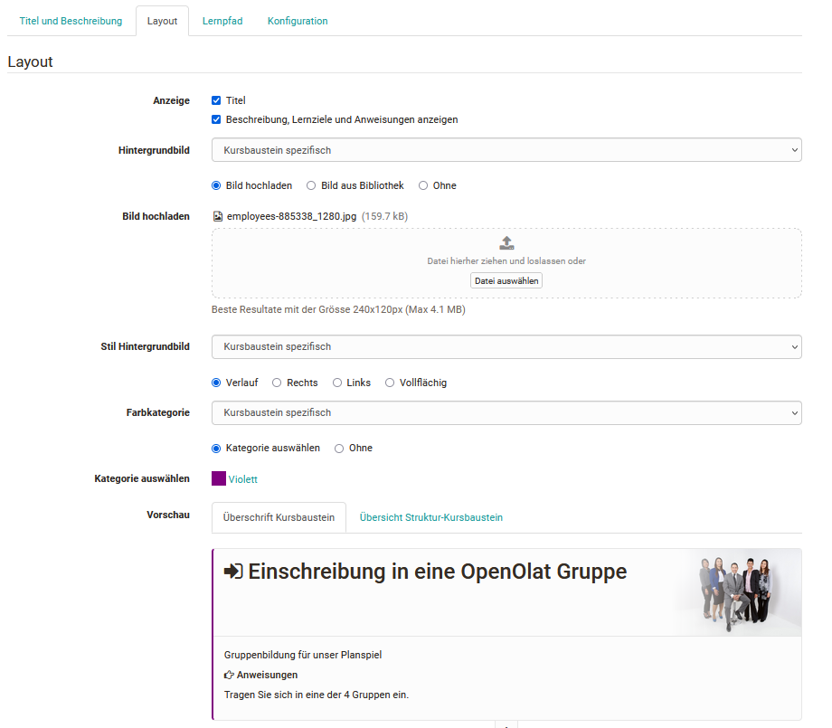

# Kursbausteine im Kurseditor

:octicons-device-camera-video-24: **Video-Einführung**: [Kursbausteine einfügen](<https://www.youtube.com/embed/AJ76e3urdKA>){:target="_blank”}

:octicons-device-camera-video-24: **Video-Einführung**: [Kursbausteine konfigurieren](<https://www.youtube.com/embed/SAkzzoOQEoQ>){:target="_blank”}

## Übersicht der Konfiguration

In der linken Navigation ganz oben wird die  Konfigurationsübersicht des Kurses und der Kursbausteine angezeigt. 

Um Anpassungen vorzunehmen klicken Sie auf den gewünschten Kursbaustein um direkt zum Kursbaustein zu gelangen. Alternativ können Sie auch mehrere Kursbausteine auswählen. Dann erscheint der Button "Konfiguration ändern" und sie können bestimmte Änderungen für alle gewählten Kursbausteine übernehmen. Die konkreten Möglichkeiten sind abhängig vom Kursbaustein und vom Kurstyp.

!!! tip "Tipp" 

    Wählen Sie nicht alle, sondern gezielt die Spalten aus, über die Sie Überblicksinformationen erhalten wollen. So bleibt die Anzeige übersichtlich. Besonders die Spalte "Beschreibung" sollte nur eingeblendet werden, wenn in den Kursbausteinen hier keine langen Texte eingetragen sind. Die Spalte "Punkte" ist nur für Assessmentbausteine relevant. Hier wird angezeigt, ob für die jeweiligen Kursbausteine die Vergabe von Punkten aktiviert ist oder nicht.

## Hinzufügen von Kursbausteinen

Ist ein Kurs erstellt, kann man beliebig viele Kursbausteine einfügen. Dabei
können auch mehrere Kursbausteine desselben Typs verwendet und beliebig verschachtelt werden. Jedoch sollte der Aufbau eines Online-Kurses immer
sinnvoll und didaktisch durchdacht erfolgen und die Usability für den
Lernenden im Blick behalten.

Um einen Kursbaustein dem Kurs hinzuzufügen wählen Sie im Kurseditor "Kursbaustein einfügen" und klicken auf den gewünschten [Kursbaustein](Course_Elements.de.md). Der gewählte Kursbaustein wird in der linken Navigation hinzugefügt. Dabei wird der ausgewählte Baustein grundsätzlich unterhalb des im Vorfeld ausgewählten bzw. angeklickten Bausteins hinzugefügt. Ist das oberste Element des Kurses ausgewählt, wird der neue Kursbaustein automatisch am Ende des Kurses eingefügt. Sie können Kursbausteine jederzeit mit "Drag&Drop" an den gewünschten Ort verschieben.

Platzieren Sie den Cursor vor dem Hinzufügen des Bausteins bereits an die
gewünschte Stelle, dann brauchen Sie den neuen Baustein nicht noch einmal zu
verschieben. Generell können alle Kursbausteine verschoben dupliziert und gelöscht werden. Weitere Infos finden Sie [hier](../learningresources/Deleting_Moving_and_Copying_Course_Elements.de.md).

Ist der Kursbaustein hinzugefügt, kann er weiter konfiguriert werden.

## Konfigurationstabs von Kursbausteinen

Jeder Kursbaustein beinhaltet die Tabs "Titel und Beschreibung" sowie
"Layout". Alle Kursbausteine eines herkömmlichen Kurses verfügen zusätzlich
über die Tabs "Sichtbarkeit" und "Zugang". Dagegen verfügen die [Lernpfad Kurse](Learning_path_course.de.md) zusätzlich
über den Tab "Lernpfad".

Daneben gibt es einen oder mehrere Tabs zur individuellen Konfiguration des
jeweiligen Kursbausteins.

### Tab "Titel und Beschreibung" {: #desc}

Im Tab "Titel und Beschreibung" beschreiben Sie den Kursbaustein genauer. Das
Feld "**Titel**" ist ein Pflichtfeld und muss ausgefüllt werden. Der "**Titel im Kursmenü**" entspricht dem Anzeigenamen in der linken
Kursnavigation und ist in der Eingabe auf 25 Zeichen beschränkt. Verwenden Sie
für die Titel Felder keine Schrägstriche und Punkte. Die Verwendung solcher
Sonderzeichen kann beim Archivieren von Kursen zu Problemen führen.

Der Eintrag im Feld "**Titel**" dient der genaueren Beschreibung des Kursbausteins und ist auf eine bestimmte Zeichenzahl beschränkt. Der Titel wird auch
angezeigt, wenn man in der Kursnavigation mit der Maus über den kurzen Titel
fährt und wenn man im Tab "Layout" die Anzeige des Titels gewählt hat.

Im Feld "**Beschreibung**" können Sie weitere Informationen zum Kursbaustein
eingeben, z.B. wofür er gedacht ist.

Sie können auch noch weitere Informationen in vorgegebene Felder eingeben, wenn
Sie den entsprechenden Bereich (erweiterte Informationen eingeben)
aufklappen.

Im Feld "**Lernziele**" können Sie konkrete Lernziele für einen einzelnen
Baustein mitteilen. Das ist besonders sinnvoll, wenn es sich um Kursbausteine
handelt, die mit komplexeren Aktionen verbunden sind oder bei
Strukturbausteinen, die mehrere weitere Kursbausteine und Aktivitäten bündeln.

Im Feld "**Anweisungen**" können Sie den Teilnehmenden Informationen
bereitstellen, wie diese den jeweiligen Kursbaustein nutzen sollen.

Darüber hinaus können auch noch Hinweise für alle Kursbetreuer bereitgestellt
werden, die von den Teilnehmenden nicht gesehen werden.

Verwenden Sie für den "Titel im Kursmenü" einen möglichst kurzen Text (1-2
Wörter), da ansonsten die linke Navigation zu breit und unübersichtlich wird.

Die "Beschreibung" ist nicht für umfangreiche Inhalte, Aufgabenstellungen oder
sonstige Informationen gedacht. In der Beschreibung sollte lediglich die
Funktion des Aufgabenbausteins näher erläutert werden. 3-4 Sätze sind hier in
der Regel passend.

Im Tab "Titel und Beschreibung" finden Sie auch die ID des jeweiligen
Kursbausteins sowie Information, die Sie benötigen, wenn Sie einen Link zu
diesem Kursbaustein setzen möchten.

 **Externer Link:** Um von einem anderen OpenOlat-Kurs oder ausserhalb von
OpenOlat auf diesen Kursbaustein zu verlinken, nutzen Sie einfach den externen
Link. Sie können den Link auch per E-Mail verschicken oder in HTML-Seiten
integrieren.

 **Interner Link (nicht in neuem Fenster öffnen)**: Um von einem Kursbaustein
innerhalb des OpenOlat-Kurses auf diesen Kursbaustein zu verlinken, können Sie
den internen Link als href-Attribut in der gewünschten HTML-Seite setzen.

Die **ID-Nummer** links oben im Feld brauchen Sie, um in den Vorbedingungen
(z.B. Sichtbarkeit) eines anderen Kursbausteins auf diesen zu verweisen. Jeder
Kursbaustein hat eine eigene ID-Nummer.

### Tab Layout

Im Tab Layout wird definiert welche der Komponenten, die im Tab "Titel und
Beschreibung" eingetragen wurden in der Anzeige des Kurses erscheinen. Hierzu
zählen ob ein Titel angezeigt werden soll und wenn ja, welcher der beiden
Titeltypen gewählt werden soll. Ferner kann hier ein Hintergrundbild für den
Header des Kursbausteins festgelegt werden. Dabei hat man die Wahl zwischen
einem Kurs Standardbild, das in den Einstellungen des Kurses im Tab Layout
definiert wird, einem vererbten Bild und einem Baustein spezifischen
Hintergrundbild. Gleiches gilt für den Stil des Hintergrundbildes und die
Farbkategorie. Das Hintergrundbild kann rechts oder links sowie vollflächig
oder mit einem Verlauf dargestellt werden. Unter Farbkategorie kann eine Farbe
ausgewählt oder die Farbkennzeichnung generell abgeschaltet werden.

Mit Hilfe der Vorschau kann man sich die Auswirkungen der Einstellungen rasch
anzeigen lassen und erkennt wie sich die Überschriften des konfigurierten
Kursbausteins im Kurs darstellen werden und wie die Übersicht-Struktur des
Kursbausteins aussehen wird.

### Tab "Sichtbarkeit" und "Zugang" der herkömmlichen Kurse  {: #access}

Über die Tabs Sichtbarkeit und Zugang kann der Zugriff auf einen Kursbaustein
und aller untergeordneten Kursbausteine eingeschränkt werden, so dass nur
bestimmte Personen Zugriff auf diesen Baustein erhalten. Setzt man die
Einschränkung auf den Zugang, ist der Baustein zwar für alle Kursmitglieder
sichtbar, aber nur bestimmte Personen haben Zugriff auf den Baustein. Wird die
Sichtbarkeit eingeschränkt, ist der Baustein für bestimmte Personen weder
sichtbar noch zugänglich.

Ist ein Kursbaustein für einen Kursteilnehmer bzw. OpenOlat-Benutzer sichtbar
aber nicht zugänglich, so ist es empfehlenswert im Tab Sichtbarkeit eine
entsprechende Erläuterung zu ergänzen, die allen ausgeschlossenen Personen des
Kurses die Hintergründe des gesperrten Zugangs erklärt.

In den meisten Fällen reicht eine Beschränkung auf entweder die Sichtbarkeit
oder den Zugang zu setzen.

Folgende Einstellungen bzw. Einschränkungen sind in beiden Tabs möglich:

* Für Lernende gesperrt
* Datumsabhängig
* Gruppenabhängig
* Bewertungsabhängig
* Nur im Prüfungsmodus

**Für Lernende gesperrt** Alle Personen die ausschließlich als Kurs- oder
Gruppenteilnehmer eingetragen sind, haben keinen Zugriff auf diesen Baustein.
Dies kann beispielsweise genutzt werden, wenn bestimmte Bereiche (zunächst)
nur für die Lehrenden sichtbar sein sollen.

**Datumsabhängig**: Hier kann ein Start- und/oder Enddatum inkl. Uhrzeit für
die Sichtbarkeit bzw. den Zugang zum Baustein definiert werden. So können Sie
z.B. einen Fragebogen erst zum Ende des Kurses frei schalten oder
Lehrmaterialien wöchentlich getaktet zur Verfügung stellen.

**Gruppenabhängig**: Auf diesen Weg kann ein Baustein nur für eine bestimmte
Gruppe zur Verfügung gestellt werden. Häufig ist es sinnvoll die
Gruppenabhängigkeit auf einen Strukturbaustein anzuwenden und alle für diese
Gruppe relevanten Bausteine dort unterzuordnen.

**Bewertungsabhängig**: Auf diesen Weg können bestimmte Kursbausteine oder
Bereiche in Abhängigkeit von anderen bewertbaren Kursbausteinen wie Tests,
Aufgaben, Portfolioaufgabe, Checkliste oder Bewertungen bereitgestellt werden.
Dabei kann sowohl auf eine bestimmte Mindestpunktzahl oder auf ein "bestanden"
eines anderen Kursbausteins geprüft werden. Beispielsweise können bestimmte
Bereiche des Kurses erst frei geschaltet werden, wenn ein bestimmter Test
bestanden wurde.

**Nur im Prüfungsmodus**: Sollen bestimmte Kursbaustein nur während einer
OpenOlat Prüfungssituation angezeigt werden bzw. zugänglich sein, wählen Sie
diese Einstellung. Weitere Informationen finden Sie im Abschnitt
[Prüfungsmodus](../learningresources/Assessment_mode.de.md).

**Regeln auch bei Besitzer:innen und Betreuer:innen anwenden**: Damit eine vorgenommene Einschränkung auch für die Kursbesitzer:innen und Gruppenbetreuer:innen gilt, muss diese Option aktiviert werden. Ist diese Checkbox nicht angekreuzt, können Betreuer:innen und Administrator:innen den Kursbaustein *immer* sehen - unabhängig davon, welche Sichtbarkeits-Regeln eingestellt sind.

???+ info "Konfigurationsbeispiel zur Einschränkung der Sichtbarkeit"

    Die Sichtbarkeit eines Bausteins ist "Gruppenabhängig" für Gruppe "A" konfiguriert. Die (De-)Aktivierung der Option "Regeln auch bei Besitzer:innen und Betreuer:innen anwenden" wirkt sich für die verschiedenen Rollen wie folgt auf die Sichtbarkeit aus:

    Rolle | :fontawesome-regular-square: Regeln auch bei Besitzer:innen / Betreuer:innen anwenden | :fontawesome-regular-square-check: Regeln auch bei Besitzer:innen / Betreuer:innen anwenden
    ---------|----------|---------
    Teilnehmer:innen Gruppe "A" | :fontawesome-regular-eye: | :fontawesome-regular-eye:
    Betreuer:innen Gruppe "A" | :fontawesome-regular-eye: | :fontawesome-regular-eye:
    Teilnehmer:innen Gruppe "B"| :fontawesome-regular-eye-slash: | :fontawesome-regular-eye-slash:
    Betreuer:innen Gruppe "B" | :fontawesome-regular-eye: | :fontawesome-regular-eye-slash:
    Teilnehmer:innen des Kurses | :fontawesome-regular-eye-slash: | :fontawesome-regular-eye-slash:
    Betreuer:innen des Kurses | :fontawesome-regular-eye: | :fontawesome-regular-eye-slash:
    Besitzer:innen des Kurses | :fontawesome-regular-eye: | :fontawesome-regular-eye-slash:

!!! note "Hinweis"

    Bei Personen mit mehreren Rollen wirken sich die Zugangs- bzw. Sichtbarkeitsbeschränkungen entsprechend der aktuell ausgewählten Rolle aus.

Über die Schaltfläche "[Expertenmodus](Access_Restrictions_in_the_Expert_Mode.de.md) anzeigen" gelangen Sie zu einem Eingabefeld, wo Sie eine komplexere
Konfiguration Ihren Bedürfnissen entsprechend vornehmen können. Es ist auch
möglich erst eine Grundeinstellung über die generellen Einstellungen
vorzunehmen und dann die Syntax im Expertenmodus zu erweitern. Der
Expertenmodus bietet sehr differenzierte Möglichkeiten verschiedene
Einschränkungen miteinander zu verknüpfen. Beispielsweise kann konfiguriert
werden, dass ein bestimmter Kursbaustein erst ab einem bestimmten Datum frei
geschaltet wird und nur wenn zwei Tests bestanden wurden oder wenn in einer
Checkliste mindestens 10 Punkte erreicht wurden oder wenn die Person Mitglied
einer bestimmten Gruppe ist.

Alle Beschränkungen auf Kursbausteine vererben sich auf untergeordnete
Kursbausteine.

Darüber hinaus bietet der Kursbaustein "**Struktur**" noch die Möglichkeit
ein Passwort zu hinterlegen. Alle untergeordneten Kursbausteine sind dann nur
für Personen sichtbar die über das passende Passwort verfügen. So können Sie
z.B. innerhalb eines Kurses weitere Inhalte integrieren, die nur Personen
erhalten, die für diesen zusätzlichen Content bezahlt haben, oder
Kursbausteine für bestimmte Level im Rahmen von gamebased learning frei
schalten.

Bei Lernpfad Kursen sind diese Einschränkungen nicht möglich. Benötigen Sie
diese spezifischen selektiven Freigaben, müssen Sie einen herkömmlichen Kurs
verwenden.

Informationen zum Tab "Lernpfad" von Lernpfad Kursen finden Sie
[hier](../learningresources/Learning_path_course_Course_editor.de.md).
