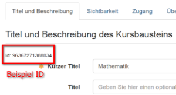
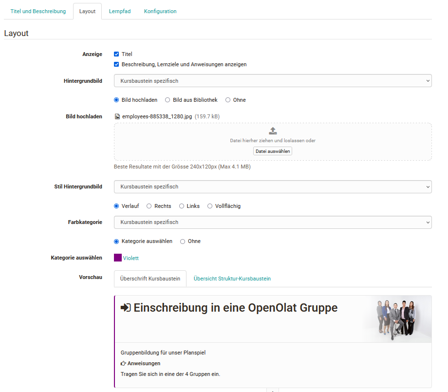

# Elements

## Adding Course Elements

A course can comprise any number of course elements. In a course you can use
several course elements of the same type; they can be nested as well. However,
the development of an online course should always be sensible and didactically
well thought out.

Select the [course element](../learningresources/Course_Elements.md) under which the new element should be inserted. Click on the course element of your choice in the selection window "Insert course element" in the toolbar. The new element will be positioned beneath the currently selected course element. If the top course element is selected, the new element will be automatically inserted at the end of the course. Course elements can be easily re-arranged with "Drag&Drop" at any given point in time.

If you place the cursor at the desired position before adding the block, you
do not need to move the new block again.

Once the course element has been added, it can be further configured.

## Delete, move and duplicate course elements

Once a course element has been selected in the course editor, it can be deleted by pressing the button
"Delete" button in the upper right corner. The course element can also be moved or duplicated within the course via the three dot menu.

## Configuration tabs of course elements

Each course element contains the tabs "Title and description" and "Layout". All course elements of a conventional course additionally have
the tabs "Visibility" and "Access". In contrast, the [Learning path courses](../learningresources/Learning_path_course.md) additionally have the tab "Learning path".

In addition, there are one or more tabs for the individual configuration of the respective course element.

###  Configuration of "Title and Description" {: #desc}

In the tab "Title and description" you can describe your course element
further. The field "**Title**" is mandatory. This "**Title in course menu**" serves as labeling of your course element in the course navigation and is
restricted to 25 characters. Do not use slashes or periods for the Short Title and
Title fields. The use of such special characters can cause problems when archiving courses.

The content in the field "**Title**" serves as additional description of
your course element and has a certain characters maximum. This title will also
be displayed when moving the cursor over the element's short title in the course navigation and if you have chosen to display the title in the "Layout" tab..

In the field "**Description**" you can provide detailed information on your
course element, for example what it is intended for.

You can also enter even more information in predefined fields when you expand
the corresponding area (enter extended information).

In the content field "**Learning objectives**" you can communicate concrete
learning objectives for an individual course element. This is especially
useful for course elements that are linked to more complex actions or for
structural elements that bundle several other course elements and activities.

In the field "**Instructions**" you can provide information to the
participants how they should use the respective course element.

In addition, you can also provide instructions for all course coaches that
will not be seen by the participants.

Use as short a text as possible (1-2 words) for the "Title in the course menu", otherwise the
left navigation will be too broad and confusing.

The "Description" is not intended for extensive contents, tasks or other
information. Only the function of the task module is to be explained in more
detail in the description. 3-4 sentences are suitable here as a rule.

In the tab "Title and description" you will also find the ID and the
information of the respective course element you need if you want to link to this course element.

 **External link**: To link to this course element from another OpenOlat
course or outside OpenOlat, simply use the external link. You can also send
the link by e-mail or integrate it into HTML pages.

 **Internal link (does not open in new window)**: In order to link from a
course element within the OpenOlat course to this course element, you can set
the internal link as href attribute in the desired HTML page.

You need the **ID number** in the upper left corner of the field to refer to
another course element in its preconditions (e.g. visibility). Each course
element has its own ID number.

### Tab Layout

In the tab Layout you can define which of the components entered in the tab
"Title and description" will appear in the course display. This includes
whether a title should be displayed and if so, which of the two title types
should be selected. Furthermore, a background image for the header of the
course element can be defined here. You can choose between a course standard
image, which is defined in the course settings in the tab Layout, an inherited
image and an element specific background image. The same applies to the style
of the background image and the color category. The background image can be
displayed on the right or on the left as well as full-surface or with a
gradient. Under Color category, a color can be selected or the color coding
can generally be switched off.

With the help of the preview you can quickly see the effects of the settings
and recognize how the headings of the configured course element will appear in
the course and how the overview structure of the course element will look
like.

##  Configuration of the Tabs "Visibility and Access" of conventional courses {: #access}

The Visibility and Access tabs can be used to restrict access to a course
element and all subordinate course elements so that only certain persons have
access to this element. If the restriction is set to access, the module 
is visible to all course members, but only certain persons have access to the
module. If the visibility is restricted, the module is neither visible nor
accessible for certain persons.

If a course element is visible but not accessible for a course participant or
OpenOlat user, it is recommended to add a corresponding explanation in the
Visibility tab which explains the background of the blocked access to all
excluded persons of the course.

In most cases, a limitation to set either visibility or access is sufficient.

The following settings and restrictions are possible in both tabs:

  * Blocked for learners
  * Depending on date
  * Depending on group
  * Depending on assessment
  * Only in assessment mode

 **Blocked for learners**: All persons who are exclusively registered as
course or group participants do not have access to this module. This can be
used, for example, if certain areas should (initially) only be visible to
teachers.

 **Depending on date**: Here you can define a start and/or end date incl.
time for the visibility or the access to the module. For example, you can
activate a questionnaire only at the end of the course or make teaching
materials available on a weekly basis.

 **Depending on group**: In this way a course element can only be made
available for a certain group. It often makes sense to apply the group
dependency to a structure module and to subordinate all modules relevant for
this group to it.

 **Depending on assessment**: In this way, certain course elements or areas
can be provided depending on other assessable course elements such as tests,
tasks, portfolio tasks, checklists or assessments. You can check for a certain
minimum score or for an "passed" of another course element. For example,
certain areas of the course can only be activated once a certain test has been
passed.

 **Only in assessment mode**: If you want certain course elements to be
displayed or accessible only during an OpenOlat assessment situation, select
this setting. For more information, refer to the section [Assessmentm Mode](../learningresources/Assessment_mode.md).

**Apply rules also for owners and tutors**: In order for a restriction to apply to course owners and group administrators, this option must be checked. If this checkbox is not activated, coaches and administrators will *always* be able to see the course element - regardless of which visibility rules are set.

???+ info "Configuration example for restricting visibility"

    The visibility of a course element is configured "Depending on group" for group "A". (De)activating the option "Apply rules also for owners and tutors" affects the visibility for the different roles as follows:

    Role | :fontawesome-regular-square: Apply rules for owners / tutors | :fontawesome-regular-square-check: Apply rules for owners / tutors
    ---------|----------|---------
    Participants Group "A" | :fontawesome-regular-eye: | :fontawesome-regular-eye:
    Coaches Group "A" | :fontawesome-regular-eye: | :fontawesome-regular-eye:
    Participants Group "B" | :fontawesome-regular-eye-slash: | :fontawesome-regular-eye-slash:
    Coaches Group "B" | :fontawesome-regular-eye: | :fontawesome-regular-eye-slash:
    Participants of the course | :fontawesome-regular-eye-slash: | :fontawesome-regular-eye-slash:
    Coaches of the course | :fontawesome-regular-eye: | :fontawesome-regular-eye-slash:
    Owners of the course | :fontawesome-regular-eye: | :fontawesome-regular-eye-slash:

!!! note "Note"

    For people with multiple roles, the access/visibility restrictions take effect according to the currently selected role.

The "Display [expert mode](Access_Restrictions_in_the_Expert_Mode.md)"
button takes you to an input field where you can make a more complex
configuration according to your needs. It is also possible to first make a
basic setting using the general settings and then extend the syntax in expert
mode. Expert mode offers a wide range of options for linking different
restrictions to each other. For example, it can be configured that a certain
course element is only activated from a certain date and only if two tests
have been passed or if at least 10 points have been reached in a checklist or
if the person is a member of a certain group.

All restrictions on course elements are inherited by subordinate course
elements.

Furthermore the course element "**Structure**" offers the possibility to
store a password. All subordinate course elements will then only be visible to
persons having the appropriate password. That way you can e.g. integrate
additional content within a course that is only available to persons who have
paid for that additional content or activate course elements for certain
levels in the context of gamebased learning.

Learning path courses do not allow these restrictions. If you need these
specific selective releases, you must use a traditional course.

You can find information about the tab "learning path"
[here](../learningresources/Learning_path_course_Course_editor.md).

  

  

