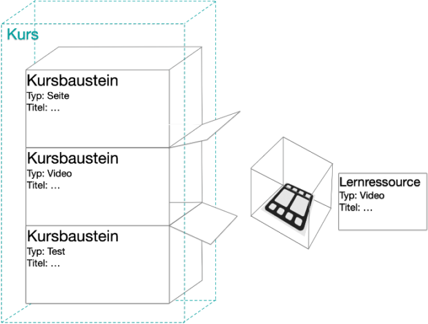
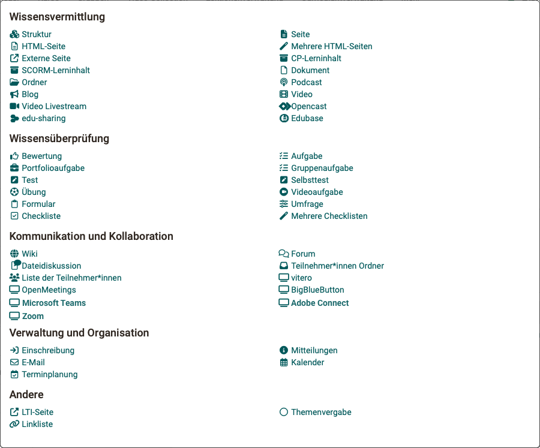
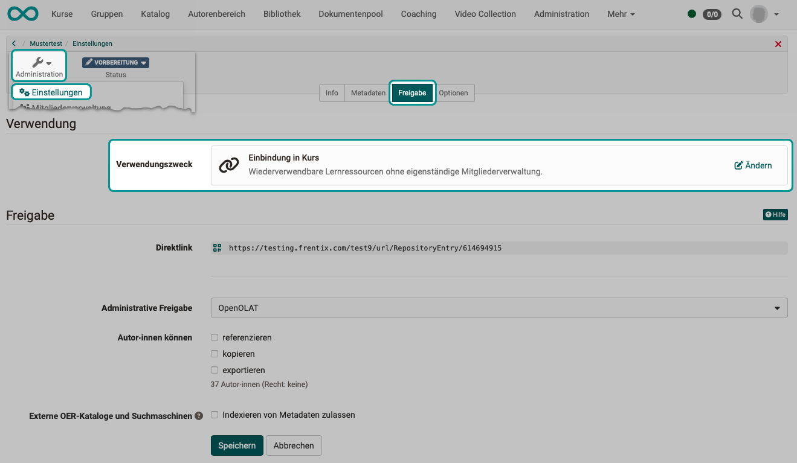
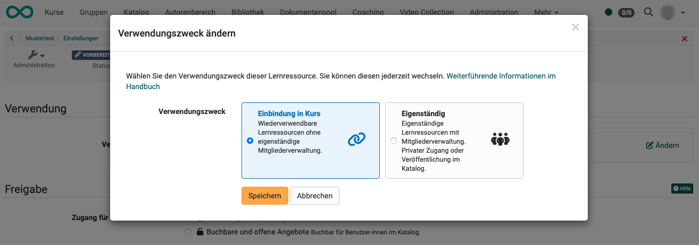

# Funktionskonzept Kurse und Lernressourcen {: #General_Functions_Concept}

## Was ist ein Kurs?

Ein OpenOlat-Kurs wird aus einzelnen Kursbausteinen zusammengesetzt. In den meisten Fällen ist jeder dieser Kursbausteine ein Behälter, in den eine Lernressource eingefügt wird.

Beispiel Kursbaustein "Video": 

{ class="lightbox" }

## Kursbausteine

OpenOlat bietet den Kursautor:innen eine Vielzahl verschiedener Kursbaustein-Typen an. Jeder Kursbausteintyp hat andere Fähigkeiten.

**Beispiel 1:** 
Ein [Kursbaustein "Video"](../learningresources/Course_Element_Video.de.md) muss mit den Zusatzfunktionen für Videos (Annotationen, Quizzes, Kapitel, Kommentaren, Segmenten) umgehen können.

**Beispiel 2:** 
Ein [Kursbaustein "Test"](../learningresources/Course_Element_Test.de.md) muss mit Punkten und Auswertung von Fragen umgehen können. Diese Fähigkeiten benötigt z.B. ein Kursbaustein "BigBlueButton" (Videokonferenz) nicht.

**Beispiel 3:** 
Eine [Checkliste](../learningresources/Course_Element_Checklist.de.md) ist ein Beispiel für einen Kursbaustein ohne Lernressource. Alle Funktionen der Checkliste sind im Kursbaustein selbst eingebaut.

Autor:innen stehen je nach Konfiguration z.B. die folgenden Kursbaustein-Typen zur Verfügung:

{ class="shadow lightbox" }

## Was ist eine Lernressource?

Lernressourcen sind Objekte, die in Kursbausteine eingefügt werden können.

!!! note "Ausnahme"

    Auch Kurse werden gelegentlich als Lernressource bezeichnet. Es kann jedoch kein Kurs in einen anderen Kurs eingefügt werden.

## Vorteile dieses Konzepts

Das Funktionskonzept mit den Kursbausteinen als Behälter für Lernressourcen hat wesentliche Vorteile:

* Die Lernressourcen können **mehrfach in verschiedenen Kursbausteinen und Kursen** genutzt werden.
* Die Lernressourcen können **ausgewechselt werden**, ohne dass dadurch die Kursstruktur zerstört wird. Die Kursbausteine bilden weiterhin als vorübergehend leere Behälter die Kursstruktur.
* Den Kursbausteinen können **Eigenschaften** gegeben werden (z.B. Titel), die **unabhängig** von der eingefügten Lernressource erhalten bleiben. Z.B. wenn eine andere Video-Lernressource mit anderem Dateinamen eingefügt wird oder ein Test speziell für den konkreten Kurs eine andere Grundeinstellung erhält. 

## Eigenständige Lernressourcen

Im Normalfall werden Lernressourcen in Kursbausteine eingebunden ("embedded"). Es gibt jedoch auch die Möglichkeit, manche Lernressourcen eigenständig ("stand alone") zu benutzen.

Das bedeutet, dass in den Einstellungen die Lernressource ähnlich einem Kurs behandelt wird. 
So können z.B. einer Lernressource direkt Mitglieder zugewiesen werden.

### Wann macht eine eigenständige Lernressource Sinn?

Ein Wiki oder ein Blog sind Lernressourcen, bei denen eine Verwendung als eigenständige Lernressource Sinn macht. Sie können gut ohne einen Kurs verwendet werden. 

Bei Test-Lernressourcen ist dies dagegen eher nicht empfohlen, weil sich viele Auswertungsfunktionen im Test-Kursbaustein befinden. Durch Einbettung in einen Kurs wird der Test Teil des Gesamtkurses und kann die Ergebnisse an den Kurs weitergeben. Bei mehreren bewertbaren Kursbausteinen ist der Test dann für Betreuer:innen im Bewertungswerkzeug aufgeführt und es kann eine Bewertung für den Gesamtkurs gemacht werden. Wenn diese Gesamtschau benötigt wird, macht eine eigenständige Lernressource wenig Sinn. 

### Eigenständige Lernressourcen in Kursen

!!! warning "Beachten Sie:"

    Auch eigenständige Lernressourcen können weiter in Kurse eingebunden werden.
    
    Wurden Mitglieder aber direkt in die Lernressource eingebucht, kann dies zu Problemen führen, wenn diese Lernressource nun in verschiedene Kurse eingebunden wird. 

## Unterschiede: Lernressource im Kurs <-> eigenständige Lernressource

|                                   |Lernressource im Kurs "embedded"| eigenständige Lernressource "stand alone" |
|-------------------------------------------------|:-------------------:|:-------------------:|
| Besitzer:innen als Mitglieder                   | ja    | ja   |
| Betreuer:innen als Mitglieder                   | nein  | ja   |
| Teilnehmer:innen als Mitglieder                 | nein  | ja   |
| Private Mitgliederverwaltung                    | nein  | ja   |
| Buchbare und offene Angebote                    | nein  | ja   |
| im Katalog auflistbar (Angebote erstellbar)  | nein  | ja   |
| Status "Veröffenlicht" erforderlich             | nein  | ja   |
| bei Videos: in Video Collection auflistbar      | ja    | ja   |

## Verwendungszweck einer Lernressource vorsehen

Wenn eine Lernressource im Autorenbereich erstellt worden ist, werden verschiedene Einstellungen an ihr vorgenommen (Konfiguration). Unter anderem wird dort auch eingestellt, ob die Lernressource zur Einbindung in Kursbausteine vorgesehen ist, oder in erster Linie als eigenständige Lernressource genutzt werden soll.

Sie finden die Einstellung des Verwendungszweckes unter 
**Autorenbereich > Lernressource wählen > Administration > Einstellungen > Tab Freigabe > Abschnitt Verwendung**

{ class="shadow lightbox" }

{ class="shadow lightbox" }

!!! note "Hinweis zum Status"

    Bei Kursen und Video-Lernressourcen ist der Status "Veröffentlicht" erforderlich, damit sie durch Teilnehmer:innen genutzt werden können.
    
    Andere Lernressourcen können in Kurse eingebunden werden, auch wenn der Status noch "Vorbereitung" ist.
