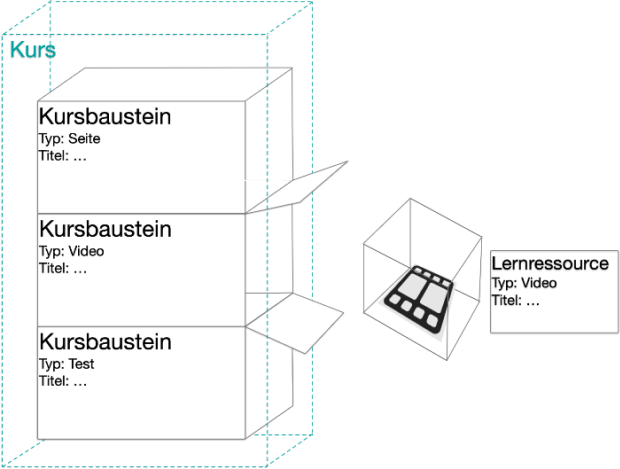
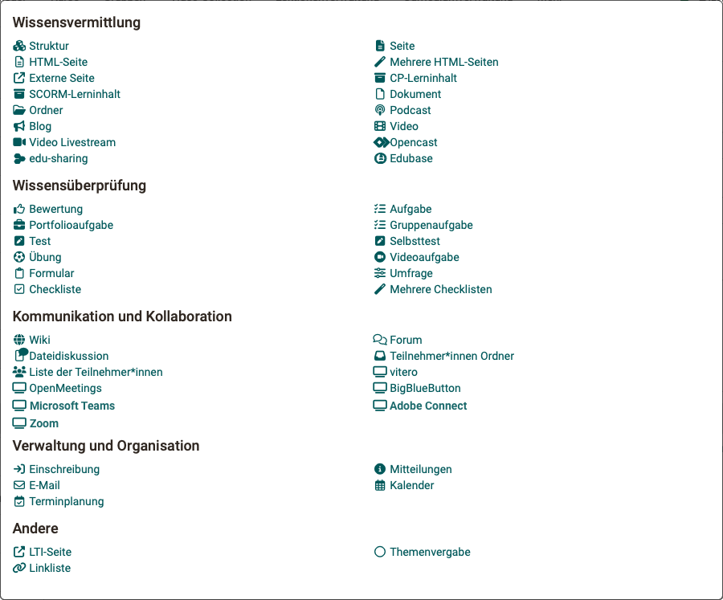
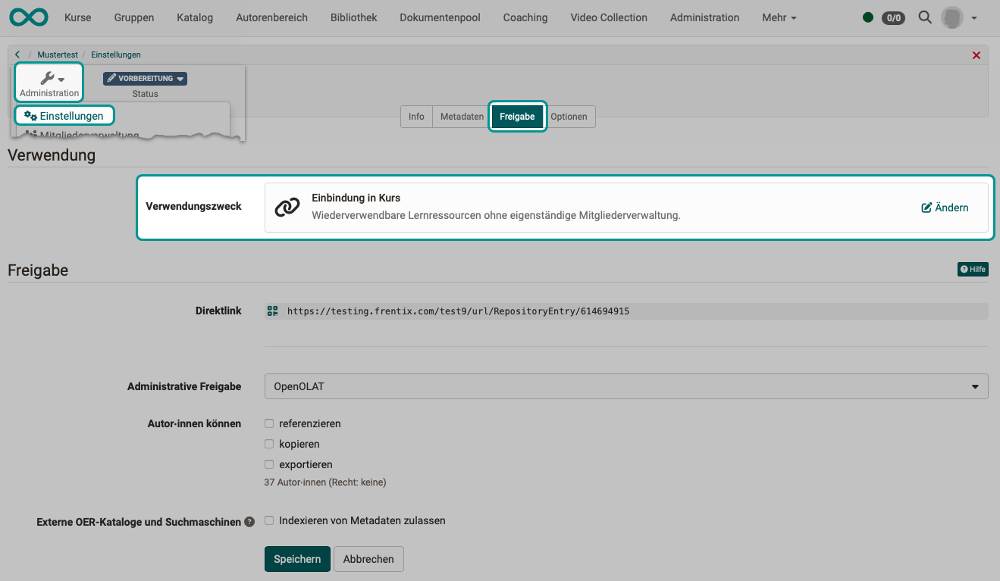
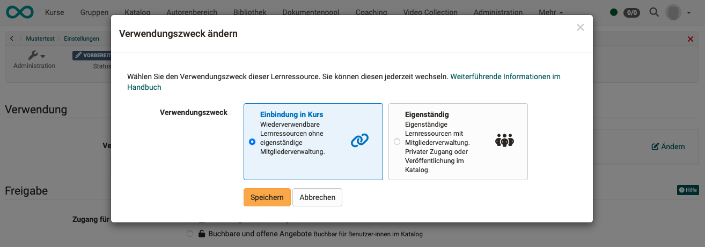

# Function concept courses and learning resources {: #General_Functions_Concept}

## What is a course?

An OpenOlat course is made up of individual course elements. In most cases, each of these course elements is a container into which a learning resource is inserted.

Example course element "Video":

{ class="lightbox" }

## Course elements

OpenOlat offers course authors a variety of different course element types. Each course element type has different capabilities.

**Example 1:** 
A [course element "Video"](../learningresources/Course_Element_Video.md) must be able to handle the additional functions for videos (annotations, quizzes, chapters, comments, segments).

**Example 2:** 
A [course element "Test"](../learningresources/Course_Element_Test.md) must be able to handle points and the evaluation of questions. A course element "BigBlueButton" (video conference), for example, does not need these capabilities.

**Example 3:** 
A [checklist](../learningresources/Course_Element_Checklist.md) is an example of a course element without a learning resource. All functions of the checklist are built into the course element itself.

Depending on the configuration, the following course element types, for example, are available to authors:

{ class="shadow lightbox" }

## What is a learning resource?

Learning resources are objects that can be inserted into course elements.

!!! note "Exception"

    Courses are also sometimes referred to as learning resources. However, no course can be inserted into another course.

## Advantages of this concept

The function concept with the course elements as containers for learning resources has significant advantages:

* The learning resources can be **used multiple times in different course elements and courses**.
* The learning resources can be **replaced** without destroying the course structure. The course elements continue to form the course structure as temporarily empty containers.
* The course elements can be given **properties** (e.g. title) that are retained **independently** of the inserted learning resource. This applies, for example, if another video learning resource with a different file name is inserted or if a test is given a different basic setting specifically for this course.

## Standalone learning resources

Normally, learning resources are embedded in course elements ("embedded"). However, it is also possible to use some learning resources on their own ("stand alone").

This means that the learning resource is treated similarly to a course in the settings. For example, members can be assigned directly to a learning resource.

### When does a standalone learning resource make sense?

A wiki or a blog are learning resources for which use as a standalone learning resource makes sense. They can be used well without a course.

For test learning resources, however, this is not recommended because many evaluation functions are located in the test course element. By embedding the test in a course, it becomes part of the overall course and can pass on the results to the course. If there are several assessable course elements, the test is then listed in the assessment tool for coaches, and an assessment can be made for the entire course. If this overall view is required, a standalone learning resource makes little sense.

### Standalone learning resources in courses

!!! warning "Attention"

    Standalone learning resources can also be embedded in courses.

    However, if members were booked directly into the learning resource, this can lead to problems if this learning resource is then embedded in different courses.

## Differences: learning resource in a course <-> standalone learning resource

|                                   |Learning resource in a course "embedded"| standalone learning resource "stand alone" |
|-------------------------------------------------|:-------------------:|:-------------------:|
| Owners as members                               | yes   | yes  |
| Coaches as members                              | no    | yes  |
| Participants as members                         | no    | yes  |
| Private members management                      | no    | yes  |
| Bookable and open offers                        | no    | yes  |
| Can be listed in the catalog (offers can be created)  | no    | yes  |
| Status "Published" required                     | no    | yes  |
| For videos: can be listed in the Video Collection | yes   | yes  |

## Provide for the usage of a learning resource

Once a learning resource has been created in the authoring area, various settings are made to it (configuration). Among other things, this is where you define whether the learning resource is intended for embedding in course elements or whether it should primarily be used as a standalone learning resource.

You can find the usage setting in the selected learning resource under: 
`Learning resource > Administration > Settings > Tab "Share" > Section "Usage"`

{ class="shadow lightbox" }

{ class="shadow lightbox" }

A course cannot be embedded in another course. If the Course Planner is enabled, courses instead offer the usage options "Standalone", "Use in Course Planner" [:octicons-tag-16:{ title="from Release 20.0 (OO-8104)" }](https://track.frentix.com/issue/OO-8104){:target="_blank"} and "Template" [:octicons-tag-16:{ title="from Release 20.0 (OO-8422)" }](https://track.frentix.com/issue/OO-8422){:target="_blank"}. Neither has a standalone members management: with "Use in Course Planner", the Course Planner manages the members, and a "Template" serves as a template for course content. Details can be found in the chapter [Course Planner: Products](../area_modules/Course_Planner_Products.md).

!!! info "Note on status"

    For courses and video learning resources, the status "Published" is required so that they can be used by participants.

    Other learning resources can be embedded in courses even if the status is still "Preparation".

## Further information {: #further_information}

[Course Element "Video" >](../learningresources/Course_Element_Video.md) 
[Course Element "Test" >](../learningresources/Course_Element_Test.md) 
[Course Element "Checklist" >](../learningresources/Course_Element_Checklist.md) 
[Course Planner: Products >](../area_modules/Course_Planner_Products.md)

[To the top of the page ^](#General_Functions_Concept)
