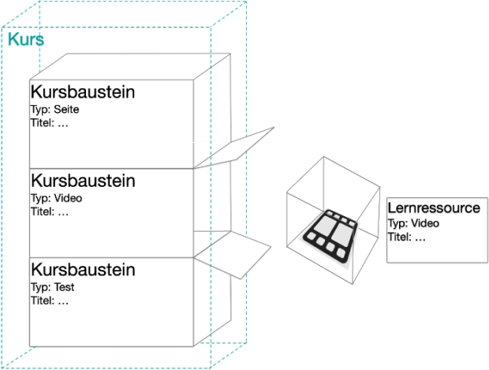
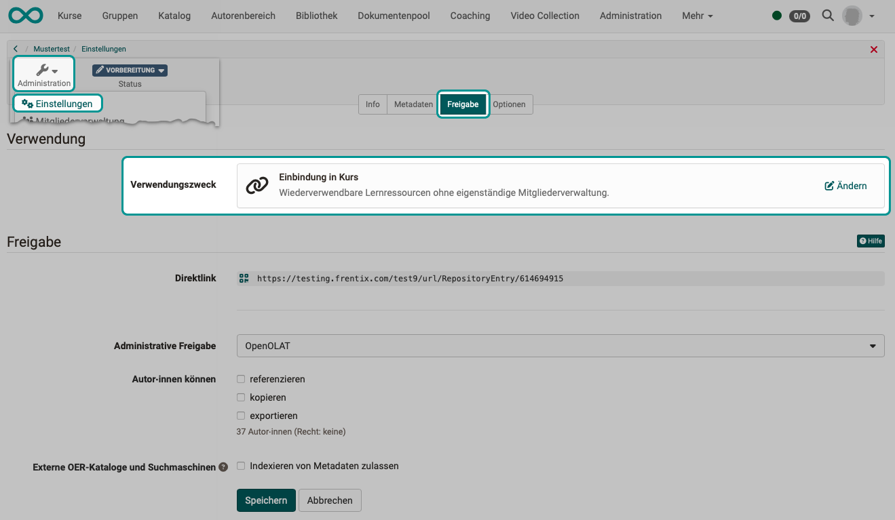
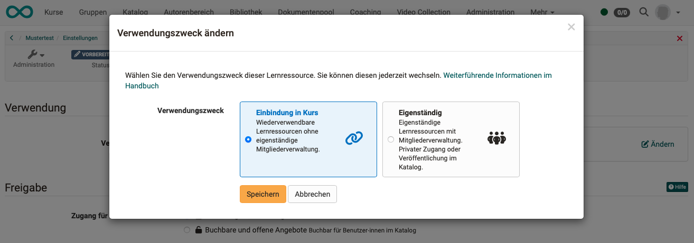

# Function concept courses and learning resources {: #General_Functions_Concept}

## What is a course?

An OpenOlat course is made up of individual course elements. In most cases, each of these course elements is a container into which a learning resource is inserted.

Example Course element "Video":

{ class="lightbox" }

## Course elements

OpenOlat offers course authors a variety of different course element types. Each course element type has different capabilities.

**Example 1:** 
A ["Video" course element](../learningresources/Course_Element_Video.md) must be able to handle the additional functions for videos (annotations, quizzes, chapters, comments, segments).

**Example 2:** 
A ["Test" course element](../learningresources/Course_Element_Test.md) must be able to deal with scoring and evaluating questions. A "BigBlueButton" (video conference) course element, for example, does not require these skills.

**Example 3:** 
A [checklist](../learningresources/Course_Element_Checklist.md) is an example of a course element without a learning resource. All checklist functions are built into the course element itself.

Depending on the configuration, the following course element types are available to authors, for example:

{ class="shadow lightbox" }

## What is a learning resource?

Learning resources are objects that can be inserted into course elements.

!!! note "Exception"

    Courses are also sometimes referred to as learning resources. However, no course can be inserted into another course.

## Advantages of this concept

The functional concept with the course elements as a container for learning resources has significant advantages:

* The learning resources can be **used multiple times** in different course modules and courses.
* The learning resources can be **replaced** without destroying the course structure. The course elements continue to form the course structure as temporarily empty containers.
* The course elements can be given **properties** (e.g. title) that are retained regardless of the learning resource inserted. For example, if another video learning resource with a different file name is inserted.

## Independent learning resources

Normally, learning resources are embedded in course elements. However, it is also possible to use some stand-alone learning resources.

However, this is not recommended for test learning resources because many evaluation functions are located in the test course element. By embedding the test in a course, it becomes part of the overall course and can pass on the results to the course. If there are several assessable course elements, the test is then listed in the assessment tool for coaches and an assessment can be made for the entire course. If this overall view is required, a stand-alone learning resource makes little sense.

### Independent learning resources in courses

!!! warning "Please note:"

    Independent learning resources can also be further integrated into courses.

    However, if members were booked directly into the learning resource, this can lead to problems if this learning resource is now integrated into different courses.

## Differences: Learning resources in courses <-> stand-alone learning resources

|                                   |Learning resources in courses "embedded"| stand-alone learning resources "stand alone" |
|-------------------------------------------------|:-------------------:|:-------------------:|
| Owners as members                   | yes    | yes   |
| Coaches as members                  | no  | yes   |
| Participants as members                 | no  | yes   |
| Private members management                    | no  | yes   |
| Bookable and open offers                    | no  | yes   |
| can be listed in the catalog (Offers can be created)  | no  | yes   |
| Status "Published" required             | no  | yes   |
| with Videos: can be listed in Video Collection      | yes    | yes   |

## Provide intended use of a learning resource

Once a learning resource has been created in the authoring area, various settings are made to it (configuration). Among other things, you can also specify whether the learning resource is intended for integration into course elements or whether it should primarily be used as an independent learning resource.

You can find the setting for the intended use under 
**Authoring area > Select learning resource > Administration > Settings > Tab Share > Section Usage**

{ class="shadow lightbox" }

{ class="shadow lightbox" }

!!! note "Note on status"

    The "Published" status is required for courses and video learning resources so that they can be used by participants.

    Other learning resources can be integrated into courses, even if the status is still "preparation".

