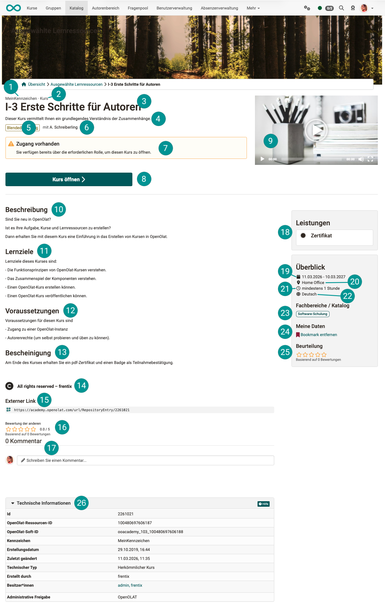
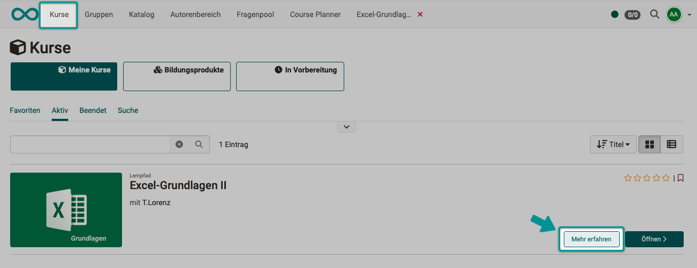
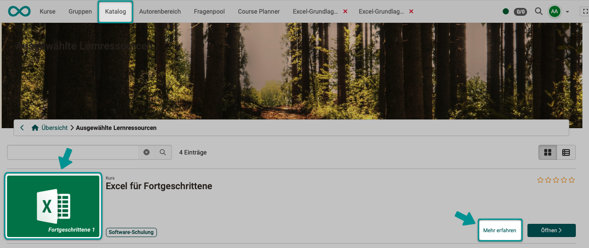
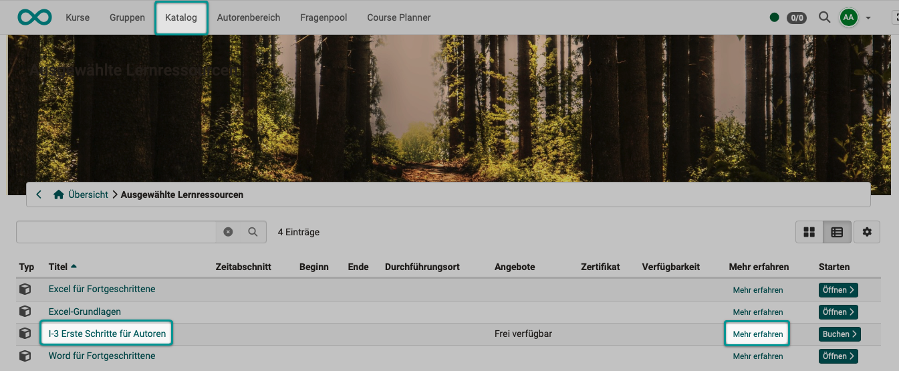
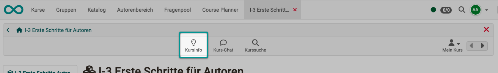
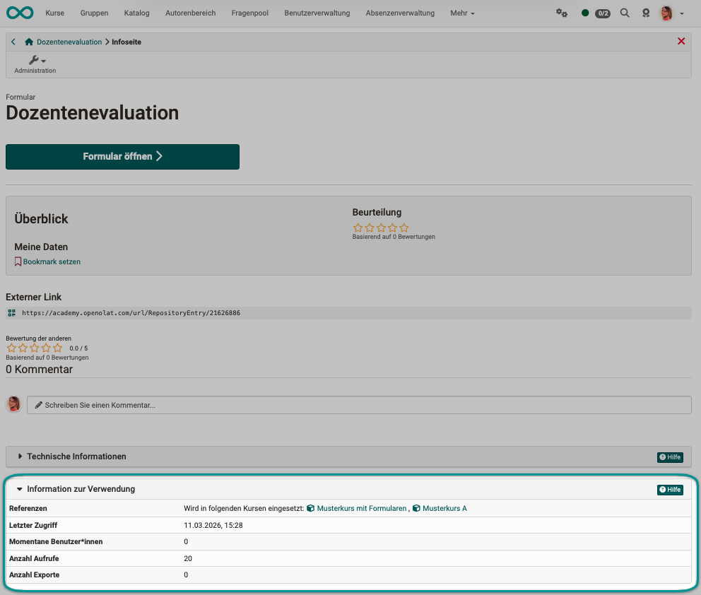

# Allgemeine Funktionen: Infoseite {: #general_functions_info}

## Wozu dient die Infoseite? {: #purpose}

Jede Lernressource verfügt über eine Infoseite. Diese enthält zum einen vom System vorgegebene Informationen, zum anderen können Besitzer:innen der Lernressource selbst Angaben machen. Diese stehen Interessierten nach Veröffentlichung der Lernressource (unabhängig von einer Buchung) bereits vor Betreten der Lernressource zur Verfügung. Das ist sinnvoll, wenn man die Zielgruppe bereits im Vorfeld informieren möchte, z.B. wenn es sich um einen kostenpflichtigen Kurs handelt.

{ class="lightbox" }

[Zum Seitenanfang ^](#general_functions_info)

---

## Informationen der Infoseite {: #content}

| | Objekt der Infoseite    |  Ort zur Eingabe |
|-|--------------------------- | ------------------------------------------- |
| | Kennzeichen | Eine externe Kennung (im Unterschied zur automatisch vergebenen ID), die Sie selbst vergeben können. Die Eingabe erfolgt unter Administration > Einstellungen > Tab Info |
|  | Typ | Der Typ der Lernressource wird bei der Erstellung festgelegt. Die Angabe entspricht der (nicht editierbaren) Angabe unter Administration > Einstellungen > Tab Metadaten|
|  | Titel | wie er unter Administration > Einstellungen > Tab Info eingegeben wurde |
|  | Teasertext | Text, wie er unter Administration > Einstellungen > Tab Info im Feld "Teaser" eingegeben wurde |
|  | Durchführungsformat | wie unter Administration > Einstellungen > Tab Metadaten ausgewählt |
|  | Autor:in | Name, wie er unter Administration > Einstellungen > Tab Metadaten eingegeben wurde |
|  | Hinweis | Box mit Bedienungshinweisen |
|  | Button | Button "Kurs öffnen" wird angezeigt wenn bereits eine Zutrittsberechtigung besteht. Der Button "Buchen" wird automatisch angezeigt, wenn unter Administration > Einstellungen > Freigabe die Option "buchbar" gwählt wurde. |
|  | Teaser-Video | Upload/Auswahl unter Administration > Einstellungen > Tab Info |
|  | Beschreibung | Text, wie unter Administration > Einstellungen > Tab Info eingegeben|
|  | Lernziele | Text, wie unter Administration > Einstellungen > Tab Info eingegeben |
|  | Voraussetzungen | Text, wie unter Administration > Einstellungen > Tab Info eingegeben |
|  | Bescheinigung | Text, wie unter Administration > Einstellungen > Tab Info eingegeben |
|  | Copyright | wie unter Administration > Einstellungen > Tab Metadaten ausgewählt/eingegeben |
|  | Externer Link | Automatisch generierter Link für den direkten Zugang. Ist ein Login/eine Registration erforderlich, werden beim Aufruf dieses Links die entsprechenden Schritte vorgeschaltet.|
|  | Bewertung mit Sternen | Der Kurs bzw. die Lernressource mit Sternen zu bewerten sofern diese Funktion vom OpenOlat Administrator aktiviert wurde. Es werden die bisherigen Bewertungen angezeigt. Wird die Maus darüberbewegt, kann eine eigene Bewertung abgegeben werden. |
|  | Eingabefeld für Kommentare | Texteingabe durch Benutzer:innen im Run-Mode |
|  | Leistungen |            |
|  | Durchführungszeitraum | wie unter Administration > Einstellungen > Tab Durchführung angegeben |
|  | Durchführungsort | wie unter Administration > Einstellungen > Tab Durchführung angegeben |
|  | Zeitaufwand | wie unter Administration > Einstellungen > Tab Metadaten angegeben |
|  | Hauptsprache | wie unter Administration > Einstellungen > Tab Metadaten angegeben |
|  | Fachbereiche/Katalog | Die Auswahl der Taxonomie erfolgt unter Administration > Einstellungen > Tab Metadaten |
|  | Meine Daten | Persönliche Daten, wie aktueller Status, letzter Zugriff, mit welchen Gruppen Sie im Kurs eingetragen sind, Bookmark setzen/entfernen. Falls ein Austragen aus dem Kurs/der Lernressource erlaubt ist, ist dies ebenfalls hier möglich. |
|  | Beurteilung | entspricht der Funktion im Hauptfenster |
|  | Technische Informationen | Technische Infos mit der Kurs-ID, Datum der letzten Änderung u.ä. Die ID ist die automatisch generierte Identifikationsnummern der Lernressource. Mit dieser ID können Sie die Lernressource über die Suchmaske suchen. Techn. Informationen werden nur für Besitzer:innen und administrative Rollen angezeigt. |

!!! note "Hinweis"

    Wenn Sie als Teilnehmer kaum Informationen auf der Infoseite finden, dann liegt es daran, dass Ihre Lehrperson diese Seite (noch) nicht weiter eingerichtet hat. Sprechen Sie ihn oder sie doch darauf an. 

[Zum Seitenanfang ^](#general_functions_info)

---

## Wo findet man die Infoseite? {: #access}

### Aufruf der Infoseite in der Kursübersicht {: #access_course_overview}

Öffnen Sie in der Hauptnavigation Ihre Kursübersicht durch Klick auf "Kurse". 
Dann wählen Sie den Link neben dem Button zum Öffnen eines Kurses.

{ class="lightbox" }

[Zum Seitenanfang ^](#general_functions_info)

---

### Aufruf der Infoseite im Katalog {: #access_catalog}

In der Kachelansicht des Katalogs finden Sie den Button zur Anzeige der Infoseite rechts unten. Sie können aber auch das Bild anklicken. 

{ class="lightbox" }

In der Listenansicht klicken Sie den Link "Mehr erfahren" oder den Titel der Lernressource. 

{ class="lightbox" }

[Zum Seitenanfang ^](#general_functions_info)

---

### Aufruf der Infoseite innerhalb eines Kurses {: #access_within_a_course}

Wenn Sie sich im Kurs befinden, wählen Sie das Icon "Kursinfo" in der Werkzeugleiste. 

{ class="lightbox" }

[Zum Seitenanfang ^](#general_functions_info)

---

### Aufruf der Infoseite zu sonstigen Lernressourcen {: #access_other_learning_resources}

Die Infoseite zu sonstigen Lernressourcen kann gleich aufgerufen werden, wie die Infoseite der Kurse.
Sie enthält im Unterschied zu Kursen ausserdem noch Hinweise zur Verwendung.

Beispiel: Lernressource Formular

{ class="lightbox" }

[Zum Seitenanfang ^](#general_functions_info)

---

## Weiterführende Informationen  {: #further_information}

[Weitere Details zur Infoseite > ](../learningresources/Info_page.de.de.md) 
[Einrichten der Infoseite > ](../learningresources/Course_Settings.de.de.md) 

[Zum Seitenanfang ^](#general_functions_info)

