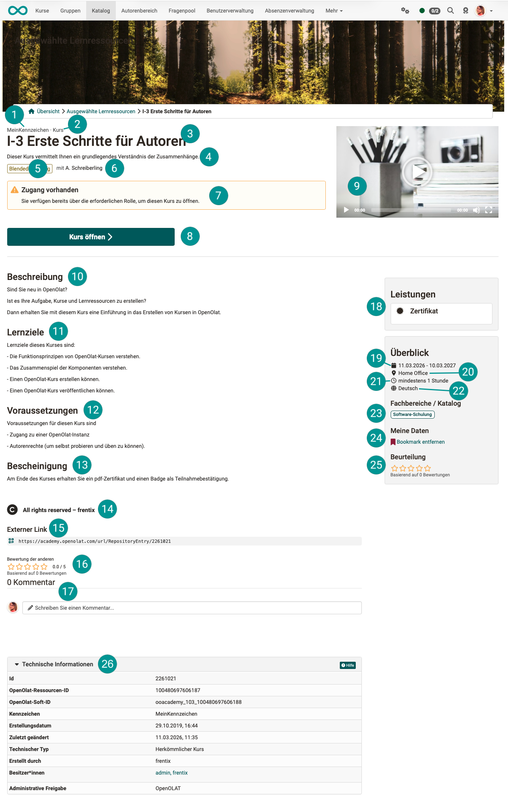
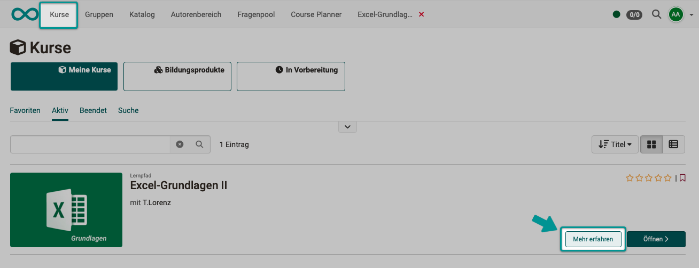
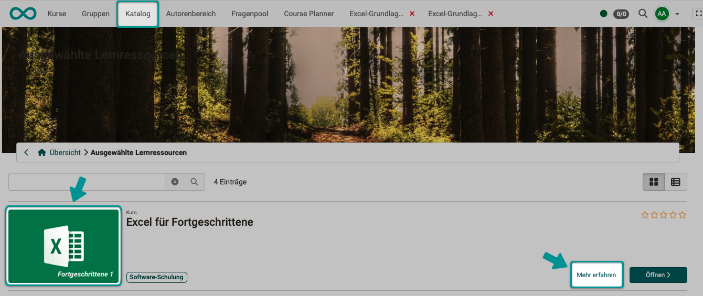
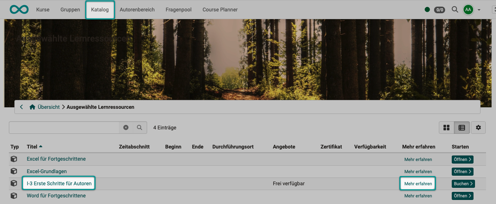
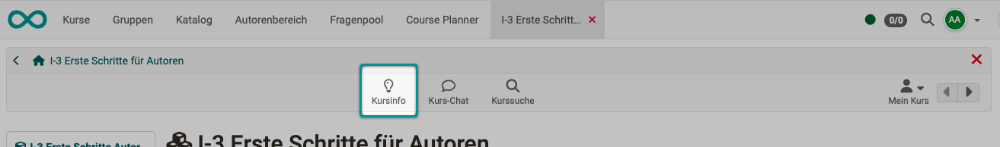
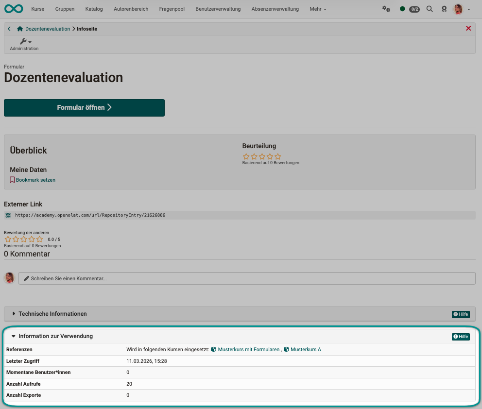

# Allgemeine Funktionen: Infoseite {: #general_functions_info}

## Wozu dient die Infoseite? {: #purpose}

Jede Lernressource verfügt über eine Infoseite. Diese enthält zum einen vom System vorgegebene Informationen, zum anderen können Besitzer:innen der Lernressource selbst Angaben machen. Diese stehen Interessierten nach Veröffentlichung der Lernressource (unabhängig von einer Buchung) bereits vor Betreten der Lernressource zur Verfügung. Das ist sinnvoll, wenn man die Zielgruppe bereits im Vorfeld informieren möchte, z.B. wenn es sich um einen kostenpflichtigen Kurs handelt.

{ class="shadow lightbox" }

[Zum Seitenanfang ^](#general_functions_info)

---

## Informationen der Infoseite {: #content}

Die Pfade in der Tabelle beziehen sich auf die Administration der jeweiligen Lernressource.

| | Objekt der Infoseite    |  Ort zur Eingabe |
|-|--------------------------- | ------------------------------------------- |
| | Kennzeichen | Eine externe Kennung (im Unterschied zur automatisch vergebenen ID), die Sie selbst vergeben können. Eingabe unter `Kurs > Administration > Einstellungen > Tab "Info"` |
|  | Typ | Der Typ der Lernressource wird bei der Erstellung festgelegt. Die Angabe entspricht der (nicht editierbaren) Angabe unter `Kurs > Administration > Einstellungen > Tab "Metadaten"` |
|  | Titel | Eingabe unter `Kurs > Administration > Einstellungen > Tab "Info"` |
|  | Teasertext | Eingabe im Feld "Teaser" unter `Kurs > Administration > Einstellungen > Tab "Info"` |
|  | Durchführungsformat | Auswahl unter `Kurs > Administration > Einstellungen > Tab "Metadaten"` |
|  | Autor:in | Eingabe des Namens unter `Kurs > Administration > Einstellungen > Tab "Metadaten"` |
|  | Hinweis | Box mit Hinweisen zum Zugang. Verfügen Sie bereits über eine Rolle, die den Kurs öffnen darf, erscheint der Hinweis "Zugang vorhanden". |
|  | Button | Der Button "Kurs öffnen" wird angezeigt, wenn bereits eine Zutrittsberechtigung besteht. Der Button "Buchen" wird automatisch angezeigt, wenn unter `Kurs > Administration > Einstellungen > Tab "Freigabe"` die Option "Buchbare und offene Angebote" gewählt wurde. Administrative Rollen sehen zusätzlich den Button "Mit administrativer Rolle öffnen". [:octicons-tag-16:{ title="ab Release 20.2 (OO-9042)" }](https://track.frentix.com/issue/OO-9042) |
|  | Teaser-Video | Upload/Auswahl unter `Kurs > Administration > Einstellungen > Tab "Info"` |
|  | Beschreibung | Eingabe unter `Kurs > Administration > Einstellungen > Tab "Info"` |
|  | Lernziele | Eingabe unter `Kurs > Administration > Einstellungen > Tab "Info"` |
|  | Voraussetzungen | Eingabe unter `Kurs > Administration > Einstellungen > Tab "Info"` |
|  | Bescheinigung | Eingabe unter `Kurs > Administration > Einstellungen > Tab "Info"` |
|  | Copyright | Auswahl/Eingabe unter `Kurs > Administration > Einstellungen > Tab "Metadaten"` |
|  | Externer Link | Automatisch generierter Link für den direkten Zugang. Ist ein Login/eine Registration erforderlich, werden beim Aufruf dieses Links die entsprechenden Schritte vorgeschaltet. |
|  | Bewertung mit Sternen | Den Kurs bzw. die Lernressource mit Sternen bewerten, sofern diese Funktion in der System-Administration aktiviert ist. Es werden die bisherigen Bewertungen angezeigt. Wird die Maus darüber bewegt, kann eine eigene Bewertung abgegeben werden. |
|  | Eingabefeld für Kommentare | Texteingabe durch Benutzer:innen in der Kursansicht |
|  | Leistungen | Box mit den Leistungen, die in der Lernressource erworben werden können, z.B. ein Zertifikat |
|  | Durchführungszeitraum | Eingabe unter `Kurs > Administration > Einstellungen > Tab "Durchführung"` |
|  | Durchführungsort | Eingabe unter `Kurs > Administration > Einstellungen > Tab "Durchführung"` |
|  | Zeitaufwand | Eingabe unter `Kurs > Administration > Einstellungen > Tab "Metadaten"` |
|  | Hauptsprache | Eingabe unter `Kurs > Administration > Einstellungen > Tab "Metadaten"` |
|  | Fachbereiche/Katalog | Auswahl der Taxonomie unter `Kurs > Administration > Einstellungen > Tab "Metadaten"` |
|  | Meine Daten | Persönliche Daten, wie aktueller Status, letzter Zugriff, mit welchen Gruppen Sie im Kurs eingetragen sind, Bookmark setzen/entfernen. Falls ein Austragen aus dem Kurs/der Lernressource erlaubt ist, ist dies ebenfalls hier möglich. |
|  | Beurteilung | Entspricht der Funktion im Hauptfenster |
|  | Technische Informationen | Technische Informationen mit der Kurs-ID, Datum der letzten Änderung u.ä. Die ID ist die automatisch generierte Identifikationsnummer der Lernressource. Mit dieser ID können Sie die Lernressource über die Suchmaske suchen. Technische Informationen werden nur für Besitzer:innen und administrative Rollen angezeigt. |

!!! note "Hinweis"

    Wenn Sie als Teilnehmer:in kaum Informationen auf der Infoseite finden, dann liegt es daran, dass Ihre Lehrperson diese Seite (noch) nicht weiter eingerichtet hat. Sprechen Sie die Lehrperson darauf an.

[Zum Seitenanfang ^](#general_functions_info)

---

## Wo findet man die Infoseite? {: #access}

### Aufruf der Infoseite in der Kursübersicht {: #access_course_overview}

Öffnen Sie in der Hauptnavigation Ihre Kursübersicht durch Klick auf "Kurse". 
Dann wählen Sie den Link "Mehr erfahren" neben dem Button "Öffnen" eines Kurses.

{ class="shadow lightbox" }

[Zum Seitenanfang ^](#general_functions_info)

---

### Aufruf der Infoseite im Katalog {: #access_catalog}

In der Kachelansicht des Katalogs finden Sie den Link "Mehr erfahren" zur Anzeige der Infoseite rechts unten. Sie können aber auch das Bild anklicken.

{ class="shadow lightbox" }

In der Listenansicht klicken Sie den Link "Mehr erfahren" oder den Titel der Lernressource.

{ class="shadow lightbox" }

[Zum Seitenanfang ^](#general_functions_info)

---

### Aufruf der Infoseite innerhalb eines Kurses {: #access_within_a_course}

Wenn Sie sich im Kurs befinden, wählen Sie das Icon "Kursinfo" in der Toolbar.

{ class="shadow lightbox" }

[Zum Seitenanfang ^](#general_functions_info)

---

### Aufruf der Infoseite zu sonstigen Lernressourcen {: #access_other_learning_resources}

Die Infoseite zu sonstigen Lernressourcen kann gleich aufgerufen werden, wie die Infoseite der Kurse.
Sie enthält im Unterschied zu Kursen ausserdem noch Hinweise zur Verwendung.

Beispiel: Lernressource Formular

{ class="shadow lightbox" }

[Zum Seitenanfang ^](#general_functions_info)

---

## Weiterführende Informationen {: #further_information}

[Toolbar: Infoseite >](../learningresources/Info_page.de.md) 
[Kurseinstellungen >](../learningresources/Course_Settings.de.md)

[Zum Seitenanfang ^](#general_functions_info)
