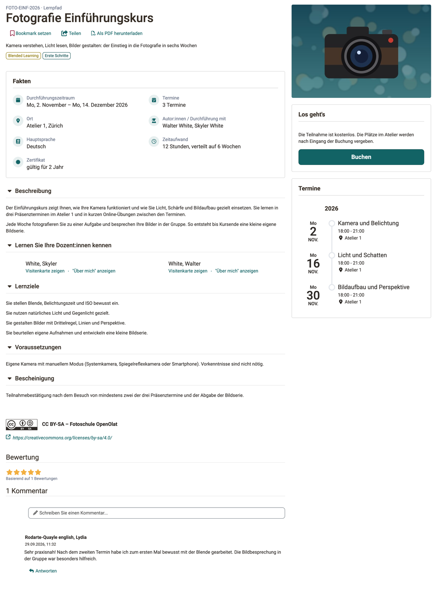
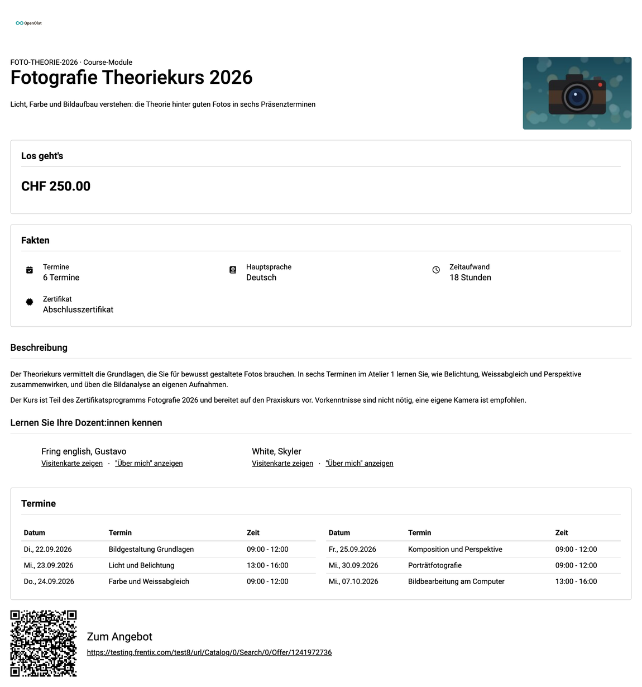
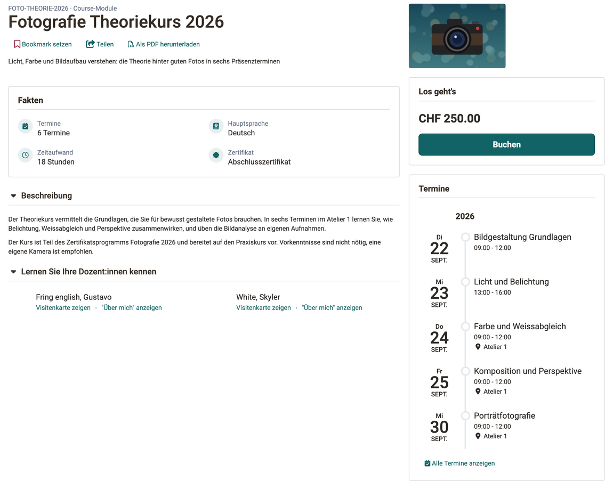
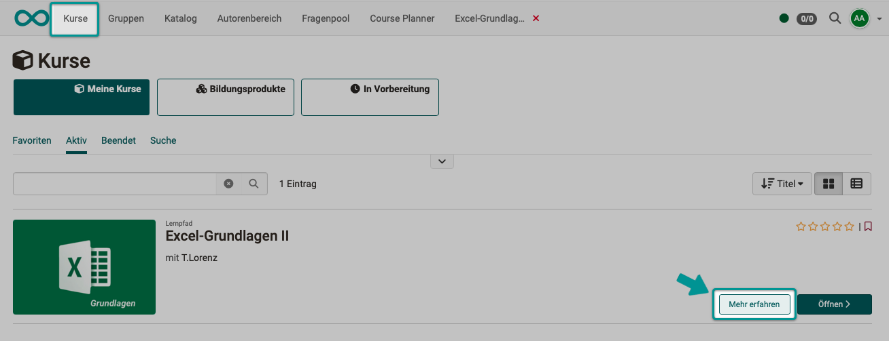
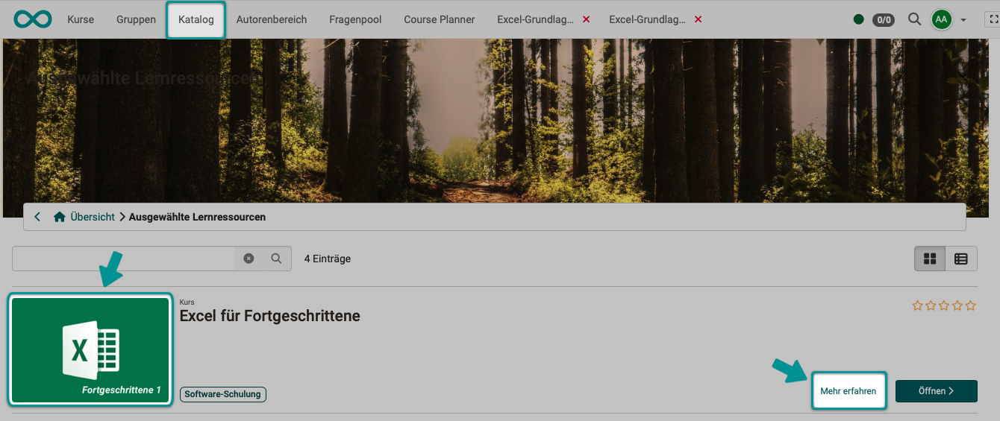
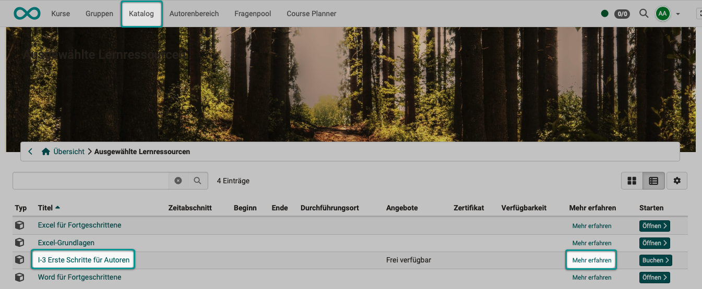
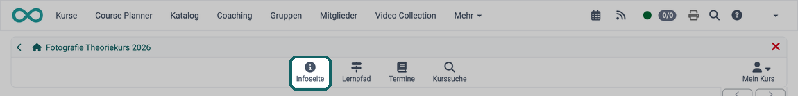

# Allgemeine Funktionen: Infoseite {: #general_functions_info}

## Wozu dient die Infoseite? [:octicons-tag-16:{ title="ab Release 10.0 (OO-984)" }](https://track.frentix.com/issue/OO-984){:target="_blank"} {: #purpose}

Wer überlegt, ob ein Kurs der richtige ist, findet auf der Infoseite alles, was vor dem Buchen oder Öffnen zählt: Beschreibung, Termine, Lernziele, Dozent:innen und den Preis. Jede Lernressource hat eine Infoseite, ebenso jede Durchführung im Course Planner. Einen Teil der Angaben erzeugt OpenOlat selbst, den Rest tragen Besitzer:innen der Lernressource in den Einstellungen ein. Nach der Veröffentlichung sehen Interessierte die Infoseite, auch ohne Buchung und bevor sie die Lernressource betreten. Das lohnt sich besonders, wenn Sie die Zielgruppe vorab informieren möchten, etwa bei einem kostenpflichtigen Kurs.

Sie rufen die Infoseite im Kurs über den Link "Infoseite" in der Toolbar auf, in der Kursübersicht und im Katalog über "Mehr erfahren". Die Aufrufwege finden Sie unter [Wo findet man die Infoseite?](#access).

{ class="shadow lightbox" title="Infoseite eines Kurses · 2026.09.29" }

[Zum Seitenanfang ^](#general_functions_info)

---

## Informationen der Infoseite [:octicons-tag-16:{ title="ab Release 21.1 (OO-8728)" }](https://track.frentix.com/issue/OO-8728){:target="_blank"} {: #content}

Die Tabelle zeigt, woraus die Infoseite besteht, von oben nach unten. Die Spalte "Im Bild" sagt, ob das Element im Bild oben zu sehen ist. Die Pfade beziehen sich auf die Einstellungen der Lernressource: `Kurs > Administration > Einstellungen`. "nur Kurs" heisst, dass andere Lernressourcen diese Einstellung nicht haben. Ein Element erscheint nur, wenn es einen Inhalt hat.

| Element | Im Bild | Als Autor:in einstellen unter | Nur mit Administration |
|---|---|---|---|
| **Kopf** | | | |
| Kennzeichen | ja | Tab "Metadaten" | nein |
| Typ | ja | automatisch | nein |
| Titel | ja | Tab "Metadaten" | nein |
| Bookmark setzen | ja | automatisch | nein |
| Teilen | ja | automatisch | nein |
| Als PDF herunterladen | ja | automatisch | PDF Generator |
| Teaser | ja | Tab "Info" | nein |
| Durchführungsformat | ja | nur Kurs: Tab "Metadaten" | nein |
| Fachbereiche | ja | Tab "Metadaten" | Taxonomie |
| **Rechte Spalte** | | | |
| Titelbild oder Teaser-Film | ja | Tab "Info" | nein |
| Los geht's mit Buchen oder Öffnen [:octicons-tag-16:{ title="ab Release 20.2 (OO-9042)" }](https://track.frentix.com/issue/OO-9042){:target="_blank"} | ja | automatisch, Angebote unter Tab "Freigabe" | nein |
| Mein Kurs | nein | automatisch für Mitglieder, Fortschritt, Status und Punkte nur Kurs | nein |
| Termine | ja | nur Kurs: Tab "Info", "Auf Infoseite anzeigen" | Termine / Absenzen |
| **Fakten** | | | |
| Durchführungszeitraum | ja | nur Kurs: Tab "Durchführung" | nein |
| Termine | ja | nur Kurs: Tab "Info", "Auf Infoseite anzeigen" | Termine / Absenzen |
| Ort | ja | nur Kurs: Tab "Durchführung", Feld "Durchführungsort" | nein |
| Autor:innen / Durchführung mit | ja | Tab "Info" | nein |
| Hauptsprache | ja | Tab "Info" | nein |
| Zeitaufwand | ja | Tab "Info" | nein |
| Kreditpunkte | nein | nur Kurs: Tab "Info", "Auf Infoseite anzeigen" | Kreditpunkte |
| Zertifikat | ja | nur Kurs: Tab "Info", "Auf Infoseite anzeigen" | nein |
| Teilnehmer:innen | nein | nur Durchführung | nein |
| **Abschnitte** | | | |
| Beschreibung | ja | Tab "Info" | nein |
| Gliederung | nein | nur Durchführung | nein |
| Lernen Sie Ihre Dozent:innen kennen | ja | nur Kurs: Tab "Info", "Auf Infoseite anzeigen" | nein |
| Lernziele | ja | nur Kurs: Tab "Info", Abschnitt "Erweiterte Informationen" | nein |
| Voraussetzungen | ja | nur Kurs: Tab "Info", Abschnitt "Erweiterte Informationen" | nein |
| Bescheinigung | ja | nur Kurs: Tab "Info", Abschnitt "Erweiterte Informationen" | nein |
| Kategorien | nein | Tab "Katalog" | Katalog V1 |
| **Unten** | | | |
| Lizenz | ja | Tab "Metadaten" | Lizenzen |
| Bewertung | ja | automatisch | Bewertung |
| Kommentare | ja | automatisch | Kommentar |

Einige Elemente erscheinen erst, wenn Administrator:innen das zugehörige Modul in der System-Administration eingeschaltet haben. Die Schaltfläche "Als PDF herunterladen" braucht den [PDF Generator](../../manual_admin/administration/External_Tools_-_Administration.de.md#pdf_generator). Bewertung und Kommentare schalten Administrator:innen im [Modul Lernressource](../../manual_admin/administration/Modules_Learning_Resource.de.md) ein, Lizenzen unter [Lizenzen](../../manual_admin/administration/Licenses.de.md), Fachbereiche im [Modul Taxonomie](../../manual_admin/administration/Modules_Taxonomy.de.md). Termine setzen das [Modul Termine und Absenzen](../../manual_admin/administration/Modules_Events_and_Absences.de.md) voraus. Kreditpunkte richten Administrator:innen in der [e-Assessment Administration](../../manual_admin/administration/e-Assessment_Credit_Points.de.md) ein.

Technische Angaben wie die ID, den externen Link und die Verantwortlichen zeigt die Infoseite nicht. Sie stehen im Fenster "Über diesen Kurs", siehe [Toolbar: Infoseite](../learningresources/Info_page.de.md#about).

!!! note "Hinweis"

    Wenn Sie als Teilnehmer:in kaum Informationen auf der Infoseite finden, dann liegt es daran, dass Ihre Lehrperson diese Seite (noch) nicht weiter eingerichtet hat. Sprechen Sie die Lehrperson darauf an.

[Zum Seitenanfang ^](#general_functions_info)

---

## Infoseite drucken oder als PDF herunterladen [:octicons-tag-16:{ title="ab Release 21.1 (OO-9299)" }](https://track.frentix.com/issue/OO-9299){:target="_blank"} {: #print}

Wer einen Kurs erst nach der Zustimmung einer vorgesetzten Person buchen darf, braucht die Kursangaben oft auf Papier. Die Infoseite lässt sich dafür als Flyer ausgeben: einspaltig, ohne Schaltflächen und mit einem QR-Code, der direkt zum Angebot führt.

Klicken Sie im Kopf der Infoseite auf **Als PDF herunterladen**. Die Schaltfläche steht neben "Bookmark setzen" und "Teilen". OpenOlat erzeugt eine PDF-Datei mit dem Titel der Lernressource als Dateinamen. Den gleichen Ausdruck erhalten Sie über den Befehl "Drucken" Ihres Browsers, dann ohne Datei.

{ class="shadow lightbox" title="PDF einer Infoseite · 2026.09.29" }

Der Ausdruck enthält:

- oben das Logo der OpenOlat-Instanz, falls das Layout eines hinterlegt hat
- Titel, Teaser und Titelbild
- bei "Los geht's" nur die Angaben zum gewählten Angebot, zum Beispiel den Preis
- Fakten, alle Abschnitte in aufgeklapptem Zustand, Lizenz und Sternebewertung
- die Termine als Tabelle mit Datum, Termin und Zeit
- am Ende den QR-Code mit der Überschrift "Zum Angebot" und der Adresse des Angebots

Der Ausdruck lässt weg, was nur am Bildschirm Sinn ergibt: Bookmark setzen, Teilen und Als PDF herunterladen, die Schaltflächen "Buchen" und "Kurs öffnen", Hinweise und freie Plätze sowie die Kommentare. Sind Sie bereits Mitglied, entfällt "Los geht's" ganz. Der QR-Code zeigt auf dieselbe Adresse wie die Aktion "Teilen". Wo die Infoseite keine Aktion "Teilen" hat, fehlt auch der QR-Code.

!!! note "Hinweis"

    Die Schaltfläche "Als PDF herunterladen" erscheint nur, wenn Administrator:innen einen PDF-Dienst eingerichtet haben, siehe [Externe Werkzeuge: PDF Generator](../../manual_admin/administration/External_Tools_-_Administration.de.md#pdf_generator). Ohne PDF-Dienst drucken Sie die Infoseite über den Browser.

[Zum Seitenanfang ^](#general_functions_info)

---

## Infoseite einer Durchführung [:octicons-tag-16:{ title="ab Release 20.0 (OO-8286)" }](https://track.frentix.com/issue/OO-8286){:target="_blank"} {: #implementation}

Wer eine Durchführung im Course Planner bucht, sieht vorher dieselbe Infoseite wie bei einem Kurs, mit Fakten, Abschnitten, Terminen und "Los geht's". Drucken und "Als PDF herunterladen" funktionieren gleich.

{ class="shadow lightbox" title="Infoseite einer Durchführung · 2026.09.29" }

Einige Elemente unterscheiden sich:

- **Es fehlen** Lizenz, Bewertung, Kommentare und "Mein Kurs".
- **Dazu kommen** der Abschnitt "Gliederung" und der Fakt "Teilnehmer:innen" mit der Zahl der Plätze.
- **Im Kopf** steht neben dem Kennzeichen der Elementtyp der Durchführung.

Sie stellen die Angaben nicht in einem Kurs ein, sondern im Course Planner in den Einstellungen der Durchführung, in den Tabs "Metadaten", "Infos" und "Durchführung". Mehr dazu unter [Course Planner: Durchführungen](../area_modules/Course_Planner_Implementations.de.md#tab_settings).

[Zum Seitenanfang ^](#general_functions_info)

---

## Wo findet man die Infoseite? {: #access}

### Aufruf der Infoseite in der Kursübersicht {: #access_course_overview}

Öffnen Sie in der Hauptnavigation Ihre Kursübersicht durch Klick auf "Kurse". 
Dann wählen Sie den Link "Mehr erfahren" neben dem Button "Öffnen" eines Kurses.

{ class="shadow lightbox" title="Kursübersicht Kurse im Tab Aktiv" }

[Zum Seitenanfang ^](#general_functions_info)

---

### Aufruf der Infoseite im Katalog {: #access_catalog}

In der Kachelansicht des Katalogs finden Sie den Link "Mehr erfahren" zur Anzeige der Infoseite rechts unten. Sie können aber auch das Bild anklicken.

{ class="shadow lightbox" title="Kachel eines Kurses im Katalog" }

In der Listenansicht klicken Sie den Link "Mehr erfahren" oder den Titel der Lernressource.

{ class="shadow lightbox" title="Listenansicht des Katalogs" }

[Zum Seitenanfang ^](#general_functions_info)

---

### Aufruf der Infoseite innerhalb eines Kurses {: #access_within_a_course}

Wenn Sie sich im Kurs befinden, wählen Sie den Link "Infoseite" mit dem Info-Symbol in der Toolbar. Dieselbe Seite erreichen Sie auch in jeder anderen geöffneten Lernressource über die Toolbar.

{ class="shadow lightbox" title="Toolbar eines geöffneten Kurses · 2026.09.29" }

[Zum Seitenanfang ^](#general_functions_info)

---

### Aufruf der Infoseite zu sonstigen Lernressourcen {: #access_other_learning_resources}

Die Infoseite zu sonstigen Lernressourcen rufen Sie gleich auf wie die Infoseite der Kurse. Im Autorenbereich führt kein Link direkt zur Infoseite: Öffnen Sie die Lernressource und wählen Sie dort "Infoseite" in der Toolbar.

Die Angaben zur Verwendung, etwa in welchen Kursen die Lernressource eingebunden ist, stehen nicht auf der Infoseite, sondern im Fenster "Über diese Lernressource", siehe [Toolbar: Infoseite](../learningresources/Info_page.de.md#about).

[Zum Seitenanfang ^](#general_functions_info)

---

## Weiterführende Informationen {: #further_information}

**Auf dieser Seite erwähnt** 
[Externe Werkzeuge: Übersicht >](../../manual_admin/administration/External_Tools_-_Administration.de.md) 
[Modul Lernressource >](../../manual_admin/administration/Modules_Learning_Resource.de.md) 
[Lizenzen >](../../manual_admin/administration/Licenses.de.md) 
[Modul Taxonomie >](../../manual_admin/administration/Modules_Taxonomy.de.md) 
[Modul Termine und Absenzen >](../../manual_admin/administration/Modules_Events_and_Absences.de.md) 
[e-Assessment Administration: Kreditpunkte >](../../manual_admin/administration/e-Assessment_Credit_Points.de.md) 
[Toolbar: Infoseite >](../learningresources/Info_page.de.md) 
[Course Planner: Durchführungen >](../area_modules/Course_Planner_Implementations.de.md)

**Weiterführend** 
[Kurseinstellungen >](../learningresources/Course_Settings.de.md) 
[Zugangskonfiguration / Freigabe >](../learningresources/Access_configuration.de.md)

[Zum Seitenanfang ^](#general_functions_info)
