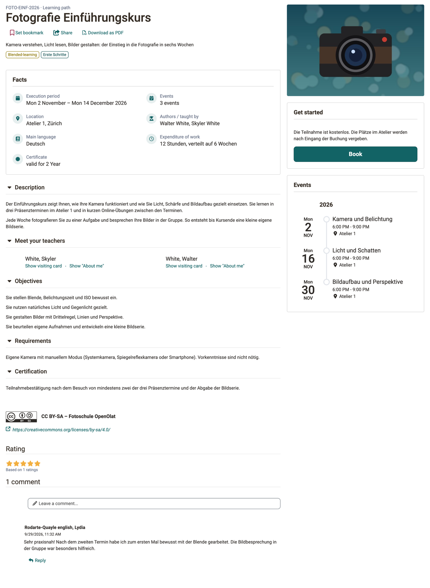
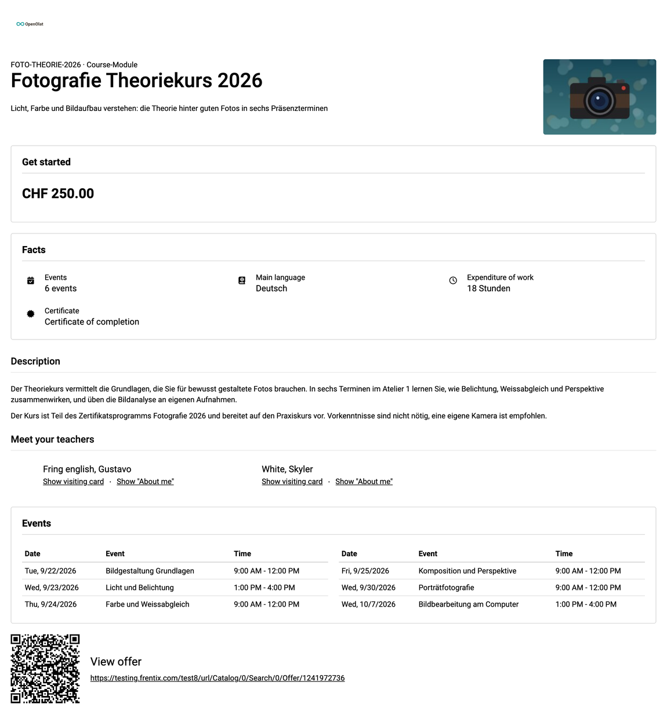
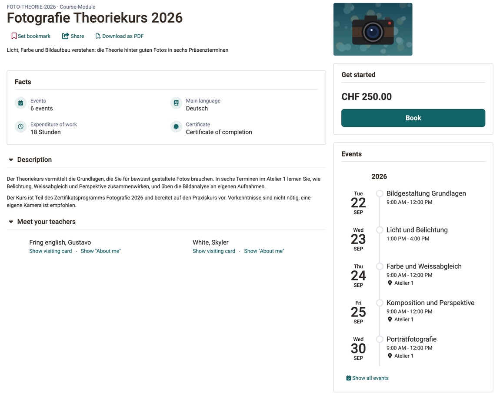

# General Functions: Info Page {: #general_functions_info}

## What's the purpose of the info page? [:octicons-tag-16:{ title="from Release 10.0 (OO-984)" }](https://track.frentix.com/issue/OO-984){:target="_blank"} {: #purpose}

Anyone deciding whether a course is the right one finds everything that matters before booking or opening it on the info page: description, events, objectives, teachers and the price. Every learning resource has an info page, and so does every implementation in the Course Planner. OpenOlat generates part of the information itself, the owners of the learning resource enter the rest in the settings. Once the learning resource is published, interested users see the info page, even without a booking and before they enter the learning resource. This is particularly useful if you want to inform the target audience in advance, for example for a course with a fee.

In a course, you open the info page via the link "Info page" in the toolbar, in the course overview and in the catalog via "Learn more". The ways to open it are described under [How do you access the info page?](#access).

{ class="shadow lightbox" title="Info page of a course · 2026.09.29" }

[To the top of the page ^](#general_functions_info)

---

## Content of the info page [:octicons-tag-16:{ title="from Release 21.1 (OO-8728)" }](https://track.frentix.com/issue/OO-8728){:target="_blank"} {: #content}

The table shows what the info page consists of, from top to bottom. The column "In the image" tells you whether the element can be seen in the image above. The paths refer to the settings of the learning resource: `Course > Administration > Settings`. "Course only" means that other learning resources do not have this setting. An element only appears if it has content.

| Element | In the image | Set as author under | Only with administration |
|---|---|---|---|
| **Header** | | | |
| Reference | yes | Tab "Metadata" | no |
| Type | yes | automatic | no |
| Title | yes | Tab "Metadata" | no |
| Set bookmark | yes | automatic | no |
| Share | yes | automatic | no |
| Download as PDF | yes | automatic | PDF Generator |
| Teaser | yes | Tab "Info" | no |
| Implementation format | yes | course only: Tab "Metadata" | no |
| Subjects | yes | Tab "Metadata" | Taxonomy |
| **Right column** | | | |
| Cover image or teaser movie | yes | Tab "Info" | no |
| Get started with booking or opening [:octicons-tag-16:{ title="from Release 20.2 (OO-9042)" }](https://track.frentix.com/issue/OO-9042){:target="_blank"} | yes | automatic, offers under Tab "Share" | no |
| My course | no | automatic for members, progress, status and score course only | no |
| Events | yes | course only: Tab "Info", "Display on info page" | Events / Absences |
| **Facts** | | | |
| Execution period | yes | course only: Tab "Execution" | no |
| Events | yes | course only: Tab "Info", "Display on info page" | Events / Absences |
| Location | yes | course only: Tab "Execution", field "Location" | no |
| Authors / taught by | yes | Tab "Info" | no |
| Main language | yes | Tab "Info" | no |
| Expenditure of work | yes | Tab "Info" | no |
| Credit points | no | course only: Tab "Info", "Display on info page" | Credit points |
| Certificate | yes | course only: Tab "Info", "Display on info page" | no |
| Participants | no | implementation only | no |
| **Sections** | | | |
| Description | yes | Tab "Info" | no |
| Outline | no | implementation only | no |
| Meet your teachers | yes | course only: Tab "Info", "Display on info page" | no |
| Objectives | yes | course only: Tab "Info", section "Details" | no |
| Requirements | yes | course only: Tab "Info", section "Details" | no |
| Certification | yes | course only: Tab "Info", section "Details" | no |
| Categories | no | Tab "Catalog" | Catalog V1 |
| **Bottom** | | | |
| License | yes | Tab "Metadata" | Licenses |
| Rating | yes | automatic | Rating |
| Comments | yes | automatic | Comment |

Some elements only appear once administrators have switched on the corresponding module in the system administration. The button "Download as PDF" requires the [PDF Generator](../../manual_admin/administration/External_Tools_-_Administration.md#pdf_generator). Administrators switch on rating and comments in the [Module Learning resource](../../manual_admin/administration/Modules_Learning_Resource.md), licenses under [Licenses](../../manual_admin/administration/Licenses.md), subjects in the [Module Taxonomy](../../manual_admin/administration/Modules_Taxonomy.md). Events require the [Module Events and Absences](../../manual_admin/administration/Modules_Events_and_Absences.md). Administrators set up credit points in the [e-Assessment Administration](../../manual_admin/administration/e-Assessment_Credit_Points.md).

The info page does not show technical details such as the ID, the external link and the responsible persons. They are in the window "About this course", see [Toolbar: Info page](../learningresources/Info_page.md#about).

!!! note "Note"

    If you, as a participant, can hardly find any information on the info page, it is because your instructor has not set up this page (yet). Ask your instructor about it.

[To the top of the page ^](#general_functions_info)

---

## Print the info page or download it as PDF [:octicons-tag-16:{ title="from Release 21.1 (OO-9299)" }](https://track.frentix.com/issue/OO-9299){:target="_blank"} {: #print}

Anyone who may only book a course after approval by a supervisor often needs the course details on paper. For this, the info page can be output as a flyer: in one column, without buttons and with a QR code that leads directly to the offer.

Click **Download as PDF** in the header of the info page. The button is next to "Set bookmark" and "Share". OpenOlat creates a PDF file with the title of the learning resource as the file name. You get the same printout with the "Print" command of your browser, then without a file.

{ class="shadow lightbox" title="PDF of an info page · 2026.09.29" }

The printout contains:

- at the top the logo of the OpenOlat instance, if the layout provides one
- title, teaser and cover image
- under "Get started" only the details of the selected offer, for example the price
- facts, all sections expanded, license and star rating
- the events as a table with date, event and time
- at the end the QR code with the heading "View offer" and the address of the offer

The printout leaves out what only makes sense on screen: Set bookmark, Share and Download as PDF, the buttons "Book" and "Open Course", notes and free places, and the comments. If you are already a member, "Get started" is left out completely. The QR code points to the same address as the action "Share". Where the info page has no action "Share", the QR code is missing too.

!!! note "Note"

    The button "Download as PDF" only appears if administrators have set up a PDF service, see [External Tools: PDF Generator](../../manual_admin/administration/External_Tools_-_Administration.md#pdf_generator). Without a PDF service, print the info page via the browser.

[To the top of the page ^](#general_functions_info)

---

## Info page of an implementation [:octicons-tag-16:{ title="from Release 20.0 (OO-8286)" }](https://track.frentix.com/issue/OO-8286){:target="_blank"} {: #implementation}

Anyone booking an implementation in the Course Planner first sees the same info page as for a course, with facts, sections, events and "Get started". Printing and "Download as PDF" work the same way.

{ class="shadow lightbox" title="Info page of an implementation · 2026.09.29" }

Some elements differ:

- **Missing** are license, rating, comments and "My course".
- **Added** are the section "Outline" and the fact "Participants" with the number of places.
- **In the header**, the element type of the implementation appears next to the reference.

You do not enter the details in a course, but in the Course Planner in the settings of the implementation, in the tabs "Metadata", "Infos" and "Execution". More on this under [Course Planner: Implementations](../area_modules/Course_Planner_Implementations.md#tab_settings).

[To the top of the page ^](#general_functions_info)

---

## How do you access the info page? {: #access}

### Access the info page via the course overview {: #access_course_overview}

In the main navigation, open your course overview by clicking on "Courses". 
Then select the link "Learn more" next to the "Open" button of a course.

{ class="shadow lightbox" title="Course overview Courses in the tab Active" }

[To the top of the page ^](#general_functions_info)

---

### Access the info page in the catalog {: #access_catalog}

In the tile view of the catalog, you find the link "Learn more" to display the info page at the bottom right. You can also click on the image.

{ class="shadow lightbox" title="Tile of a course in the catalog" }

In the list view, click the link "Learn more" or the title of the learning resource.

{ class="shadow lightbox" title="List view of the catalog" }

[To the top of the page ^](#general_functions_info)

---

### Access the info page within a course {: #access_within_a_course}

Once you are in the course, select the link "Info page" with the info icon in the toolbar. You reach the same page in any other opened learning resource via the toolbar.

{ class="shadow lightbox" title="Toolbar of an opened course · 2026.09.29" }

[To the top of the page ^](#general_functions_info)

---

### Access the info page of other learning resources {: #access_other_learning_resources}

You open the info page of other learning resources in the same way as the info page of courses. In the authoring area, no link leads directly to the info page: open the learning resource and select "Info page" in the toolbar there.

The details on usage, for example in which courses the learning resource is embedded, are not on the info page, but in the window "About this learning resource", see [Toolbar: Info page](../learningresources/Info_page.md#about).

[To the top of the page ^](#general_functions_info)

---

## Further information {: #further_information}

**Mentioned on this page** 
[External Tools: Overview >](../../manual_admin/administration/External_Tools_-_Administration.md) 
[Module Learning resource >](../../manual_admin/administration/Modules_Learning_Resource.md) 
[Licenses >](../../manual_admin/administration/Licenses.md) 
[Module Taxonomy >](../../manual_admin/administration/Modules_Taxonomy.md) 
[Module Events and Absences >](../../manual_admin/administration/Modules_Events_and_Absences.md) 
[e-Assessment Administration: Credit points >](../../manual_admin/administration/e-Assessment_Credit_Points.md) 
[Toolbar: Info page >](../learningresources/Info_page.md) 
[Course Planner: Implementations >](../area_modules/Course_Planner_Implementations.md)

**Further reading** 
[Course Settings >](../learningresources/Course_Settings.md) 
[Access configuration >](../learningresources/Access_configuration.md)

[To the top of the page ^](#general_functions_info)
