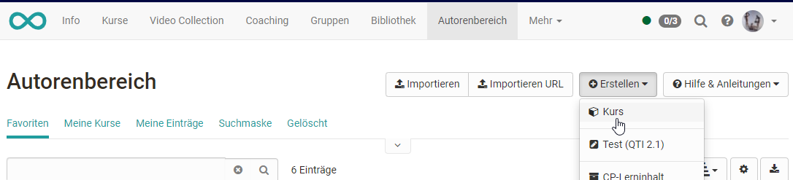

# Allgemeines

:octicons-device-camera-video-24: **Video-Einführung**: [OpenOlat Funktionsprinzipien](<https://www.youtube.com/embed/M-JkSAFN298>){:target="_blank”}

OpenOlat-Kurse ermöglichen das Abbilden von diversen Veranstaltungsformaten z.B. Vorlesungen, Seminare, Online-Tutorien oder Gruppenpuzzle, genauso wie die Umsetzung verschiedener Arten von Lernen, z.B. problembasiertes Lernen, kooperatives Lernen, selbstorganisiertes Lernen usw. Durch den Einsatz beliebig vieler [Kursbausteine](Course_Elements.de.md) in frei wählbarer Reihenfolge, gewährt Ihnen OpenOlat maximale Flexibilität bei der Umsetzung Ihres didaktischen Konzepts.

Beantragen Sie bei Ihrer OpenOlat-Supportstelle bzw. den Administratoren Ihrer OpenOlat Instanz, Autorenrechte und legen Sie los!

## Der Kurszyklus im Überblick

### 1. Kurs anlegen

Lernressource Kurs im "Autorenbereich" erstellen und den gewünschten Kurstyp "Lernpfad" oder "herkömmlicher Kurs" wählen.

{ class="shadow" }

!!! info "Weitere Informationen"
	  * [Kurse erstellen](../learningresources/Creating_Course.de.md)
	  * [Mein erster Kurs](../../manual_how-to/my_first_course/my_first_course.de.md)
	  * [Lernpfad Kurse erstellen](Creating_learning_path_courses.de.md)

### 2. Kurs einrichten, gestalten, publizieren

Im Kurseditor setzen Sie dann Ihren Kurs um, indem Sie die für Sie passenden
Kursbausteine auswählen, eventuell Lernressourcen erstellen und alles wie
gewünscht konfigurieren.

!!! info "Weitere Informationen"
	  * [Kursbausteine](Course_Elements.de.md)
	  * [Verwendung von Kurseditorwerkzeugen](Using_additional_Course_Editor_Tools.de.md)
	  * [Lernpfad Kurs - Kurseditor](../learningresources/Learning_path_course_Course_editor.de.md)
	  * [Lernressourcen](../learningresources/index.de.md)
	  * [Allgemeine Konfiguration von Kursbausteinen](General_Configuration_of_Course_Elements.de.md)
	  * [Kurseinstellungen](Course_Settings.de.md)

### 3. Zugang einrichten

Im Administrationsmenü "Einstellungen" werden die benötigten Einstellungen für den Zugang vorgenommen. Insbesondere der Tab "Freigabe" ist dabei wichtig.

!!! info "Weitere Informationen"
	  * [Zugangskonfiguration](Access_configuration.de.md)
	  * [Kurseinstellungen](Course_Settings.de.md)

### 4. Kurs Status veröffentlichen

In der Kurs Toolbar den Status auf "Veröffentlicht" setzen, damit der Kurs
auch für die Lernenden sichtbar wird.

!!! info "Weitere Informationen"
	  * [Zugangskonfiguration](Access_configuration.de.md)  

### 5. Kurs durchführen und Assessmentbausteine bewerten

Nutzen Sie das Bewertungswerkzeug für Bewertung und Feedbacks. Posten Sie im
Forum, organisieren Sie die Absenzen und nehmen Sie weitere betreuende
Handlungen vor.

!!! info "Weitere Informationen"
	  * [Kursbetrieb](../learningresources/Administration.de.md)

### 6. Kurs beenden {: #end_course}

Ist der Kurs abgelaufen, sollten Sie den Status auf "beendet" setzen.

!!! info "Weitere Informationen"
	  * [Zugangskonfiguration](Access_configuration.de.md)  

### 7. Kurs löschen

Das "Löschen" des Kurses erfolgt über das passende Menü in der Kurs
Administration. Gelöschte Kurse können im Autorenbereich über die Filteroption
im Lebenszyklus ein- oder ausgeblendet oder gezielt über den Link "Gelöscht"
angezeigt werden.

!!! info "Weitere Informationen"
	  * [Zugangskonfiguration](Access_configuration.de.md)  

## Tip
  
!!! hint "Bevor Sie Ihren OpenOlat Kurs erstellen"

	Überlegen Sie zunächst was Sie mit dem Kurs bezwecken wollen.
	
	Wie der Aufbau Ihres Kurses aussieht ist also abhängig von Ihrem didaktischen
	Konzept, den Zielen und den gesamten Rahmenbedingungen. Auf dieser Basis
	können Sie entscheiden, ob ein herkömmlicher Kurs oder ein Lernpfad Kurs für
	Sie die passende Wahl ist. Entscheiden Sie sich im Zweifelsfall für den
	herkömmlichen Kurs, da Sie diesen jederzeit in einen Lernpfad Kurs umwandeln
	können. Umgekehrt geht das nicht.
	
	Wählen Sie nach der Grundsatzentscheidung des Kurstyps die optimalen und
	effektivsten Kursbausteine aus mit denen Sie Ihr Ziel erreichen und Ihr
	Kurskonzept umsetzen können. Versuchen Sie auch zusammengehörende Dinge
	sinnvoll zu bündeln, um eine optimale Usability zu erreichen. Wenn der Aufbau
	klar ist, bereiten Sie die Lerninhalte, weitere Dateien ([HTML pages, PDF files, CPs](../learningresources/index.de.md), etc.) und alles, was Sie für den
	Einsatz in der Lernplattform benötigen, vor.

---

## Rollenwechsel 
In der Toolbar wird Ihnen angezeigt, in welcher Rolle Sie gerade den Kurs betrachten. Als Autor:in eines Kurses wird dies in der Regel die Rolle "Besitzer:in" sein. Sie können aber jederzeit über das Ausklappmenü in die Teilnehmendenrolle wechseln. 

Sofern Sie noch weitere Rollen im Kurs besitzen werden diese ebenfalls angezeigt und Sie können zur entsprechenden Ansicht wechseln.  

Bei den Rollen wird aber nicht zwischen Betreuer:innen und Gruppenbetreuer:innen oder Teilnehmer:innen und Gruppenteilnehmer:innen unterschieden, sondern die Möglichkeiten innerhalb der Rolle Betreuer:in bzw. Teilnehmer:in zusammengefasst.

Der Rollenwechsel bietet sich z.B. an, wenn man als Kursbesitzer:in die Teilnehmenden-Rolle einnehmen möchte. Auch kann man sich so den Flow der Kursbausteine Aufgabe, Gruppenaufgabe, Checkliste oder des Teilnehmer:innenordners aus der Teilnehmendensicht gut anschauen.

    
Spezialfall: Verhalten bei Einschreibung in eine Gruppe (Einschreibe-Baustein)

    
    <b>Situation:</b>  
    - Sie erstellen einen Kurs mit dem Kursbaustein "Einschreibung". 
    - Sie wechseln in die Teilnehmer:innenansicht und nehmen eine Einschreibung vor.  
    <b>-></b> OpenOlat wechselt danach ungewollt in die Besitzer:innenrolle. 
    - Bei erneutem Wechsel in die Teilnehmer:innenansicht wird der sinnvolle Warndialog ("Sie sind in der Rolle Teilnehmer:in") mit Löschoption für Daten nicht mehr angezeigt. 
    - Erst nach einem erneuten Aufruf des Kurses wird die Teilnehmer:innenansicht mit Warndialog wieder korrekt angezeigt.
      
    <b>Erklärung:</b>  
    Die Teilnehmer:innenansicht ist analog zur Kurs-Freigabe "Ohne Buchung" umgesetzt - man ist in dieser Ansicht nicht in der Kurs-Mitgliederverwaltung eingebucht.
    Es passiert deshalb nun Folgendes: 
    - Trägt man sich im Einschreibe-Baustein in eine Gruppe eine, so wird man in diesem Moment Gruppenteilnehmer:in und ist in der Mitgliederverwaltung des Kurses eingetragen. 
    - Sobald man im Kurs eine eingetragene Mitgliedschaft "Teilnehmer:in" (Kurs oder Gruppe oder Curriculum) besitzt, steht die "Teilnehmer:innen-Ansicht" nicht mehr zur Verfügung. Diese ist nur vorhanden, wenn man nicht in der Kurs-Mitgliederverwaltung als Teilnehmer:in aufgeführt ist. 
    <b>-></b> Schreibe ich mich aus der Teilnehmer:innenansicht in eine Gruppe ein, existiert danach die Teilnehmerinnenansicht für mich nicht mehr, sondern ich bin als Gruppenteilnehmer:in in der Mitgliederverwaltung des Kurses aufgeführt. Deshalb wechselt die Rolle von der Teilnehmerinnenansicht in die Besitzer:innen-Rolle. 
    - Klappt man nun bei den Rollen die Auswahl aus, sieht man anstelle der Teilnehmer:innenansicht nun die Rolle "Teilnehmer:in" aufgeführt. 
    - Trägt man sich aus der Gruppe wieder aus (und lädt den Kurs neu), so ist die Rolle "Teilnehmer:in" wieder weg und stattdessen die Teilnehmer:innenansicht wieder verfügbar.  

