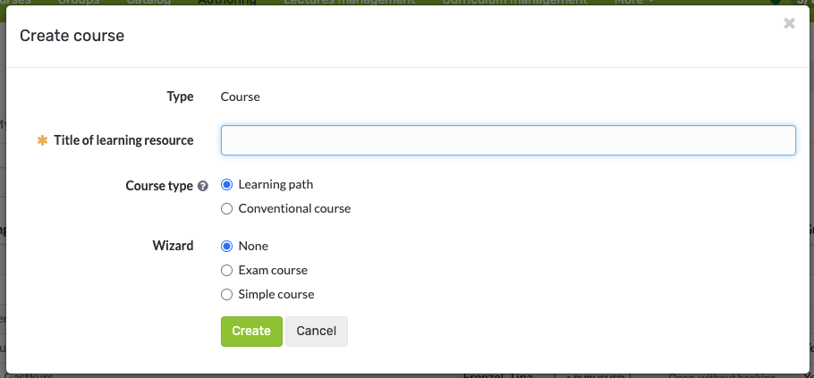
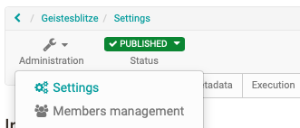
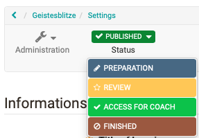
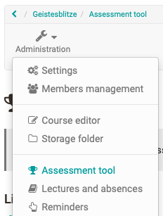

# General Information

OpenOlat courses enable the mapping of various event formats e.g. lectures, seminars, online tutorials or group puzzles, as well as the implementation of different types of learning, e.g. problem-based learning, cooperative learning, self-organized learning etc. A maximum of flexibility is guaranteed by using any number of [course elements](Course_Elements.md) in any order of your choice; therefore it is easy to realize your didactic concept.

Apply for author rights at your OpenOlat support center or the administrators of your OpenOlat instance and get started!

## The course cycle at a glance

### 1. Create course

Creating a Learning Resource Course in the Authoring Area and choosing the course type "Learning path" or "Conventional course".

{ class="shadow" }  

!!! info "Further Information"
	  * [Creating Courses](../learningresources/Creating_Course.md)
	  * [My first course](../../manual_how-to/my_first_course/my_first_course.md)
	  * [Creating learning path courses](Creating_learning_path_courses.md)

### 2. Set up, design, publish course

You implement your course in the course editor by selecting suitable course elements, creating learning resources if necessary, and configuring everything as desired.

{ class="shadow" }

!!! info "Further Information"
	  * [Course elements](Course_Elements.md)
	  * [Using additional Course Editor Tools](Using_additional_Course_Editor_Tools.md)
	  * [Learning path course - Course editor](../learningresources/Learning_path_course_Course_editor.md)
	  * [Various types of learning resources](../learningresources/index.md)
	  * [General Configuration of Course Elements](General_Configuration_of_Course_Elements.md)
	  * [Course Settings](Course_Settings.md)

### 3. Set up access

In the administration menu "Settings" the necessary settings for the access are made. The "Share" tab is particularly important here.

{ class="shadow" }

!!! info "Further Information"
	  * [Access configuration](Access_configuration.md)
	  * [Course Settings](Course_Settings.md)
  
### 4. Publish course status

In the course toolbar set the status to "Published" in order for students to see the course.

{ class="shadow" }

!!! info "Further Information"
	  * [Access configuration](Access_configuration.md)  
  
### 5. Execute course and evaluate assessment modules

Now especially the assessment tool is needed and further actions are carried out directly in the course, e.g. forums are supervised, absences are organised etc.

{ class="shadow" }

!!! info "Further Information"
	  * [Course Operation](../learningresources/Administration.md)

### 6. End course {: #end_course}

If the course has expired, the status is set to "finished".

{ class="shadow" }

!!! info "Further Information"
	  * [Access configuration](Access_configuration.md)  

### 7. Delete course

The deletion ("Delete") of the course is done via the appropriate menu in the course administration. Deleted courses can be shown or hidden in the authoring area via the filter option in the life cycle or specifically displayed in the "Deleted" tab.

{ class="shadow" }

!!! info "Further Information"
	  * [Access configuration](Access_configuration.md)  
  
## Tip

!!! hint "Before you create your OpenOlat course"

	First think about what you want to achieve with the course.
	
	What the course looks like depends on your didactic concept, the goals and the overall framework. On this basis, you can decide whether a conventional course or a learning path course is the right choice for you. If in doubt, opt for the conventional course, as you can convert it into a learning path course at any time. The other way around is not possible.
	
	After the decision, choose the optimal and most effective course elements and try to bundle things that belong together in a meaningful way to achieve optimal usability. When the structure is clear, prepare the learning content, additional files ([HTML pages, PDF files, CPs](../learningresources/index.md), etc.) and everything you need for use in the learning platform.

---

## Role change
The toolbar shows you in which role you are currently viewing the course. As author of a course, this will be as a rule the "owner" role. However, you can switch to the participant role at any time via the drop-down menu. 

If you have other roles in the course, these are also displayed and you can switch to the corresponding view. 

There is no further distinction between coaches and group coaches or participants and group participants, but the options within the role coach or participant are summarized.
ßß
The role change is useful if you want to look at the course from the respective perspective, e.g. as the course owner you want to take on the role of the participant. It is also possible to view the flow of the course elements task, group task, checklist or the participant folder from the participant's point of view.

    
Special case: Behaviour when enrolling in a group (course element 'enrolment')

    
    <b>Situation:</b>  
    - You create a course with the course element ‘Enrolment’. 
    - You switch to the participant view and make an enrolment.  
    <b>-></b> OpenOlat then unintentionally switches to the owner role. 
    - When switching back to the participant view, the useful warning dialogue (‘You are in the participant role’) with the option to delete data is no longer displayed. 
    - The participant view with warning dialogue is only displayed correctly again once the course has been called up again.
      
    <b>Explanation:</b>  
    The participant view is implemented in the same way as the course activation ‘Without booking’ - in this view you are not booked into the course member administration.
    The following therefore now happens: 
    - If you register for a group in the enrolment module, you become a group member at that moment and are entered in the course member administration.  
    - As soon as you have a registered ‘Participant’ membership (course or group or curriculum) in the course, the ‘Participant view’ is no longer available. This is only available if you are not listed as a participant in the course member administration. 
    <b>-></b> If I enrol in a group from the participant view, the participant view no longer exists for me, but I am listed as a group participant in the member administration of the course. The role therefore changes from the 'participant view' to the owner role. 
    - If you now unfold the selection for the roles, you will now see the role ‘Participant’ listed instead of the 'participant view'. 
    - If you unsubscribe from the group (and reload the course), the ‘Participant’ role is removed and the participant view is available again instead.  

