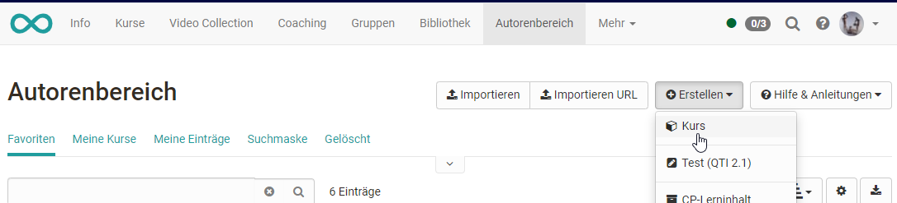
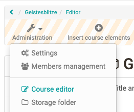
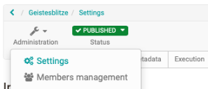
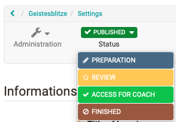
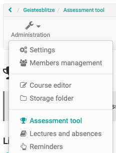
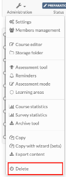
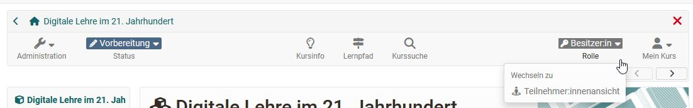

# General Information {: #general_information}

:octicons-device-camera-video-24: **Video introduction (German)**: [OpenOlat Funktionsprinzipien](<https://www.youtube.com/embed/M-JkSAFN298>){:target="_blank"}

OpenOlat courses enable the mapping of various event formats e.g. lectures, seminars, online tutorials or group puzzles, as well as the implementation of different types of learning, e.g. problem-based learning, cooperative learning, self-organized learning etc. A maximum of flexibility is guaranteed by using any number of [course elements](Course_Elements.md) in any order of your choice; therefore it is easy to realize your didactic concept.

Apply for author rights at your OpenOlat support center or the administrators of your OpenOlat instance and get started!

## The course cycle at a glance {: #course_lifecycle}

### 1. Create course {: #stage1}

Create the learning resource Course via `Authoring > Create > Course` and choose the desired course design: "With learning path" or "With learning progress" for a learning path course, "Classic" for a conventional course.

{ class="shadow lightbox" }

!!! note "Further Information"
    * [Creating Courses](../learningresources/Creating_Course.md)
    * [My first course](../../manual_how-to/my_first_course/my_first_course.md)
    * [Creating learning path courses](Creating_learning_path_courses.md)

### 2. Set up, design, publish course {: #stage2}

You implement your course in the course editor by selecting suitable course elements, creating learning resources if necessary, and configuring everything as desired.

{ class="shadow lightbox" }

!!! note "Further Information"
    * [Course elements](Course_Elements.md)
    * [Using additional Course Editor Tools](Using_additional_Course_Editor_Tools.md)
    * [Learning path course - Course editor](../learningresources/Learning_path_course_Course_editor.md)
    * [Various types of learning resources](../learningresources/index.md)
    * [General Configuration of Course Elements](General_Configuration_of_Course_Elements.md)
    * [Course Settings](Course_Settings.md)

### 3. Set up access {: #stage3}

You make the access settings in the course administration: `Course > Administration > Settings`. The "Share" tab is particularly important here.

{ class="shadow lightbox" }

!!! note "Further Information"
    * [Access configuration](Access_configuration.md)
    * [Course Settings](Course_Settings.md)

In learning path courses, it is partially possible to grant participants time-limited access to a course:

* At the course element level: yes, via `Course editor > Tab "Learning path"` with a relative date
* At the structure element level: no
* At the top-level node (overall course): no

### 4. Publish course status {: #stage4}

In the course toolbar set the status to "Published" in order for learners to see the course.

{ class="shadow lightbox" }

!!! note "Further Information"
    * [Access configuration](Access_configuration.md)

### 5. Execute course and evaluate assessment modules {: #stage5}

Use the assessment tool for assessment and feedback. Post in the forum, organise the absences and carry out further coaching actions.

{ class="shadow lightbox" }

!!! note "Further Information"
    * [Course Operation](../learningresources/Administration.md)

### 6. End course {: #stage6}

If the course has expired, you should set the status to "Finished".

{ class="shadow lightbox" }

!!! note "Further Information"
    * [Access configuration](Access_configuration.md)

### 7. Delete course {: #stage7}

The course is deleted via `Course > Administration > Delete`. Deleted courses can be shown or hidden in the authoring area via the filter option in the life cycle or specifically displayed in the "Deleted" tab.

{ class="shadow lightbox" }

!!! note "Further Information"
    * [Access configuration](Access_configuration.md)

## Tip {: #tip}

!!! tip "Before you create your OpenOlat course"

    First think about what you want to achieve with the course.

    What the course looks like depends on your didactic concept, the goals and the overall framework. On this basis, you can decide whether a conventional course or a learning path course is the right choice for you. If in doubt, opt for the conventional course, as you can convert it into a learning path course later, provided that all course elements it contains are supported in the learning path course. The other way around is not possible.

    After the decision on the course design, choose the optimal and most effective course elements and try to bundle things that belong together in a meaningful way to achieve optimal usability. When the structure is clear, prepare the learning content, additional files ([HTML pages, PDF files, CPs](../learningresources/index.md), etc.) and everything you need for use in the learning platform.

[To the top of the page ^](#general_information)

---

## Role change {: #role_change}

The toolbar shows you in which role you are currently viewing the course. As author of a course, this will be as a rule the "Owner" role. However, you can switch to the participant role at any time via the drop-down menu.

{ class="shadow lightbox" }

If you have other roles in the course, these are also displayed and you can switch to the corresponding view.

There is no further distinction between coaches and group coaches or participants and group participants, but the options within the role coach or participant are summarized.

The role change is useful if you want to look at the course from the respective perspective, e.g. as the course owner you want to take on the role of the participant. It is also possible to view the flow of the course elements task, group task, checklist or the participant folder from the participant's point of view.

### Initial role when opening a course {: #initial_role}

Users with administrative rights (such as administrator or learning resource manager) can open courses even though they are not a member of the course. This right corresponds to the role, but interferes if the user is explicitly supposed to be a participant in a course.

Therefore: If a person with administrative rights is a participant in a course, the course is initially always opened in the "Participant" role. (However, the role can be changed as usual.)

This does not apply to course owners or coaches. For these roles, it makes sense to be in the "Owner" or "Coach" role as soon as you enter the course. (You can then switch to the participant view.)

    
Special case: Behaviour when enrolling in a group (course element 'enrolment')

    <b>Situation:</b>  
    - You create a course with the course element "Enrolment". 
    - You switch to the participant view and make an enrolment. 
    <b>-></b> OpenOlat then unintentionally switches to the owner role. 
    - When switching back to the participant view, the useful warning dialogue ("You are in the participant role") with the option to delete data is no longer displayed. 
    - The participant view with warning dialogue is only displayed correctly again once the course has been called up again.
      
    <b>Explanation:</b>  
    The participant view is implemented in the same way as the course share option "Without booking" - in this view you are not booked into the course member administration.
    The following therefore now happens: 
    - If you enrol in a group in the course element "Enrolment", you become a group participant at that moment and are entered in the course member administration. 
    - As soon as you have a registered "Participant" membership (course or group or curriculum) in the course, the "Participant view" is no longer available. This is only available if you are not listed as a participant in the course member administration. 
    <b>-></b> If I enrol in a group from the participant view, the participant view no longer exists for me, but I am listed as a group participant in the member administration of the course. The role therefore changes from the participant view to the owner role. 
    - If you now unfold the selection for the roles, you will now see the role "Participant" listed instead of the participant view. 
    - If you unsubscribe from the group (and reload the course), the "Participant" role is removed and the participant view is available again instead.  

[To the top of the page ^](#general_information)
