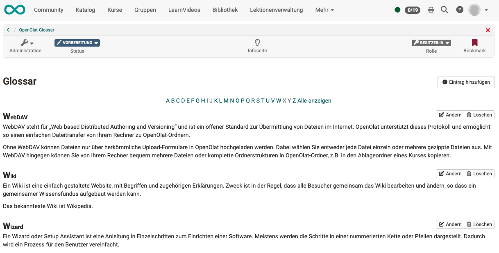
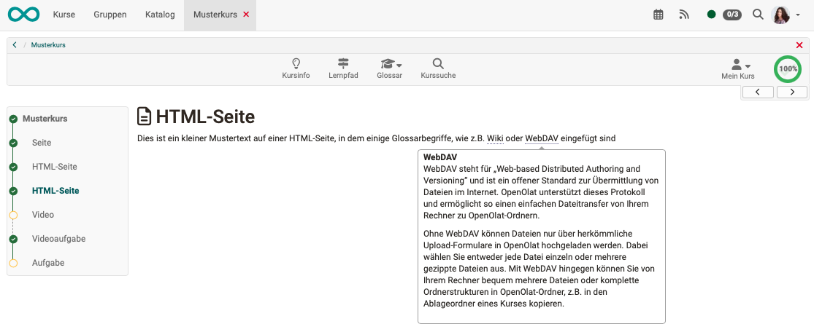

# Glossar {: #glossary}

## Was ist und kann ein Glossar?

Ein Glossar ist eine einfache Tabelle, in der Begriffe und ihre Definitionen abgelegt und alphabetisch sortiert aufgelistet werden.

{ class="shadow lightbox" }

Wird ein Glossar in einen OpenOlat Kurs eingebaut, können in HTML-Dateien dieses Kurses zu den Glossarbegriffen bei MouseOver direkt die Erklärung des Glossareintrags angezeigt werden, wenn man den Mauszeiger im Text über den Schlüsselbegriff bewegt.  

{ class="shadow lightbox" }

Es ist möglich Glossare so zu konfigurieren, dass auch Lernende ein Glossar inhaltlich befüllen können.

Technisch betrachtet, ist in OpenOlat ein Glossar eine **Lernressource**.

---

## Weiterführende Informationen {: #further_information}

[Glossar verwenden >](../learningresources/Glossary_usage.de.md) 
[Glossar erstellen >](../learningresources/Glossary_create.de.md)

[Zum Seitenanfang ^](#glossary)