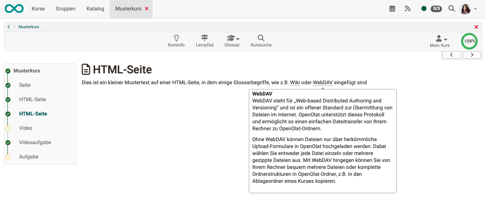

# Glossary

## What is a glossary and what can it do?

A glossary is a simple table in which various terms and definitions can be described. The table is sorted alphabetically.

{ class="shadow lightbox" }

If a glossary is integrated into an OpenOlat course, the explanation of the glossary entry can be displayed directly in the HTML files of this course for the glossary terms when the mouse pointer is moved over the key term in the text.

{ class="shadow lightbox" }

It is possible to configure glossaries in a way, which allows for students to fill it with contents as well.

Technically, it counts as a **learning resource** in OpenOlat.