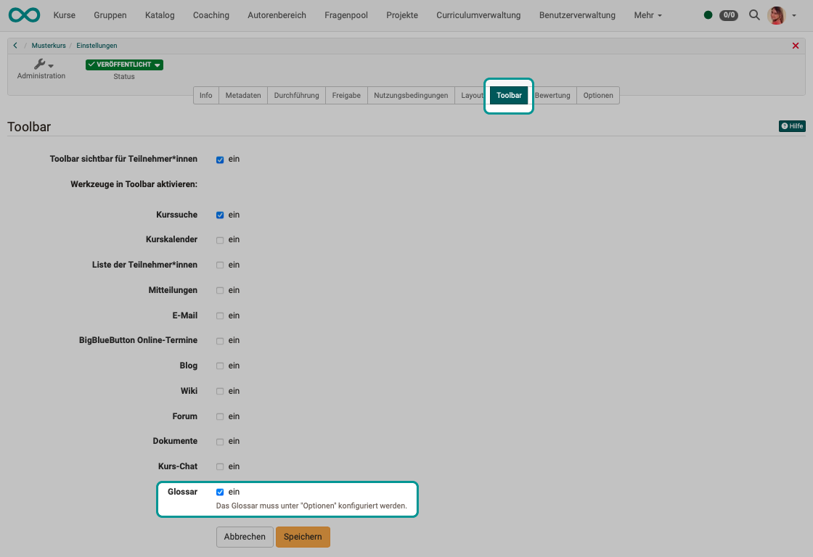

# Glossar erstellen {: #glossary_create}

## Wo wird ein neues Glossar erstellt? {: #where}

Glossare können wie andere Lernressourcen im **Autorenbereich** erstellt werden.

{ class="shadow lightbox" }

Alternativ kann die Erstellung auch direkt im Kurs unter **Administration -> Einstellungen -> Tab "Optionen"** aufgerufen werden.
Sie finden dort den Button (4), der ein Popup-Fenster öffnet, in dem ein vorhandenes Glossar ausgewählt oder eine neue Glossar-Lernressource erstellt werden kann.

{ class="shadow lightbox" }

!!! note "Hinweis"

    Es können mehrere Glossare im Autorenbereich erstellt werden. Eingebunden werden kann aber pro Kurs jeweils nur 1 Glossar.

[Zum Seitenanfang ^](#glossary_create)

---

## Glossareinträge erstellen {: #create_entries}

``1.`` Gehen Sie in den **Autorenbereich** und öffnen Sie das Glossar.  
(Klick auf den Namen oder Klick auf den Edit-Button oder "Edit" unter dem Icon mit den 3 Punkten.)

{ class="shadow lightbox" }

``2.`` Klicken Sie einen der Buttons **"Eintrag hinzufügen"**.

{ class="shadow lightbox" }

``3.`` Tragen Sie den gewünschten Fachausdruck ein. Sie können auch Synonyme ergänzen. Zum Beispiel kann der Begriff "Informationstechnologie" mit dem Synonym "IT" ergänzt werden. 

``4.`` Speichern Sie den Begriff. Dadurch wird der Tab für die Eingabe der Definition frei geschaltet.

{ class="shadow lightbox" }

``5.`` Im Tab "Definition" ergänzen Sie dann die konkrete Definition des Begriffs. Eingetragene Begriffe können auch im Nachhinein geändert oder gelöscht werden.

{ class="shadow lightbox" }

Es kann ermöglicht werden, dass auch Lernende ein Glossar inhaltlich befüllen können.

### Schreibrecht für alle Benutzer:innen

In der Lernressource "Glossar" kann unter Administration > Einstellungen im **Tab "Schreibberechtigung"** definiert werden, ob nur die Besitzer der Lernressource Beiträge erstellen und editieren dürfen oder ob auch Benutzer das Recht erhalten.

**Besitzer** der jeweiligen Lernressource "Glossar" können grundsätzlich alle erstellten Glossarbeiträge ändern und löschen. Standardmäßig können neue Glossareinträge nur vom Kursbesitzer vorgenommen werden.

Die Auswahl "Schreibberechtigung für alle Benutzer:innen" erlaubt es **allen Systembenutzer:innen** neue Glossarbeiträge zu erstellen.
Wer einen Glossarbeitrag erstellt hat, kann diesen selbst erstellten Beitrag anschliessend auch ändern und wieder löschen. 
Die Besitzer:innen eines Glossars können dagegen alle Beiträge - auch die von anderen Benutzer:innen erstellten - jederzeit ändern oder löschen.

Wenn diese Funktion eingeschaltet ist, wird der jeweilige Urheber und die letzte Person, die Änderungen vorgenommen hat, neben dem Glossarbeitrag angezeigt.

{ class="shadow lightbox" }

### Schreibrecht nur für ausgewählte Benutzer:innen

Möchte man nur bestimmten Personen (z.B. den Teilnehmenden eines Kurses) das Schreibrecht für ein Glossar vergeben, geht man einen anderen Weg. Hierfür wird die **Mitgliederverwaltung** eines Kurses verwendet. Erstellen Sie dort eine neue **Gruppe** und fügen Sie die gewünschten Personen als Teilnehmer:innen dieser Gruppe hinzu. Gehen Sie anschließend in der Mitgliederverwaltung des Kurses in den Bereich **"Rechte"** und setzen Sie bei den Kursteilnehmer:innen der Gruppe den Haken für das Recht **"Glossarwerkzeug"**. Nun können die Personen der Gruppe Glossareinträge hinzufügen und ändern.

[Zum Seitenanfang ^](#glossary_create)

---

## Glossar gestalten {: #design}

Die Erklärungen (Definitionen) können mit einem einfachen Editor bearbeitet werden, der neben Text Ergänzungen zulässt, wie

* Schriftartwahl
* Einrückungen
* Tabellen
* Links
* u.a.

Das alphabetische Register ist für ein lateinisches Alphabet ausgelegt und beeinhaltet die Zeichen von A-Z. Für ein Glossar mit anderem Zeichensatz, sollte das Register ausgeschaltet werden.

**Administration > Einstellungen > Tab "Alphabetisches Register"**

{ class="shadow lightbox" }

!!! note "Achtung"

    Die Besitzer:innen eines Kurses sind nicht automatisch auch Besitzer:innen der Lernressource. Wurde eine Lernressource "Glossar" von einer anderen Person erstellt, können nicht automatisch die Besitzer:innen des Kurses, in dem die Lernressource eingebunden wurde, auch Einträge im Glossar vornehmen.  
    
    Damit die anderen Kursbesitzer Änderungen vornehmen können, muss eine der beschriebenen Berechtigungen eingerichtet werden oder die gewünschten Kursbesitzer:innen müssen auch als Besitzer:innen der jeweiligen Lernressource "Glossar" eingetragen werden.

[Zum Seitenanfang ^](#glossary_create)

---

## Glossar einbinden {: #integrate}

Glossare sind OpenOlat-Lernressourcen, die normalerweise in einen Kurs eingebunden werden. Darüber hinaus ist auch eine Nutzung als Stand-alone-Lernressource möglich. In diesem Fall kann das Glossar dann z.B. auch als eigenständiges Angebot im Katalog angezeigt werden.

Eine generelle Aktivierung der Glossarfunktion durch Administrator:innen ist nicht erforderlich.

``1.`` Um ein Glossar in einen Kurs einzubinden, wählen Sie im ersten Schritt die Lernressource in den **Einstellungen** des Kurses im **Tab Optionen** aus. 

{ class="shadow lightbox" }

``2.`` Damit das eingebundene Glossar in der Toolbar des Kurses sichtbar wird, muss noch die Anzeige als Werkzeug gewählt werden. Wählen Sie die entsprechende Checkbox unter 
**Administration > Einstellung > Tab "Toolbar"**

{ class="shadow lightbox" }

!!! note "Hinweis"

    Es kann pro Kurs jeweils nur 1 Glossar eingebunden werden. Im Autorenbereich können dagegen mehrere Glossar-Lernressourcen vorhanden sein, so dass in verschiedenen Kursen unterschiedliche Glossare verwendet werden können.

Wenn Sie das Glossar nicht mehr verwenden oder ein anderes Glossar in Ihren Kurs einbinden möchten, können Sie im Menü **Administration -> Einstellungen** unter dem Tab **Optionen** eine andere Glossar-Lernressource auswählen.

---

## Weiterführende Informationen {: #further_information}

[Glossar verwenden >](../learningresources/Glossary_usage.de.md)

[Zum Seitenanfang ^](#glossary_create)
